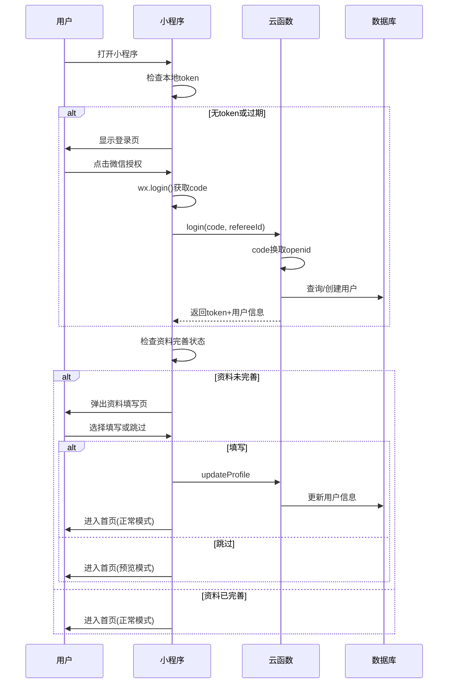
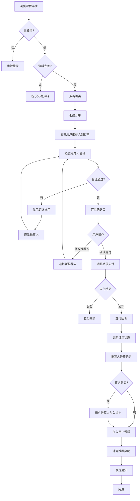
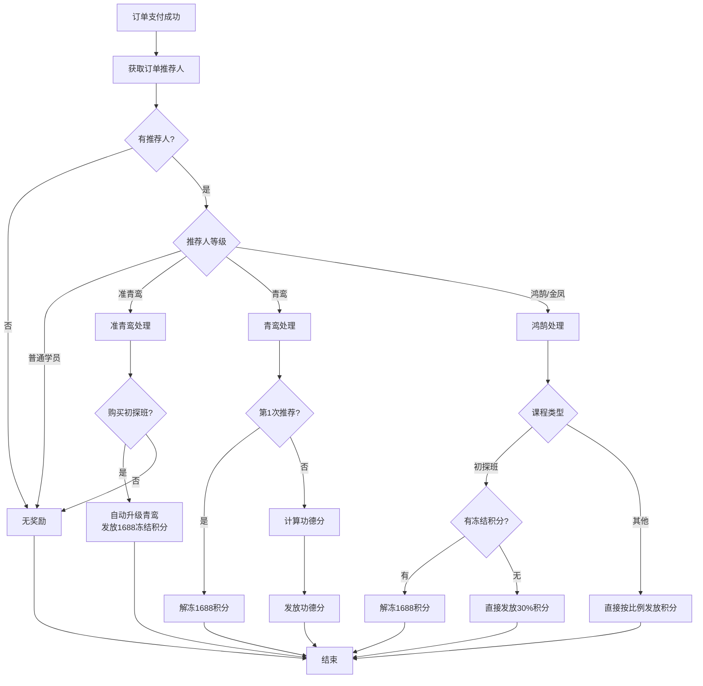
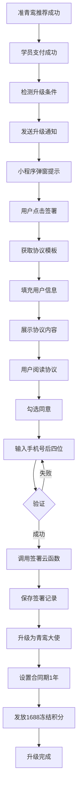

# 天道文化课程小程序完整架构方案

## 一、技术栈选型

### 前端技术栈

- **框架**：uni-app (Vue 3)
- **样式**：Tailwind CSS
- **状态管理**：Pinia
- **开发工具**：Cursor + 微信开发者工具

### 后端技术栈

- **平台**：腾讯云开发 CloudBase
- **计算**：云函数（Node.js）
- **数据库**：云数据库（文档型）
- **存储**：云存储
- **支付**：微信支付

### 多端支持

- 微信小程序（主要）
- H5（预留）

---

## 二、项目目录结构

```javascript
tiandao-course-app/
│
├── cloudfunctions/                    # 云函数目录
│   │
│   ├── user/                          # 用户模块
│   │   ├── login/                     # 微信登录
│   │   ├── getUserInfo/               # 获取用户信息
│   │   ├── updateProfile/             # 更新用户资料
│   │   ├── updateReferee/             # 更新推荐人
│   │   └── checkPreviewMode/          # 检查预览模式
│   │
│   ├── referee/                       # 推荐人管理
│   │   ├── validateReferee/           # 验证推荐人资格
│   │   ├── getAmbassadorList/         # 获取可选大使列表
│   │   ├── checkRefereeStatus/        # 检查推荐人状态
│   │   └── getRefereeChangeLog/       # 推荐人变更日志
│   │
│   ├── course/                        # 课程模块
│   │   ├── getCourseList/             # 获取课程列表
│   │   ├── getCourseDetail/           # 获取课程详情
│   │   ├── getMyCourses/              # 我的课程
│   │   └── getSchedule/               # 课程计划
│   │
│   ├── order/                         # 订单模块
│   │   ├── createOrder/               # 创建订单
│   │   ├── updateOrderReferee/        # 修改订单推荐人
│   │   ├── payCallback/               # 支付回调
│   │   ├── getOrderList/              # 订单列表
│   │   └── getOrderDetail/            # 订单详情
│   │
│   ├── ambassador/                    # 大使模块
│   │   ├── applyAmbassador/           # 申请准青鸾大使
│   │   ├── getAmbassadorInfo/         # 大使信息
│   │   ├── checkUpgradeStatus/        # 检查升级状态
│   │   ├── getQrcode/                 # 生成推荐二维码
│   │   ├── getRefereeList/            # 推荐人员列表
│   │   └── getActivityRecords/        # 活动记录
│   │
│   ├── points/                        # 积分模块
│   │   ├── getMeritPoints/            # 功德分查询
│   │   ├── getCashPoints/             # 积分查询
│   │   ├── calculateReward/           # 计算推荐奖励
│   │   ├── unfreezePoints/            # 积分解冻
│   │   └── withdrawApply/             # 提现申请
│   │
│   ├── contract/                      # 协议模块
│   │   ├── getContractTemplate/       # 获取协议模板
│   │   ├── signContract/              # 签署协议
│   │   ├── checkSignStatus/           # 检查签署状态
│   │   ├── getMyContracts/            # 我的协议列表
│   │   └── downloadContractPDF/       # 下载协议PDF
│   │
│   ├── appointment/                   # 预约模块
│   │   ├── createAppointment/         # 创建预约
│   │   ├── cancelAppointment/         # 取消预约
│   │   └── getMyAppointments/         # 我的预约
│   │
│   ├── consultation/                  # 咨询预约
│   │   ├── getConsultationTypes/      # 获取咨询类型
│   │   ├── createConsultation/        # 创建咨询
│   │   ├── getMyConsultations/        # 我的咨询列表
│   │   └── cancelConsultation/        # 取消咨询
│   │
│   └── common/                        # 通用模块
│       ├── getAnnouncements/          # 获取公告
│       ├── submitFeedback/            # 提交反馈
│       └── uploadFile/                # 文件上传
│
├── uniapp-project/                    # uni-app 前端项目
│   │
│   ├── src/
│   │   │
│   │   ├── pages/
│   │   │   │
│   │   │   ├── index/                 # 首页（课程学习 Tab）
│   │   │   │   ├── index.vue
│   │   │   │   └── components/
│   │   │   │       ├── CourseList.vue
│   │   │   │       ├── Banner.vue
│   │   │   │       └── Announcement.vue
│   │   │   │
│   │   │   ├── course/                # 课程相关
│   │   │   │   ├── detail.vue
│   │   │   │   ├── my-courses.vue
│   │   │   │   ├── schedule.vue
│   │   │   │   └── appointment-confirm.vue
│   │   │   │
│   │   │   ├── order/                 # 订单流程
│   │   │   │   ├── confirm.vue
│   │   │   │   ├── select-referee.vue
│   │   │   │   ├── payment.vue
│   │   │   │   └── detail.vue
│   │   │   │
│   │   │   ├── mine/                  # 我的 Tab
│   │   │   │   ├── index.vue
│   │   │   │   ├── profile.vue
│   │   │   │   ├── referee-manage.vue
│   │   │   │   ├── orders.vue
│   │   │   │   ├── appointments.vue
│   │   │   │   ├── feedback.vue
│   │   │   │   ├── consultation.vue
│   │   │   │   └── contracts.vue
│   │   │   │
│   │   │   ├── ambassador/            # 大使模块
│   │   │   │   ├── index.vue
│   │   │   │   ├── apply.vue
│   │   │   │   ├── level.vue
│   │   │   │   ├── upgrade-guide.vue
│   │   │   │   ├── merit-points.vue
│   │   │   │   ├── cash-points.vue
│   │   │   │   ├── withdraw.vue
│   │   │   │   ├── qrcode.vue
│   │   │   │   ├── team.vue
│   │   │   │   ├── contract-sign.vue
│   │   │   │   └── contract-detail.vue
│   │   │   │
│   │   │   ├── auth/                  # 授权登录
│   │   │   │   ├── login.vue
│   │   │   │   └── complete-profile.vue
│   │   │   │
│   │   │   └── common/                # 通用页面
│   │   │       ├── announcement.vue
│   │   │       └── webview.vue
│   │   │
│   │   ├── components/                # 全局组件
│   │   │   ├── CourseCard/
│   │   │   ├── AmbassadorBadge/
│   │   │   ├── PointsDisplay/
│   │   │   ├── PreviewModeTip/
│   │   │   ├── CompleteProfileFloat/
│   │   │   ├── RefereeSelector/
│   │   │   ├── ContractSignFlow/
│   │   │   ├── ActivityRecordCard/
│   │   │   ├── EmptyState/
│   │   │   └── Loading/
│   │   │
│   │   ├── api/                       # 接口封装
│   │   │   ├── index.js
│   │   │   ├── request.js
│   │   │   ├── user.js
│   │   │   ├── referee.js
│   │   │   ├── course.js
│   │   │   ├── order.js
│   │   │   ├── ambassador.js
│   │   │   ├── points.js
│   │   │   ├── contract.js
│   │   │   ├── consultation.js
│   │   │   └── common.js
│   │   │
│   │   ├── store/                     # Pinia 状态管理
│   │   │   ├── index.js
│   │   │   └── modules/
│   │   │       ├── user.js
│   │   │       ├── referee.js
│   │   │       ├── contract.js
│   │   │       ├── course.js
│   │   │       └── ambassador.js
│   │   │
│   │   ├── utils/                     # 工具函数
│   │   │   ├── index.js
│   │   │   ├── auth.js
│   │   │   ├── validator.js
│   │   │   ├── permission.js
│   │   │   ├── previewMode.js
│   │   │   ├── refereeValidator.js
│   │   │   ├── retrain.js
│   │   │   ├── contract.js
│   │   │   ├── rewardCalculator.js
│   │   │   ├── date.js
│   │   │   ├── storage.js
│   │   │   └── wechat.js
│   │   │
│   │   ├── config/
│   │   │   ├── index.js
│   │   │   ├── cloudbase.js
│   │   │   └── constants.js
│   │   │
│   │   ├── styles/
│   │   │   ├── index.scss
│   │   │   ├── variables.scss
│   │   │   └── tailwind.css
│   │   │
│   │   ├── static/
│   │   │   └── images/
│   │   │
│   │   ├── App.vue
│   │   ├── main.js
│   │   ├── manifest.json
│   │   ├── pages.json
│   │   └── uni.scss
│   │
│   ├── tailwind.config.js
│   ├── postcss.config.js
│   ├── package.json
│   └── vite.config.js
│
└── docs/
    ├── API.md
    ├── DATABASE.md
    └── FLOWS.md
```

---

## 三、核心业务流程

### 3.1 用户登录和资料完善




### 3.2 课程购买和推荐人管理




### 3.3 推荐奖励计算




### 3.4 协议签署流程



---

## 四、关键云函数实现

### 4.1 推荐人资格验证（referee-validateReferee）

```javascript
const cloud = require('wx-server-sdk')
cloud.init({ env: cloud.DYNAMIC_CURRENT_ENV })
const db = cloud.database()

exports.main = async (event, context) => {
  const { refereeId, courseType } = event
  
  try {
    const refereeRes = await db.collection('users')
      .doc(refereeId)
      .field({ ambassadorLevel: true, nickname: true, avatar: true })
      .get()
    
    if (!refereeRes.data) {
      return { code: -1, valid: false, message: '推荐人不存在' }
    }
    
    const referee = refereeRes.data
    const level = referee.ambassadorLevel || 0
    
    // 验证推荐人等级
    if (level === 0) {
      return {
        code: -1,
        valid: false,
        message: '推荐人必须是准青鸾及以上等级的传播大使'
      }
    }
    
    // 准青鸾只能推荐初探班
    if (level === 1 && courseType && courseType !== 1) {
      return {
        code: -1,
        valid: false,
        message: '您的推荐人暂时只能推荐初探班课程\n推荐人升级为青鸾大使后即可推荐所有课程\n请选择青鸾及以上等级的推荐人，或先购买初探班'
      }
    }
    
    return {
      code: 0,
      valid: true,
      refereeInfo: {
        id: refereeId,
        nickname: referee.nickname,
        avatar: referee.avatar,
        level: level
      }
    }
    
  } catch (error) {
    return { code: -1, valid: false, message: error.message }
  }
}
```


### 4.2 奖励计算引擎（points-calculateReward）

关键逻辑参考文档[需求文档-V2.md](需求文档-V2.md)第1270-1470行的奖励计算流程。核心要点：

- 准青鸾推荐初探班自动升级为青鸾
- 青鸾第1次推荐初探班解冻1688积分
- 青鸾第2次起推荐只发功德分
- 鸿鹄/金凤推荐只发积分
- 功德分和积分不可同时发放
```javascript
const cloud = require('wx-server-sdk')
cloud.init({ env: cloud.DYNAMIC_CURRENT_ENV })
const db = cloud.database()

exports.main = async (event, context) => {
  const { orderId } = event
  
  try {
    // 1. 获取订单信息
    const orderRes = await db.collection('orders').doc(orderId).get()
    const order = orderRes.data
    
    if (!order.refereeId) {
      return { code: 0, message: '无推荐人' }
    }
    
    // 2. 获取推荐人信息
    const refereeRes = await db.collection('users').doc(order.refereeId).get()
    const referee = refereeRes.data
    
    // 3. 获取课程信息
    const courseRes = await db.collection('courses').doc(order.courseId).get()
    const course = courseRes.data
    
    // 4. 根据等级处理奖励
    let result = {}
    const level = referee.ambassadorLevel || 0
    
    if (level === 1) {
      // 准青鸾：自动升级青鸾
      result = await handleZhunQingluanUpgrade(referee._id)
    } else if (level === 2) {
      // 青鸾：第1次解冻，第2次起功德分
      result = await handleQingluanReward(referee, order, course)
    } else if (level >= 3) {
      // 鸿鹄/金凤：只发积分
      result = await handleHonghuReward(referee, order, course)
    }
    
    // 5. 更新订单状态
    await db.collection('orders').doc(orderId).update({
      data: {
        isRewardGranted: true,
        rewardGrantedAt: new Date(),
        rewardDetail: result
      }
    })
    
    return { code: 0, data: result }
    
  } catch (error) {
    return { code: -1, message: error.message }
  }
}

// 具体实现函数略...
```


### 4.3 协议签署（contract-signContract）

```javascript
const cloud = require('wx-server-sdk')
cloud.init({ env: cloud.DYNAMIC_CURRENT_ENV })
const db = cloud.database()

exports.main = async (event, context) => {
  const { 
    userId, 
    contractTemplateId, 
    ambassadorLevel,
    signPhoneSuffix,
    signDevice 
  } = event
  
  try {
    // 1. 获取用户信息
    const userRes = await db.collection('users').doc(userId).get()
    const user = userRes.data
    
    // 2. 验证手机号
    const phoneSuffix = user.phone ? user.phone.slice(-4) : ''
    if (phoneSuffix !== signPhoneSuffix) {
      return { code: -1, message: '手机号验证失败' }
    }
    
    // 3. 获取协议模板
    const templateRes = await db.collection('contract_templates')
      .doc(contractTemplateId)
      .get()
    const template = templateRes.data
    
    // 4. 填充变量
    const contractContent = fillContractVariables(template.content, user)
    
    // 5. 保存签署记录
    const now = new Date()
    const contractEnd = new Date(now.getFullYear() + 1, now.getMonth(), now.getDate())
    
    const signature = {
      userId,
      contractTemplateId,
      contractName: template.contractName,
      contractVersion: template.version,
      contractContent,
      ambassadorLevel,
      signPhone: user.phone,
      signPhoneSuffix,
      signDevice,
      signTime: now,
      contractStart: now,
      contractEnd,
      status: 1,
      createTime: now
    }
    
    const signRes = await db.collection('contract_signatures').add({
      data: signature
    })
    
    // 6. 更新用户合同期
    await db.collection('users').doc(userId).update({
      data: {
        contractStart: now,
        contractEnd,
        updateTime: now
      }
    })
    
    return {
      code: 0,
      message: '签署成功',
      signatureId: signRes._id
    }
    
  } catch (error) {
    return { code: -1, message: error.message }
  }
}
```

---

## 五、前端关键工具函数

### 5.1 推荐人验证工具（utils/refereeValidator.js）

```javascript
import { callFunction } from '@/api/request'

export async function validateReferee(refereeId, courseType = null) {
  try {
    const res = await callFunction('referee-validateReferee', {
      refereeId,
      courseType
    })
    
    return {
      valid: res.valid,
      message: res.message,
      refereeInfo: res.refereeInfo
    }
  } catch (error) {
    return {
      valid: false,
      message: error.message || '验证失败'
    }
  }
}

export function checkModifyFrequency(lastUpdateTime) {
  if (!lastUpdateTime) {
    return { canModify: true, remainDays: 0 }
  }
  
  const lastTime = new Date(lastUpdateTime)
  const now = new Date()
  const diffDays = Math.floor((now - lastTime) / (1000 * 60 * 60 * 24))
  
  if (diffDays >= 7) {
    return { canModify: true, remainDays: 0 }
  }
  
  return {
    canModify: false,
    remainDays: 7 - diffDays
  }
}
```


### 5.2 预览模式管理（utils/previewMode.js）

```javascript
import { useUserStore } from '@/store/modules/user'

export function checkPreviewMode(showTip = true) {
  const userStore = useUserStore()
  
  if (userStore.isPreviewMode) {
    if (showTip) {
      uni.showModal({
        title: '提示',
        content: '请先完善个人资料后使用此功能',
        confirmText: '去完善',
        success: (res) => {
          if (res.confirm) {
            uni.navigateTo({
              url: '/pages/auth/complete-profile'
            })
          }
        }
      })
    }
    return false
  }
  
  return true
}
```


### 5.3 奖励计算工具（utils/rewardCalculator.js）

```javascript
export const AMBASSADOR_LEVEL = {
  NORMAL: 0,
  ZHUN_QINGLUAN: 1,
  QINGLUAN: 2,
  HONGHU: 3,
  JINFENG: 4
}

export const COURSE_TYPE = {
  CHUTAN: 1,
  MIXUN: 2,
  ZIXUN: 3,
  GUWEN: 4
}

export function estimateReward(ambassadorLevel, courseType, amount, isFirstRecommend, frozenPoints) {
  if (ambassadorLevel === AMBASSADOR_LEVEL.ZHUN_QINGLUAN) {
    if (courseType === COURSE_TYPE.CHUTAN) {
      return {
        type: 'upgrade',
        message: '推荐成功后自动升级为青鸾大使',
        frozenPoints: 1688
      }
    }
  }
  
  if (ambassadorLevel === AMBASSADOR_LEVEL.QINGLUAN) {
    if (isFirstRecommend && courseType === COURSE_TYPE.CHUTAN) {
      return {
        type: 'unfreeze',
        message: '解冻1688积分',
        points: 1688
      }
    } else {
      const ratio = courseType === COURSE_TYPE.CHUTAN ? 0.3 : 0.2
      return {
        type: 'merit',
        message: '获得功德分',
        meritPoints: Math.floor(amount * ratio)
      }
    }
  }
  
  if (ambassadorLevel >= AMBASSADOR_LEVEL.HONGHU) {
    if (courseType === COURSE_TYPE.CHUTAN && frozenPoints > 0) {
      return {
        type: 'unfreeze',
        message: '解冻积分',
        points: Math.min(1688, frozenPoints)
      }
    } else {
      const ratioMap = { 1: 0.3, 2: 0.2, 3: 0.2, 4: 0.03 }
      return {
        type: 'direct',
        message: '直接获得积分',
        points: Math.floor(amount * (ratioMap[courseType] || 0))
      }
    }
  }
  
  return { type: 'none', message: '无奖励' }
}
```


### 5.4 复训规则处理（utils/retrain.js）

```javascript
export function calculateRetrainDeadline(classDate, classTime = '00:00') {
  const classDateTime = new Date(`${classDate} ${classTime}`)
  const deadline = new Date(classDateTime)
  deadline.setDate(deadline.getDate() - 3)
  return deadline
}

export function checkRetrainAvailable(classDate, classTime) {
  const deadline = calculateRetrainDeadline(classDate, classTime)
  const now = new Date()
  
  if (now > deadline) {
    return {
      canRetrain: false,
      message: '已超过复训截止时间（开课前3天）'
    }
  }
  
  const remainDays = Math.ceil((deadline - now) / (1000 * 60 * 60 * 24))
  
  return {
    canRetrain: true,
    message: `距离复训截止还有${remainDays}天`,
    remainDays
  }
}

export function checkRetrainCancelable(classDate, classTime) {
  const deadline = calculateRetrainDeadline(classDate, classTime)
  const now = new Date()
  
  if (now > deadline) {
    return {
      canCancel: false,
      canRefund: false,
      message: '已到开课前3天，不能取消复训和退款'
    }
  }
  
  return {
    canCancel: true,
    canRefund: true,
    message: '可以取消并退款'
  }
}
```

---

## 六、数据库设计

### 6.1 核心集合

#### users（用户表）

```javascript
{
  _id: 'user_xxx',
  openid: 'oXXX',
  nickname: '张三',
  avatar: 'https://...',
  realName: '张三',
  phone: '13800138000',
  profileCompleted: true,
  
  refereeId: 'user_yyy',
  refereeUpdatedAt: '2024-01-15',
  isRefereeConfirmed: false,
  refereeConfirmedAt: null,
  
  ambassadorLevel: 2,
  meritPoints: 5000,
  cashPointsFrozen: 0,
  cashPointsAvailable: 1688,
  isFirstRecommend: false,
  
  contractStart: '2024-01-01',
  contractEnd: '2025-01-01',
  
  createTime: '2024-01-01T00:00:00Z'
}
```


#### orders（订单表）

```javascript
{
  _id: 'order_xxx',
  orderNo: 'ORDER20240101XXX',
  userId: 'user_xxx',
  courseId: 'course_001',
  amount: 1688,
  payStatus: 1,
  
  refereeId: 'user_yyy',
  refereeConfirmedAt: '2024-01-01T10:00:00Z',
  isRewardGranted: true,
  rewardGrantedAt: '2024-01-01T10:05:00Z',
  
  createTime: '2024-01-01T09:00:00Z'
}
```


#### referee_change_logs（推荐人变更日志）

```javascript
{
  _id: 'log_xxx',
  userId: 'user_xxx',
  oldRefereeId: 'user_yyy',
  newRefereeId: 'user_zzz',
  changeType: 2,
  changeSource: 1,
  orderId: null,
  changeIp: '192.168.1.1',
  changeDevice: {},
  createTime: '2024-01-15T08:00:00Z'
}
```


#### contract_signatures（协议签署记录）

```javascript
{
  _id: 'sign_xxx',
  userId: 'user_xxx',
  contractTemplateId: 'template_001',
  contractName: '传播大使合作协议',
  contractVersion: 'v1.0',
  contractContent: '完整协议内容...',
  ambassadorLevel: 2,
  signTime: '2024-01-01T10:00:00Z',
  contractStart: '2024-01-01',
  contractEnd: '2025-01-01',
  status: 1,
  createTime: '2024-01-01T10:00:00Z'
}
```

---

## 七、开发阶段规划

### 第一阶段：基础框架（1周）

- 创建 uni-app 项目
- 配置 Tailwind CSS
- 创建腾讯云开发环境
- 搭建基础组件库

### 第二阶段：核心功能（2-3周）

- 登录授权和预览模式
- 课程浏览和购买
- 订单管理和支付
- 推荐人管理

### 第三阶段：大使系统（2-3周）

- 大使申请流程
- 推荐奖励计算
- 功德分和积分管理
- 协议签署

### 第四阶段：完善优化（1-2周）

- 商学院模块
- 咨询预约
- 消息通知
- 性能优化

---

## 八、配置文件

### pages.json（页面路由）

```json
{
  "pages": [
    {
      "path": "pages/index/index",
      "style": { "navigationBarTitleText": "课程学习" }
    },
    {
      "path": "pages/mine/index",
      "style": { "navigationBarTitleText": "我的" }
    }
  ],
  
  "tabBar": {
    "color": "#666666",
    "selectedColor": "#1677FF",
    "list": [
      {
        "pagePath": "pages/index/index",
        "text": "课程学习",
        "iconPath": "static/images/tabbar/course.png",
        "selectedIconPath": "static/images/tabbar/course-active.png"
      },
      {
        "pagePath": "pages/mine/index",
        "text": "我的",
        "iconPath": "static/images/tabbar/mine.png",
        "selectedIconPath": "static/images/tabbar/mine-active.png"
      }
    ]
  }
}
```


### constants.js（常量定义）

```javascript
export const AMBASSADOR_LEVEL = {
  NORMAL: 0,
  ZHUN_QINGLUAN: 1,
  QINGLUAN: 2,
  HONGHU: 3,
  JINFENG: 4
}

export const COURSE_TYPE = {
  CHUTAN: 1,
  MIXUN: 2,
  ZIXUN: 3,
  GUWEN: 4
}

export const REFEREE_QUALIFICATION = {
  [AMBASSADOR_LEVEL.ZHUN_QINGLUAN]: [COURSE_TYPE.CHUTAN],
  [AMBASSADOR_LEVEL.QINGLUAN]: [COURSE_TYPE.CHUTAN, COURSE_TYPE.MIXUN, COURSE_TYPE.ZIXUN, COURSE_TYPE.GUWEN],
  [AMBASSADOR_LEVEL.HONGHU]: [COURSE_TYPE.CHUTAN, COURSE_TYPE.MIXUN, COURSE_TYPE.ZIXUN, COURSE_TYPE.GUWEN],
  [AMBASSADOR_LEVEL.JINFENG]: [COURSE_TYPE.CHUTAN, COURSE_TYPE.MIXUN, COURSE_TYPE.ZIXUN, COURSE_TYPE.GUWEN]
}

export const REFEREE_MODIFY_LIMIT_DAYS = 7
export const RETRAIN_DEADLINE_DAYS = 3


```