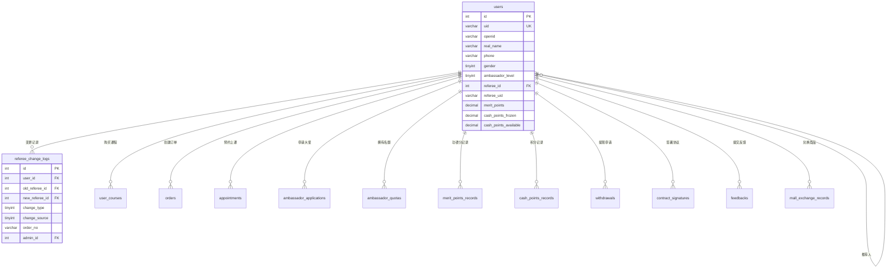

# 用户模块 - 数据库设计

## 1. 模块概述

用户模块是系统的核心模块，负责管理所有用户信息，包括普通用户和传播大使。同时记录推荐人变更历史，支持推荐关系追溯和审计。

### 包含的表

| 表名 | 中文名 | 说明 |
|-----|-------|------|
| users | 用户表 | 存储所有用户信息，包括普通用户和大使 |
| referee_change_logs | 推荐人变更日志表 | 记录推荐人变更历史 |

---

## 2. 表结构

### 2.1 users（用户表）

```sql
CREATE TABLE users (
  -- 主键
  id INT AUTO_INCREMENT PRIMARY KEY COMMENT '用户ID（主键）',

  -- CloudBase 标识
  uid VARCHAR(64) NOT NULL COMMENT 'CloudBase 用户唯一标识',
  openid VARCHAR(128) COMMENT '微信 OpenID',
  _openid VARCHAR(64) DEFAULT '' NOT NULL COMMENT 'CloudBase 用户标识（用于数据隔离和访问控制）',

  -- 基本信息
  real_name VARCHAR(50) COMMENT '真实姓名',
  phone VARCHAR(20) COMMENT '手机号',
  gender TINYINT COMMENT '性别：0女/1男',
  avatar VARCHAR(255) COMMENT '头像URL',
  nickname VARCHAR(50) COMMENT '微信昵称',

  -- 八字信息（JSON存储）
  birth_bazi JSON COMMENT '出生八字信息',

  -- 地区信息
  province VARCHAR(50) COMMENT '省份',
  city VARCHAR(50) COMMENT '城市',

  -- 其他信息
  industry VARCHAR(50) COMMENT '行业',
  personal_intro VARCHAR(500) COMMENT '个人简介',

  -- 资料完善状态
  profile_completed TINYINT(1) DEFAULT 0 COMMENT '资料是否完善：0否/1是',

  -- 大使相关
  ambassador_level TINYINT DEFAULT 0 COMMENT '大使等级：0普通用户/1准青鸾/2青鸾/3鸿鹄',
  ambassador_start_date DATE COMMENT '成为大使的日期',
  referee_code VARCHAR(10) COMMENT '推荐码（6位字母数字组合）',
  is_first_recommend TINYINT(1) DEFAULT 0 COMMENT '是否已完成首次推荐（用于青鸾解冻积分）',

  -- 推荐人信息
  referee_id INT COMMENT '推荐人ID（关联 users.id）',
  referee_uid VARCHAR(64) COMMENT '推荐人UID（辅助字段）',
  referee_confirmed_at DATETIME COMMENT '推荐人确认时间（首次支付后锁定）',
  referee_updated_at DATETIME COMMENT '推荐人最后修改时间',

  -- 积分相关（冗余存储，提高查询效率）
  merit_points DECIMAL(10,2) DEFAULT 0.00 COMMENT '功德分余额',
  cash_points_frozen DECIMAL(10,2) DEFAULT 0.00 COMMENT '冻结积分',
  cash_points_available DECIMAL(10,2) DEFAULT 0.00 COMMENT '可用积分',
  cash_points_pending DECIMAL(10,2) DEFAULT 0.00 COMMENT '提现中的积分',

  -- 时间戳
  created_at DATETIME DEFAULT CURRENT_TIMESTAMP COMMENT '创建时间',
  updated_at DATETIME DEFAULT CURRENT_TIMESTAMP ON UPDATE CURRENT_TIMESTAMP COMMENT '更新时间',

  -- 唯一索引
  UNIQUE KEY uk_uid (uid),
  UNIQUE KEY uk_referee_code (referee_code),

  -- 普通索引
  INDEX idx_openid (openid),
  INDEX idx_phone (phone),
  INDEX idx_referee_id (referee_id),
  INDEX idx_ambassador_level (ambassador_level),
  INDEX idx_profile_completed (profile_completed),
  INDEX idx_referee_updated_at (referee_updated_at),
  INDEX idx_created_at (created_at)
) ENGINE=InnoDB DEFAULT CHARSET=utf8mb4 COLLATE=utf8mb4_unicode_ci COMMENT='用户表';
```

### 2.2 referee_change_logs（推荐人变更日志表）

```sql
CREATE TABLE referee_change_logs (
  -- 主键
  id INT AUTO_INCREMENT PRIMARY KEY COMMENT '日志ID',

  -- 用户信息
  user_id INT NOT NULL COMMENT '用户ID',
  user_uid VARCHAR(64) COMMENT '用户UID',
  _openid VARCHAR(64) DEFAULT '' NOT NULL COMMENT 'CloudBase 用户标识（用于数据隔离）',

  -- 变更前推荐人
  old_referee_id INT COMMENT '原推荐人ID',
  old_referee_uid VARCHAR(64) COMMENT '原推荐人UID',
  old_referee_name VARCHAR(50) COMMENT '原推荐人姓名（冗余）',

  -- 变更后推荐人
  new_referee_id INT COMMENT '新推荐人ID',
  new_referee_uid VARCHAR(64) COMMENT '新推荐人UID',
  new_referee_name VARCHAR(50) COMMENT '新推荐人姓名（冗余）',

  -- 变更类型
  change_type TINYINT NOT NULL COMMENT '变更类型：1首次设置/2用户主动修改/3管理员修改/4订单页修改',
  change_source TINYINT NOT NULL COMMENT '变更来源：1小程序用户资料/2订单支付页/3后台管理',

  -- 关联信息
  order_no VARCHAR(32) COMMENT '关联订单号（订单页修改时）',
  admin_id INT COMMENT '操作管理员ID（管理员修改时）',

  -- 其他信息
  remark VARCHAR(500) COMMENT '变更备注',
  change_ip VARCHAR(50) COMMENT '变更IP地址',

  -- 时间戳
  created_at DATETIME DEFAULT CURRENT_TIMESTAMP COMMENT '变更时间',

  -- 索引
  INDEX idx_user_id (user_id),
  INDEX idx_change_type (change_type),
  INDEX idx_change_source (change_source),
  INDEX idx_order_no (order_no),
  INDEX idx_admin_id (admin_id),
  INDEX idx_created_at (created_at)
) ENGINE=InnoDB DEFAULT CHARSET=utf8mb4 COLLATE=utf8mb4_unicode_ci COMMENT='推荐人变更日志表';
```

---

## 3. 数据字典

### 3.1 users 表字段说明

| 字段名 | 类型 | 长度 | 允许空 | 默认值 | 说明 |
|-------|------|------|-------|-------|------|
| id | INT | - | NO | AUTO_INCREMENT | 用户ID（主键） |
| uid | VARCHAR | 64 | NO | - | CloudBase 用户唯一标识 |
| openid | VARCHAR | 128 | YES | NULL | 微信 OpenID |
| real_name | VARCHAR | 50 | YES | NULL | 真实姓名 |
| phone | VARCHAR | 20 | YES | NULL | 手机号 |
| gender | TINYINT | - | YES | NULL | 性别：0女/1男 |
| avatar | VARCHAR | 255 | YES | NULL | 头像URL |
| nickname | VARCHAR | 50 | YES | NULL | 微信昵称 |
| birth_bazi | JSON | - | YES | NULL | 出生八字信息 |
| province | VARCHAR | 50 | YES | NULL | 省份 |
| city | VARCHAR | 50 | YES | NULL | 城市 |
| industry | VARCHAR | 50 | YES | NULL | 行业 |
| personal_intro | VARCHAR | 500 | YES | NULL | 个人简介 |
| profile_completed | TINYINT | 1 | NO | 0 | 资料是否完善 |
| ambassador_level | TINYINT | - | NO | 0 | 大使等级 |
| ambassador_start_date | DATE | - | YES | NULL | 成为大使的日期 |
| referee_code | VARCHAR | 10 | YES | NULL | 推荐码 |
| is_first_recommend | TINYINT | 1 | NO | 0 | 是否已完成首次推荐 |
| referee_id | INT | - | YES | NULL | 推荐人ID |
| referee_uid | VARCHAR | 64 | YES | NULL | 推荐人UID |
| referee_confirmed_at | DATETIME | - | YES | NULL | 推荐人确认时间 |
| referee_updated_at | DATETIME | - | YES | NULL | 推荐人最后修改时间 |
| merit_points | DECIMAL | 10,2 | NO | 0.00 | 功德分余额 |
| cash_points_frozen | DECIMAL | 10,2 | NO | 0.00 | 冻结积分 |
| cash_points_available | DECIMAL | 10,2 | NO | 0.00 | 可用积分 |
| cash_points_pending | DECIMAL | 10,2 | NO | 0.00 | 提现中的积分 |
| created_at | DATETIME | - | NO | CURRENT_TIMESTAMP | 创建时间 |
| updated_at | DATETIME | - | NO | CURRENT_TIMESTAMP | 更新时间 |

### 3.2 枚举值定义

#### gender（性别）
| 值 | 说明 |
|---|------|
| 0 | 女 |
| 1 | 男 |

#### profile_completed（资料完善状态）
| 值 | 说明 |
|---|------|
| 0 | 未完善 |
| 1 | 已完善 |

#### ambassador_level（大使等级）
| 值 | 说明 | 权限 |
|---|------|------|
| 0 | 普通用户 | 无推荐权限 |
| 1 | 准青鸾大使 | 可推荐初探班 |
| 2 | 青鸾大使 | 可推荐初探班、密训班 |
| 3 | 鸿鹄大使 | 可推荐所有课程，拥有赠送名额 |

### 3.3 referee_change_logs 表字段说明

| 字段名 | 类型 | 长度 | 允许空 | 默认值 | 说明 |
|-------|------|------|-------|-------|------|
| id | INT | - | NO | AUTO_INCREMENT | 日志ID |
| user_id | INT | - | NO | - | 用户ID |
| user_uid | VARCHAR | 64 | YES | NULL | 用户UID |
| old_referee_id | INT | - | YES | NULL | 原推荐人ID |
| old_referee_uid | VARCHAR | 64 | YES | NULL | 原推荐人UID |
| old_referee_name | VARCHAR | 50 | YES | NULL | 原推荐人姓名 |
| new_referee_id | INT | - | YES | NULL | 新推荐人ID |
| new_referee_uid | VARCHAR | 64 | YES | NULL | 新推荐人UID |
| new_referee_name | VARCHAR | 50 | YES | NULL | 新推荐人姓名 |
| change_type | TINYINT | - | NO | - | 变更类型 |
| change_source | TINYINT | - | NO | - | 变更来源 |
| order_no | VARCHAR | 32 | YES | NULL | 关联订单号 |
| admin_id | INT | - | YES | NULL | 操作管理员ID |
| remark | VARCHAR | 500 | YES | NULL | 变更备注 |
| change_ip | VARCHAR | 50 | YES | NULL | 变更IP地址 |
| created_at | DATETIME | - | NO | CURRENT_TIMESTAMP | 变更时间 |

#### change_type（变更类型）
| 值 | 说明 |
|---|------|
| 1 | 首次设置 |
| 2 | 用户主动修改 |
| 3 | 管理员修改 |
| 4 | 订单页修改 |

#### change_source（变更来源）
| 值 | 说明 |
|---|------|
| 1 | 小程序用户资料 |
| 2 | 订单支付页 |
| 3 | 后台管理 |

### 3.4 birth_bazi JSON 结构

```json
{
  "year": "1990",
  "month": "01",
  "day": "01",
  "hour": "10"
}
```

---

## 4. 表关系



---

## 5. 索引设计

### 5.1 users 表索引

| 索引名 | 索引类型 | 字段 | 使用场景 |
|-------|---------|------|---------|
| PRIMARY | 主键 | id | 主键查询 |
| uk_uid | 唯一索引 | uid | CloudBase 用户查询 |
| uk_referee_code | 唯一索引 | referee_code | 推荐码查询 |
| idx_openid | 普通索引 | openid | 微信登录查询 |
| idx_phone | 普通索引 | phone | 手机号查询 |
| idx_referee_id | 普通索引 | referee_id | 推荐人关联查询 |
| idx_ambassador_level | 普通索引 | ambassador_level | 大使等级筛选 |
| idx_profile_completed | 普通索引 | profile_completed | 资料完善状态筛选 |
| idx_referee_updated_at | 普通索引 | referee_updated_at | 推荐人修改时间查询 |
| idx_created_at | 普通索引 | created_at | 注册时间排序 |

### 5.2 referee_change_logs 表索引

| 索引名 | 索引类型 | 字段 | 使用场景 |
|-------|---------|------|---------|
| PRIMARY | 主键 | id | 主键查询 |
| idx_user_id | 普通索引 | user_id | 用户变更记录查询 |
| idx_change_type | 普通索引 | change_type | 变更类型筛选 |
| idx_change_source | 普通索引 | change_source | 变更来源筛选 |
| idx_order_no | 普通索引 | order_no | 订单关联查询 |
| idx_admin_id | 普通索引 | admin_id | 管理员操作查询 |
| idx_created_at | 普通索引 | created_at | 时间范围查询 |

---

## 6. 约束说明

### 6.1 业务规则约束

1. **uid 唯一性**：每个 CloudBase 用户对应唯一的 uid
2. **推荐码唯一性**：每个大使的推荐码必须唯一
3. **推荐人修改限制**：
   - 7天内只能修改1次
   - 首次购买支付后不可修改
   - 不能选择自己为推荐人
   - 不能选择自己的下级为推荐人
4. **资料完善判定**：real_name + phone + gender + birth_bazi + (province OR city) 全部填写

### 6.2 数据完整性约束

1. **referee_id 关联**：必须关联有效的 users.id
2. **ambassador_level 范围**：0-3
3. **积分字段非负**：merit_points、cash_points_* 必须 >= 0

---

## 7. 示例数据

```sql
-- 插入普通用户
INSERT INTO users (uid, openid, real_name, phone, gender, province, city, profile_completed) VALUES
('cloud-uid-001', 'o6_xxx001', '张三', '13800138001', 1, '广东省', '深圳市', 1),
('cloud-uid-002', 'o6_xxx002', '李四', '13800138002', 0, '北京市', '北京市', 1);

-- 插入大使用户
INSERT INTO users (uid, openid, real_name, phone, gender, province, city, profile_completed, ambassador_level, ambassador_start_date, referee_code, merit_points, cash_points_frozen, cash_points_available) VALUES
('cloud-uid-100', 'o6_xxx100', '王大使', '13800138100', 1, '广东省', '广州市', 1, 2, '2024-01-01', 'ABC123', 5000.00, 0.00, 1688.00);

-- 设置推荐关系
UPDATE users SET referee_id = 3, referee_uid = 'cloud-uid-100' WHERE id IN (1, 2);

-- 插入推荐人变更日志
INSERT INTO referee_change_logs (user_id, user_uid, old_referee_id, old_referee_uid, new_referee_id, new_referee_uid, new_referee_name, change_type, change_source, change_ip) VALUES
(1, 'cloud-uid-001', NULL, NULL, 3, 'cloud-uid-100', '王大使', 1, 1, '192.168.1.1');
```

---

## 8. 变更记录

| 版本 | 日期 | 变更内容 | 变更人 |
|-----|------|---------|-------|
| V1.0 | 2026-02-03 | 初始版本 | Claude |
