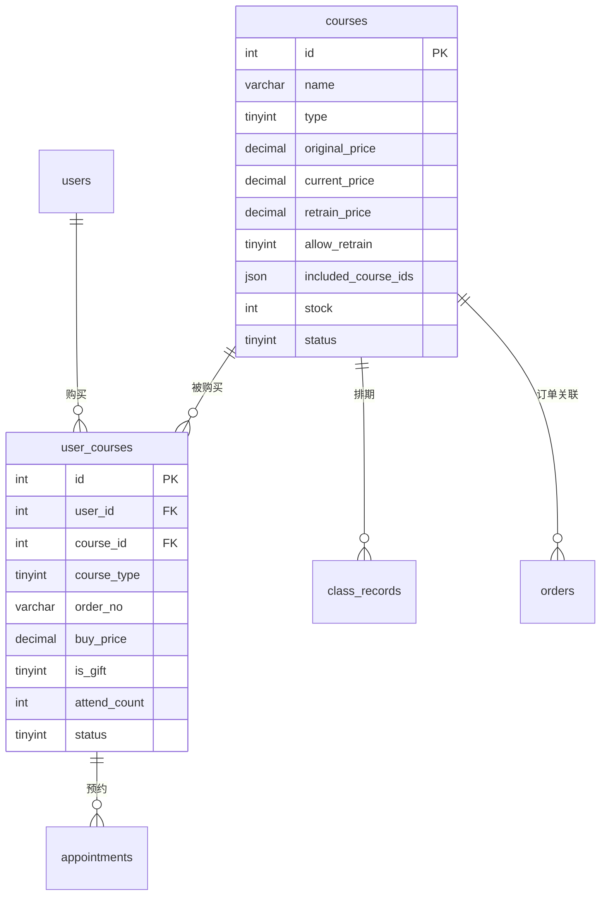

# 课程模块 - 数据库设计

## 1. 模块概述

课程模块负责管理系统中的所有课程信息，包括初探班、密训班、咨询服务等。同时记录用户购买的课程，支持复训和上课次数统计。

### 包含的表

| 表名 | 中文名 | 说明 |
|-----|-------|------|
| courses | 课程表 | 课程基础信息 |
| user_courses | 用户课程表 | 用户购买的课程记录 |

---

## 2. 表结构

### 2.1 courses（课程表）

```sql
CREATE TABLE courses (
  -- 主键
  id INT AUTO_INCREMENT PRIMARY KEY COMMENT '课程ID',

  -- 基本信息
  name VARCHAR(100) NOT NULL COMMENT '课程名称',
  type TINYINT NOT NULL COMMENT '课程类型：1初探班/2密训班/3咨询服务',
  cover_image VARCHAR(255) COMMENT '封面图片URL',
  description VARCHAR(500) COMMENT '课程简介',
  content TEXT COMMENT '详细介绍（HTML）',
  outline TEXT COMMENT '课程大纲',
  teacher VARCHAR(100) COMMENT '讲师信息',
  duration VARCHAR(50) COMMENT '课程时长（如：2天）',

  -- 价格信息
  original_price DECIMAL(10,2) NOT NULL COMMENT '原价',
  current_price DECIMAL(10,2) NOT NULL COMMENT '现价',
  retrain_price DECIMAL(10,2) DEFAULT 0.00 COMMENT '复训价格',
  allow_retrain TINYINT(1) DEFAULT 1 COMMENT '是否允许复训：0否/1是',

  -- 包含课程（密训班包含初探班）
  included_course_ids JSON COMMENT '包含的课程ID列表',

  -- 库存和销量
  stock INT DEFAULT -1 COMMENT '库存数量（-1表示无限）',
  sold_count INT DEFAULT 0 COMMENT '已售数量',

  -- 排序和状态
  sort_order INT DEFAULT 0 COMMENT '排序权重（越大越靠前）',
  status TINYINT DEFAULT 1 COMMENT '状态：0下架/1上架',

  -- 时间戳
  created_at DATETIME DEFAULT CURRENT_TIMESTAMP COMMENT '创建时间',
  updated_at DATETIME DEFAULT CURRENT_TIMESTAMP ON UPDATE CURRENT_TIMESTAMP COMMENT '更新时间',

  -- 索引
  INDEX idx_type (type),
  INDEX idx_status (status),
  INDEX idx_sort_order (sort_order),
  INDEX idx_type_status (type, status)
) ENGINE=InnoDB DEFAULT CHARSET=utf8mb4 COLLATE=utf8mb4_unicode_ci COMMENT='课程表';
```

### 2.2 user_courses（用户课程表）

```sql
CREATE TABLE user_courses (
  -- 主键
  id INT AUTO_INCREMENT PRIMARY KEY COMMENT '用户课程ID',

  -- 用户信息
  user_id INT NOT NULL COMMENT '用户ID',
  user_uid VARCHAR(64) COMMENT '用户UID',
  _openid VARCHAR(64) DEFAULT '' NOT NULL COMMENT 'CloudBase 用户标识（用于数据隔离）',

  -- 课程信息
  course_id INT NOT NULL COMMENT '课程ID',
  course_type TINYINT NOT NULL COMMENT '课程类型（冗余存储）：1初探班/2密训班/3咨询服务',
  course_name VARCHAR(100) COMMENT '课程名称（冗余存储）',

  -- 购买信息
  order_no VARCHAR(32) COMMENT '关联订单号',
  buy_price DECIMAL(10,2) COMMENT '购买价格',
  buy_time DATETIME COMMENT '购买时间',

  -- 赠送标记
  is_gift TINYINT(1) DEFAULT 0 COMMENT '是否赠送：0否/1是（密训班赠送的初探班）',
  gift_source VARCHAR(100) COMMENT '赠送来源说明',

  -- 上课信息
  attend_count INT DEFAULT 1 COMMENT '可上课次数（初始为1，表示可首次上课）',
  first_class_time DATETIME COMMENT '首次上课时间',
  last_attend_time DATETIME COMMENT '最后上课时间',

  -- 状态
  status TINYINT DEFAULT 1 COMMENT '状态：0无效/1有效/2已退款',

  -- 时间戳
  created_at DATETIME DEFAULT CURRENT_TIMESTAMP COMMENT '创建时间',
  updated_at DATETIME DEFAULT CURRENT_TIMESTAMP ON UPDATE CURRENT_TIMESTAMP COMMENT '更新时间',

  -- 索引
  INDEX idx_user_id (user_id),
  INDEX idx_course_id (course_id),
  INDEX idx_course_type (course_type),
  INDEX idx_order_no (order_no),
  INDEX idx_is_gift (is_gift),
  INDEX idx_status (status),
  INDEX idx_user_course (user_id, course_id),
  INDEX idx_user_type (user_id, course_type)
) ENGINE=InnoDB DEFAULT CHARSET=utf8mb4 COLLATE=utf8mb4_unicode_ci COMMENT='用户课程表';
```

---

## 3. 数据字典

### 3.1 courses 表字段说明

| 字段名 | 类型 | 长度 | 允许空 | 默认值 | 说明 |
|-------|------|------|-------|-------|------|
| id | INT | - | NO | AUTO_INCREMENT | 课程ID |
| name | VARCHAR | 100 | NO | - | 课程名称 |
| type | TINYINT | - | NO | - | 课程类型 |
| cover_image | VARCHAR | 255 | YES | NULL | 封面图片URL |
| description | VARCHAR | 500 | YES | NULL | 课程简介 |
| content | TEXT | - | YES | NULL | 详细介绍（HTML） |
| outline | TEXT | - | YES | NULL | 课程大纲 |
| teacher | VARCHAR | 100 | YES | NULL | 讲师信息 |
| duration | VARCHAR | 50 | YES | NULL | 课程时长 |
| original_price | DECIMAL | 10,2 | NO | - | 原价 |
| current_price | DECIMAL | 10,2 | NO | - | 现价 |
| retrain_price | DECIMAL | 10,2 | YES | 0.00 | 复训价格 |
| allow_retrain | TINYINT | 1 | YES | 1 | 是否允许复训 |
| included_course_ids | JSON | - | YES | NULL | 包含的课程ID列表 |
| stock | INT | - | YES | -1 | 库存数量 |
| sold_count | INT | - | YES | 0 | 已售数量 |
| sort_order | INT | - | YES | 0 | 排序权重 |
| status | TINYINT | - | YES | 1 | 状态 |
| created_at | DATETIME | - | NO | CURRENT_TIMESTAMP | 创建时间 |
| updated_at | DATETIME | - | NO | CURRENT_TIMESTAMP | 更新时间 |

### 3.2 枚举值定义

#### type（课程类型）
| 值 | 说明 | 价格 | 复训价格 |
|---|------|------|---------|
| 1 | 初探班 | 1688元 | 500元 |
| 2 | 密训班 | 38888元 | 根据配置 |
| 3 | 咨询服务 | 根据配置 | 不支持复训 |

#### status（课程状态）
| 值 | 说明 |
|---|------|
| 0 | 下架 |
| 1 | 上架 |

#### allow_retrain（是否允许复训）
| 值 | 说明 |
|---|------|
| 0 | 不允许 |
| 1 | 允许 |

### 3.3 user_courses 表字段说明

| 字段名 | 类型 | 长度 | 允许空 | 默认值 | 说明 |
|-------|------|------|-------|-------|------|
| id | INT | - | NO | AUTO_INCREMENT | 用户课程ID |
| user_id | INT | - | NO | - | 用户ID |
| user_uid | VARCHAR | 64 | YES | NULL | 用户UID |
| course_id | INT | - | NO | - | 课程ID |
| course_type | TINYINT | - | NO | - | 课程类型（冗余） |
| course_name | VARCHAR | 100 | YES | NULL | 课程名称（冗余） |
| order_no | VARCHAR | 32 | YES | NULL | 关联订单号 |
| buy_price | DECIMAL | 10,2 | YES | NULL | 购买价格 |
| buy_time | DATETIME | - | YES | NULL | 购买时间 |
| is_gift | TINYINT | 1 | YES | 0 | 是否赠送 |
| gift_source | VARCHAR | 100 | YES | NULL | 赠送来源说明 |
| attend_count | INT | - | YES | 1 | 可上课次数 |
| first_class_time | DATETIME | - | YES | NULL | 首次上课时间 |
| last_attend_time | DATETIME | - | YES | NULL | 最后上课时间 |
| status | TINYINT | - | YES | 1 | 状态 |
| created_at | DATETIME | - | NO | CURRENT_TIMESTAMP | 创建时间 |
| updated_at | DATETIME | - | NO | CURRENT_TIMESTAMP | 更新时间 |

#### is_gift（是否赠送）
| 值 | 说明 |
|---|------|
| 0 | 正常购买 |
| 1 | 赠送（如密训班赠送初探班） |

#### status（用户课程状态）
| 值 | 说明 |
|---|------|
| 0 | 无效 |
| 1 | 有效 |
| 2 | 已退款 |

### 3.4 included_course_ids JSON 结构

```json
[2, 3]  // 包含课程ID为2和3的课程
```

---

## 4. 表关系



---

## 5. 索引设计

### 5.1 courses 表索引

| 索引名 | 索引类型 | 字段 | 使用场景 |
|-------|---------|------|---------|
| PRIMARY | 主键 | id | 主键查询 |
| idx_type | 普通索引 | type | 课程类型筛选 |
| idx_status | 普通索引 | status | 上下架状态筛选 |
| idx_sort_order | 普通索引 | sort_order | 排序查询 |
| idx_type_status | 复合索引 | type, status | 类型+状态组合查询 |

### 5.2 user_courses 表索引

| 索引名 | 索引类型 | 字段 | 使用场景 |
|-------|---------|------|---------|
| PRIMARY | 主键 | id | 主键查询 |
| idx_user_id | 普通索引 | user_id | 用户课程查询 |
| idx_course_id | 普通索引 | course_id | 课程购买统计 |
| idx_course_type | 普通索引 | course_type | 课程类型筛选 |
| idx_order_no | 普通索引 | order_no | 订单关联查询 |
| idx_is_gift | 普通索引 | is_gift | 赠送课程筛选 |
| idx_status | 普通索引 | status | 状态筛选 |
| idx_user_course | 复合索引 | user_id, course_id | 用户是否购买某课程 |
| idx_user_type | 复合索引 | user_id, course_type | 用户某类型课程查询 |

---

## 6. 约束说明

### 6.1 业务规则约束

1. **课程类型**：type 只能是 1、2、3
2. **价格非负**：original_price、current_price、retrain_price 必须 >= 0
3. **库存管理**：stock = -1 表示无限库存，>= 0 表示有限库存
4. **复训规则**：
   - attend_count = 1 表示可首次上课
   - 首次上课后 attend_count 变为 2
   - attend_count > 1 时预约需支付复训费

### 6.2 数据完整性约束

1. **user_id 关联**：必须关联有效的 users.id
2. **course_id 关联**：必须关联有效的 courses.id
3. **order_no 关联**：必须关联有效的 orders.order_no

### 6.3 密训班赠送初探班规则

购买密训班时，系统自动创建两条 user_courses 记录：
1. 密训班记录：is_gift = 0
2. 初探班记录：is_gift = 1，gift_source = '购买密训班赠送'

---

## 7. 示例数据

```sql
-- 插入课程数据
INSERT INTO courses (name, type, cover_image, description, original_price, current_price, retrain_price, allow_retrain, duration, status, sort_order) VALUES
('初探班', 1, 'https://example.com/course1.jpg', '天道文化入门课程，带您初探天道奥秘', 1688.00, 1688.00, 500.00, 1, '2天', 1, 100),
('密训班', 2, 'https://example.com/course2.jpg', '深度密训课程，全面掌握天道文化精髓', 38888.00, 38888.00, 1000.00, 1, '5天', 1, 90),
('一对一咨询', 3, 'https://example.com/course3.jpg', '专业导师一对一咨询服务', 5000.00, 5000.00, 0.00, 0, '2小时', 1, 80);

-- 设置密训班包含初探班
UPDATE courses SET included_course_ids = '[1]' WHERE id = 2;

-- 插入用户课程数据（正常购买）
INSERT INTO user_courses (user_id, user_uid, course_id, course_type, course_name, order_no, buy_price, buy_time, is_gift, attend_count, status) VALUES
(1, 'cloud-uid-001', 1, 1, '初探班', 'ORD202401150001', 1688.00, '2024-01-15 10:30:00', 0, 1, 1);

-- 插入用户课程数据（密训班购买，包含赠送的初探班）
INSERT INTO user_courses (user_id, user_uid, course_id, course_type, course_name, order_no, buy_price, buy_time, is_gift, attend_count, status) VALUES
(2, 'cloud-uid-002', 2, 2, '密训班', 'ORD202401150002', 38888.00, '2024-01-16 14:00:00', 0, 1, 1),
(2, 'cloud-uid-002', 1, 1, '初探班', 'ORD202401150002', 0.00, '2024-01-16 14:00:00', 1, 1, 1);

-- 更新最后一条记录的赠送来源
UPDATE user_courses SET gift_source = '购买密训班赠送' WHERE id = 3;
```

---

## 8. 变更记录

| 版本 | 日期 | 变更内容 | 变更人 |
|-----|------|---------|-------|
| V1.0 | 2026-02-03 | 初始版本 | Claude |
