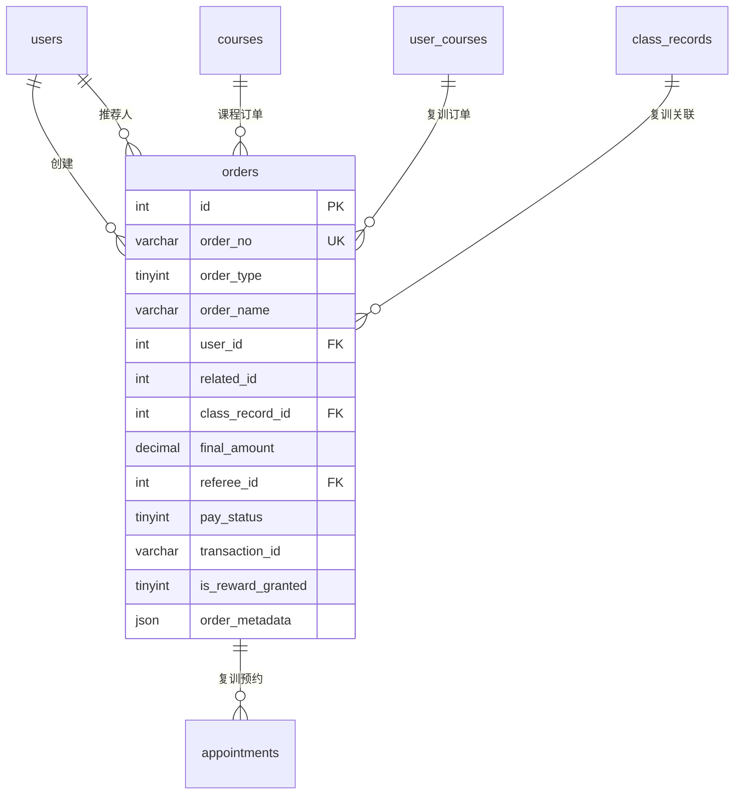

# 订单模块 - 数据库设计

## 1. 模块概述

订单模块是系统的核心交易模块，采用统一订单表设计，支持课程购买、复训费支付、大使升级等多种订单类型。所有涉及真实金钱交易的场景都通过此模块处理。

### 包含的表

| 表名 | 中文名 | 说明 |
|-----|-------|------|
| orders | 订单表 | 统一订单表（课程/复训/升级） |

### 适用场景

- **order_type=1**：课程购买（初探班/密训班/咨询服务）
- **order_type=2**：复训费支付
- **order_type=4**：需支付的大使升级（如鸿鹄升级9800元）

### 不适用场景

- 商城兑换（功德分/积分，无真实金钱）→ 使用 mall_exchange_records 表
- 无需支付的大使升级（如准青鸾→青鸾）→ 直接更新用户等级

---

## 2. 表结构

### 2.1 orders（订单表）

```sql
CREATE TABLE orders (
  -- 主键
  id INT AUTO_INCREMENT PRIMARY KEY COMMENT '订单ID',

  -- 订单基本信息
  order_no VARCHAR(32) NOT NULL COMMENT '订单号（格式：ORD + 年月日 + 8位随机数）',
  order_type TINYINT NOT NULL COMMENT '订单类型：1课程/2复训/4大使升级',
  order_name VARCHAR(100) NOT NULL COMMENT '订单名称',

  -- 用户信息
  user_id INT NOT NULL COMMENT '用户ID',
  user_uid VARCHAR(64) COMMENT '用户UID',
  user_name VARCHAR(50) COMMENT '用户姓名（冗余）',
  user_phone VARCHAR(20) COMMENT '用户手机号（冗余）',
  _openid VARCHAR(64) DEFAULT '' NOT NULL COMMENT 'CloudBase 用户标识（用于数据隔离）',

  -- 关联信息（根据 order_type 含义不同）
  related_id INT COMMENT '关联ID：课程ID/用户课程ID/目标等级',
  class_record_id INT COMMENT '上课记录ID（复训专用）',

  -- 价格信息
  original_amount DECIMAL(10,2) NOT NULL COMMENT '原价',
  discount_amount DECIMAL(10,2) DEFAULT 0.00 COMMENT '优惠金额',
  final_amount DECIMAL(10,2) NOT NULL COMMENT '应付金额',

  -- 推荐人信息
  referee_id INT COMMENT '推荐人ID',
  referee_uid VARCHAR(64) COMMENT '推荐人UID',
  referee_name VARCHAR(50) COMMENT '推荐人姓名（冗余）',
  referee_level TINYINT COMMENT '推荐人等级（下单时）',
  referee_updated_at DATETIME COMMENT '推荐人修改时间',

  -- 支付信息
  pay_status TINYINT DEFAULT 0 COMMENT '支付状态：0待支付/1已支付/2已取消/3已关闭/4已退款',
  pay_method VARCHAR(20) DEFAULT 'wechat' COMMENT '支付方式',
  pay_time DATETIME COMMENT '支付时间',
  transaction_id VARCHAR(64) COMMENT '微信支付交易号',
  prepay_id VARCHAR(64) COMMENT '微信预支付交易会话标识',

  -- 退款信息
  refund_status TINYINT DEFAULT 0 COMMENT '退款状态：0无退款/1退款中/2已退款/3退款失败',
  refund_amount DECIMAL(10,2) COMMENT '退款金额',
  refund_time DATETIME COMMENT '退款时间',
  refund_reason VARCHAR(200) COMMENT '退款原因',

  -- 奖励发放
  is_reward_granted TINYINT(1) DEFAULT 0 COMMENT '是否已发放推荐人奖励',
  reward_granted_at DATETIME COMMENT '奖励发放时间',

  -- 订单元数据（JSON存储扩展信息）
  order_metadata JSON COMMENT '订单元数据',

  -- 订单有效期
  expire_at DATETIME COMMENT '订单过期时间（创建后30分钟）',

  -- 备注
  remark VARCHAR(500) COMMENT '订单备注',
  admin_remark VARCHAR(500) COMMENT '管理员备注',

  -- 时间戳
  created_at DATETIME DEFAULT CURRENT_TIMESTAMP COMMENT '创建时间',
  updated_at DATETIME DEFAULT CURRENT_TIMESTAMP ON UPDATE CURRENT_TIMESTAMP COMMENT '更新时间',

  -- 唯一索引
  UNIQUE KEY uk_order_no (order_no),

  -- 普通索引
  INDEX idx_user_id (user_id),
  INDEX idx_order_type (order_type),
  INDEX idx_pay_status (pay_status),
  INDEX idx_referee_id (referee_id),
  INDEX idx_related_id (related_id),
  INDEX idx_class_record_id (class_record_id),
  INDEX idx_transaction_id (transaction_id),
  INDEX idx_prepay_id (prepay_id),
  INDEX idx_expire_at (expire_at),
  INDEX idx_pay_time (pay_time),
  INDEX idx_created_at (created_at),

  -- 复合索引
  INDEX idx_user_type_status (user_id, order_type, pay_status),
  INDEX idx_user_pay_status (user_id, pay_status),
  INDEX idx_type_status_time (order_type, pay_status, created_at)
) ENGINE=InnoDB DEFAULT CHARSET=utf8mb4 COLLATE=utf8mb4_unicode_ci COMMENT='订单表';
```

---

## 3. 数据字典

### 3.1 orders 表字段说明

| 字段名 | 类型 | 长度 | 允许空 | 默认值 | 说明 |
|-------|------|------|-------|-------|------|
| id | INT | - | NO | AUTO_INCREMENT | 订单ID |
| order_no | VARCHAR | 32 | NO | - | 订单号 |
| order_type | TINYINT | - | NO | - | 订单类型 |
| order_name | VARCHAR | 100 | NO | - | 订单名称 |
| user_id | INT | - | NO | - | 用户ID |
| user_uid | VARCHAR | 64 | YES | NULL | 用户UID |
| user_name | VARCHAR | 50 | YES | NULL | 用户姓名 |
| user_phone | VARCHAR | 20 | YES | NULL | 用户手机号 |
| related_id | INT | - | YES | NULL | 关联ID |
| class_record_id | INT | - | YES | NULL | 上课记录ID |
| original_amount | DECIMAL | 10,2 | NO | - | 原价 |
| discount_amount | DECIMAL | 10,2 | YES | 0.00 | 优惠金额 |
| final_amount | DECIMAL | 10,2 | NO | - | 应付金额 |
| referee_id | INT | - | YES | NULL | 推荐人ID |
| referee_uid | VARCHAR | 64 | YES | NULL | 推荐人UID |
| referee_name | VARCHAR | 50 | YES | NULL | 推荐人姓名 |
| referee_level | TINYINT | - | YES | NULL | 推荐人等级 |
| referee_updated_at | DATETIME | - | YES | NULL | 推荐人修改时间 |
| pay_status | TINYINT | - | YES | 0 | 支付状态 |
| pay_method | VARCHAR | 20 | YES | 'wechat' | 支付方式 |
| pay_time | DATETIME | - | YES | NULL | 支付时间 |
| transaction_id | VARCHAR | 64 | YES | NULL | 微信支付交易号 |
| prepay_id | VARCHAR | 64 | YES | NULL | 预支付会话标识 |
| refund_status | TINYINT | - | YES | 0 | 退款状态 |
| refund_amount | DECIMAL | 10,2 | YES | NULL | 退款金额 |
| refund_time | DATETIME | - | YES | NULL | 退款时间 |
| refund_reason | VARCHAR | 200 | YES | NULL | 退款原因 |
| is_reward_granted | TINYINT | 1 | YES | 0 | 是否已发放奖励 |
| reward_granted_at | DATETIME | - | YES | NULL | 奖励发放时间 |
| order_metadata | JSON | - | YES | NULL | 订单元数据 |
| expire_at | DATETIME | - | YES | NULL | 订单过期时间 |
| remark | VARCHAR | 500 | YES | NULL | 订单备注 |
| admin_remark | VARCHAR | 500 | YES | NULL | 管理员备注 |
| created_at | DATETIME | - | NO | CURRENT_TIMESTAMP | 创建时间 |
| updated_at | DATETIME | - | NO | CURRENT_TIMESTAMP | 更新时间 |

### 3.2 枚举值定义

#### order_type（订单类型）
| 值 | 说明 | related_id 含义 |
|---|------|----------------|
| 1 | 课程购买 | 课程ID (courses.id) |
| 2 | 复训费 | 用户课程ID (user_courses.id) |
| 4 | 大使升级 | 目标等级 (1/2/3) |

#### pay_status（支付状态）
| 值 | 说明 | 可转换状态 |
|---|------|-----------|
| 0 | 待支付 | 1, 2, 3 |
| 1 | 已支付 | 4 |
| 2 | 已取消 | - |
| 3 | 已关闭（超时） | - |
| 4 | 已退款 | - |

#### refund_status（退款状态）
| 值 | 说明 |
|---|------|
| 0 | 无退款 |
| 1 | 退款中 |
| 2 | 已退款 |
| 3 | 退款失败 |

#### is_reward_granted（奖励发放状态）
| 值 | 说明 |
|---|------|
| 0 | 未发放 |
| 1 | 已发放 |

### 3.3 order_metadata JSON 结构示例

```json
// 课程购买订单
{
  "course_type": 2,           // 课程类型
  "include_gift": true,       // 是否包含赠送（密训班赠送初探班）
  "gift_course_id": 1         // 赠送的课程ID
}

// 复训订单
{
  "retrain_count": 2,         // 第几次复训
  "original_course_order": "ORD202401150001"  // 原购买订单号
}

// 大使升级订单
{
  "from_level": 2,            // 原等级
  "to_level": 3,              // 目标等级
  "quota_count": 10           // 获得的名额数量
}
```

---

## 4. 表关系



---

## 5. 索引设计

### 5.1 索引列表

| 索引名 | 索引类型 | 字段 | 使用场景 |
|-------|---------|------|---------|
| PRIMARY | 主键 | id | 主键查询 |
| uk_order_no | 唯一索引 | order_no | 订单号查询 |
| idx_user_id | 普通索引 | user_id | 用户订单查询 |
| idx_order_type | 普通索引 | order_type | 订单类型筛选 |
| idx_pay_status | 普通索引 | pay_status | 支付状态筛选 |
| idx_referee_id | 普通索引 | referee_id | 推荐人订单统计 |
| idx_related_id | 普通索引 | related_id | 关联查询 |
| idx_class_record_id | 普通索引 | class_record_id | 复训订单查询 |
| idx_transaction_id | 普通索引 | transaction_id | 支付回调查询 |
| idx_prepay_id | 普通索引 | prepay_id | 预支付查询 |
| idx_expire_at | 普通索引 | expire_at | 过期订单清理 |
| idx_pay_time | 普通索引 | pay_time | 支付时间统计 |
| idx_created_at | 普通索引 | created_at | 创建时间排序 |
| idx_user_type_status | 复合索引 | user_id, order_type, pay_status | 用户特定类型订单查询 |
| idx_user_pay_status | 复合索引 | user_id, pay_status | 用户订单状态查询 |
| idx_type_status_time | 复合索引 | order_type, pay_status, created_at | 订单统计分析 |

### 5.2 索引使用说明

```sql
-- 查询用户的待支付订单
SELECT * FROM orders WHERE user_id = ? AND pay_status = 0;
-- 使用索引：idx_user_pay_status

-- 查询用户的课程购买订单
SELECT * FROM orders WHERE user_id = ? AND order_type = 1 AND pay_status = 1;
-- 使用索引：idx_user_type_status

-- 根据订单号查询
SELECT * FROM orders WHERE order_no = ?;
-- 使用索引：uk_order_no

-- 清理过期订单
UPDATE orders SET pay_status = 3 WHERE pay_status = 0 AND expire_at < NOW();
-- 使用索引：idx_expire_at
```

---

## 6. 约束说明

### 6.1 业务规则约束

1. **订单号唯一**：order_no 全局唯一，格式为 `ORD + YYYYMMDD + 8位随机数`
2. **订单有效期**：创建后30分钟内未支付自动关闭
3. **推荐人修改**：仅待支付状态可修改推荐人
4. **支付状态流转**：
   - 待支付 → 已支付/已取消/已关闭
   - 已支付 → 已退款
5. **奖励发放**：支付成功后发放推荐人奖励，退款时回退

### 6.2 数据完整性约束

1. **user_id 关联**：必须关联有效的 users.id
2. **related_id 关联**：根据 order_type 关联不同表
3. **金额校验**：final_amount = original_amount - discount_amount

### 6.3 订单类型业务规则

| 订单类型 | 验证规则 | 支付后处理 |
|---------|---------|-----------|
| 课程购买 | 验证课程存在、推荐人资格、重复购买 | 创建 user_courses 记录，发放奖励 |
| 复训费 | 验证已购买、复训截止时间、是否已预约 | 创建预约记录 |
| 大使升级 | 验证当前等级、升级条件、协议签署 | 更新等级，发放名额和积分 |

---

## 7. 示例数据

```sql
-- 课程购买订单（待支付）
INSERT INTO orders (
  order_no, order_type, order_name, user_id, user_uid, user_name, user_phone,
  related_id, original_amount, final_amount, referee_id, referee_uid, referee_name, referee_level,
  pay_status, expire_at, order_metadata
) VALUES (
  'ORD2024011500000001', 1, '初探班', 1, 'cloud-uid-001', '张三', '13800138001',
  1, 1688.00, 1688.00, 100, 'cloud-uid-100', '王大使', 2,
  0, DATE_ADD(NOW(), INTERVAL 30 MINUTE), '{"course_type": 1}'
);

-- 课程购买订单（已支付）
INSERT INTO orders (
  order_no, order_type, order_name, user_id, user_uid, user_name, user_phone,
  related_id, original_amount, final_amount, referee_id, referee_uid, referee_name, referee_level,
  pay_status, pay_time, transaction_id, is_reward_granted, reward_granted_at, order_metadata
) VALUES (
  'ORD2024011500000002', 1, '密训班', 2, 'cloud-uid-002', '李四', '13800138002',
  2, 38888.00, 38888.00, 100, 'cloud-uid-100', '王大使', 2,
  1, '2024-01-15 10:30:00', 'wx_trans_001', 1, '2024-01-15 10:31:00',
  '{"course_type": 2, "include_gift": true, "gift_course_id": 1}'
);

-- 复训订单
INSERT INTO orders (
  order_no, order_type, order_name, user_id, user_uid,
  related_id, class_record_id, original_amount, final_amount,
  pay_status, order_metadata
) VALUES (
  'ORD2024011500000003', 2, '初探班复训', 1, 'cloud-uid-001',
  1, 5, 500.00, 500.00,
  0, '{"retrain_count": 2}'
);

-- 大使升级订单
INSERT INTO orders (
  order_no, order_type, order_name, user_id, user_uid,
  related_id, original_amount, final_amount,
  pay_status, order_metadata
) VALUES (
  'ORD2024011500000004', 4, '升级鸿鹄大使', 100, 'cloud-uid-100',
  3, 9800.00, 9800.00,
  0, '{"from_level": 2, "to_level": 3, "quota_count": 10}'
);
```

---

## 8. 变更记录

| 版本 | 日期 | 变更内容 | 变更人 |
|-----|------|---------|-------|
| V1.0 | 2026-02-03 | 初始版本 | Claude |
