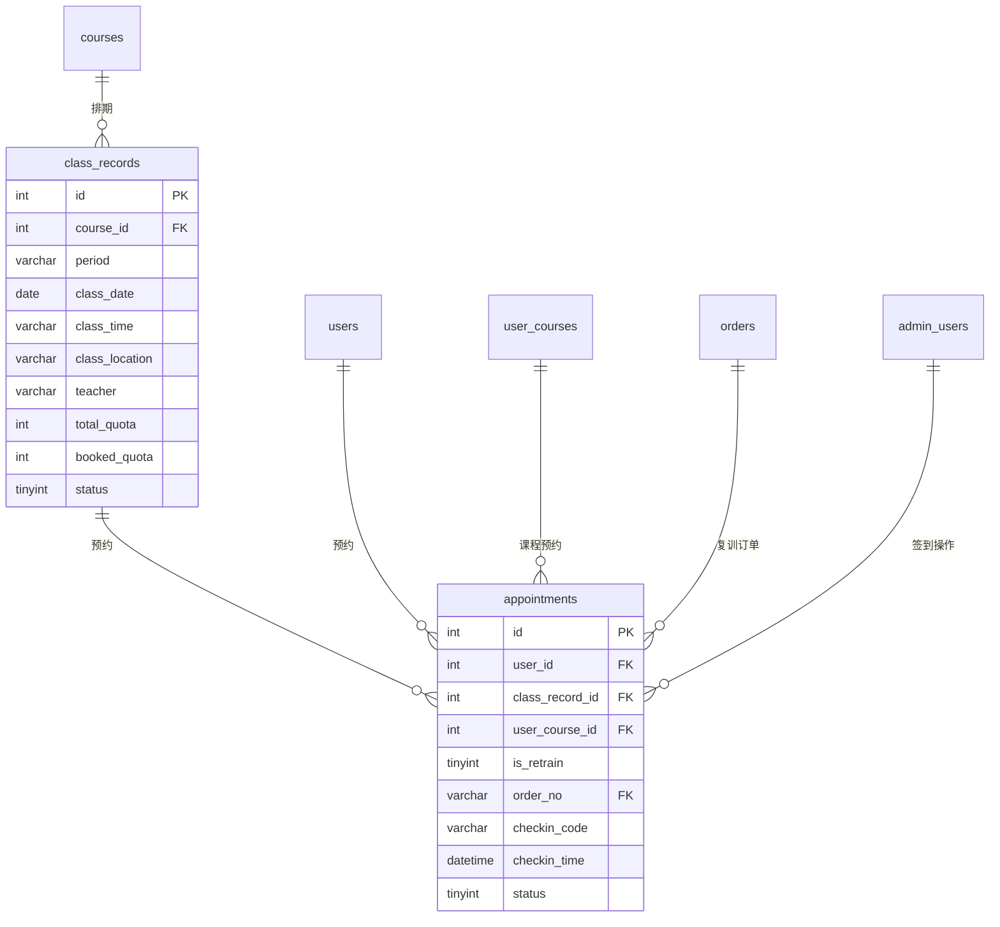

# 预约模块 - 数据库设计

## 1. 模块概述

预约模块负责管理课程排期和用户预约，支持首次上课预约和复训预约。包含上课计划管理、预约创建、签到管理等功能。

### 包含的表

| 表名 | 中文名 | 说明 |
|-----|-------|------|
| class_records | 上课计划表 | 课程排期信息 |
| appointments | 预约表 | 用户预约记录 |

---

## 2. 表结构

### 2.1 class_records（上课计划表）

```sql
CREATE TABLE class_records (
  -- 主键
  id INT AUTO_INCREMENT PRIMARY KEY COMMENT '上课计划ID',

  -- 课程信息
  course_id INT NOT NULL COMMENT '课程ID',
  course_name VARCHAR(100) COMMENT '课程名称（冗余）',
  course_type TINYINT COMMENT '课程类型（冗余）',

  -- 排期信息
  period VARCHAR(20) COMMENT '期数（如：第10期）',
  class_date DATE NOT NULL COMMENT '上课日期',
  class_time VARCHAR(50) COMMENT '上课时间（如：09:00-17:00）',
  class_location VARCHAR(200) COMMENT '上课地点',
  teacher VARCHAR(100) COMMENT '讲师',

  -- 名额管理
  total_quota INT NOT NULL DEFAULT 30 COMMENT '总名额',
  booked_quota INT DEFAULT 0 COMMENT '已预约名额',

  -- 截止时间
  booking_deadline DATETIME COMMENT '预约截止时间',
  retrain_deadline DATETIME COMMENT '复训报名截止时间（开课前3天）',

  -- 状态
  status TINYINT DEFAULT 1 COMMENT '状态：0取消/1正常/2已结束',

  -- 备注
  remark VARCHAR(500) COMMENT '备注',

  -- 时间戳
  created_at DATETIME DEFAULT CURRENT_TIMESTAMP COMMENT '创建时间',
  updated_at DATETIME DEFAULT CURRENT_TIMESTAMP ON UPDATE CURRENT_TIMESTAMP COMMENT '更新时间',

  -- 索引
  INDEX idx_course_id (course_id),
  INDEX idx_class_date (class_date),
  INDEX idx_status (status),
  INDEX idx_course_date (course_id, class_date),
  INDEX idx_booking_deadline (booking_deadline),
  INDEX idx_retrain_deadline (retrain_deadline)
) ENGINE=InnoDB DEFAULT CHARSET=utf8mb4 COLLATE=utf8mb4_unicode_ci COMMENT='上课计划表';
```

### 2.2 appointments（预约表）

```sql
CREATE TABLE appointments (
  -- 主键
  id INT AUTO_INCREMENT PRIMARY KEY COMMENT '预约ID',

  -- 用户信息
  user_id INT NOT NULL COMMENT '用户ID',
  user_uid VARCHAR(64) COMMENT '用户UID',
  user_name VARCHAR(50) COMMENT '用户姓名（冗余）',
  user_phone VARCHAR(20) COMMENT '用户手机号（冗余）',
  _openid VARCHAR(64) DEFAULT '' NOT NULL COMMENT 'CloudBase 用户标识（用于数据隔离）',

  -- 课程信息
  class_record_id INT NOT NULL COMMENT '上课计划ID',
  user_course_id INT NOT NULL COMMENT '用户课程ID',
  course_id INT COMMENT '课程ID（冗余）',
  course_name VARCHAR(100) COMMENT '课程名称（冗余）',

  -- 预约类型
  is_retrain TINYINT(1) DEFAULT 0 COMMENT '是否复训：0首次/1复训',
  order_no VARCHAR(32) COMMENT '关联订单号（复训专用）',

  -- 签到信息
  checkin_code VARCHAR(20) COMMENT '签到码',
  checkin_time DATETIME COMMENT '签到时间',
  checkin_admin_id INT COMMENT '签到操作管理员ID',

  -- 状态
  status TINYINT DEFAULT 0 COMMENT '状态：0待上课/1已签到/2缺席/3已取消',

  -- 取消信息
  cancel_reason VARCHAR(200) COMMENT '取消原因',
  cancel_time DATETIME COMMENT '取消时间',

  -- 备注
  remark VARCHAR(500) COMMENT '备注',

  -- 时间戳
  created_at DATETIME DEFAULT CURRENT_TIMESTAMP COMMENT '预约时间',
  updated_at DATETIME DEFAULT CURRENT_TIMESTAMP ON UPDATE CURRENT_TIMESTAMP COMMENT '更新时间',

  -- 索引
  INDEX idx_user_id (user_id),
  INDEX idx_class_record_id (class_record_id),
  INDEX idx_user_course_id (user_course_id),
  INDEX idx_course_id (course_id),
  INDEX idx_is_retrain (is_retrain),
  INDEX idx_order_no (order_no),
  INDEX idx_status (status),
  INDEX idx_checkin_time (checkin_time),
  INDEX idx_user_class (user_id, class_record_id),
  INDEX idx_class_status (class_record_id, status)
) ENGINE=InnoDB DEFAULT CHARSET=utf8mb4 COLLATE=utf8mb4_unicode_ci COMMENT='预约表';
```

---

## 3. 数据字典

### 3.1 class_records 表字段说明

| 字段名 | 类型 | 长度 | 允许空 | 默认值 | 说明 |
|-------|------|------|-------|-------|------|
| id | INT | - | NO | AUTO_INCREMENT | 上课计划ID |
| course_id | INT | - | NO | - | 课程ID |
| course_name | VARCHAR | 100 | YES | NULL | 课程名称（冗余） |
| course_type | TINYINT | - | YES | NULL | 课程类型（冗余） |
| period | VARCHAR | 20 | YES | NULL | 期数 |
| class_date | DATE | - | NO | - | 上课日期 |
| class_time | VARCHAR | 50 | YES | NULL | 上课时间 |
| class_location | VARCHAR | 200 | YES | NULL | 上课地点 |
| teacher | VARCHAR | 100 | YES | NULL | 讲师 |
| total_quota | INT | - | NO | 30 | 总名额 |
| booked_quota | INT | - | YES | 0 | 已预约名额 |
| booking_deadline | DATETIME | - | YES | NULL | 预约截止时间 |
| retrain_deadline | DATETIME | - | YES | NULL | 复训报名截止时间 |
| status | TINYINT | - | YES | 1 | 状态 |
| remark | VARCHAR | 500 | YES | NULL | 备注 |
| created_at | DATETIME | - | NO | CURRENT_TIMESTAMP | 创建时间 |
| updated_at | DATETIME | - | NO | CURRENT_TIMESTAMP | 更新时间 |

### 3.2 枚举值定义

#### class_records.status（上课计划状态）
| 值 | 说明 |
|---|------|
| 0 | 已取消 |
| 1 | 正常 |
| 2 | 已结束 |

### 3.3 appointments 表字段说明

| 字段名 | 类型 | 长度 | 允许空 | 默认值 | 说明 |
|-------|------|------|-------|-------|------|
| id | INT | - | NO | AUTO_INCREMENT | 预约ID |
| user_id | INT | - | NO | - | 用户ID |
| user_uid | VARCHAR | 64 | YES | NULL | 用户UID |
| user_name | VARCHAR | 50 | YES | NULL | 用户姓名 |
| user_phone | VARCHAR | 20 | YES | NULL | 用户手机号 |
| class_record_id | INT | - | NO | - | 上课计划ID |
| user_course_id | INT | - | NO | - | 用户课程ID |
| course_id | INT | - | YES | NULL | 课程ID |
| course_name | VARCHAR | 100 | YES | NULL | 课程名称 |
| is_retrain | TINYINT | 1 | YES | 0 | 是否复训 |
| order_no | VARCHAR | 32 | YES | NULL | 关联订单号 |
| checkin_code | VARCHAR | 20 | YES | NULL | 签到码 |
| checkin_time | DATETIME | - | YES | NULL | 签到时间 |
| checkin_admin_id | INT | - | YES | NULL | 签到管理员ID |
| status | TINYINT | - | YES | 0 | 状态 |
| cancel_reason | VARCHAR | 200 | YES | NULL | 取消原因 |
| cancel_time | DATETIME | - | YES | NULL | 取消时间 |
| remark | VARCHAR | 500 | YES | NULL | 备注 |
| created_at | DATETIME | - | NO | CURRENT_TIMESTAMP | 预约时间 |
| updated_at | DATETIME | - | NO | CURRENT_TIMESTAMP | 更新时间 |

#### appointments.status（预约状态）
| 值 | 说明 |
|---|------|
| 0 | 待上课 |
| 1 | 已签到 |
| 2 | 缺席 |
| 3 | 已取消 |

#### is_retrain（是否复训）
| 值 | 说明 |
|---|------|
| 0 | 首次上课 |
| 1 | 复训 |

---

## 4. 表关系



---

## 5. 索引设计

### 5.1 class_records 表索引

| 索引名 | 索引类型 | 字段 | 使用场景 |
|-------|---------|------|---------|
| PRIMARY | 主键 | id | 主键查询 |
| idx_course_id | 普通索引 | course_id | 课程排期查询 |
| idx_class_date | 普通索引 | class_date | 日期筛选 |
| idx_status | 普通索引 | status | 状态筛选 |
| idx_course_date | 复合索引 | course_id, class_date | 课程+日期查询 |
| idx_booking_deadline | 普通索引 | booking_deadline | 预约截止查询 |
| idx_retrain_deadline | 普通索引 | retrain_deadline | 复训截止查询 |

### 5.2 appointments 表索引

| 索引名 | 索引类型 | 字段 | 使用场景 |
|-------|---------|------|---------|
| PRIMARY | 主键 | id | 主键查询 |
| idx_user_id | 普通索引 | user_id | 用户预约查询 |
| idx_class_record_id | 普通索引 | class_record_id | 上课计划预约列表 |
| idx_user_course_id | 普通索引 | user_course_id | 用户课程预约查询 |
| idx_course_id | 普通索引 | course_id | 课程预约统计 |
| idx_is_retrain | 普通索引 | is_retrain | 复训筛选 |
| idx_order_no | 普通索引 | order_no | 订单关联查询 |
| idx_status | 普通索引 | status | 状态筛选 |
| idx_checkin_time | 普通索引 | checkin_time | 签到时间查询 |
| idx_user_class | 复合索引 | user_id, class_record_id | 用户是否已预约 |
| idx_class_status | 复合索引 | class_record_id, status | 上课计划预约统计 |

---

## 6. 约束说明

### 6.1 业务规则约束

1. **名额管理**：
   - booked_quota <= total_quota
   - 预约时检查剩余名额
   - 取消预约时释放名额

2. **预约时间限制**：
   - 首次预约：在 booking_deadline 之前
   - 复训预约：在 retrain_deadline 之前（开课前3天）

3. **取消规则**：
   - 复训预约：开课前3天可取消并退款
   - 首次预约：开课前1天可取消
   - 已签到不可取消

4. **签到规则**：
   - 签到后更新 user_courses.attend_count
   - 首次上课签到后触发推荐人奖励解冻

### 6.2 数据完整性约束

1. **course_id 关联**：必须关联有效的 courses.id
2. **user_id 关联**：必须关联有效的 users.id
3. **class_record_id 关联**：必须关联有效的 class_records.id
4. **user_course_id 关联**：必须关联有效的 user_courses.id

### 6.3 预约流程

```
首次预约流程：
1. 验证用户已购买课程
2. 检查 attend_count = 1（首次上课）
3. 检查预约截止时间
4. 检查名额
5. 创建预约记录
6. 更新 booked_quota

复训预约流程：
1. 验证用户已购买课程
2. 检查 attend_count > 1（需复训）
3. 检查复训截止时间
4. 创建复训订单
5. 支付成功后创建预约记录
6. 更新 booked_quota
```

---

## 7. 示例数据

```sql
-- 插入上课计划
INSERT INTO class_records (
  course_id, course_name, course_type, period, class_date, class_time,
  class_location, teacher, total_quota, booked_quota,
  booking_deadline, retrain_deadline, status
) VALUES
(1, '初探班', 1, '第10期', '2024-02-01', '09:00-17:00',
 '深圳市南山区科技园XX大厦3楼', '王老师', 30, 15,
 '2024-01-31 18:00:00', '2024-01-29 00:00:00', 1),
(1, '初探班', 1, '第11期', '2024-02-15', '09:00-17:00',
 '深圳市南山区科技园XX大厦3楼', '王老师', 30, 5,
 '2024-02-14 18:00:00', '2024-02-12 00:00:00', 1),
(2, '密训班', 2, '第5期', '2024-02-20', '09:00-17:00',
 '深圳市南山区科技园XX大厦5楼', '李老师', 20, 8,
 '2024-02-19 18:00:00', '2024-02-17 00:00:00', 1);

-- 插入预约记录（首次上课）
INSERT INTO appointments (
  user_id, user_uid, user_name, user_phone,
  class_record_id, user_course_id, course_id, course_name,
  is_retrain, checkin_code, status
) VALUES
(1, 'cloud-uid-001', '张三', '13800138001',
 1, 1, 1, '初探班',
 0, 'CHK001', 0);

-- 插入预约记录（复训）
INSERT INTO appointments (
  user_id, user_uid, user_name, user_phone,
  class_record_id, user_course_id, course_id, course_name,
  is_retrain, order_no, checkin_code, status
) VALUES
(2, 'cloud-uid-002', '李四', '13800138002',
 2, 2, 1, '初探班',
 1, 'ORD2024011500000003', 'CHK002', 0);

-- 插入已签到的预约记录
INSERT INTO appointments (
  user_id, user_uid, user_name, user_phone,
  class_record_id, user_course_id, course_id, course_name,
  is_retrain, checkin_code, checkin_time, checkin_admin_id, status
) VALUES
(3, 'cloud-uid-003', '王五', '13800138003',
 1, 3, 1, '初探班',
 0, 'CHK003', '2024-02-01 08:55:00', 1, 1);

-- 插入已取消的预约记录
INSERT INTO appointments (
  user_id, user_uid, user_name, user_phone,
  class_record_id, user_course_id, course_id, course_name,
  is_retrain, status, cancel_reason, cancel_time
) VALUES
(4, 'cloud-uid-004', '赵六', '13800138004',
 1, 4, 1, '初探班',
 0, 3, '时间冲突', '2024-01-25 10:00:00');
```

---

## 8. 变更记录

| 版本 | 日期 | 变更内容 | 变更人 |
|-----|------|---------|-------|
| V1.0 | 2026-02-03 | 初始版本 | Claude |
