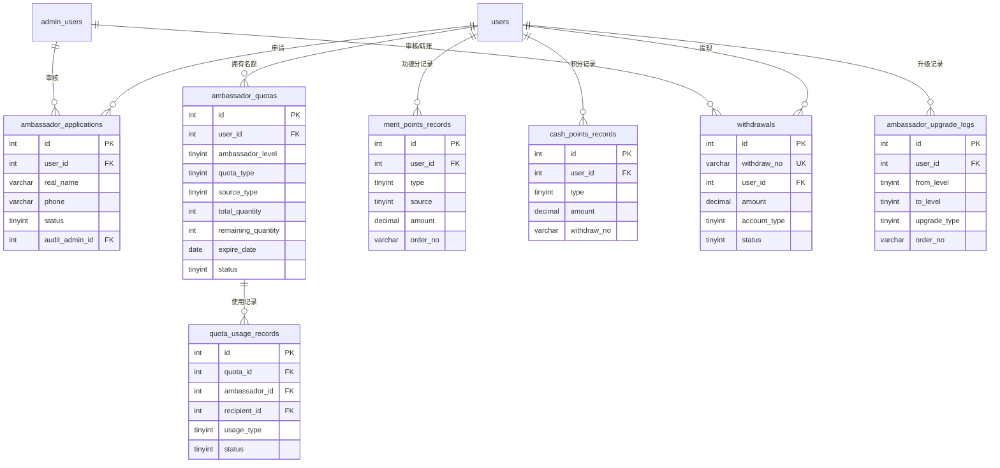

# 大使模块 - 数据库设计

## 1. 模块概述

大使模块是系统的核心业务模块，负责管理传播大使体系，包括大使申请、等级升级、名额管理、功德分/积分管理、提现等功能。

### 包含的表

| 表名 | 中文名 | 说明 |
|-----|-------|------|
| ambassador_applications | 大使申请表 | 大使申请记录 |
| ambassador_quotas | 大使名额表 | 大使赠送名额管理 |
| quota_usage_records | 名额使用记录表 | 名额赠送/核销记录 |
| merit_points_records | 功德分记录表 | 功德分流水 |
| cash_points_records | 积分记录表 | 现金积分流水 |
| withdrawals | 提现记录表 | 积分提现申请 |
| ambassador_upgrade_logs | 大使升级日志表 | 大使等级变更记录 |

---

## 2. 表结构

### 2.1 ambassador_applications（大使申请表）

```sql
CREATE TABLE ambassador_applications (
  -- 主键
  id INT AUTO_INCREMENT PRIMARY KEY COMMENT '申请ID',

  -- 用户信息
  user_id INT NOT NULL COMMENT '用户ID',
  user_uid VARCHAR(64) COMMENT '用户UID',
  _openid VARCHAR(64) DEFAULT '' NOT NULL COMMENT 'CloudBase 用户标识（用于数据隔离）',

  -- 申请信息
  real_name VARCHAR(50) NOT NULL COMMENT '真实姓名',
  phone VARCHAR(20) NOT NULL COMMENT '手机号',
  wechat_id VARCHAR(50) COMMENT '微信号',
  city VARCHAR(50) COMMENT '所在城市',
  occupation VARCHAR(50) COMMENT '职业/行业',
  apply_reason TEXT COMMENT '申请原因',
  understanding TEXT COMMENT '对天道文化的理解',
  willing_help TINYINT(1) DEFAULT 1 COMMENT '是否愿意帮助他人',
  promotion_plan TEXT COMMENT '推广计划',

  -- 审核信息
  status TINYINT DEFAULT 0 COMMENT '状态：0待审核/1待面试/2面试中/3已通过/4已拒绝',
  interview_time DATETIME COMMENT '面试时间',
  interview_remark VARCHAR(500) COMMENT '面试备注',
  reject_reason VARCHAR(500) COMMENT '拒绝原因',

  -- 审核管理员
  audit_admin_id INT COMMENT '审核管理员ID',
  audit_time DATETIME COMMENT '审核时间',
  audit_remark VARCHAR(500) COMMENT '审核备注',

  -- 时间戳
  created_at DATETIME DEFAULT CURRENT_TIMESTAMP COMMENT '申请时间',
  updated_at DATETIME DEFAULT CURRENT_TIMESTAMP ON UPDATE CURRENT_TIMESTAMP COMMENT '更新时间',

  -- 索引
  INDEX idx_user_id (user_id),
  INDEX idx_status (status),
  INDEX idx_audit_admin_id (audit_admin_id),
  INDEX idx_created_at (created_at)
) ENGINE=InnoDB DEFAULT CHARSET=utf8mb4 COLLATE=utf8mb4_unicode_ci COMMENT='大使申请表';
```

### 2.2 ambassador_quotas（大使名额表）

```sql
CREATE TABLE ambassador_quotas (
  -- 主键
  id INT AUTO_INCREMENT PRIMARY KEY COMMENT '名额ID',

  -- 大使信息
  user_id INT NOT NULL COMMENT '大使用户ID',
  user_uid VARCHAR(64) COMMENT '大使用户UID',
  _openid VARCHAR(64) DEFAULT '' NOT NULL COMMENT 'CloudBase 用户标识（用于数据隔离）',
  ambassador_level TINYINT NOT NULL COMMENT '大使等级：2青鸾/3鸿鹄/4金凤等',

  -- 名额信息
  quota_type TINYINT NOT NULL COMMENT '名额类型：1初探班/2密训班',
  source_type TINYINT NOT NULL COMMENT '来源类型：1大使升级/2活动奖励/3系统发放',
  source_remark VARCHAR(200) COMMENT '来源说明',

  -- 数量管理
  total_quantity INT NOT NULL COMMENT '总数量',
  used_quantity INT DEFAULT 0 COMMENT '已使用数量',
  remaining_quantity INT NOT NULL COMMENT '剩余数量',

  -- 有效期
  expire_date DATE NOT NULL COMMENT '过期日期',

  -- 状态
  status TINYINT DEFAULT 1 COMMENT '状态：0失效/1有效',

  -- 时间戳
  created_at DATETIME DEFAULT CURRENT_TIMESTAMP COMMENT '创建时间',
  updated_at DATETIME DEFAULT CURRENT_TIMESTAMP ON UPDATE CURRENT_TIMESTAMP COMMENT '更新时间',

  -- 索引
  INDEX idx_user_id (user_id),
  INDEX idx_ambassador_level (ambassador_level),
  INDEX idx_quota_type (quota_type),
  INDEX idx_source_type (source_type),
  INDEX idx_expire_date (expire_date),
  INDEX idx_status (status),
  INDEX idx_user_status (user_id, status)
) ENGINE=InnoDB DEFAULT CHARSET=utf8mb4 COLLATE=utf8mb4_unicode_ci COMMENT='大使名额表';
```

### 2.3 quota_usage_records（名额使用记录表）

```sql
CREATE TABLE quota_usage_records (
  -- 主键
  id INT AUTO_INCREMENT PRIMARY KEY COMMENT '记录ID',

  -- 名额信息
  quota_id INT NOT NULL COMMENT '名额ID',

  -- 大使信息
  ambassador_id INT NOT NULL COMMENT '大使用户ID',
  ambassador_uid VARCHAR(64) COMMENT '大使用户UID',
  _openid VARCHAR(64) DEFAULT '' NOT NULL COMMENT 'CloudBase 用户标识（用于数据隔离）',

  -- 受赠人信息
  recipient_id INT COMMENT '受赠人用户ID',
  recipient_uid VARCHAR(64) COMMENT '受赠人用户UID',
  recipient_name VARCHAR(50) COMMENT '受赠人姓名',
  recipient_phone VARCHAR(20) COMMENT '受赠人手机号',

  -- 使用信息
  usage_type TINYINT NOT NULL COMMENT '使用类型：1赠送/2核销',
  course_id INT COMMENT '课程ID',
  course_name VARCHAR(100) COMMENT '课程名称',

  -- 状态
  status TINYINT DEFAULT 1 COMMENT '状态：1已赠送/2已核销/3已取消',

  -- 核销信息
  verify_time DATETIME COMMENT '核销时间',
  verify_admin_id INT COMMENT '核销管理员ID',

  -- 备注
  message VARCHAR(200) COMMENT '赠送留言',
  remark VARCHAR(500) COMMENT '备注',

  -- 时间戳
  created_at DATETIME DEFAULT CURRENT_TIMESTAMP COMMENT '创建时间',
  updated_at DATETIME DEFAULT CURRENT_TIMESTAMP ON UPDATE CURRENT_TIMESTAMP COMMENT '更新时间',

  -- 索引
  INDEX idx_quota_id (quota_id),
  INDEX idx_ambassador_id (ambassador_id),
  INDEX idx_recipient_id (recipient_id),
  INDEX idx_usage_type (usage_type),
  INDEX idx_status (status),
  INDEX idx_created_at (created_at)
) ENGINE=InnoDB DEFAULT CHARSET=utf8mb4 COLLATE=utf8mb4_unicode_ci COMMENT='名额使用记录表';
```

### 2.4 merit_points_records（功德分记录表）

```sql
CREATE TABLE merit_points_records (
  -- 主键
  id INT AUTO_INCREMENT PRIMARY KEY COMMENT '记录ID',

  -- 用户信息
  user_id INT NOT NULL COMMENT '用户ID',
  user_uid VARCHAR(64) COMMENT '用户UID',
  _openid VARCHAR(64) DEFAULT '' NOT NULL COMMENT 'CloudBase 用户标识（用于数据隔离）',

  -- 变动信息
  type TINYINT NOT NULL COMMENT '类型：1获得/2使用/3过期/4退回',
  source TINYINT NOT NULL COMMENT '来源：1推荐初探班/2推荐密训班/3活动奖励/4商城兑换/5系统调整',
  amount DECIMAL(10,2) NOT NULL COMMENT '变动金额（正数增加，负数减少）',
  balance_after DECIMAL(10,2) COMMENT '变动后余额',

  -- 关联信息
  order_no VARCHAR(32) COMMENT '关联订单号',
  exchange_no VARCHAR(32) COMMENT '关联兑换单号',
  referee_user_id INT COMMENT '被推荐人ID（推荐获得时）',
  referee_user_name VARCHAR(50) COMMENT '被推荐人姓名',
  activity_name VARCHAR(100) COMMENT '活动名称（活动奖励时）',

  -- 备注
  remark VARCHAR(500) COMMENT '备注',

  -- 时间戳
  created_at DATETIME DEFAULT CURRENT_TIMESTAMP COMMENT '创建时间',

  -- 索引
  INDEX idx_user_id (user_id),
  INDEX idx_type (type),
  INDEX idx_source (source),
  INDEX idx_order_no (order_no),
  INDEX idx_exchange_no (exchange_no),
  INDEX idx_created_at (created_at),
  INDEX idx_user_type (user_id, type),
  INDEX idx_user_source (user_id, source)
) ENGINE=InnoDB DEFAULT CHARSET=utf8mb4 COLLATE=utf8mb4_unicode_ci COMMENT='功德分记录表';
```

### 2.5 cash_points_records（积分记录表）

```sql
CREATE TABLE cash_points_records (
  -- 主键
  id INT AUTO_INCREMENT PRIMARY KEY COMMENT '记录ID',

  -- 用户信息
  user_id INT NOT NULL COMMENT '用户ID',
  user_uid VARCHAR(64) COMMENT '用户UID',
  _openid VARCHAR(64) DEFAULT '' NOT NULL COMMENT 'CloudBase 用户标识（用于数据隔离）',

  -- 变动信息
  type TINYINT NOT NULL COMMENT '类型：1获得冻结/2解冻/3提现申请/4提现成功/5提现失败退回/6系统调整',
  amount DECIMAL(10,2) NOT NULL COMMENT '变动金额',

  -- 余额快照
  frozen_after DECIMAL(10,2) COMMENT '变动后冻结余额',
  available_after DECIMAL(10,2) COMMENT '变动后可用余额',

  -- 关联信息
  order_no VARCHAR(32) COMMENT '关联订单号',
  withdraw_no VARCHAR(32) COMMENT '关联提现单号',
  referee_user_id INT COMMENT '被推荐人ID（解冻时）',
  referee_user_name VARCHAR(50) COMMENT '被推荐人姓名',

  -- 备注
  remark VARCHAR(500) COMMENT '备注',

  -- 时间戳
  created_at DATETIME DEFAULT CURRENT_TIMESTAMP COMMENT '创建时间',

  -- 索引
  INDEX idx_user_id (user_id),
  INDEX idx_type (type),
  INDEX idx_order_no (order_no),
  INDEX idx_withdraw_no (withdraw_no),
  INDEX idx_created_at (created_at),
  INDEX idx_user_type (user_id, type)
) ENGINE=InnoDB DEFAULT CHARSET=utf8mb4 COLLATE=utf8mb4_unicode_ci COMMENT='积分记录表';
```

### 2.6 withdrawals（提现记录表）

```sql
CREATE TABLE withdrawals (
  -- 主键
  id INT AUTO_INCREMENT PRIMARY KEY COMMENT '提现ID',

  -- 提现单号
  withdraw_no VARCHAR(32) NOT NULL COMMENT '提现单号（格式：WD + 年月日 + 8位随机数）',

  -- 用户信息
  user_id INT NOT NULL COMMENT '用户ID',
  user_uid VARCHAR(64) COMMENT '用户UID',
  user_name VARCHAR(50) COMMENT '用户姓名',
  _openid VARCHAR(64) DEFAULT '' NOT NULL COMMENT 'CloudBase 用户标识（用于数据隔离）',

  -- 提现金额
  amount DECIMAL(10,2) NOT NULL COMMENT '提现金额',

  -- 收款账户
  account_type TINYINT NOT NULL COMMENT '账户类型：1微信/2支付宝/3银行卡',
  account_info JSON NOT NULL COMMENT '账户信息',

  -- 状态
  status TINYINT DEFAULT 0 COMMENT '状态：0待审核/1审核通过待转账/2已转账/3已拒绝',

  -- 申请信息
  apply_time DATETIME NOT NULL COMMENT '申请时间',
  apply_ip VARCHAR(50) COMMENT '申请IP',

  -- 审核信息
  audit_admin_id INT COMMENT '审核管理员ID',
  audit_time DATETIME COMMENT '审核时间',
  audit_remark VARCHAR(500) COMMENT '审核备注',
  reject_reason VARCHAR(500) COMMENT '拒绝原因',

  -- 转账信息
  transfer_time DATETIME COMMENT '转账时间',
  transfer_no VARCHAR(64) COMMENT '转账流水号',
  transfer_admin_id INT COMMENT '转账操作管理员ID',

  -- 时间戳
  created_at DATETIME DEFAULT CURRENT_TIMESTAMP COMMENT '创建时间',
  updated_at DATETIME DEFAULT CURRENT_TIMESTAMP ON UPDATE CURRENT_TIMESTAMP COMMENT '更新时间',

  -- 唯一索引
  UNIQUE KEY uk_withdraw_no (withdraw_no),

  -- 普通索引
  INDEX idx_user_id (user_id),
  INDEX idx_status (status),
  INDEX idx_account_type (account_type),
  INDEX idx_apply_time (apply_time),
  INDEX idx_audit_time (audit_time),
  INDEX idx_audit_admin_id (audit_admin_id),
  INDEX idx_status_apply_time (status, apply_time)
) ENGINE=InnoDB DEFAULT CHARSET=utf8mb4 COLLATE=utf8mb4_unicode_ci COMMENT='提现记录表';
```

### 2.7 ambassador_upgrade_logs（大使升级日志表）

```sql
CREATE TABLE ambassador_upgrade_logs (
  -- 主键
  id INT AUTO_INCREMENT PRIMARY KEY COMMENT '日志ID',

  -- 用户信息
  user_id INT NOT NULL COMMENT '用户ID',
  user_uid VARCHAR(64) COMMENT '用户UID',

  -- 等级变更
  from_level TINYINT NOT NULL COMMENT '原等级',
  to_level TINYINT NOT NULL COMMENT '新等级',

  -- 升级类型
  upgrade_type TINYINT NOT NULL COMMENT '升级类型：1支付升级/2协议升级/3管理员调整',

  -- 关联信息
  order_no VARCHAR(32) COMMENT '关联订单号（支付升级时）',
  contract_signature_id INT COMMENT '关联协议签署ID（协议升级时）',
  admin_id INT COMMENT '操作管理员ID（管理员调整时）',

  -- 奖励信息
  rewards JSON COMMENT '升级奖励信息',

  -- 备注
  remark VARCHAR(500) COMMENT '备注',

  -- 时间戳
  created_at DATETIME DEFAULT CURRENT_TIMESTAMP COMMENT '升级时间',

  -- 索引
  INDEX idx_user_id (user_id),
  INDEX idx_from_level (from_level),
  INDEX idx_to_level (to_level),
  INDEX idx_upgrade_type (upgrade_type),
  INDEX idx_order_no (order_no),
  INDEX idx_created_at (created_at)
) ENGINE=InnoDB DEFAULT CHARSET=utf8mb4 COLLATE=utf8mb4_unicode_ci COMMENT='大使升级日志表';
```

---

## 3. 数据字典

### 3.1 枚举值定义

#### ambassador_applications.status（申请状态）
| 值 | 说明 |
|---|------|
| 0 | 待审核 |
| 1 | 待面试 |
| 2 | 面试中 |
| 3 | 已通过 |
| 4 | 已拒绝 |

#### ambassador_quotas.quota_type（名额类型）
| 值 | 说明 |
|---|------|
| 1 | 初探班名额 |
| 2 | 密训班名额 |

#### ambassador_quotas.source_type（名额来源）
| 值 | 说明 |
|---|------|
| 1 | 大使升级 |
| 2 | 活动奖励 |
| 3 | 系统发放 |

#### quota_usage_records.usage_type（使用类型）
| 值 | 说明 |
|---|------|
| 1 | 赠送 |
| 2 | 核销 |

#### quota_usage_records.status（使用状态）
| 值 | 说明 |
|---|------|
| 1 | 已赠送 |
| 2 | 已核销 |
| 3 | 已取消 |

#### merit_points_records.type（功德分类型）
| 值 | 说明 |
|---|------|
| 1 | 获得 |
| 2 | 使用 |
| 3 | 过期 |
| 4 | 退回 |

#### merit_points_records.source（功德分来源）
| 值 | 说明 | 金额计算 |
|---|------|---------|
| 1 | 推荐初探班 | 1688 × 30% = 506.4 |
| 2 | 推荐密训班 | 38888 × 20% = 7777.6 |
| 3 | 活动奖励 | 根据活动配置 |
| 4 | 商城兑换 | 负数（消费） |
| 5 | 系统调整 | 管理员操作 |

#### cash_points_records.type（积分类型）
| 值 | 说明 |
|---|------|
| 1 | 获得冻结 |
| 2 | 解冻 |
| 3 | 提现申请 |
| 4 | 提现成功 |
| 5 | 提现失败退回 |
| 6 | 系统调整 |

#### withdrawals.account_type（账户类型）
| 值 | 说明 |
|---|------|
| 1 | 微信 |
| 2 | 支付宝 |
| 3 | 银行卡 |

#### withdrawals.status（提现状态）
| 值 | 说明 |
|---|------|
| 0 | 待审核 |
| 1 | 审核通过待转账 |
| 2 | 已转账 |
| 3 | 已拒绝 |

#### ambassador_upgrade_logs.upgrade_type（升级类型）
| 值 | 说明 |
|---|------|
| 1 | 支付升级 |
| 2 | 协议升级 |
| 3 | 管理员调整 |

### 3.2 JSON 结构定义

#### withdrawals.account_info（账户信息）

```json
// 微信账户
{
  "account_name": "张三",
  "account_no": "微信号或手机号"
}

// 支付宝账户
{
  "account_name": "张三",
  "account_no": "支付宝账号"
}

// 银行卡账户
{
  "account_name": "张三",
  "account_no": "6222021234567890123",
  "bank_name": "中国工商银行",
  "bank_branch": "深圳南山支行"
}
```

#### ambassador_upgrade_logs.rewards（升级奖励）

```json
// 青鸾升级奖励
{
  "frozen_points": 1688.00,
  "description": "获得1688冻结积分"
}

// 鸿鹄升级奖励
{
  "frozen_points": 16880.00,
  "quota_count": 10,
  "quota_type": 1,
  "description": "获得16880冻结积分和10个初探班名额"
}
```

---

## 4. 表关系



---

## 5. 索引设计

### 5.1 索引汇总

| 表名 | 索引名 | 字段 | 使用场景 |
|-----|-------|------|---------|
| ambassador_applications | idx_user_id | user_id | 用户申请查询 |
| ambassador_applications | idx_status | status | 状态筛选 |
| ambassador_quotas | idx_user_status | user_id, status | 用户有效名额查询 |
| ambassador_quotas | idx_expire_date | expire_date | 过期名额清理 |
| quota_usage_records | idx_quota_id | quota_id | 名额使用记录 |
| quota_usage_records | idx_ambassador_id | ambassador_id | 大使赠送记录 |
| merit_points_records | idx_user_type | user_id, type | 用户功德分明细 |
| merit_points_records | idx_user_source | user_id, source | 用户功德分来源统计 |
| cash_points_records | idx_user_type | user_id, type | 用户积分明细 |
| withdrawals | uk_withdraw_no | withdraw_no | 提现单号查询 |
| withdrawals | idx_status_apply_time | status, apply_time | 待处理提现列表 |
| ambassador_upgrade_logs | idx_user_id | user_id | 用户升级历史 |

---

## 6. 约束说明

### 6.1 业务规则约束

1. **大使申请**：
   - 必须已购买密训班
   - 不能重复申请（待审核/待面试状态）
   - 已是大使不能申请

2. **名额管理**：
   - remaining_quantity = total_quantity - used_quantity
   - 赠送时检查剩余名额和有效期
   - 过期名额自动失效

3. **功德分规则**：
   - 推荐初探班：30% 功德分（506.4）
   - 推荐密训班：20% 功德分（7777.6）
   - 商城兑换消费功德分

4. **积分规则**：
   - 青鸾升级：获得1688冻结积分
   - 鸿鹄升级：获得16880冻结积分
   - 首次推荐成功解冻1688积分

5. **提现规则**：
   - 最低提现金额：100元
   - 单笔最高金额：50000元
   - 有待处理提现时不能再次申请

### 6.2 大使等级升级路径

```
普通用户 → 准青鸾大使（申请审核通过）
    ↓
准青鸾 → 青鸾大使（推荐初探班成功1次 + 签署协议）
    ↓
青鸾 → 鸿鹄大使（支付9800元 + 签署补充协议）
```

---

## 7. 示例数据

```sql
-- 大使申请
INSERT INTO ambassador_applications (
  user_id, user_uid, real_name, phone, wechat_id, city,
  occupation, apply_reason, understanding, willing_help, promotion_plan,
  status
) VALUES (
  1, 'cloud-uid-001', '张三', '13800138001', 'zhangsan123', '深圳市',
  '教育行业', '希望传播天道文化', '对天道文化有深刻理解', 1, '通过朋友圈和线下活动推广',
  0
);

-- 大使名额（鸿鹄大使升级获得）
INSERT INTO ambassador_quotas (
  user_id, user_uid, ambassador_level, quota_type, source_type, source_remark,
  total_quantity, used_quantity, remaining_quantity, expire_date, status
) VALUES (
  100, 'cloud-uid-100', 3, 1, 1, '升级鸿鹄大使获得',
  10, 3, 7, '2025-01-15', 1
);

-- 名额使用记录
INSERT INTO quota_usage_records (
  quota_id, ambassador_id, ambassador_uid,
  recipient_id, recipient_uid, recipient_name, recipient_phone,
  usage_type, course_id, course_name, status, message
) VALUES (
  1, 100, 'cloud-uid-100',
  50, 'cloud-uid-050', '李四', '13800138050',
  1, 1, '初探班', 1, '赠送初探班名额，祝学习愉快'
);

-- 功德分记录
INSERT INTO merit_points_records (
  user_id, user_uid, type, source, amount, balance_after,
  order_no, referee_user_id, referee_user_name, remark
) VALUES
(100, 'cloud-uid-100', 1, 2, 7777.60, 12777.60,
 'ORD2024011500000002', 2, '李四', '推荐密训班获得功德分');

-- 积分记录
INSERT INTO cash_points_records (
  user_id, user_uid, type, amount, frozen_after, available_after,
  order_no, referee_user_id, referee_user_name, remark
) VALUES
(100, 'cloud-uid-100', 1, 1688.00, 1688.00, 0.00,
 NULL, NULL, NULL, '升级为青鸾大使'),
(100, 'cloud-uid-100', 2, 1688.00, 0.00, 1688.00,
 'ORD2024011500000001', 1, '张三', '首次推荐成功解冻');

-- 提现记录
INSERT INTO withdrawals (
  withdraw_no, user_id, user_uid, user_name, amount,
  account_type, account_info, status, apply_time
) VALUES (
  'WD2024011500000001', 100, 'cloud-uid-100', '王大使', 1688.00,
  1, '{"account_name": "王大使", "account_no": "wangdashi"}', 0, NOW()
);

-- 大使升级日志
INSERT INTO ambassador_upgrade_logs (
  user_id, user_uid, from_level, to_level, upgrade_type,
  order_no, rewards, remark
) VALUES
(100, 'cloud-uid-100', 1, 2, 2,
 NULL, '{"frozen_points": 1688.00}', '签署协议升级为青鸾大使'),
(100, 'cloud-uid-100', 2, 3, 1,
 'ORD2024011500000004', '{"frozen_points": 16880.00, "quota_count": 10, "quota_type": 1}', '支付升级为鸿鹄大使');
```

---

## 8. 变更记录

| 版本 | 日期 | 变更内容 | 变更人 |
|-----|------|---------|-------|
| V1.0 | 2026-02-03 | 初始版本 | Claude |
