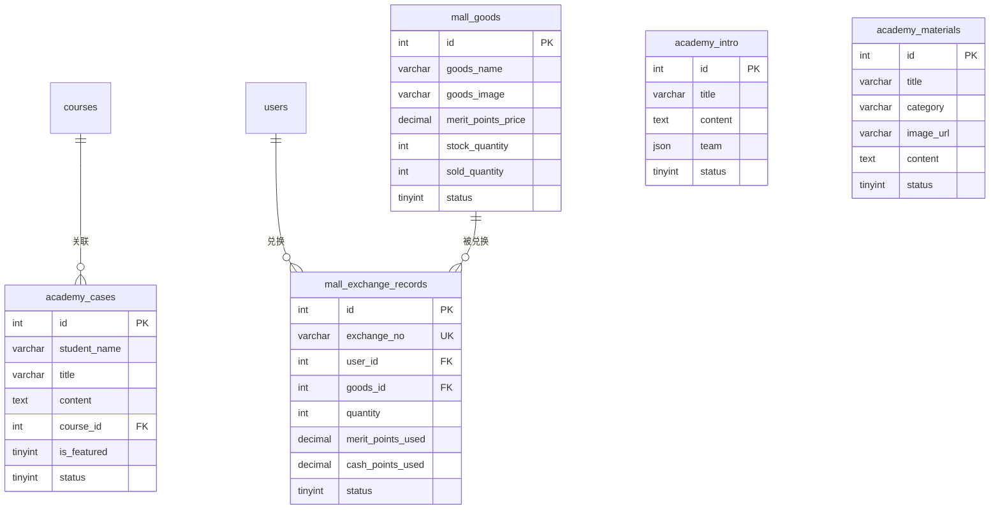

# 商学院商城模块 - 数据库设计

## 1. 模块概述

商学院商城模块包含商学院介绍、朋友圈素材、学员案例展示，以及功德分兑换商城功能。商城兑换不涉及真实金钱交易，直接使用功德分（可补充积分）完成兑换。

### 包含的表

| 表名 | 中文名 | 说明 |
|-----|-------|------|
| academy_intro | 商学院介绍表 | 商学院简介和团队 |
| academy_materials | 朋友圈素材表 | 推广素材库 |
| academy_cases | 学员案例表 | 学员成功案例 |
| mall_goods | 商城商品表 | 功德分兑换商品 |
| mall_exchange_records | 兑换记录表 | 商品兑换记录 |

---

## 2. 表结构

### 2.1 academy_intro（商学院介绍表）

```sql
CREATE TABLE academy_intro (
  -- 主键
  id INT AUTO_INCREMENT PRIMARY KEY COMMENT '介绍ID',

  -- 基本信息
  title VARCHAR(100) NOT NULL COMMENT '标题',
  content TEXT COMMENT '介绍内容（HTML）',
  cover_image VARCHAR(255) COMMENT '封面图片',

  -- 团队信息（JSON数组）
  team JSON COMMENT '团队成员信息',

  -- 排序和状态
  sort_order INT DEFAULT 0 COMMENT '排序权重',
  status TINYINT DEFAULT 1 COMMENT '状态：0禁用/1启用',

  -- 时间戳
  created_at DATETIME DEFAULT CURRENT_TIMESTAMP COMMENT '创建时间',
  updated_at DATETIME DEFAULT CURRENT_TIMESTAMP ON UPDATE CURRENT_TIMESTAMP COMMENT '更新时间',

  -- 索引
  INDEX idx_status (status),
  INDEX idx_sort_order (sort_order)
) ENGINE=InnoDB DEFAULT CHARSET=utf8mb4 COLLATE=utf8mb4_unicode_ci COMMENT='商学院介绍表';
```

### 2.2 academy_materials（朋友圈素材表）

```sql
CREATE TABLE academy_materials (
  -- 主键
  id INT AUTO_INCREMENT PRIMARY KEY COMMENT '素材ID',

  -- 基本信息
  title VARCHAR(100) NOT NULL COMMENT '素材标题',
  category VARCHAR(50) NOT NULL COMMENT '分类：poster海报/copywriting文案/video视频',

  -- 内容
  image_url VARCHAR(255) COMMENT '图片URL',
  video_url VARCHAR(255) COMMENT '视频URL',
  content TEXT COMMENT '文案内容',

  -- 标签
  tags JSON COMMENT '标签列表',

  -- 统计
  view_count INT DEFAULT 0 COMMENT '浏览次数',
  download_count INT DEFAULT 0 COMMENT '下载次数',
  share_count INT DEFAULT 0 COMMENT '分享次数',

  -- 排序和状态
  sort_order INT DEFAULT 0 COMMENT '排序权重',
  status TINYINT DEFAULT 1 COMMENT '状态：0下架/1上架',

  -- 时间戳
  created_at DATETIME DEFAULT CURRENT_TIMESTAMP COMMENT '创建时间',
  updated_at DATETIME DEFAULT CURRENT_TIMESTAMP ON UPDATE CURRENT_TIMESTAMP COMMENT '更新时间',

  -- 索引
  INDEX idx_category (category),
  INDEX idx_status (status),
  INDEX idx_sort_order (sort_order),
  INDEX idx_created_at (created_at),
  INDEX idx_category_status (category, status)
) ENGINE=InnoDB DEFAULT CHARSET=utf8mb4 COLLATE=utf8mb4_unicode_ci COMMENT='朋友圈素材表';
```

### 2.3 academy_cases（学员案例表）

```sql
CREATE TABLE academy_cases (
  -- 主键
  id INT AUTO_INCREMENT PRIMARY KEY COMMENT '案例ID',

  -- 学员信息
  student_name VARCHAR(50) NOT NULL COMMENT '学员姓名',
  student_avatar VARCHAR(255) COMMENT '学员头像',
  student_title VARCHAR(100) COMMENT '学员头衔/职业',

  -- 案例内容
  title VARCHAR(200) NOT NULL COMMENT '案例标题',
  summary VARCHAR(500) COMMENT '案例摘要',
  content TEXT COMMENT '详细内容（HTML）',

  -- 媒体资源
  video_url VARCHAR(255) COMMENT '视频URL',
  images JSON COMMENT '图片列表',

  -- 课程关联
  course_id INT COMMENT '关联课程ID',
  course_name VARCHAR(100) COMMENT '关联课程名称',

  -- 统计
  view_count INT DEFAULT 0 COMMENT '浏览次数',
  like_count INT DEFAULT 0 COMMENT '点赞次数',

  -- 排序和状态
  sort_order INT DEFAULT 0 COMMENT '排序权重',
  is_featured TINYINT(1) DEFAULT 0 COMMENT '是否精选',
  status TINYINT DEFAULT 1 COMMENT '状态：0下架/1上架',

  -- 时间戳
  created_at DATETIME DEFAULT CURRENT_TIMESTAMP COMMENT '创建时间',
  updated_at DATETIME DEFAULT CURRENT_TIMESTAMP ON UPDATE CURRENT_TIMESTAMP COMMENT '更新时间',

  -- 索引
  INDEX idx_course_id (course_id),
  INDEX idx_is_featured (is_featured),
  INDEX idx_status (status),
  INDEX idx_sort_order (sort_order),
  INDEX idx_created_at (created_at)
) ENGINE=InnoDB DEFAULT CHARSET=utf8mb4 COLLATE=utf8mb4_unicode_ci COMMENT='学员案例表';
```

### 2.4 mall_goods（商城商品表）

```sql
CREATE TABLE mall_goods (
  -- 主键
  id INT AUTO_INCREMENT PRIMARY KEY COMMENT '商品ID',

  -- 基本信息
  goods_name VARCHAR(100) NOT NULL COMMENT '商品名称',
  goods_image VARCHAR(255) COMMENT '商品图片',
  description TEXT COMMENT '商品描述',

  -- 价格（功德分）
  merit_points_price DECIMAL(10,2) NOT NULL COMMENT '功德分价格',

  -- 库存
  stock_quantity INT DEFAULT -1 COMMENT '库存数量（-1表示无限）',
  sold_quantity INT DEFAULT 0 COMMENT '已售数量',

  -- 兑换限制
  limit_per_user INT DEFAULT 0 COMMENT '每人限兑数量（0表示不限）',

  -- 排序和状态
  sort_order INT DEFAULT 0 COMMENT '排序权重',
  status TINYINT DEFAULT 1 COMMENT '状态：0下架/1上架',

  -- 时间戳
  created_at DATETIME DEFAULT CURRENT_TIMESTAMP COMMENT '创建时间',
  updated_at DATETIME DEFAULT CURRENT_TIMESTAMP ON UPDATE CURRENT_TIMESTAMP COMMENT '更新时间',

  -- 索引
  INDEX idx_status (status),
  INDEX idx_sort_order (sort_order),
  INDEX idx_merit_points_price (merit_points_price)
) ENGINE=InnoDB DEFAULT CHARSET=utf8mb4 COLLATE=utf8mb4_unicode_ci COMMENT='商城商品表';
```

### 2.5 mall_exchange_records（兑换记录表）

```sql
CREATE TABLE mall_exchange_records (
  -- 主键
  id INT AUTO_INCREMENT PRIMARY KEY COMMENT '兑换ID',

  -- 兑换单号
  exchange_no VARCHAR(32) NOT NULL COMMENT '兑换单号（格式：EX + 年月日 + 8位随机数）',

  -- 用户信息
  user_id INT NOT NULL COMMENT '用户ID',
  user_uid VARCHAR(64) COMMENT '用户UID',
  user_name VARCHAR(50) COMMENT '用户姓名',
  _openid VARCHAR(64) DEFAULT '' NOT NULL COMMENT 'CloudBase 用户标识（用于数据隔离）',

  -- 商品信息
  goods_id INT NOT NULL COMMENT '商品ID',
  goods_name VARCHAR(100) NOT NULL COMMENT '商品名称（冗余）',
  goods_image VARCHAR(255) COMMENT '商品图片（冗余）',

  -- 兑换数量和价格
  quantity INT NOT NULL DEFAULT 1 COMMENT '兑换数量',
  unit_price DECIMAL(10,2) NOT NULL COMMENT '单价（功德分）',
  total_cost DECIMAL(10,2) NOT NULL COMMENT '总成本',

  -- 支付明细
  merit_points_used DECIMAL(10,2) NOT NULL COMMENT '使用功德分',
  cash_points_used DECIMAL(10,2) DEFAULT 0.00 COMMENT '补充的积分',

  -- 状态
  status TINYINT DEFAULT 1 COMMENT '状态：1已兑换/2已领取/3已取消',

  -- 领取信息
  pickup_time DATETIME COMMENT '领取时间',
  pickup_admin_id INT COMMENT '领取确认管理员ID',

  -- 备注
  remark VARCHAR(500) COMMENT '备注',

  -- 时间戳
  created_at DATETIME DEFAULT CURRENT_TIMESTAMP COMMENT '兑换时间',
  updated_at DATETIME DEFAULT CURRENT_TIMESTAMP ON UPDATE CURRENT_TIMESTAMP COMMENT '更新时间',

  -- 唯一索引
  UNIQUE KEY uk_exchange_no (exchange_no),

  -- 普通索引
  INDEX idx_user_id (user_id),
  INDEX idx_goods_id (goods_id),
  INDEX idx_status (status),
  INDEX idx_created_at (created_at),
  INDEX idx_user_status (user_id, status)
) ENGINE=InnoDB DEFAULT CHARSET=utf8mb4 COLLATE=utf8mb4_unicode_ci COMMENT='兑换记录表';
```

---

## 3. 数据字典

### 3.1 枚举值定义

#### academy_materials.category（素材分类）
| 值 | 说明 |
|---|------|
| poster | 海报 |
| copywriting | 文案 |
| video | 视频 |

#### mall_goods.status（商品状态）
| 值 | 说明 |
|---|------|
| 0 | 下架 |
| 1 | 上架 |

#### mall_exchange_records.status（兑换状态）
| 值 | 说明 |
|---|------|
| 1 | 已兑换（待领取） |
| 2 | 已领取 |
| 3 | 已取消 |

### 3.2 JSON 结构定义

#### academy_intro.team（团队成员）

```json
[
  {
    "name": "讲师姓名",
    "avatar": "头像URL",
    "title": "职称",
    "intro": "简介"
  }
]
```

#### academy_materials.tags（标签列表）

```json
["初探班", "推广", "朋友圈"]
```

#### academy_cases.images（图片列表）

```json
["https://example.com/img1.jpg", "https://example.com/img2.jpg"]
```

---

## 4. 表关系



---

## 5. 索引设计

### 5.1 索引汇总

| 表名 | 索引名 | 字段 | 使用场景 |
|-----|-------|------|---------|
| academy_intro | idx_status | status | 启用状态筛选 |
| academy_materials | idx_category_status | category, status | 分类+状态查询 |
| academy_materials | idx_created_at | created_at | 时间排序 |
| academy_cases | idx_course_id | course_id | 课程关联查询 |
| academy_cases | idx_is_featured | is_featured | 精选案例查询 |
| mall_goods | idx_status | status | 上架商品查询 |
| mall_goods | idx_sort_order | sort_order | 排序查询 |
| mall_exchange_records | uk_exchange_no | exchange_no | 兑换单号查询 |
| mall_exchange_records | idx_user_status | user_id, status | 用户兑换记录 |

---

## 6. 约束说明

### 6.1 业务规则约束

1. **商品库存**：
   - stock_quantity = -1 表示无限库存
   - stock_quantity >= 0 时需检查库存
   - 兑换时：stock_quantity -= quantity, sold_quantity += quantity

2. **兑换限制**：
   - limit_per_user > 0 时检查用户已兑换数量
   - 功德分不足时可使用积分补充

3. **混合支付规则**：
   ```
   总成本 = merit_points_price × quantity

   如果 用户功德分 >= 总成本:
       merit_points_used = 总成本
       cash_points_used = 0
   否则:
       merit_points_used = 用户功德分
       cash_points_used = 总成本 - merit_points_used
   ```

4. **素材管理**：
   - 海报类必须有 image_url
   - 视频类必须有 video_url
   - 文案类必须有 content

### 6.2 数据完整性约束

1. **user_id 关联**：必须关联有效的 users.id
2. **goods_id 关联**：必须关联有效的 mall_goods.id
3. **course_id 关联**：如有值，必须关联有效的 courses.id

---

## 7. 示例数据

```sql
-- 商学院介绍
INSERT INTO academy_intro (title, content, team, status) VALUES (
  '天道文化商学院',
  '<h1>关于我们</h1><p>天道文化商学院致力于传播天道文化...</p>',
  '[{"name": "王老师", "avatar": "https://example.com/avatar1.jpg", "title": "首席讲师", "intro": "20年教学经验"}]',
  1
);

-- 朋友圈素材
INSERT INTO academy_materials (title, category, image_url, content, tags, status, sort_order) VALUES
('初探班招生海报', 'poster', 'https://example.com/poster1.jpg', NULL, '["初探班", "招生"]', 1, 100),
('学员见证文案', 'copywriting', NULL, '参加初探班后，我的人生发生了翻天覆地的变化...', '["见证", "文案"]', 1, 90),
('课程介绍视频', 'video', 'https://example.com/thumb1.jpg', NULL, '["视频", "介绍"]', 1, 80);

-- 更新视频素材的视频URL
UPDATE academy_materials SET video_url = 'https://example.com/video1.mp4' WHERE id = 3;

-- 学员案例
INSERT INTO academy_cases (
  student_name, student_avatar, student_title, title, summary, content,
  video_url, images, course_id, course_name, is_featured, status
) VALUES (
  '张三',
  'https://example.com/student1.jpg',
  '企业家',
  '从迷茫到清晰：我的天道文化学习之旅',
  '通过学习天道文化，我找到了人生的方向...',
  '<p>详细的学习心得...</p>',
  'https://example.com/case1.mp4',
  '["https://example.com/case1_1.jpg", "https://example.com/case1_2.jpg"]',
  1, '初探班', 1, 1
);

-- 商城商品
INSERT INTO mall_goods (goods_name, goods_image, description, merit_points_price, stock_quantity, limit_per_user, status, sort_order) VALUES
('初探班名额券', 'https://example.com/goods1.jpg', '可兑换一次初探班上课名额', 1688.00, 50, 1, 1, 100),
('天道文化书籍套装', 'https://example.com/goods2.jpg', '包含3本天道文化经典书籍', 500.00, 100, 2, 1, 90),
('定制文化衫', 'https://example.com/goods3.jpg', '天道文化定制T恤', 200.00, -1, 0, 1, 80);

-- 兑换记录
INSERT INTO mall_exchange_records (
  exchange_no, user_id, user_uid, user_name,
  goods_id, goods_name, goods_image, quantity, unit_price, total_cost,
  merit_points_used, cash_points_used, status
) VALUES (
  'EX2024011500000001', 100, 'cloud-uid-100', '王大使',
  1, '初探班名额券', 'https://example.com/goods1.jpg', 1, 1688.00, 1688.00,
  1500.00, 188.00, 1
);
```

---

## 8. 变更记录

| 版本 | 日期 | 变更内容 | 变更人 |
|-----|------|---------|-------|
| V1.0 | 2026-02-03 | 初始版本 | Claude |
