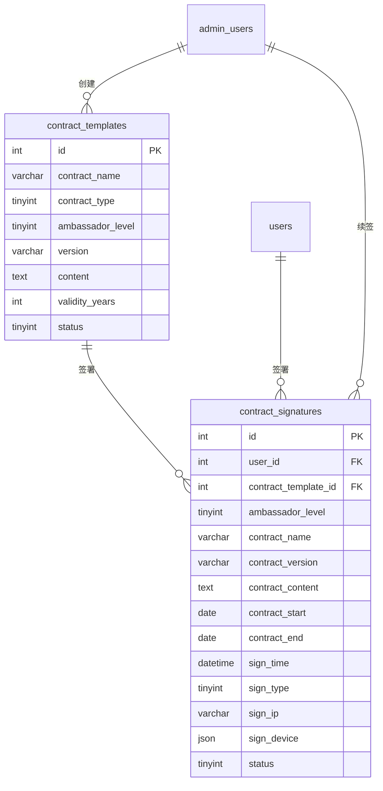

# 协议模块 - 数据库设计

## 1. 模块概述

协议模块负责管理系统中的各类协议模板和用户签署记录，支持协议版本管理、用户签署、协议续签等功能。主要用于传播大使的合作协议管理。

### 包含的表

| 表名 | 中文名 | 说明 |
|-----|-------|------|
| contract_templates | 协议模板表 | 协议模板管理 |
| contract_signatures | 协议签署记录表 | 用户签署记录 |

---

## 2. 表结构

### 2.1 contract_templates（协议模板表）

```sql
CREATE TABLE contract_templates (
  -- 主键
  id INT AUTO_INCREMENT PRIMARY KEY COMMENT '模板ID',

  -- 基本信息
  contract_name VARCHAR(100) NOT NULL COMMENT '协议名称',
  contract_type TINYINT NOT NULL COMMENT '协议类型：1传播大使协议/2青鸾大使协议/3鸿鹄大使补充协议',
  ambassador_level TINYINT NOT NULL COMMENT '适用大使等级：1准青鸾/2青鸾/3鸿鹄',

  -- 版本信息
  version VARCHAR(20) NOT NULL COMMENT '版本号（如：v1.0）',
  version_note VARCHAR(500) COMMENT '版本说明',

  -- 协议内容
  content TEXT NOT NULL COMMENT '协议内容（HTML，支持变量占位符）',

  -- 有效期配置
  validity_years INT DEFAULT 1 COMMENT '协议有效期（年）',
  effective_time DATETIME COMMENT '生效时间',

  -- 状态
  status TINYINT DEFAULT 1 COMMENT '状态：0禁用/1启用',

  -- 创建信息
  created_by INT COMMENT '创建管理员ID',

  -- 时间戳
  created_at DATETIME DEFAULT CURRENT_TIMESTAMP COMMENT '创建时间',
  updated_at DATETIME DEFAULT CURRENT_TIMESTAMP ON UPDATE CURRENT_TIMESTAMP COMMENT '更新时间',

  -- 索引
  INDEX idx_contract_type (contract_type),
  INDEX idx_ambassador_level (ambassador_level),
  INDEX idx_version (version),
  INDEX idx_status (status),
  INDEX idx_type_level_status (contract_type, ambassador_level, status)
) ENGINE=InnoDB DEFAULT CHARSET=utf8mb4 COLLATE=utf8mb4_unicode_ci COMMENT='协议模板表';
```

### 2.2 contract_signatures（协议签署记录表）

```sql
CREATE TABLE contract_signatures (
  -- 主键
  id INT AUTO_INCREMENT PRIMARY KEY COMMENT '签署ID',

  -- 用户信息
  user_id INT NOT NULL COMMENT '用户ID',
  user_uid VARCHAR(64) COMMENT '用户UID',
  user_name VARCHAR(50) COMMENT '用户姓名',
  _openid VARCHAR(64) DEFAULT '' NOT NULL COMMENT 'CloudBase 用户标识（用于数据隔离）',

  -- 协议模板信息
  contract_template_id INT NOT NULL COMMENT '协议模板ID',
  ambassador_level TINYINT NOT NULL COMMENT '签署时的大使等级',

  -- 协议快照（签署时的完整协议内容）
  contract_name VARCHAR(100) NOT NULL COMMENT '协议名称',
  contract_version VARCHAR(20) NOT NULL COMMENT '协议版本',
  contract_content TEXT NOT NULL COMMENT '协议完整内容（已填充变量）',

  -- 合同期限
  contract_start DATE NOT NULL COMMENT '合同开始日期',
  contract_end DATE NOT NULL COMMENT '合同结束日期',

  -- 签署信息
  sign_time DATETIME NOT NULL COMMENT '签署时间',
  sign_type TINYINT DEFAULT 1 COMMENT '签署类型：1用户签署/2管理员续签',
  sign_phone_suffix VARCHAR(4) COMMENT '签署手机号后四位',
  sign_ip VARCHAR(50) COMMENT '签署IP地址',
  sign_device JSON COMMENT '签署设备信息',

  -- 管理员操作（续签时）
  admin_id INT COMMENT '操作管理员ID（续签时）',

  -- 状态
  status TINYINT DEFAULT 1 COMMENT '状态：0已作废/1有效/2已过期/3已续签',

  -- 时间戳
  created_at DATETIME DEFAULT CURRENT_TIMESTAMP COMMENT '创建时间',
  updated_at DATETIME DEFAULT CURRENT_TIMESTAMP ON UPDATE CURRENT_TIMESTAMP COMMENT '更新时间',

  -- 索引
  INDEX idx_user_id (user_id),
  INDEX idx_contract_template_id (contract_template_id),
  INDEX idx_ambassador_level (ambassador_level),
  INDEX idx_contract_end (contract_end),
  INDEX idx_sign_time (sign_time),
  INDEX idx_sign_type (sign_type),
  INDEX idx_status (status),
  INDEX idx_user_status (user_id, status),
  INDEX idx_admin_id (admin_id)
) ENGINE=InnoDB DEFAULT CHARSET=utf8mb4 COLLATE=utf8mb4_unicode_ci COMMENT='协议签署记录表';
```

---

## 3. 数据字典

### 3.1 contract_templates 表字段说明

| 字段名 | 类型 | 长度 | 允许空 | 默认值 | 说明 |
|-------|------|------|-------|-------|------|
| id | INT | - | NO | AUTO_INCREMENT | 模板ID |
| contract_name | VARCHAR | 100 | NO | - | 协议名称 |
| contract_type | TINYINT | - | NO | - | 协议类型 |
| ambassador_level | TINYINT | - | NO | - | 适用大使等级 |
| version | VARCHAR | 20 | NO | - | 版本号 |
| version_note | VARCHAR | 500 | YES | NULL | 版本说明 |
| content | TEXT | - | NO | - | 协议内容 |
| validity_years | INT | - | YES | 1 | 协议有效期（年） |
| effective_time | DATETIME | - | YES | NULL | 生效时间 |
| status | TINYINT | - | YES | 1 | 状态 |
| created_by | INT | - | YES | NULL | 创建管理员ID |
| created_at | DATETIME | - | NO | CURRENT_TIMESTAMP | 创建时间 |
| updated_at | DATETIME | - | NO | CURRENT_TIMESTAMP | 更新时间 |

### 3.2 枚举值定义

#### contract_type（协议类型）
| 值 | 说明 | 适用等级 |
|---|------|---------|
| 1 | 传播大使协议 | 准青鸾 |
| 2 | 青鸾大使协议 | 青鸾 |
| 3 | 鸿鹄大使补充协议 | 鸿鹄 |

#### ambassador_level（大使等级）
| 值 | 说明 |
|---|------|
| 1 | 准青鸾大使 |
| 2 | 青鸾大使 |
| 3 | 鸿鹄大使 |

#### contract_templates.status（模板状态）
| 值 | 说明 |
|---|------|
| 0 | 禁用 |
| 1 | 启用 |

#### contract_signatures.sign_type（签署类型）
| 值 | 说明 |
|---|------|
| 1 | 用户签署 |
| 2 | 管理员续签 |

#### contract_signatures.status（签署状态）
| 值 | 说明 |
|---|------|
| 0 | 已作废 |
| 1 | 有效 |
| 2 | 已过期 |
| 3 | 已续签 |

### 3.3 JSON 结构定义

#### sign_device（签署设备信息）

```json
{
  "model": "iPhone 15 Pro",
  "os": "iOS",
  "version": "17.2",
  "brand": "Apple"
}
```

### 3.4 协议内容变量占位符

协议模板中支持以下变量占位符，签署时自动替换：

| 占位符 | 说明 | 示例值 |
|-------|------|-------|
| {{real_name}} | 用户真实姓名 | 张三 |
| {{phone}} | 用户手机号 | 13800138000 |
| {{city}} | 用户所在城市 | 深圳市 |
| {{referee_name}} | 推荐人姓名 | 李四 |
| {{today}} | 签署日期 | 2024年01月15日 |
| {{contract_start}} | 合同开始日期 | 2024年01月15日 |
| {{contract_end}} | 合同结束日期 | 2025年01月15日 |
| {{ambassador_level_name}} | 大使等级名称 | 青鸾大使 |
| {{year}} | 当前年份 | 2024 |

---

## 4. 表关系



---

## 5. 索引设计

### 5.1 contract_templates 表索引

| 索引名 | 索引类型 | 字段 | 使用场景 |
|-------|---------|------|---------|
| PRIMARY | 主键 | id | 主键查询 |
| idx_contract_type | 普通索引 | contract_type | 协议类型筛选 |
| idx_ambassador_level | 普通索引 | ambassador_level | 大使等级筛选 |
| idx_version | 普通索引 | version | 版本查询 |
| idx_status | 普通索引 | status | 状态筛选 |
| idx_type_level_status | 复合索引 | contract_type, ambassador_level, status | 获取最新协议模板 |

### 5.2 contract_signatures 表索引

| 索引名 | 索引类型 | 字段 | 使用场景 |
|-------|---------|------|---------|
| PRIMARY | 主键 | id | 主键查询 |
| idx_user_id | 普通索引 | user_id | 用户协议查询 |
| idx_contract_template_id | 普通索引 | contract_template_id | 模板签署统计 |
| idx_ambassador_level | 普通索引 | ambassador_level | 等级筛选 |
| idx_contract_end | 普通索引 | contract_end | 到期提醒查询 |
| idx_sign_time | 普通索引 | sign_time | 签署时间排序 |
| idx_sign_type | 普通索引 | sign_type | 签署类型筛选 |
| idx_status | 普通索引 | status | 状态筛选 |
| idx_user_status | 复合索引 | user_id, status | 用户有效协议查询 |
| idx_admin_id | 普通索引 | admin_id | 管理员操作查询 |

---

## 6. 约束说明

### 6.1 业务规则约束

1. **协议版本管理**：
   - 同一类型协议可有多个版本
   - 签署时使用最新启用版本
   - 旧版本可禁用但不删除

2. **签署规则**：
   - 验证手机号后四位
   - 记录签署IP和设备信息
   - 保存协议完整快照（防止模板修改影响已签署协议）
   - 防止重复签署同一协议

3. **有效期管理**：
   - 默认有效期1年
   - 到期前30天提醒续签
   - 过期后自动更新状态为"已过期"

4. **续签规则**：
   - 管理员可手动续签
   - 续签从原协议到期日或当前日期开始
   - 原协议状态更新为"已续签"

### 6.2 数据完整性约束

1. **user_id 关联**：必须关联有效的 users.id
2. **contract_template_id 关联**：必须关联有效的 contract_templates.id
3. **admin_id 关联**：如有值，必须关联有效的 admin_users.id

### 6.3 协议签署流程

```
1. 获取协议模板
   ↓
2. 填充用户变量
   ↓
3. 验证手机号后四位
   ↓
4. 记录签署信息（IP、设备）
   ↓
5. 保存协议快照
   ↓
6. 设置合同期限
   ↓
7. 创建签署记录
```

---

## 7. 示例数据

```sql
-- 协议模板
INSERT INTO contract_templates (
  contract_name, contract_type, ambassador_level, version, version_note,
  content, validity_years, effective_time, status, created_by
) VALUES
('传播大使合作协议', 1, 1, 'v1.0', '初始版本',
 '<h1>传播大使合作协议</h1>
  <p>甲方：天道文化</p>
  <p>乙方：{{real_name}}</p>
  <p>手机号：{{phone}}</p>
  <p>...</p>
  <p>签署日期：{{today}}</p>
  <p>合同期限：{{contract_start}} 至 {{contract_end}}</p>',
 1, '2024-01-01 00:00:00', 1, 1),

('青鸾大使协议', 2, 2, 'v1.0', '初始版本',
 '<h1>青鸾大使协议</h1>
  <p>甲方：天道文化</p>
  <p>乙方：{{real_name}}（{{ambassador_level_name}}）</p>
  <p>...</p>',
 1, '2024-01-01 00:00:00', 1, 1),

('鸿鹄大使补充协议', 3, 3, 'v1.0', '初始版本',
 '<h1>鸿鹄大使补充协议</h1>
  <p>本协议为《青鸾大使协议》的补充协议...</p>
  <p>...</p>',
 1, '2024-01-01 00:00:00', 1, 1);

-- 协议签署记录（用户签署）
INSERT INTO contract_signatures (
  user_id, user_uid, user_name, contract_template_id, ambassador_level,
  contract_name, contract_version, contract_content,
  contract_start, contract_end, sign_time, sign_type,
  sign_phone_suffix, sign_ip, sign_device, status
) VALUES (
  100, 'cloud-uid-100', '王大使', 2, 2,
  '青鸾大使协议', 'v1.0',
  '<h1>青鸾大使协议</h1><p>甲方：天道文化</p><p>乙方：王大使（青鸾大使）</p>...',
  '2024-01-15', '2025-01-15', '2024-01-15 10:00:00', 1,
  '8100', '192.168.1.100',
  '{"model": "iPhone 15 Pro", "os": "iOS", "version": "17.2"}',
  1
);

-- 协议签署记录（管理员续签）
INSERT INTO contract_signatures (
  user_id, user_uid, user_name, contract_template_id, ambassador_level,
  contract_name, contract_version, contract_content,
  contract_start, contract_end, sign_time, sign_type,
  admin_id, status
) VALUES (
  101, 'cloud-uid-101', '李大使', 2, 2,
  '青鸾大使协议', 'v1.0',
  '<h1>青鸾大使协议</h1><p>甲方：天道文化</p><p>乙方：李大使（青鸾大使）</p>...',
  '2025-01-16', '2026-01-16', '2025-01-10 14:00:00', 2,
  1, 1
);

-- 查询即将到期的协议（30天内）
SELECT cs.*, u.real_name, u.phone
FROM contract_signatures cs
JOIN users u ON cs.user_id = u.id
WHERE cs.status = 1
  AND cs.contract_end BETWEEN CURDATE() AND DATE_ADD(CURDATE(), INTERVAL 30 DAY)
ORDER BY cs.contract_end ASC;
```

---

## 8. 变更记录

| 版本 | 日期 | 变更内容 | 变更人 |
|-----|------|---------|-------|
| V1.0 | 2026-02-03 | 初始版本 | Claude |
