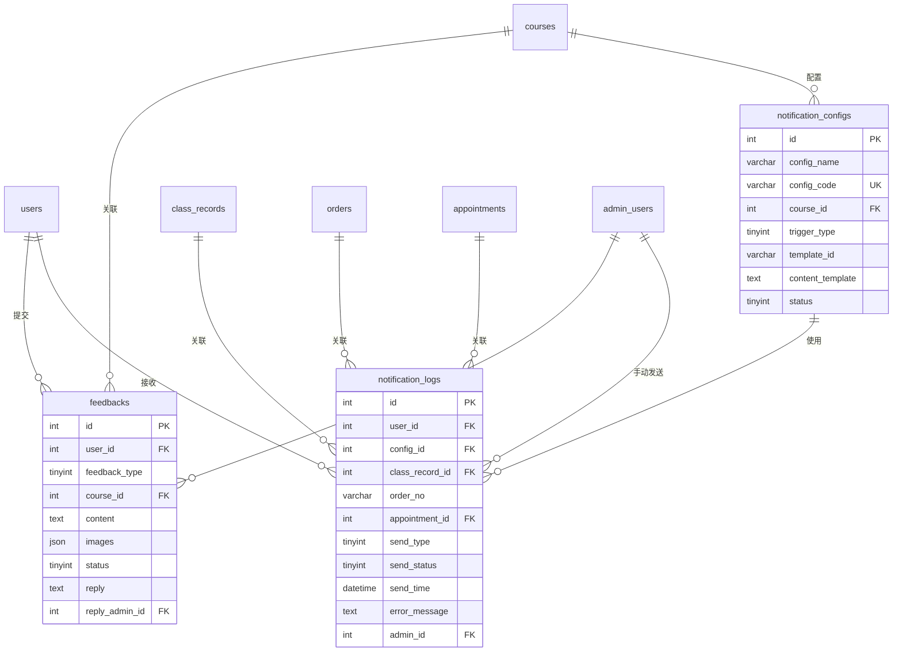

# 反馈消息模块 - 数据库设计

## 1. 模块概述

反馈消息模块负责管理用户反馈和系统消息通知功能，包括用户反馈提交与处理、消息模板配置、消息发送记录等。

### 包含的表

| 表名 | 中文名 | 说明 |
|-----|-------|------|
| feedbacks | 反馈表 | 用户反馈记录 |
| notification_configs | 消息配置表 | 消息模板配置 |
| notification_logs | 消息发送日志表 | 消息发送记录 |

---

## 2. 表结构

### 2.1 feedbacks（反馈表）

```sql
CREATE TABLE feedbacks (
  -- 主键
  id INT AUTO_INCREMENT PRIMARY KEY COMMENT '反馈ID',

  -- 用户信息
  user_id INT NOT NULL COMMENT '用户ID',
  user_uid VARCHAR(64) COMMENT '用户UID',
  user_name VARCHAR(50) COMMENT '用户姓名',
  user_phone VARCHAR(20) COMMENT '用户手机号',
  _openid VARCHAR(64) DEFAULT '' NOT NULL COMMENT 'CloudBase 用户标识（用于数据隔离）',

  -- 反馈内容
  feedback_type TINYINT NOT NULL COMMENT '反馈类型：1功能建议/2课程内容/3课程服务/4系统问题/5其他',
  course_id INT COMMENT '关联课程ID（课程相关反馈）',
  course_name VARCHAR(100) COMMENT '关联课程名称',
  content TEXT NOT NULL COMMENT '反馈内容',
  images JSON COMMENT '图片列表',
  contact VARCHAR(100) COMMENT '联系方式',

  -- 处理信息
  status TINYINT DEFAULT 0 COMMENT '状态：0待处理/1处理中/2已处理/3已关闭',
  reply TEXT COMMENT '回复内容',
  reply_time DATETIME COMMENT '回复时间',
  reply_admin_id INT COMMENT '回复管理员ID',

  -- 优先级
  priority TINYINT DEFAULT 0 COMMENT '优先级：0普通/1紧急/2非常紧急',

  -- 时间戳
  created_at DATETIME DEFAULT CURRENT_TIMESTAMP COMMENT '提交时间',
  updated_at DATETIME DEFAULT CURRENT_TIMESTAMP ON UPDATE CURRENT_TIMESTAMP COMMENT '更新时间',

  -- 索引
  INDEX idx_user_id (user_id),
  INDEX idx_feedback_type (feedback_type),
  INDEX idx_course_id (course_id),
  INDEX idx_status (status),
  INDEX idx_priority (priority),
  INDEX idx_reply_admin_id (reply_admin_id),
  INDEX idx_created_at (created_at),
  INDEX idx_status_priority (status, priority)
) ENGINE=InnoDB DEFAULT CHARSET=utf8mb4 COLLATE=utf8mb4_unicode_ci COMMENT='反馈表';
```

### 2.2 notification_configs（消息配置表）

```sql
CREATE TABLE notification_configs (
  -- 主键
  id INT AUTO_INCREMENT PRIMARY KEY COMMENT '配置ID',

  -- 基本信息
  config_name VARCHAR(100) NOT NULL COMMENT '配置名称',
  config_code VARCHAR(50) NOT NULL COMMENT '配置编码（唯一标识）',

  -- 关联信息
  course_id INT COMMENT '关联课程ID（0表示通用）',

  -- 触发条件
  trigger_type TINYINT NOT NULL COMMENT '触发类型：1预约成功/2上课提醒/3签到成功/4支付成功/5手动发送',
  trigger_time_offset INT DEFAULT 0 COMMENT '触发时间偏移（分钟，负数表示提前）',

  -- 微信模板信息
  template_id VARCHAR(100) COMMENT '微信订阅消息模板ID',
  template_name VARCHAR(100) COMMENT '模板名称',

  -- 消息内容配置
  title VARCHAR(100) COMMENT '消息标题',
  content_template TEXT COMMENT '消息内容模板（支持变量）',

  -- 跳转配置
  page_path VARCHAR(200) COMMENT '点击跳转页面路径',

  -- 状态
  status TINYINT DEFAULT 1 COMMENT '状态：0禁用/1启用',

  -- 时间戳
  created_at DATETIME DEFAULT CURRENT_TIMESTAMP COMMENT '创建时间',
  updated_at DATETIME DEFAULT CURRENT_TIMESTAMP ON UPDATE CURRENT_TIMESTAMP COMMENT '更新时间',

  -- 唯一索引
  UNIQUE KEY uk_config_code (config_code),

  -- 普通索引
  INDEX idx_course_id (course_id),
  INDEX idx_trigger_type (trigger_type),
  INDEX idx_status (status),
  INDEX idx_course_trigger (course_id, trigger_type)
) ENGINE=InnoDB DEFAULT CHARSET=utf8mb4 COLLATE=utf8mb4_unicode_ci COMMENT='消息配置表';
```

### 2.3 notification_logs（消息发送日志表）

```sql
CREATE TABLE notification_logs (
  -- 主键
  id INT AUTO_INCREMENT PRIMARY KEY COMMENT '日志ID',

  -- 用户信息
  user_id INT NOT NULL COMMENT '用户ID',
  user_uid VARCHAR(64) COMMENT '用户UID',
  openid VARCHAR(128) COMMENT '微信OpenID',
  _openid VARCHAR(64) DEFAULT '' NOT NULL COMMENT 'CloudBase 用户标识（用于数据隔离）',

  -- 消息配置
  config_id INT COMMENT '消息配置ID',
  template_id VARCHAR(100) COMMENT '微信模板ID',

  -- 关联信息
  class_record_id INT COMMENT '关联上课计划ID',
  order_no VARCHAR(32) COMMENT '关联订单号',
  appointment_id INT COMMENT '关联预约ID',

  -- 消息内容
  title VARCHAR(100) COMMENT '消息标题',
  content TEXT COMMENT '消息内容',
  template_data JSON COMMENT '模板数据（发送给微信的数据）',

  -- 发送信息
  send_type TINYINT DEFAULT 1 COMMENT '发送类型：1自动/2手动',
  send_status TINYINT DEFAULT 0 COMMENT '发送状态：0待发送/1已发送/2发送失败',
  send_time DATETIME COMMENT '发送时间',
  error_message TEXT COMMENT '发送失败时的错误信息',

  -- 手动发送信息
  admin_id INT COMMENT '手动发送时的管理员ID',

  -- 时间戳
  created_at DATETIME DEFAULT CURRENT_TIMESTAMP COMMENT '创建时间',

  -- 索引
  INDEX idx_user_id (user_id),
  INDEX idx_config_id (config_id),
  INDEX idx_class_record_id (class_record_id),
  INDEX idx_order_no (order_no),
  INDEX idx_appointment_id (appointment_id),
  INDEX idx_send_type (send_type),
  INDEX idx_send_status (send_status),
  INDEX idx_send_time (send_time),
  INDEX idx_admin_id (admin_id),
  INDEX idx_created_at (created_at),
  INDEX idx_class_status (class_record_id, send_status)
) ENGINE=InnoDB DEFAULT CHARSET=utf8mb4 COLLATE=utf8mb4_unicode_ci COMMENT='消息发送日志表';
```

---

## 3. 数据字典

### 3.1 feedbacks 表字段说明

| 字段名 | 类型 | 长度 | 允许空 | 默认值 | 说明 |
|-------|------|------|-------|-------|------|
| id | INT | - | NO | AUTO_INCREMENT | 反馈ID |
| user_id | INT | - | NO | - | 用户ID |
| user_uid | VARCHAR | 64 | YES | NULL | 用户UID |
| user_name | VARCHAR | 50 | YES | NULL | 用户姓名 |
| user_phone | VARCHAR | 20 | YES | NULL | 用户手机号 |
| feedback_type | TINYINT | - | NO | - | 反馈类型 |
| course_id | INT | - | YES | NULL | 关联课程ID |
| course_name | VARCHAR | 100 | YES | NULL | 关联课程名称 |
| content | TEXT | - | NO | - | 反馈内容 |
| images | JSON | - | YES | NULL | 图片列表 |
| contact | VARCHAR | 100 | YES | NULL | 联系方式 |
| status | TINYINT | - | YES | 0 | 状态 |
| reply | TEXT | - | YES | NULL | 回复内容 |
| reply_time | DATETIME | - | YES | NULL | 回复时间 |
| reply_admin_id | INT | - | YES | NULL | 回复管理员ID |
| priority | TINYINT | - | YES | 0 | 优先级 |
| created_at | DATETIME | - | NO | CURRENT_TIMESTAMP | 提交时间 |
| updated_at | DATETIME | - | NO | CURRENT_TIMESTAMP | 更新时间 |

### 3.2 枚举值定义

#### feedbacks.feedback_type（反馈类型）
| 值 | 说明 |
|---|------|
| 1 | 功能建议 |
| 2 | 课程内容 |
| 3 | 课程服务 |
| 4 | 系统问题 |
| 5 | 其他 |

#### feedbacks.status（反馈状态）
| 值 | 说明 |
|---|------|
| 0 | 待处理 |
| 1 | 处理中 |
| 2 | 已处理 |
| 3 | 已关闭 |

#### feedbacks.priority（优先级）
| 值 | 说明 |
|---|------|
| 0 | 普通 |
| 1 | 紧急 |
| 2 | 非常紧急 |

#### notification_configs.trigger_type（触发类型）
| 值 | 说明 | 触发时机 |
|---|------|---------|
| 1 | 预约成功 | 用户预约成功后 |
| 2 | 上课提醒 | 上课前N分钟 |
| 3 | 签到成功 | 用户签到后 |
| 4 | 支付成功 | 订单支付成功后 |
| 5 | 手动发送 | 管理员手动触发 |

#### notification_logs.send_type（发送类型）
| 值 | 说明 |
|---|------|
| 1 | 自动发送 |
| 2 | 手动发送 |

#### notification_logs.send_status（发送状态）
| 值 | 说明 |
|---|------|
| 0 | 待发送 |
| 1 | 已发送 |
| 2 | 发送失败 |

### 3.3 JSON 结构定义

#### feedbacks.images（图片列表）

```json
["https://example.com/img1.jpg", "https://example.com/img2.jpg"]
```

#### notification_logs.template_data（模板数据）

```json
{
  "thing1": {
    "value": "初探班"
  },
  "time2": {
    "value": "2024-02-01 09:00"
  },
  "thing3": {
    "value": "深圳市南山区"
  },
  "thing4": {
    "value": "请准时参加"
  }
}
```

---

## 4. 表关系



---

## 5. 索引设计

### 5.1 feedbacks 表索引

| 索引名 | 索引类型 | 字段 | 使用场景 |
|-------|---------|------|---------|
| PRIMARY | 主键 | id | 主键查询 |
| idx_user_id | 普通索引 | user_id | 用户反馈查询 |
| idx_feedback_type | 普通索引 | feedback_type | 类型筛选 |
| idx_course_id | 普通索引 | course_id | 课程反馈查询 |
| idx_status | 普通索引 | status | 状态筛选 |
| idx_priority | 普通索引 | priority | 优先级筛选 |
| idx_reply_admin_id | 普通索引 | reply_admin_id | 管理员处理记录 |
| idx_created_at | 普通索引 | created_at | 时间排序 |
| idx_status_priority | 复合索引 | status, priority | 待处理优先级排序 |

### 5.2 notification_configs 表索引

| 索引名 | 索引类型 | 字段 | 使用场景 |
|-------|---------|------|---------|
| PRIMARY | 主键 | id | 主键查询 |
| uk_config_code | 唯一索引 | config_code | 配置编码查询 |
| idx_course_id | 普通索引 | course_id | 课程配置查询 |
| idx_trigger_type | 普通索引 | trigger_type | 触发类型筛选 |
| idx_status | 普通索引 | status | 状态筛选 |
| idx_course_trigger | 复合索引 | course_id, trigger_type | 课程+触发类型查询 |

### 5.3 notification_logs 表索引

| 索引名 | 索引类型 | 字段 | 使用场景 |
|-------|---------|------|---------|
| PRIMARY | 主键 | id | 主键查询 |
| idx_user_id | 普通索引 | user_id | 用户消息记录 |
| idx_config_id | 普通索引 | config_id | 配置使用统计 |
| idx_class_record_id | 普通索引 | class_record_id | 上课计划消息 |
| idx_order_no | 普通索引 | order_no | 订单消息查询 |
| idx_appointment_id | 普通索引 | appointment_id | 预约消息查询 |
| idx_send_type | 普通索引 | send_type | 发送类型筛选 |
| idx_send_status | 普通索引 | send_status | 发送状态筛选 |
| idx_send_time | 普通索引 | send_time | 发送时间查询 |
| idx_admin_id | 普通索引 | admin_id | 管理员发送记录 |
| idx_created_at | 普通索引 | created_at | 时间排序 |
| idx_class_status | 复合索引 | class_record_id, send_status | 上课计划发送统计 |

---

## 6. 约束说明

### 6.1 业务规则约束

1. **反馈处理**：
   - 待处理状态可转为处理中、已处理、已关闭
   - 已处理/已关闭状态不可再修改
   - 回复时必须填写回复内容

2. **消息配置**：
   - config_code 全局唯一
   - 同一课程同一触发类型只能有一个启用配置
   - 上课提醒需设置 trigger_time_offset（如 -60 表示提前60分钟）

3. **消息发送**：
   - 自动发送根据配置触发
   - 手动发送需记录管理员ID
   - 发送失败需记录错误信息

### 6.2 数据完整性约束

1. **user_id 关联**：必须关联有效的 users.id
2. **course_id 关联**：如有值，必须关联有效的 courses.id
3. **config_id 关联**：如有值，必须关联有效的 notification_configs.id
4. **admin_id 关联**：如有值，必须关联有效的 admin_users.id

---

## 7. 示例数据

```sql
-- 用户反馈
INSERT INTO feedbacks (
  user_id, user_uid, user_name, user_phone,
  feedback_type, course_id, course_name, content, images, contact,
  status, priority
) VALUES
(1, 'cloud-uid-001', '张三', '13800138001',
 2, 1, '初探班', '课程内容非常精彩，建议增加更多案例分析',
 '["https://example.com/feedback1.jpg"]', '13800138001',
 0, 0),
(2, 'cloud-uid-002', '李四', '13800138002',
 4, NULL, NULL, '小程序在某些页面加载较慢，希望优化',
 NULL, 'lisi@example.com',
 1, 1);

-- 消息配置
INSERT INTO notification_configs (
  config_name, config_code, course_id, trigger_type, trigger_time_offset,
  template_id, template_name, title, content_template, page_path, status
) VALUES
('预约成功通知', 'APPOINTMENT_SUCCESS', 0, 1, 0,
 'tmpl_xxx001', '预约成功通知', '预约成功',
 '您已成功预约{{course_name}}，上课时间：{{class_time}}，地点：{{class_location}}',
 'pages/appointment/detail/index', 1),
('上课提醒', 'CLASS_REMINDER', 0, 2, -60,
 'tmpl_xxx002', '上课提醒', '上课提醒',
 '您预约的{{course_name}}将于1小时后开始，请准时参加',
 'pages/appointment/detail/index', 1),
('签到成功通知', 'CHECKIN_SUCCESS', 0, 3, 0,
 'tmpl_xxx003', '签到成功', '签到成功',
 '您已成功签到{{course_name}}，祝学习愉快',
 'pages/course/detail/index', 1),
('支付成功通知', 'PAYMENT_SUCCESS', 0, 4, 0,
 'tmpl_xxx004', '支付成功', '支付成功',
 '您已成功购买{{course_name}}，订单金额：{{amount}}元',
 'pages/order/detail/index', 1);

-- 消息发送日志（自动发送）
INSERT INTO notification_logs (
  user_id, user_uid, openid, config_id, template_id,
  class_record_id, appointment_id,
  title, content, template_data,
  send_type, send_status, send_time
) VALUES (
  1, 'cloud-uid-001', 'o6_xxx001', 1, 'tmpl_xxx001',
  1, 1,
  '预约成功', '您已成功预约初探班，上课时间：2024-02-01 09:00，地点：深圳市南山区',
  '{"thing1": {"value": "初探班"}, "time2": {"value": "2024-02-01 09:00"}, "thing3": {"value": "深圳市南山区"}}',
  1, 1, '2024-01-20 10:00:00'
);

-- 消息发送日志（手动发送）
INSERT INTO notification_logs (
  user_id, user_uid, openid, config_id, template_id,
  class_record_id,
  title, content, template_data,
  send_type, send_status, send_time, admin_id
) VALUES (
  1, 'cloud-uid-001', 'o6_xxx001', 2, 'tmpl_xxx002',
  1,
  '上课提醒', '您预约的初探班将于1小时后开始，请准时参加',
  '{"thing1": {"value": "初探班"}, "thing4": {"value": "请准时参加"}}',
  2, 1, '2024-02-01 08:00:00', 1
);

-- 消息发送日志（发送失败）
INSERT INTO notification_logs (
  user_id, user_uid, openid, config_id, template_id,
  order_no,
  title, content, template_data,
  send_type, send_status, error_message
) VALUES (
  2, 'cloud-uid-002', 'o6_xxx002', 4, 'tmpl_xxx004',
  'ORD2024011500000001',
  '支付成功', '您已成功购买初探班，订单金额：1688元',
  '{"thing1": {"value": "初探班"}, "amount2": {"value": "1688"}}',
  1, 2, '用户未订阅该消息模板'
);
```

---

## 8. 变更记录

| 版本 | 日期 | 变更内容 | 变更人 |
|-----|------|---------|-------|
| V1.0 | 2026-02-03 | 初始版本 | Claude |
