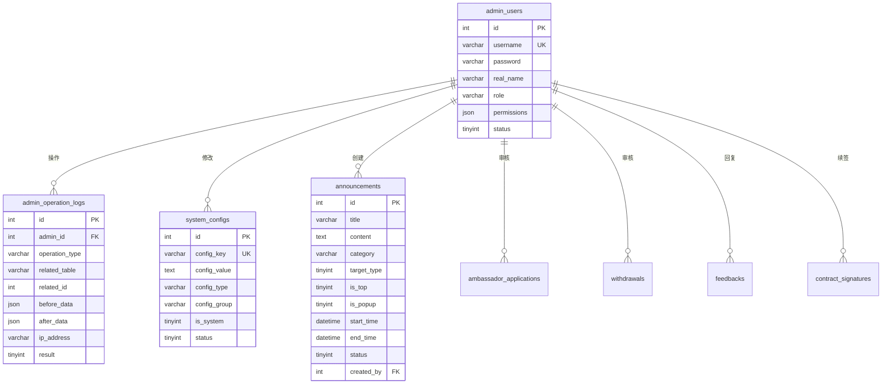

# 后台管理模块 - 数据库设计

## 1. 模块概述

后台管理模块负责管理系统的后台功能，包括管理员账号管理、操作日志审计、系统配置管理、公告管理等。

### 包含的表

| 表名 | 中文名 | 说明 |
|-----|-------|------|
| admin_users | 管理员表 | 后台管理员账号 |
| admin_operation_logs | 操作日志表 | 管理员操作审计 |
| system_configs | 系统配置表 | 系统参数配置 |
| announcements | 公告表 | 系统公告 |

---

## 2. 表结构

### 2.1 admin_users（管理员表）

```sql
CREATE TABLE admin_users (
  -- 主键
  id INT AUTO_INCREMENT PRIMARY KEY COMMENT '管理员ID',

  -- 账号信息
  username VARCHAR(50) NOT NULL COMMENT '用户名',
  password VARCHAR(255) NOT NULL COMMENT '密码（加密存储）',
  real_name VARCHAR(50) COMMENT '真实姓名',
  phone VARCHAR(20) COMMENT '手机号',
  email VARCHAR(100) COMMENT '邮箱',
  avatar VARCHAR(255) COMMENT '头像URL',

  -- 角色权限
  role VARCHAR(50) NOT NULL DEFAULT 'admin' COMMENT '角色：super_admin超级管理员/admin管理员/operator操作员',
  permissions JSON COMMENT '权限列表',

  -- 登录信息
  last_login_time DATETIME COMMENT '最后登录时间',
  last_login_ip VARCHAR(50) COMMENT '最后登录IP',
  login_count INT DEFAULT 0 COMMENT '登录次数',

  -- 状态
  status TINYINT DEFAULT 1 COMMENT '状态：0禁用/1启用',

  -- 创建信息
  created_by INT COMMENT '创建人ID',

  -- 时间戳
  created_at DATETIME DEFAULT CURRENT_TIMESTAMP COMMENT '创建时间',
  updated_at DATETIME DEFAULT CURRENT_TIMESTAMP ON UPDATE CURRENT_TIMESTAMP COMMENT '更新时间',

  -- 唯一索引
  UNIQUE KEY uk_username (username),

  -- 普通索引
  INDEX idx_role (role),
  INDEX idx_status (status),
  INDEX idx_phone (phone),
  INDEX idx_email (email)
) ENGINE=InnoDB DEFAULT CHARSET=utf8mb4 COLLATE=utf8mb4_unicode_ci COMMENT='管理员表';
```

### 2.2 admin_operation_logs（操作日志表）

```sql
CREATE TABLE admin_operation_logs (
  -- 主键
  id INT AUTO_INCREMENT PRIMARY KEY COMMENT '日志ID',

  -- 管理员信息
  admin_id INT NOT NULL COMMENT '管理员ID',
  admin_name VARCHAR(50) COMMENT '管理员姓名',

  -- 操作信息
  operation_type VARCHAR(50) NOT NULL COMMENT '操作类型',
  operation_name VARCHAR(100) COMMENT '操作名称',
  operation_desc VARCHAR(500) COMMENT '操作描述',

  -- 关联信息
  related_table VARCHAR(50) COMMENT '关联表名',
  related_id INT COMMENT '关联记录ID',

  -- 请求信息
  request_method VARCHAR(10) COMMENT '请求方法',
  request_url VARCHAR(255) COMMENT '请求URL',
  request_params TEXT COMMENT '请求参数',
  response_data TEXT COMMENT '响应数据',

  -- 变更数据
  before_data JSON COMMENT '变更前数据',
  after_data JSON COMMENT '变更后数据',

  -- 客户端信息
  ip_address VARCHAR(50) COMMENT '操作IP',
  user_agent VARCHAR(500) COMMENT '用户代理',

  -- 执行结果
  result TINYINT DEFAULT 1 COMMENT '执行结果：0失败/1成功',
  error_message TEXT COMMENT '错误信息',

  -- 备注
  remark TEXT COMMENT '备注',

  -- 时间戳
  created_at DATETIME DEFAULT CURRENT_TIMESTAMP COMMENT '操作时间',

  -- 索引
  INDEX idx_admin_id (admin_id),
  INDEX idx_operation_type (operation_type),
  INDEX idx_related_table (related_table),
  INDEX idx_related_id (related_id),
  INDEX idx_result (result),
  INDEX idx_created_at (created_at),
  INDEX idx_admin_type (admin_id, operation_type),
  INDEX idx_table_id (related_table, related_id)
) ENGINE=InnoDB DEFAULT CHARSET=utf8mb4 COLLATE=utf8mb4_unicode_ci COMMENT='操作日志表';
```

### 2.3 system_configs（系统配置表）

```sql
CREATE TABLE system_configs (
  -- 主键
  id INT AUTO_INCREMENT PRIMARY KEY COMMENT '配置ID',

  -- 配置信息
  config_key VARCHAR(100) NOT NULL COMMENT '配置键',
  config_value TEXT COMMENT '配置值',
  config_type VARCHAR(20) DEFAULT 'string' COMMENT '值类型：string/number/boolean/json',

  -- 分组
  config_group VARCHAR(50) DEFAULT 'general' COMMENT '配置分组',

  -- 描述
  config_name VARCHAR(100) COMMENT '配置名称',
  config_desc VARCHAR(500) COMMENT '配置描述',

  -- 状态
  is_system TINYINT(1) DEFAULT 0 COMMENT '是否系统配置（不可删除）',
  status TINYINT DEFAULT 1 COMMENT '状态：0禁用/1启用',

  -- 修改信息
  updated_by INT COMMENT '最后修改人ID',

  -- 时间戳
  created_at DATETIME DEFAULT CURRENT_TIMESTAMP COMMENT '创建时间',
  updated_at DATETIME DEFAULT CURRENT_TIMESTAMP ON UPDATE CURRENT_TIMESTAMP COMMENT '更新时间',

  -- 唯一索引
  UNIQUE KEY uk_config_key (config_key),

  -- 普通索引
  INDEX idx_config_group (config_group),
  INDEX idx_status (status)
) ENGINE=InnoDB DEFAULT CHARSET=utf8mb4 COLLATE=utf8mb4_unicode_ci COMMENT='系统配置表';
```

### 2.4 announcements（公告表）

```sql
CREATE TABLE announcements (
  -- 主键
  id INT AUTO_INCREMENT PRIMARY KEY COMMENT '公告ID',

  -- 基本信息
  title VARCHAR(200) NOT NULL COMMENT '公告标题',
  content TEXT NOT NULL COMMENT '公告内容（HTML）',
  summary VARCHAR(500) COMMENT '公告摘要',
  cover_image VARCHAR(255) COMMENT '封面图片',

  -- 分类
  category VARCHAR(50) DEFAULT 'general' COMMENT '分类：general通用/course课程/activity活动/system系统',

  -- 目标用户
  target_type TINYINT DEFAULT 0 COMMENT '目标类型：0全部用户/1普通用户/2大使用户',
  target_level TINYINT COMMENT '目标大使等级（target_type=2时）',

  -- 显示设置
  is_top TINYINT(1) DEFAULT 0 COMMENT '是否置顶',
  is_popup TINYINT(1) DEFAULT 0 COMMENT '是否弹窗显示',

  -- 有效期
  start_time DATETIME COMMENT '开始时间',
  end_time DATETIME COMMENT '结束时间',

  -- 统计
  view_count INT DEFAULT 0 COMMENT '浏览次数',

  -- 排序和状态
  sort_order INT DEFAULT 0 COMMENT '排序权重',
  status TINYINT DEFAULT 1 COMMENT '状态：0草稿/1已发布/2已下架',

  -- 创建信息
  created_by INT COMMENT '创建人ID',
  published_at DATETIME COMMENT '发布时间',

  -- 时间戳
  created_at DATETIME DEFAULT CURRENT_TIMESTAMP COMMENT '创建时间',
  updated_at DATETIME DEFAULT CURRENT_TIMESTAMP ON UPDATE CURRENT_TIMESTAMP COMMENT '更新时间',

  -- 索引
  INDEX idx_category (category),
  INDEX idx_target_type (target_type),
  INDEX idx_is_top (is_top),
  INDEX idx_is_popup (is_popup),
  INDEX idx_start_time (start_time),
  INDEX idx_end_time (end_time),
  INDEX idx_status (status),
  INDEX idx_sort_order (sort_order),
  INDEX idx_created_by (created_by),
  INDEX idx_status_time (status, start_time, end_time)
) ENGINE=InnoDB DEFAULT CHARSET=utf8mb4 COLLATE=utf8mb4_unicode_ci COMMENT='公告表';
```

---

## 3. 数据字典

### 3.1 枚举值定义

#### admin_users.role（管理员角色）
| 值 | 说明 | 权限范围 |
|---|------|---------|
| super_admin | 超级管理员 | 所有权限 |
| admin | 管理员 | 大部分权限 |
| operator | 操作员 | 基础操作权限 |

#### admin_users.status（管理员状态）
| 值 | 说明 |
|---|------|
| 0 | 禁用 |
| 1 | 启用 |

#### admin_operation_logs.operation_type（操作类型）
| 值 | 说明 |
|---|------|
| login | 登录 |
| logout | 登出 |
| user_create | 创建用户 |
| user_update | 更新用户 |
| user_delete | 删除用户 |
| update_referee | 修改推荐人 |
| course_create | 创建课程 |
| course_update | 更新课程 |
| order_refund | 订单退款 |
| ambassador_audit | 大使审核 |
| withdraw_audit | 提现审核 |
| contract_renew | 协议续签 |
| send_notification | 发送消息 |
| config_update | 更新配置 |
| announcement_publish | 发布公告 |

#### system_configs.config_type（配置值类型）
| 值 | 说明 |
|---|------|
| string | 字符串 |
| number | 数字 |
| boolean | 布尔值 |
| json | JSON对象 |

#### system_configs.config_group（配置分组）
| 值 | 说明 |
|---|------|
| general | 通用配置 |
| retrain | 复训规则 |
| merit_points | 功德分规则 |
| cash_points | 积分规则 |
| commission | 佣金规则 |
| notification | 通知配置 |

#### announcements.category（公告分类）
| 值 | 说明 |
|---|------|
| general | 通用公告 |
| course | 课程公告 |
| activity | 活动公告 |
| system | 系统公告 |

#### announcements.target_type（目标用户类型）
| 值 | 说明 |
|---|------|
| 0 | 全部用户 |
| 1 | 普通用户 |
| 2 | 大使用户 |

#### announcements.status（公告状态）
| 值 | 说明 |
|---|------|
| 0 | 草稿 |
| 1 | 已发布 |
| 2 | 已下架 |

### 3.2 JSON 结构定义

#### admin_users.permissions（权限列表）

```json
[
  "user:view",
  "user:edit",
  "order:view",
  "order:refund",
  "course:view",
  "course:edit",
  "ambassador:audit",
  "withdraw:audit",
  "config:edit",
  "announcement:publish"
]
```

#### admin_operation_logs.before_data / after_data（变更数据）

```json
{
  "referee_id": 100,
  "referee_name": "原推荐人"
}
```

---

## 4. 表关系



---

## 5. 索引设计

### 5.1 admin_users 表索引

| 索引名 | 索引类型 | 字段 | 使用场景 |
|-------|---------|------|---------|
| PRIMARY | 主键 | id | 主键查询 |
| uk_username | 唯一索引 | username | 用户名登录 |
| idx_role | 普通索引 | role | 角色筛选 |
| idx_status | 普通索引 | status | 状态筛选 |
| idx_phone | 普通索引 | phone | 手机号查询 |
| idx_email | 普通索引 | email | 邮箱查询 |

### 5.2 admin_operation_logs 表索引

| 索引名 | 索引类型 | 字段 | 使用场景 |
|-------|---------|------|---------|
| PRIMARY | 主键 | id | 主键查询 |
| idx_admin_id | 普通索引 | admin_id | 管理员操作记录 |
| idx_operation_type | 普通索引 | operation_type | 操作类型筛选 |
| idx_related_table | 普通索引 | related_table | 关联表查询 |
| idx_related_id | 普通索引 | related_id | 关联记录查询 |
| idx_result | 普通索引 | result | 执行结果筛选 |
| idx_created_at | 普通索引 | created_at | 时间范围查询 |
| idx_admin_type | 复合索引 | admin_id, operation_type | 管理员特定操作查询 |
| idx_table_id | 复合索引 | related_table, related_id | 记录操作历史查询 |

### 5.3 system_configs 表索引

| 索引名 | 索引类型 | 字段 | 使用场景 |
|-------|---------|------|---------|
| PRIMARY | 主键 | id | 主键查询 |
| uk_config_key | 唯一索引 | config_key | 配置键查询 |
| idx_config_group | 普通索引 | config_group | 分组查询 |
| idx_status | 普通索引 | status | 状态筛选 |

### 5.4 announcements 表索引

| 索引名 | 索引类型 | 字段 | 使用场景 |
|-------|---------|------|---------|
| PRIMARY | 主键 | id | 主键查询 |
| idx_category | 普通索引 | category | 分类筛选 |
| idx_target_type | 普通索引 | target_type | 目标用户筛选 |
| idx_is_top | 普通索引 | is_top | 置顶公告查询 |
| idx_is_popup | 普通索引 | is_popup | 弹窗公告查询 |
| idx_status | 普通索引 | status | 状态筛选 |
| idx_sort_order | 普通索引 | sort_order | 排序查询 |
| idx_status_time | 复合索引 | status, start_time, end_time | 有效公告查询 |

---

## 6. 约束说明

### 6.1 业务规则约束

1. **管理员账号**：
   - username 全局唯一
   - 密码必须加密存储（推荐 bcrypt）
   - 超级管理员不可删除

2. **操作日志**：
   - 所有敏感操作必须记录
   - 日志不可修改或删除
   - 保留完整的变更前后数据

3. **系统配置**：
   - config_key 全局唯一
   - 系统配置（is_system=1）不可删除
   - 配置值类型必须与 config_type 匹配

4. **公告管理**：
   - 发布后不可删除，只能下架
   - 有效期内的公告才显示
   - 弹窗公告每个用户只显示一次

### 6.2 数据完整性约束

1. **admin_id 关联**：必须关联有效的 admin_users.id
2. **created_by 关联**：如有值，必须关联有效的 admin_users.id

---

## 7. 示例数据

```sql
-- 管理员账号
INSERT INTO admin_users (
  username, password, real_name, phone, email, role, permissions, status
) VALUES
('admin', '$2b$10$xxxxxxxxxxxxxxxxxxxxxxxxxxxxxxxxxxxxxxxxxxxxx', '超级管理员', '13800000000', 'admin@example.com', 'super_admin', '["*"]', 1),
('operator1', '$2b$10$xxxxxxxxxxxxxxxxxxxxxxxxxxxxxxxxxxxxxxxxxxxxx', '操作员小王', '13800000001', 'wang@example.com', 'operator', '["user:view", "order:view", "course:view"]', 1);

-- 操作日志
INSERT INTO admin_operation_logs (
  admin_id, admin_name, operation_type, operation_name, operation_desc,
  related_table, related_id, before_data, after_data,
  ip_address, result
) VALUES
(1, '超级管理员', 'update_referee', '修改推荐人', '将用户张三的推荐人从李四修改为王五',
 'users', 1, '{"referee_id": 100, "referee_name": "李四"}', '{"referee_id": 200, "referee_name": "王五"}',
 '192.168.1.100', 1),
(1, '超级管理员', 'ambassador_audit', '大使审核', '通过用户张三的大使申请',
 'ambassador_applications', 1, '{"status": 0}', '{"status": 3}',
 '192.168.1.100', 1);

-- 系统配置
INSERT INTO system_configs (
  config_key, config_value, config_type, config_group, config_name, config_desc, is_system
) VALUES
('retrain_price_course_1', '500', 'number', 'retrain', '初探班复训价格', '初探班复训费用（元）', 1),
('retrain_price_course_2', '1000', 'number', 'retrain', '密训班复训价格', '密训班复训费用（元）', 1),
('retrain_deadline_days', '3', 'number', 'retrain', '复训报名截止天数', '开课前N天截止复训报名', 1),
('merit_points_rate_course_1', '0.3', 'number', 'merit_points', '初探班功德分比例', '推荐初探班获得功德分比例', 1),
('merit_points_rate_course_2', '0.2', 'number', 'merit_points', '密训班功德分比例', '推荐密训班获得功德分比例', 1),
('cash_points_frozen_level_2', '1688', 'number', 'cash_points', '青鸾冻结积分', '升级青鸾大使获得的冻结积分', 1),
('cash_points_frozen_level_3', '16880', 'number', 'cash_points', '鸿鹄冻结积分', '升级鸿鹄大使获得的冻结积分', 1),
('withdraw_min_amount', '100', 'number', 'cash_points', '最低提现金额', '积分提现最低金额（元）', 1),
('withdraw_max_amount', '50000', 'number', 'cash_points', '最高提现金额', '单笔提现最高金额（元）', 1),
('upgrade_price_level_3', '9800', 'number', 'commission', '鸿鹄升级费用', '升级鸿鹄大使需支付的费用（元）', 1),
('quota_count_level_3', '10', 'number', 'commission', '鸿鹄名额数量', '升级鸿鹄大使获得的初探班名额数量', 1);

-- 公告
INSERT INTO announcements (
  title, content, summary, category, target_type, is_top, is_popup,
  start_time, end_time, status, created_by, published_at
) VALUES
('欢迎加入天道文化', '<h1>欢迎</h1><p>欢迎加入天道文化大家庭...</p>', '欢迎加入天道文化大家庭',
 'general', 0, 1, 0, '2024-01-01 00:00:00', '2024-12-31 23:59:59', 1, 1, '2024-01-01 00:00:00'),
('初探班第10期开始报名', '<p>初探班第10期将于2024年2月1日开课...</p>', '初探班第10期开始报名',
 'course', 0, 0, 1, '2024-01-15 00:00:00', '2024-01-31 23:59:59', 1, 1, '2024-01-15 10:00:00'),
('大使专属活动通知', '<p>青鸾及以上大使专属活动...</p>', '大使专属活动',
 'activity', 2, 0, 0, '2024-01-20 00:00:00', '2024-02-20 23:59:59', 1, 1, '2024-01-20 10:00:00');

-- 查询有效公告
SELECT * FROM announcements
WHERE status = 1
  AND (start_time IS NULL OR start_time <= NOW())
  AND (end_time IS NULL OR end_time >= NOW())
ORDER BY is_top DESC, sort_order DESC, published_at DESC;
```

---

## 8. 变更记录

| 版本 | 日期 | 变更内容 | 变更人 |
|-----|------|---------|-------|
| V1.0 | 2026-02-03 | 初始版本 | Claude |
