    # 天道文化小程序 - 数据库设计文档

> **版本**: V1.8
> **更新时间**: 2026-02-04
> **数据库类型**: MySQL 8.0+
> **字符集**: utf8mb4
> **排序规则**: utf8mb4_unicode_ci
> **存储引擎**: InnoDB
> 
> **CloudBase 环境**:
> - 环境 ID: `cloud1-0gnn3mn17b581124`
> - 环境别名: `cloud1`
> - MySQL 实例: `tnt-e300s320g`
> - 区域: `ap-shanghai`
>
> **云函数架构**: 模块优先（单函数多路由，通过 action 参数区分操作）

---

## 📚 重要文档导航

- **[SDK 操作指南](./SDK_GUIDE.md)** ⭐ **适用于无 MCP 工具的环境（如 Claude Code）**
  - CloudBase Manager SDK 使用
  - 完整的 SQL 执行示例
  - 安全规则配置脚本
  - 云函数数据库访问
  - 故障排查指南

- **[快速参考卡](./QUICK_REFERENCE.md)** 🔥 **命令速查表**
  - 常用 CLI 命令
  - SQL 语句模板
  - 批量操作脚本
  - 验证命令集合

- **[脚本示例](./SCRIPTS_EXAMPLES.md)** 💻 **Node.js 脚本集合**
  - 批量建表脚本
  - 安全规则配置脚本
  - 部署验证脚本
  - 数据初始化脚本

- **[部署检查清单](./DEPLOYMENT_CHECKLIST.md)** - 数据库部署步骤速查

---

## 目录

1. [数据库概述](#1-数据库概述)
2. [数据表清单](#2-数据表清单)
3. [全局ER图](#3-全局er图)
4. [模块文档索引](#4-模块文档索引)
5. [数据库配置](#5-数据库配置)
6. [命名规范](#6-命名规范)
7. [设计原则](#7-设计原则)
8. [CloudBase 数据库部署与架构](#8-cloudbase-数据库部署与架构)
   - 8.1 [架构设计](#81-架构设计)
     - 8.1.1 [整体架构](#811-整体架构)
     - 8.1.2 [数据访问层次](#812-数据访问层次)
     - 8.1.3 [云函数目录结构](#813-云函数目录结构)
     - 8.1.4 [权限控制策略](#814-权限控制策略)
   - 8.2 [层管理](#82-层管理layer-management)
     - 8.2.1 [层管理概念](#821-层管理概念)
     - 8.2.2 [层的结构设计](#822-层的结构设计)
     - 8.2.3 [层的创建和使用](#823-层的创建和使用)
   - 8.3 [快速部署指南](#83-快速部署指南)
     - 8.3.1 [部署前准备](#831-部署前准备)
     - 8.3.2 [建表 SQL 获取路径](#832-建表-sql-获取路径)
     - 8.3.3 [部署步骤](#833-部署步骤推荐)
     - 8.3.4 [重要注意事项](#834-重要注意事项)
     - 8.3.5 [常见部署问题](#835-常见部署问题)
   - 8.4 [部署验证](#84-部署验证)
     - 8.4.1 [验证表创建完整性](#841-验证表创建完整性)
     - 8.4.2 [验证 _openid 字段](#842-验证-_openid-字段)
     - 8.4.3 [验证索引创建](#843-验证索引创建)
     - 8.4.4 [验证字符集和排序规则](#844-验证字符集和排序规则)
   - 8.5 [执行 SQL](#85-执行-sql使用-mcp-工具)
   - 8.6 [配置安全规则](#86-配置安全规则)
   - 8.7 [数据初始化](#87-数据初始化)
   - 8.8 [控制台管理](#88-控制台管理)
   - 8.9 [部署检查清单](#89-部署检查清单)
   - 8.10 [常见问题](#810-常见问题)
9. [快速参考](#9-快速参考)
   - 9.1 [部署流程速查](#91-部署流程速查)
   - 9.2 [模块文档快速索引](#92-模块文档快速索引)
   - 9.3 [关键 SQL 命令速查](#93-关键-sql-命令速查)
   - 9.4 [MCP 工具快速参考](#94-mcp-工具快速参考)
   - 9.5 [安全规则配置速查](#95-安全规则配置速查)
   - 9.6 [常用控制台链接](#96-常用控制台链接)
10. [变更记录](#10-变更记录)

---

## 1. 数据库概述

本数据库为天道文化小程序提供数据存储支持，涵盖用户管理、课程管理、订单交易、预约签到、传播大使体系、商学院商城、协议管理、消息通知等核心业务模块。

### 1.1 业务架构

```
┌─────────────────────────────────────────────────────────────────┐
│                        天道文化小程序                              │
├─────────────────────────────────────────────────────────────────┤
│  用户模块  │  课程模块  │  订单模块  │  预约模块  │  大使模块      │
├─────────────────────────────────────────────────────────────────┤
│  商学院/商城  │  协议模块  │  反馈/消息  │  后台管理              │
└─────────────────────────────────────────────────────────────────┘
```

### 1.2 核心实体关系

- **用户(users)** 是系统核心实体，关联所有业务数据
- **课程(courses)** 是核心商品，通过订单和用户课程表关联用户
- **订单(orders)** 记录所有交易，包括课程购买、复训、大使升级
- **大使体系** 通过用户表的等级字段和多个辅助表实现

---

## 2. 数据表清单

### 总计：28张表

| 模块 | 表数量 | 表名列表 |
|-----|-------|---------|
| 用户模块 | 2 | users, referee_change_logs |
| 课程模块 | 2 | courses, user_courses |
| 订单模块 | 1 | orders |
| 预约模块 | 2 | class_records, appointments |
| 大使模块 | 7 | ambassador_applications, ambassador_quotas, quota_usage_records, merit_points_records, cash_points_records, withdrawals, ambassador_upgrade_logs |
| 商学院/商城 | 5 | academy_intro, academy_materials, academy_cases, mall_goods, mall_exchange_records |
| 协议模块 | 2 | contract_templates, contract_signatures |
| 反馈/消息 | 3 | feedbacks, notification_configs, notification_logs |
| 后台管理 | 4 | admin_users, admin_operation_logs, system_configs, announcements |

### 完整表清单

| 序号 | 表名 | 中文名 | 所属模块 | 说明 |
|-----|------|-------|---------|------|
| 1 | users | 用户表 | 用户模块 | 存储所有用户信息，包括普通用户和大使 |
| 2 | referee_change_logs | 推荐人变更日志表 | 用户模块 | 记录推荐人变更历史 |
| 3 | courses | 课程表 | 课程模块 | 课程基础信息 |
| 4 | user_courses | 用户课程表 | 课程模块 | 用户购买的课程记录 |
| 5 | orders | 订单表 | 订单模块 | 统一订单表（课程/复训/升级） |
| 6 | class_records | 上课计划表 | 预约模块 | 课程排期信息 |
| 7 | appointments | 预约表 | 预约模块 | 用户预约记录 |
| 8 | ambassador_applications | 大使申请表 | 大使模块 | 大使申请记录 |
| 9 | ambassador_quotas | 大使名额表 | 大使模块 | 大使赠送名额管理 |
| 10 | quota_usage_records | 名额使用记录表 | 大使模块 | 名额赠送/核销记录 |
| 11 | merit_points_records | 功德分记录表 | 大使模块 | 功德分流水 |
| 12 | cash_points_records | 积分记录表 | 大使模块 | 现金积分流水 |
| 13 | withdrawals | 提现记录表 | 大使模块 | 积分提现申请 |
| 14 | ambassador_upgrade_logs | 大使升级日志表 | 大使模块 | 大使等级变更记录 |
| 15 | academy_intro | 商学院介绍表 | 商学院/商城 | 商学院简介和团队 |
| 16 | academy_materials | 朋友圈素材表 | 商学院/商城 | 推广素材库 |
| 17 | academy_cases | 学员案例表 | 商学院/商城 | 学员成功案例 |
| 18 | mall_goods | 商城商品表 | 商学院/商城 | 功德分兑换商品 |
| 19 | mall_exchange_records | 兑换记录表 | 商学院/商城 | 商品兑换记录 |
| 20 | contract_templates | 协议模板表 | 协议模块 | 协议模板管理 |
| 21 | contract_signatures | 协议签署记录表 | 协议模块 | 用户签署记录 |
| 22 | feedbacks | 反馈表 | 反馈/消息 | 用户反馈记录 |
| 23 | notification_configs | 消息配置表 | 反馈/消息 | 消息模板配置 |
| 24 | notification_logs | 消息发送日志表 | 反馈/消息 | 消息发送记录 |
| 25 | admin_users | 管理员表 | 后台管理 | 后台管理员账号 |
| 26 | admin_operation_logs | 操作日志表 | 后台管理 | 管理员操作审计 |
| 27 | system_configs | 系统配置表 | 后台管理 | 系统参数配置 |
| 28 | announcements | 公告表 | 后台管理 | 系统公告 |

---

## 3. 全局ER图

```mermaid
erDiagram
    %% 用户模块
    users ||--o{ referee_change_logs : "变更记录"
    users ||--o{ user_courses : "购买课程"
    users ||--o{ orders : "创建订单"
    users ||--o{ appointments : "预约上课"
    users ||--o{ ambassador_applications : "申请大使"
    users ||--o{ ambassador_quotas : "拥有名额"
    users ||--o{ merit_points_records : "功德分记录"
    users ||--o{ cash_points_records : "积分记录"
    users ||--o{ withdrawals : "提现申请"
    users ||--o{ contract_signatures : "签署协议"
    users ||--o{ feedbacks : "提交反馈"
    users ||--o{ notification_logs : "消息记录"
    users ||--o{ mall_exchange_records : "兑换商品"
    users }o--|| users : "推荐人"

    %% 课程模块
    courses ||--o{ user_courses : "被购买"
    courses ||--o{ class_records : "排期"
    courses ||--o{ orders : "订单关联"

    %% 预约模块
    class_records ||--o{ appointments : "预约"
    user_courses ||--o{ appointments : "课程预约"

    %% 大使模块
    ambassador_quotas ||--o{ quota_usage_records : "使用记录"
    users ||--o{ ambassador_upgrade_logs : "升级记录"

    %% 商学院/商城
    mall_goods ||--o{ mall_exchange_records : "被兑换"

    %% 协议模块
    contract_templates ||--o{ contract_signatures : "签署"

    %% 后台管理
    admin_users ||--o{ admin_operation_logs : "操作日志"

    %% 表结构简要
    users {
        int id PK
        varchar uid UK
        varchar openid
        varchar real_name
        varchar phone
        tinyint ambassador_level
        int referee_id FK
    }

    courses {
        int id PK
        varchar name
        tinyint type
        decimal current_price
        decimal retrain_price
    }

    orders {
        int id PK
        varchar order_no UK
        int user_id FK
        tinyint order_type
        decimal final_amount
        tinyint pay_status
    }

    user_courses {
        int id PK
        int user_id FK
        int course_id FK
        int attend_count
        boolean is_gift
    }

    class_records {
        int id PK
        int course_id FK
        date class_date
        varchar class_location
        int total_quota
    }

    appointments {
        int id PK
        int user_id FK
        int class_record_id FK
        int user_course_id FK
        tinyint status
        boolean is_retrain
    }
```



---

## 4. 模块文档索引

| 文档 | 包含表 | 说明 |
|-----|-------|------|
| [01_用户模块.md](./01_用户模块.md) | users, referee_change_logs | 用户信息、推荐关系 |
| [02_课程模块.md](./02_课程模块.md) | courses, user_courses | 课程管理、用户课程 |
| [03_订单模块.md](./03_订单模块.md) | orders | 统一订单管理 |
| [04_预约模块.md](./04_预约模块.md) | class_records, appointments | 课程排期、预约签到 |
| [05_大使模块.md](./05_大使模块.md) | 7张表 | 大使体系完整设计 |
| [06_商学院商城模块.md](./06_商学院商城模块.md) | 5张表 | 商学院、商城兑换 |
| [07_协议模块.md](./07_协议模块.md) | contract_templates, contract_signatures | 协议管理 |
| [08_反馈消息模块.md](./08_反馈消息模块.md) | feedbacks, notification_configs, notification_logs | 反馈、消息通知 |
| [09_后台管理模块.md](./09_后台管理模块.md) | 4张表 | 后台管理、系统配置 |

---

## 5. 数据库配置

### 5.1 创建数据库

```sql
-- 创建数据库
CREATE DATABASE IF NOT EXISTS tiandao_culture
  CHARACTER SET utf8mb4
  COLLATE utf8mb4_unicode_ci;

-- 使用数据库
USE tiandao_culture;

-- 设置时区
SET time_zone = '+08:00';
```

### 5.2 连接配置示例

```javascript
// Node.js 配置示例
const dbConfig = {
  host: 'localhost',
  port: 3306,
  user: 'tiandao_user',
  password: '********',
  database: 'tiandao_culture',
  charset: 'utf8mb4',
  timezone: '+08:00',
  connectionLimit: 10,
  supportBigNumbers: true,
  bigNumberStrings: true
};
```

### 5.3 MySQL 配置建议

```ini
[mysqld]
# 字符集
character-set-server = utf8mb4
collation-server = utf8mb4_unicode_ci

# InnoDB 配置
innodb_buffer_pool_size = 1G
innodb_log_file_size = 256M
innodb_flush_log_at_trx_commit = 1

# 连接数
max_connections = 500

# 慢查询日志
slow_query_log = 1
slow_query_log_file = /var/log/mysql/slow.log
long_query_time = 2
```

---

## 6. 命名规范

### 6.1 表命名

| 规则 | 示例 | 说明 |
|-----|------|------|
| 小写字母 | users | 全部使用小写 |
| 下划线分隔 | user_courses | 多单词用下划线 |
| 复数形式 | orders | 表名使用复数 |
| 模块前缀 | admin_users | 后台管理表加 admin_ 前缀 |
| 日志表后缀 | _logs | 日志类表加 _logs 后缀 |
| 记录表后缀 | _records | 流水记录表加 _records 后缀 |

### 6.2 字段命名

| 规则 | 示例 | 说明 |
|-----|------|------|
| 主键 | id | 统一使用 id |
| 外键 | user_id, course_id | 表名单数 + _id |
| 时间字段 | created_at, updated_at | 动作 + _at |
| 布尔字段 | is_gift, is_retrain | is_ 前缀 |
| 状态字段 | status, pay_status | 描述 + status |
| 数量字段 | total_quantity, attend_count | 描述 + quantity/count |
| 金额字段 | final_amount, current_price | 描述 + amount/price |

### 6.3 索引命名

| 类型 | 格式 | 示例 |
|-----|------|------|
| 主键 | PRIMARY | PRIMARY |
| 唯一索引 | uk_字段名 | uk_uid, uk_order_no |
| 普通索引 | idx_字段名 | idx_user_id, idx_status |
| 复合索引 | idx_字段1_字段2 | idx_user_id_status |

---

## 7. 设计原则

### 7.1 主键设计

- 所有表使用 `id INT AUTO_INCREMENT PRIMARY KEY` 作为主键
- CloudBase 的 `uid` 设置为 `UNIQUE NOT NULL`，用于用户身份识别
- 外键关联优先使用 `id`（性能优），同时保存 `uid`（语义清晰）

```sql
-- 示例：用户表主键设计
CREATE TABLE users (
  id INT AUTO_INCREMENT PRIMARY KEY,    -- 主键（自增ID）
  uid VARCHAR(64) UNIQUE NOT NULL,      -- CloudBase 用户唯一标识
  -- ...
);
```

### 7.2 外键策略

- 使用 `xxx_id` + `xxx_uid` 双字段设计
- 不使用物理外键约束，通过应用层保证数据完整性
- 便于分库分表和数据迁移

```sql
-- 示例：推荐人关联
referee_id INT,                       -- 推荐人 id（关联 users.id）
referee_uid VARCHAR(64),              -- 推荐人 uid（辅助字段）
```

### 7.3 时间字段

- 统一使用 `created_at` 和 `updated_at`
- 使用 `DATETIME` 类型，支持时区
- `updated_at` 使用 `ON UPDATE CURRENT_TIMESTAMP` 自动更新

```sql
created_at DATETIME DEFAULT CURRENT_TIMESTAMP,
updated_at DATETIME DEFAULT CURRENT_TIMESTAMP ON UPDATE CURRENT_TIMESTAMP
```

### 7.4 软删除策略

- 使用 `status` 字段而非物理删除
- 重要数据保留完整历史记录
- 状态值定义清晰，便于查询

### 7.5 JSON字段使用

- 复杂数据使用 JSON 类型存储
- 适用于：设备信息、扩展属性、配置项等
- 注意：JSON 字段不适合频繁查询条件

```sql
-- 示例
sign_device JSON COMMENT '签署设备信息',
order_metadata JSON COMMENT '订单元数据'
```

### 7.6 金额字段

- 使用 `DECIMAL(10,2)` 类型
- 精确到分，避免浮点数精度问题
- 金额计算在应用层完成

---

## 8. CloudBase 数据库部署与架构

### 8.1 架构设计

#### 8.1.1 整体架构

```
┌─────────────────────────────────────────────────────────────┐
│                       应用层（Application）                    │
├─────────────────────────────────────────────────────────────┤
│   小程序端（Mini Program）    │    管理后台（Admin Panel）     │
│   - 用户操作界面               │    - 管理员操作界面            │
│   - 业务逻辑展示               │    - 数据管理                  │
└──────────────┬────────────────┴───────────────┬──────────────┘
               │                                │
               │                                │
               ▼                                ▼
┌─────────────────────────────────────────────────────────────┐
│                    云函数层（Cloud Functions）                │
├─────────────────────────────────────────────────────────────┤
│  业务逻辑层                                                    │
│  - 数据验证                                                    │
│  - 权限控制（自动获取 openid）                                 │
│  - 业务规则                                                    │
│  - 数据转换                                                    │
│                                                               │
│  共享层（Layers）                                              │
│  - 数据库工具库                                                │
│  - 通用工具函数                                                │
│  - 依赖包管理                                                  │
└──────────────┬────────────────────────────────────────────────┘
               │
               │ SQL 操作
               ▼
┌─────────────────────────────────────────────────────────────┐
│                  CloudBase MySQL 数据库                        │
├─────────────────────────────────────────────────────────────┤
│  数据存储层                                                    │
│  - 28张业务表                                                  │
│  - _openid 字段（用户数据隔离）                                │
│  - 索引优化                                                    │
└─────────────────────────────────────────────────────────────┘
```

#### 8.1.2 数据访问层次

**【推荐架构】前后端统一通过云函数访问数据库**

```javascript
// ✅ 推荐方式：小程序端调用云函数
wx.cloud.callFunction({
  name: 'getUserCourses',  // 语义化命名
  data: {
    // 不传 openid，由云函数自动获取
    status: 1
  }
}).then(res => {
  console.log(res.result);
});

// ✅ 推荐方式：管理后台调用云函数
cloudbase.callFunction({
  name: 'listAllUsers',  // 语义化命名
  data: {
    page: 1,
    limit: 20
  }
}).then(res => {
  console.log(res.result);
});

// ❌ 不推荐：直接使用 Web SDK 访问数据库
// const db = cloudbase.database();
// const result = await db.collection('users').get();
```

**架构优势：**

1. **安全性**：所有数据操作在云函数中执行，前端无法直接操作数据库
2. **可控性**：业务逻辑集中管理，便于维护和升级
3. **灵活性**：云函数可以自由组合多表查询、事务处理等复杂操作
4. **权限控制**：云函数自动获取 `openid`，防止前端伪造身份

#### 8.1.3 云函数目录结构

**【推荐】模块优先架构：单函数多路由（通过 action 参数区分操作）**

```
cloudfunctions/                                # 云函数根目录
│
├── user/                                      # 【用户模块云函数】
│   ├── index.js                               # 主入口（处理所有用户相关操作）
│   ├── config.json                            # 层配置
│   └── package.json                           # 依赖配置
│       # 支持的 action：
│       # - client:getMyCourses       获取我的课程
│       # - client:getMyOrders        获取我的订单
│       # - client:updateProfile      更新个人资料
│       # - client:getMeritPoints     获取功德积分
│       # - admin:getAllUsers         管理员获取所有用户
│       # - admin:updateUser          管理员更新用户
│       # - admin:deleteUser          管理员删除用户
│       # - admin:getUserStatistics   管理员获取用户统计
│
├── course/                                    # 【课程模块云函数】
│   ├── index.js
│   ├── config.json
│   └── package.json
│       # 支持的 action：
│       # - public:getList             公开获取课程列表
│       # - public:getDetail           公开获取课程详情
│       # - client:makeAppointment     用户预约课程
│       # - client:submitFeedback      用户提交反馈
│       # - admin:getAll               管理员获取所有课程（含未发布）
│       # - admin:create               管理员创建课程
│       # - admin:update               管理员更新课程
│       # - admin:delete               管理员删除课程
│
├── order/                                     # 【订单模块云函数】
│   ├── index.js
│   ├── config.json
│   └── package.json
│       # 支持的 action：
│       # - client:create              用户创建订单
│       # - client:pay                 用户支付订单
│       # - client:cancel              用户取消订单
│       # - client:getMyOrders         用户获取订单列表
│       # - admin:getAll               管理员获取所有订单
│       # - admin:approve              管理员审核订单
│       # - admin:refund               管理员退款
│
├── ambassador/                                # 【大使模块云函数】
│   ├── index.js
│   ├── config.json
│   └── package.json
│       # 支持的 action：
│       # - client:apply                用户申请大使
│       # - client:invite               大使邀请用户
│       # - client:getQuota             大使获取名额
│       # - client:getMeritPoints       获取功德积分
│       # - client:applyWithdraw        申请提现
│       # - admin:approve               管理员审批大使申请
│       # - admin:adjustQuota           管理员调整名额
│       # - admin:approveWithdraw       管理员审批提现
│
├── system/                                    # 【系统模块云函数】（纯管理端）
│   ├── index.js
│   ├── config.json
│   └── package.json
│       # 支持的 action：
│       # - admin:getConfig             获取系统配置
│       # - admin:updateConfig          更新系统配置
│       # - admin:exportData            导出数据
│       # - admin:getStatistics         获取系统统计
│       # - admin:manageAnnouncements   管理公告
│
└── layers/                                    # 【层目录】（共享代码）
    ├── db-utils/                              # 数据库工具层
    │   ├── nodejs/
    │   │   └── node_modules/
    │   │       └── mysql2/                    # MySQL 驱动
    │   ├── index.js                           # 导出数据库连接和查询工具
    │   └── package.json
    │
    ├── common-utils/                          # 通用工具层
    │   ├── index.js                           # 权限验证、响应格式化等
    │   └── package.json
    │
    └── business-logic/                        # 业务逻辑层（可选）
        ├── index.js                           # 积分计算、订单处理等
        └── package.json
```

**架构优势：**

1. ✅ **函数数量少**：5个核心函数（user/course/order/ambassador/system）
2. ✅ **冷启动概率低**：函数调用频率高，实例长期保持热启动
3. ✅ **权限控制灵活**：通过 `action` 前缀（public:/client:/admin:）区分权限
4. ✅ **业务逻辑集中**：同一模块的代码在一个函数中，便于维护
5. ✅ **代码复用性高**：公开接口、用户接口、管理接口可共享逻辑

**action 命名规范：**

```
格式：{namespace}:{operation}

namespace（权限命名空间）:
  - public:   公开接口（无需登录）
  - client:   客户端接口（需要登录，普通用户权限）
  - admin:    管理端接口（需要管理员权限）

operation（操作）:
  - get*      查询操作（如 getList, getDetail, getMyCourses）
  - create*   创建操作（如 create, createOrder）
  - update*   更新操作（如 update, updateProfile）
  - delete*   删除操作（如 delete, deleteUser）
  - 动词      其他操作（如 apply, approve, pay, cancel）

示例：
  - public:getList           # 公开获取列表
  - client:getMyCourses      # 用户获取自己的课程
  - client:createOrder       # 用户创建订单
  - admin:getAllUsers        # 管理员获取所有用户
  - admin:approve            # 管理员审批
```

#### 8.1.4 完整代码示例

##### 8.1.4.1 层代码（共享工具）

**common-utils 层（权限验证和响应格式化）**

```javascript
// cloudfunctions/layers/common-utils/index.js
const cloud = require('wx-server-sdk')
cloud.init()

/**
 * 权限等级定义
 */
const ROLE_LEVEL = {
  'user': 0,
  'ambassador_qingluan': 10,
  'ambassador_honghu': 20,
  'admin': 90,
  'super_admin': 100
}

/**
 * 获取用户信息和权限
 */
async function getUserInfo(openid) {
  const db = cloud.database()
  const [user] = await db.query(
    'SELECT id, role, nickname, phone FROM users WHERE _openid = ?',
    [openid]
  )
  
  if (!user) {
    throw new Error('用户不存在')
  }
  
  return user
}

/**
 * 检查管理员权限
 */
async function checkAdminAuth(openid, minRole = 'admin') {
  const user = await getUserInfo(openid)
  
  if (ROLE_LEVEL[user.role] < ROLE_LEVEL[minRole]) {
    throw new Error(`需要 ${minRole} 权限，当前角色：${user.role}`)
  }
  
  return user
}

/**
 * 检查用户认证（用于客户端接口）
 */
async function checkClientAuth(openid) {
  return await getUserInfo(openid)
}

/**
 * 统一成功响应
 */
function successResponse(data, message = '操作成功') {
  return {
    success: true,
    code: 0,
    message,
    data
  }
}

/**
 * 统一错误响应
 */
function errorResponse(message, error = null) {
  return {
    success: false,
    code: -1,
    message,
    error: error ? error.message : null
  }
}

module.exports = {
  ROLE_LEVEL,
  getUserInfo,
  checkAdminAuth,
  checkClientAuth,
  successResponse,
  errorResponse
}
```

**db-utils 层（数据库连接）**

```javascript
// cloudfunctions/layers/db-utils/index.js
const mysql = require('mysql2/promise')

let pool = null

/**
 * 获取数据库连接池
 */
function getPool() {
  if (!pool) {
    pool = mysql.createPool({
      host: process.env.DB_HOST,
      user: process.env.DB_USER,
      password: process.env.DB_PASSWORD,
      database: process.env.DB_NAME,
      connectionLimit: 5,
      waitForConnections: true,
      charset: 'utf8mb4'
    })
  }
  return pool
}

/**
 * 执行查询
 */
async function query(sql, params = []) {
  const connection = await getPool().getConnection()
  try {
    const [rows] = await connection.query(sql, params)
    return rows
  } finally {
    connection.release()
  }
}

module.exports = {
  getPool,
  query
}
```

##### 8.1.4.2 用户模块云函数

```javascript
// cloudfunctions/user/index.js
const cloud = require('wx-server-sdk')
cloud.init()

const { query } = require('/opt/db-utils')
const { checkAdminAuth, checkClientAuth, successResponse, errorResponse } = require('/opt/common-utils')

exports.main = async (event, context) => {
  const { action, ...params } = event
  const { OPENID } = cloud.getWXContext()
  
  try {
    // ==================== 客户端路由 ====================
    if (action.startsWith('client:')) {
      return await handleClientRequest(OPENID, action, params)
    }
    
    // ==================== 管理端路由 ====================
    if (action.startsWith('admin:')) {
      return await handleAdminRequest(OPENID, action, params)
    }
    
    throw new Error(`未知操作: ${action}`)
    
  } catch (error) {
    return errorResponse(error.message, error)
  }
}

/**
 * 处理客户端请求
 */
async function handleClientRequest(openid, action, params) {
  // 验证用户身份
  const user = await checkClientAuth(openid)
  
  switch (action) {
    case 'client:getMyCourses':
      // 获取我的课程
      const courses = await query(
        `SELECT uc.*, c.title, c.cover_image, c.type
         FROM user_courses uc
         LEFT JOIN courses c ON uc.course_id = c.id
         WHERE uc._openid = ?
         ORDER BY uc.created_at DESC`,
        [openid]
      )
      return successResponse(courses)
    
    case 'client:getMyOrders':
      // 获取我的订单
      const { page = 1, pageSize = 20 } = params
      const orders = await query(
        `SELECT o.*, c.title as course_title
         FROM orders o
         LEFT JOIN courses c ON o.course_id = c.id
         WHERE o._openid = ?
         ORDER BY o.created_at DESC
         LIMIT ? OFFSET ?`,
        [openid, pageSize, (page - 1) * pageSize]
      )
      return successResponse(orders)
    
    case 'client:updateProfile':
      // 更新个人信息
      await query(
        `UPDATE users 
         SET nickname = ?, avatar = ?, phone = ?
         WHERE _openid = ?`,
        [params.nickname, params.avatar, params.phone, openid]
      )
      return successResponse(null, '更新成功')
    
    case 'client:getMeritPoints':
      // 获取功德积分记录
      const points = await query(
        `SELECT * FROM merit_points_records
         WHERE _openid = ?
         ORDER BY created_at DESC
         LIMIT 50`,
        [openid]
      )
      return successResponse(points)
    
    default:
      throw new Error(`未知的客户端操作: ${action}`)
  }
}

/**
 * 处理管理端请求
 */
async function handleAdminRequest(openid, action, params) {
  // 🔒 验证管理员权限
  const admin = await checkAdminAuth(openid, 'admin')
  
  switch (action) {
    case 'admin:getAllUsers':
      // 获取所有用户列表
      const { page = 1, pageSize = 20, keyword = '', role = '' } = params
      
      let sql = 'SELECT * FROM users WHERE 1=1'
      const sqlParams = []
      
      if (keyword) {
        sql += ' AND (nickname LIKE ? OR phone LIKE ?)'
        sqlParams.push(`%${keyword}%`, `%${keyword}%`)
      }
      
      if (role) {
        sql += ' AND role = ?'
        sqlParams.push(role)
      }
      
      sql += ' ORDER BY created_at DESC LIMIT ? OFFSET ?'
      sqlParams.push(pageSize, (page - 1) * pageSize)
      
      const users = await query(sql, sqlParams)
      return successResponse(users)
    
    case 'admin:updateUser':
      // 更新用户信息
      await query(
        `UPDATE users 
         SET role = ?, status = ?
         WHERE id = ?`,
        [params.role, params.status, params.userId]
      )
      return successResponse(null, '更新成功')
    
    case 'admin:deleteUser':
      // 删除用户（软删除）
      const [targetUser] = await query(
        'SELECT role FROM users WHERE id = ?',
        [params.userId]
      )
      
      if (targetUser.role === 'super_admin') {
        throw new Error('不能删除超级管理员')
      }
      
      await query(
        'UPDATE users SET status = "deleted", deleted_at = NOW() WHERE id = ?',
        [params.userId]
      )
      return successResponse(null, '删除成功')
    
    case 'admin:getUserStatistics':
      // 获取用户统计数据
      const stats = {}
      
      const [total] = await query('SELECT COUNT(*) as count FROM users')
      stats.totalUsers = total.count
      
      const [ambassadors] = await query(
        'SELECT COUNT(*) as count FROM users WHERE role IN ("ambassador_qingluan", "ambassador_honghu")'
      )
      stats.totalAmbassadors = ambassadors.count
      
      const [todayNew] = await query(
        'SELECT COUNT(*) as count FROM users WHERE DATE(created_at) = CURDATE()'
      )
      stats.todayNew = todayNew.count
      
      return successResponse(stats)
    
    default:
      throw new Error(`未知的管理端操作: ${action}`)
  }
}
```

##### 8.1.4.3 课程模块云函数

```javascript
// cloudfunctions/course/index.js
const cloud = require('wx-server-sdk')
cloud.init()

const { query } = require('/opt/db-utils')
const { checkAdminAuth, checkClientAuth, successResponse, errorResponse } = require('/opt/common-utils')

exports.main = async (event, context) => {
  const { action, ...params } = event
  const { OPENID } = cloud.getWXContext()
  
  try {
    // ==================== 公开路由 ====================
    if (action.startsWith('public:')) {
      return await handlePublicRequest(action, params)
    }
    
    // ==================== 客户端路由 ====================
    if (action.startsWith('client:')) {
      return await handleClientRequest(OPENID, action, params)
    }
    
    // ==================== 管理端路由 ====================
    if (action.startsWith('admin:')) {
      return await handleAdminRequest(OPENID, action, params)
    }
    
    throw new Error(`未知操作: ${action}`)
    
  } catch (error) {
    return errorResponse(error.message, error)
  }
}

/**
 * 处理公开请求（无需权限）
 */
async function handlePublicRequest(action, params) {
  switch (action) {
    case 'public:getList':
      // 获取课程列表
      const { page = 1, pageSize = 20, type = '' } = params
      
      let sql = 'SELECT * FROM courses WHERE status = "published"'
      const sqlParams = []
      
      if (type) {
        sql += ' AND type = ?'
        sqlParams.push(type)
      }
      
      sql += ' ORDER BY sort_order ASC, created_at DESC LIMIT ? OFFSET ?'
      sqlParams.push(pageSize, (page - 1) * pageSize)
      
      const courses = await query(sql, sqlParams)
      return successResponse(courses)
    
    case 'public:getDetail':
      // 获取课程详情
      const [course] = await query(
        'SELECT * FROM courses WHERE id = ? AND status = "published"',
        [params.courseId]
      )
      return successResponse(course || null)
    
    default:
      throw new Error(`未知的公开操作: ${action}`)
  }
}

/**
 * 处理客户端请求
 */
async function handleClientRequest(openid, action, params) {
  const user = await checkClientAuth(openid)
  
  switch (action) {
    case 'client:getDetailWithStatus':
      // 获取课程详情（包含购买状态）
      const [course] = await query(
        'SELECT * FROM courses WHERE id = ?',
        [params.courseId]
      )
      
      // 查询是否已购买
      const [purchase] = await query(
        'SELECT * FROM user_courses WHERE course_id = ? AND _openid = ?',
        [params.courseId, openid]
      )
      
      course.isPurchased = !!purchase
      course.purchaseInfo = purchase || null
      
      return successResponse(course)
    
    case 'client:makeAppointment':
      // 预约课程
      await query(
        `INSERT INTO appointments 
         (_openid, course_id, appointment_date, appointment_time, status)
         VALUES (?, ?, ?, ?, 'pending')`,
        [openid, params.courseId, params.date, params.time]
      )
      return successResponse(null, '预约成功')
    
    default:
      throw new Error(`未知的客户端操作: ${action}`)
  }
}

/**
 * 处理管理端请求
 */
async function handleAdminRequest(openid, action, params) {
  // 🔒 验证管理员权限
  const admin = await checkAdminAuth(openid, 'admin')
  
  switch (action) {
    case 'admin:getAll':
      // 获取所有课程（包括未发布）
      const courses = await query(
        `SELECT * FROM courses
         ORDER BY created_at DESC
         LIMIT ? OFFSET ?`,
        [params.pageSize, (params.page - 1) * params.pageSize]
      )
      return successResponse(courses)
    
    case 'admin:create':
      // 创建课程
      const result = await query(
        `INSERT INTO courses
         (title, subtitle, type, price, original_price, cover_image, description, status)
         VALUES (?, ?, ?, ?, ?, ?, ?, 'draft')`,
        [params.title, params.subtitle, params.type, params.price, 
         params.originalPrice, params.coverImage, params.description]
      )
      return successResponse({ id: result.insertId }, '创建成功')
    
    case 'admin:update':
      // 更新课程
      await query(
        `UPDATE courses
         SET title = ?, subtitle = ?, type = ?, price = ?, status = ?
         WHERE id = ?`,
        [params.title, params.subtitle, params.type, params.price,
         params.status, params.courseId]
      )
      return successResponse(null, '更新成功')
    
    default:
      throw new Error(`未知的管理端操作: ${action}`)
  }
}
```

##### 8.1.4.4 前端调用示例

**小程序端调用**

```javascript
// 小程序 src/api/user.js
import cloudbase from '@cloudbase/js-sdk'

const app = cloudbase.init({
  env: 'cloud1-0gnn3mn17b581124'
})

/**
 * 获取我的课程
 */
export async function getMyCourses() {
  const result = await app.callFunction({
    name: 'user',
    data: {
      action: 'client:getMyCourses'
    }
  })
  return result.result.data
}

/**
 * 更新个人资料
 */
export async function updateProfile(nickname, avatar, phone) {
  const result = await app.callFunction({
    name: 'user',
    data: {
      action: 'client:updateProfile',
      nickname,
      avatar,
      phone
    }
  })
  return result.result
}

// 小程序 src/api/course.js

/**
 * 获取课程列表（公开）
 */
export async function getCourseList(page = 1, pageSize = 20, type = '') {
  const result = await app.callFunction({
    name: 'course',
    data: {
      action: 'public:getList',
      page,
      pageSize,
      type
    }
  })
  return result.result.data
}

/**
 * 预约课程
 */
export async function makeAppointment(courseId, date, time) {
  const result = await app.callFunction({
    name: 'course',
    data: {
      action: 'client:makeAppointment',
      courseId,
      date,
      time
    }
  })
  return result.result
}
```

**管理后台调用**

```javascript
// 管理后台 admin-panel/src/api/user.js
import cloudbase from '@cloudbase/js-sdk'

const app = cloudbase.init({
  env: 'cloud1-0gnn3mn17b581124'
})

/**
 * 获取所有用户
 */
export async function getAllUsers(page, pageSize, keyword = '', role = '') {
  const result = await app.callFunction({
    name: 'user',
    data: {
      action: 'admin:getAllUsers',
      page,
      pageSize,
      keyword,
      role
    }
  })
  return result.result.data
}

/**
 * 更新用户信息
 */
export async function updateUser(userId, role, status) {
  const result = await app.callFunction({
    name: 'user',
    data: {
      action: 'admin:updateUser',
      userId,
      role,
      status
    }
  })
  return result.result
}

// 管理后台 admin-panel/src/api/course.js

/**
 * 获取所有课程（包括未发布）
 */
export async function getAllCourses(page, pageSize) {
  const result = await app.callFunction({
    name: 'course',
    data: {
      action: 'admin:getAll',
      page,
      pageSize
    }
  })
  return result.result.data
}

/**
 * 创建课程
 */
export async function createCourse(courseData) {
  const result = await app.callFunction({
    name: 'course',
    data: {
      action: 'admin:create',
      ...courseData
    }
  })
  return result.result
}
```

##### 8.1.4.5 云函数配置文件

**user 函数配置**

```json
// cloudfunctions/user/config.json
{
  "permissions": {
    "openapi": []
  },
  "triggers": [],
  "layers": [
    {
      "name": "db-utils",
      "version": 1
    },
    {
      "name": "common-utils",
      "version": 1
    }
  ]
}
```

**user 函数依赖**

```json
// cloudfunctions/user/package.json
{
  "name": "user",
  "version": "1.0.0",
  "description": "用户模块云函数",
  "main": "index.js",
  "dependencies": {
    "wx-server-sdk": "latest"
  }
}
```

### 8.2 层管理（Layer Management）

#### 8.2.1 层管理概念

**什么是层（Layer）？**

层是云函数的代码共享机制，可以将依赖库、公共代码文件等资源独立管理，实现多个函数间的代码复用。

**层的优势：**

1. **减小部署包体积**：将依赖库从函数代码中分离，保持部署包轻量化
2. **提高开发效率**：公共代码只需维护一份，多个函数可复用
3. **支持在线编辑**：对于 Node.js、Python 和 PHP 函数，代码包保持在 10MB 以下时可在控制台在线编辑
4. **版本管理**：层支持版本控制，可以安全地更新共享代码

**层的工作原理：**

- 层中的文件会添加到 `/opt` 目录中，函数执行期间可访问
- 如果函数绑定了多个层，按顺序合并到 `/opt` 目录
- 同名文件保留序号最大的层的文件

#### 8.2.2 层的结构设计

**推荐的层划分策略：**

```
├── layer-database-utils/          # 数据库工具层
│   ├── lib/
│   │   ├── db.js                  # 数据库连接封装
│   │   ├── query-builder.js       # SQL 查询构建器
│   │   └── transaction.js         # 事务处理
│   └── package.json
│
├── layer-common-utils/            # 通用工具层
│   ├── lib/
│   │   ├── validator.js           # 数据验证
│   │   ├── auth.js                # 权限验证
│   │   ├── logger.js              # 日志工具
│   │   └── response.js            # 统一响应格式
│   └── package.json
│
├── layer-business-logic/          # 业务逻辑层
│   ├── lib/
│   │   ├── order-handler.js       # 订单处理逻辑
│   │   ├── points-calculator.js   # 积分计算
│   │   └── notification.js        # 消息通知
│   └── package.json
│
└── layer-dependencies/            # 依赖包层
    └── nodejs/
        └── node_modules/          # 第三方依赖包
            ├── moment/
            ├── lodash/
            └── ...
```

#### 8.2.3 层的创建和使用

**步骤1：创建层**

通过控制台创建层：

1. 登录云开发控制台，进入环境
2. 点击左侧菜单"云函数" → "层管理"
3. 点击"新建层"按钮
4. 填写层信息：
   - **层名称**：如 `database-utils`
   - **描述**：层的功能说明
   - **层代码**：上传 zip 包（最大 50MB）
   - **运行环境**：选择兼容的运行时（如 Nodejs18.15）
5. 点击"确定"完成创建

**层代码打包示例：**

```bash
# 目录结构
layer-database-utils/
├── lib/
│   └── db.js
└── package.json

# 打包命令（在 layer-database-utils 目录外执行）
cd layer-database-utils
npm install --production
cd ..
zip -r database-utils-layer.zip layer-database-utils/

# 或者直接压缩整个文件夹
zip -r database-utils-layer.zip layer-database-utils/
```

**步骤2：在云函数中使用层**

**方式1：通过 MCP 工具创建函数时绑定层**

```javascript
// 使用 createFunction 工具
{
  func: {
    name: "getUserCourses",
    runtime: "Nodejs18.15",
    handler: "index.main",
    layers: [
      { name: "database-utils", version: 1 },
      { name: "common-utils", version: 1 }
    ]
  },
  functionRootPath: "/path/to/cloudfunctions"
}
```

**方式2：通过控制台绑定层**

1. 进入云函数详情页
2. 点击"层管理"标签
3. 点击"绑定"按钮
4. 选择要绑定的层及版本
5. 保存配置

**步骤3：在函数代码中引用层**

```javascript
// cloudfunctions/getUserCourses/index.js

// 引用层中的模块（层文件在 /opt 目录下）
const db = require('/opt/lib/db');
const { validateParams } = require('/opt/lib/validator');
const { successResponse, errorResponse } = require('/opt/lib/response');

exports.main = async (event, context) => {
  // 1. 参数验证（使用层中的工具）
  const validation = validateParams(event, ['status']);
  if (!validation.valid) {
    return errorResponse('参数错误', validation.errors);
  }
  
  // 2. 获取用户身份
  const { openid } = cloud.getWXContext();
  
  try {
    // 3. 查询数据（使用层中的数据库工具）
    const result = await db.query(
      'SELECT * FROM user_courses WHERE _openid = ? AND status = ?',
      [openid, event.status]
    );
    
    return successResponse(result);
  } catch (error) {
    return errorResponse('查询失败', error);
  }
};
```

**层的最佳实践：**

1. **职责单一**：每个层只负责一类功能（数据库、工具、业务逻辑等）
2. **版本管理**：层更新时创建新版本，而不是直接覆盖
3. **依赖分离**：将 node_modules 打包成独立的层
4. **文档完善**：为每个层编写使用说明和 API 文档
5. **测试先行**：层更新前充分测试，避免影响多个函数

**层的版本管理：**

```javascript
// 不同函数可以使用不同版本的层
// 函数A使用稳定版本
{
  name: "functionA",
  layers: [
    { name: "database-utils", version: 1 }  // 稳定版
  ]
}

// 函数B使用最新版本进行测试
{
  name: "functionB",
  layers: [
    { name: "database-utils", version: 2 }  // 测试版
  ]
}
```

**层使用限制：**

- 每个函数最多可以绑定 **5个层**
- 单个层的压缩包大小不超过 **50MB**
- 层和函数代码总大小不超过 **500MB**（解压后）
- 层的运行环境必须与函数兼容

### 8.3 快速部署指南

本项目采用**模块化设计**，建表 SQL 分布在各个模块文档中。以下提供完整的部署流程指引。

#### 8.3.1 部署前准备

**1. 环境信息准备**

请提供以下信息（部署时需要）：

- [ ] CloudBase 环境 ID（envId）
- [ ] 数据库名称（建议：`tiandao_culture`）
- [ ] 数据库字符集（推荐：`utf8mb4`）
- [ ] 数据库排序规则（推荐：`utf8mb4_unicode_ci`）

**2. 登录 CloudBase 环境**

```bash
# 调用 CloudBase MCP login 工具
# 工具会引导您选择要使用的环境
```

**3. 查询环境信息**

```javascript
// 使用 MCP 工具 envQuery 查询环境信息
// action: "info" - 获取当前环境详情
// action: "list" - 获取所有环境列表
```

**4. 创建数据库（如果不存在）**

```sql
CREATE DATABASE IF NOT EXISTS tiandao_culture
  CHARACTER SET utf8mb4
  COLLATE utf8mb4_unicode_ci;

USE tiandao_culture;
SET time_zone = '+08:00';
```

#### 8.3.2 建表 SQL 获取路径

建表 SQL 按模块分布在以下文档中，**请按顺序执行**：

| 序号 | 模块文档 | 包含表数量 | 建表顺序说明 |
|-----|----------|-----------|-------------|
| 1 | [01_用户模块.md](./01_用户模块.md) | 2张表 | ⚠️ **必须最先创建**（其他表依赖用户表） |
| 2 | [02_课程模块.md](./02_课程模块.md) | 2张表 | 依赖用户表 |
| 3 | [03_订单模块.md](./03_订单模块.md) | 1张表 | 依赖用户表、课程表 |
| 4 | [04_预约模块.md](./04_预约模块.md) | 2张表 | 依赖用户表、课程表 |
| 5 | [05_大使模块.md](./05_大使模块.md) | 7张表 | 依赖用户表 |
| 6 | [06_商学院商城模块.md](./06_商学院商城模块.md) | 5张表 | 依赖用户表 |
| 7 | [07_协议模块.md](./07_协议模块.md) | 2张表 | 依赖用户表 |
| 8 | [08_反馈消息模块.md](./08_反馈消息模块.md) | 3张表 | 依赖用户表 |
| 9 | [09_后台管理模块.md](./09_后台管理模块.md) | 4张表 | 独立模块，可最后创建 |

**📋 每个模块文档的结构：**

```
模块文档.md
├── 1. 模块概述          # 模块说明
├── 2. 表结构            # 完整建表 SQL（在这里复制）
│   ├── 2.1 表A
│   ├── 2.2 表B
│   └── ...
├── 3. 字段说明          # 字段详细说明
├── 4. 索引说明          # 索引设计
└── 5. 业务逻辑说明      # 业务规则
```

#### 8.3.3 部署步骤（推荐）

> 📋 **配合使用**：建议打开 [DEPLOYMENT_CHECKLIST.md](./DEPLOYMENT_CHECKLIST.md) 逐项勾选

**方式1：逐模块部署（推荐，便于排查问题）**

```bash
# 步骤1：创建用户模块表（必须最先）
# 打开 docs/database/01_用户模块.md
# 复制 "2. 表结构" 中的所有 CREATE TABLE 语句
# 使用 executeWriteSQL 工具执行

# 步骤2：创建课程模块表
# 打开 docs/database/02_课程模块.md
# 复制建表 SQL 并执行

# 步骤3-9：依次执行其他模块
# ...
```

**方式2：批量部署脚本（快速，适合重建）**

```sql
-- ============================================
-- 天道文化小程序 - 数据库完整部署脚本
-- 版本：V1.3
-- 日期：2026-02-04
-- ============================================

-- 1. 创建数据库
CREATE DATABASE IF NOT EXISTS tiandao_culture
  CHARACTER SET utf8mb4
  COLLATE utf8mb4_unicode_ci;

USE tiandao_culture;
SET time_zone = '+08:00';

-- 2. 用户模块（从 01_用户模块.md 复制）
-- [在此粘贴用户模块的建表 SQL]

-- 3. 课程模块（从 02_课程模块.md 复制）
-- [在此粘贴课程模块的建表 SQL]

-- 4. 订单模块（从 03_订单模块.md 复制）
-- [在此粘贴订单模块的建表 SQL]

-- 5. 预约模块（从 04_预约模块.md 复制）
-- [在此粘贴预约模块的建表 SQL]

-- 6. 大使模块（从 05_大使模块.md 复制）
-- [在此粘贴大使模块的建表 SQL]

-- 7. 商学院商城模块（从 06_商学院商城模块.md 复制）
-- [在此粘贴商学院商城模块的建表 SQL]

-- 8. 协议模块（从 07_协议模块.md 复制）
-- [在此粘贴协议模块的建表 SQL]

-- 9. 反馈消息模块（从 08_反馈消息模块.md 复制）
-- [在此粘贴反馈消息模块的建表 SQL]

-- 10. 后台管理模块（从 09_后台管理模块.md 复制）
-- [在此粘贴后台管理模块的建表 SQL]
```

#### 8.3.4 重要注意事项

**⚠️ `_openid` 字段说明**

根据 CloudBase 官方要求，**只有需要用户数据隔离的表才添加 `_openid` 字段**。

**字段定义：**
```sql
_openid VARCHAR(64) DEFAULT '' NOT NULL COMMENT 'CloudBase 用户标识（用于数据隔离和访问控制）'
```

**✅ 需要添加 `_openid` 的表（15张 - 用户数据表）：**

| 表名 | 说明 | 所属模块 |
|-----|------|---------|
| `users` | 用户表 | 用户模块 |
| `referee_change_logs` | 推荐人变更日志 | 用户模块 |
| `user_courses` | 用户课程表 | 课程模块 |
| `orders` | 订单表 | 订单模块 |
| `appointments` | 预约表 | 预约模块 |
| `ambassador_applications` | 大使申请表 | 大使模块 |
| `ambassador_quotas` | 大使名额表 | 大使模块 |
| `quota_usage_records` | 名额使用记录 | 大使模块 |
| `merit_points_records` | 功德分记录 | 大使模块 |
| `cash_points_records` | 积分记录 | 大使模块 |
| `withdrawals` | 提现记录 | 大使模块 |
| `mall_exchange_records` | 兑换记录 | 商学院/商城模块 |
| `contract_signatures` | 协议签署记录 | 协议模块 |
| `feedbacks` | 反馈表 | 反馈/消息模块 |
| `notification_logs` | 消息发送日志 | 反馈/消息模块 |

**❌ 不需要添加 `_openid` 的表（13张 - 系统配置表）：**

| 表名 | 说明 | 原因 |
|-----|------|------|
| `courses` | 课程表 | 系统课程列表，公共数据 |
| `class_records` | 上课计划表 | 系统排期信息，公共数据 |
| `academy_intro` | 商学院介绍 | 系统配置内容 |
| `academy_materials` | 朋友圈素材 | 系统素材库 |
| `academy_cases` | 学员案例 | 系统展示内容 |
| `mall_goods` | 商城商品 | 系统商品列表 |
| `contract_templates` | 协议模板 | 系统协议模板 |
| `notification_configs` | 消息配置 | 系统消息模板 |
| `admin_users` | 管理员表 | 后台管理员账号 |
| `admin_operation_logs` | 操作日志 | 管理员操作记录 |
| `system_configs` | 系统配置 | 系统参数 |
| `announcements` | 公告表 | 系统公告 |
| `ambassador_upgrade_logs` | 大使升级日志 | 系统审计日志 |

> 💡 **判断标准**：
> - ✅ **需要 `_openid`**：数据属于某个用户，需要区分用户数据
> - ❌ **不需要 `_openid`**：数据是公共的/系统的，由管理员创建，不属于某个用户

> 📝 **注意**：所有模块文档中的建表 SQL 已按此标准更新完成

**🔧 表结构验证**

创建每个表后，立即验证：

```sql
-- 验证表是否创建成功
SHOW TABLES LIKE 'users';

-- 检查表结构
DESCRIBE users;

-- 检查索引
SHOW INDEX FROM users;

-- 检查是否有 _openid 字段
SELECT COLUMN_NAME, COLUMN_TYPE, IS_NULLABLE, COLUMN_DEFAULT 
FROM INFORMATION_SCHEMA.COLUMNS 
WHERE TABLE_SCHEMA = 'tiandao_culture' 
  AND TABLE_NAME = 'users' 
  AND COLUMN_NAME = '_openid';
```

#### 8.3.5 常见部署问题

**问题1：表已存在**

```sql
-- 解决方案1：删除表（⚠️ 谨慎使用）
DROP TABLE IF EXISTS table_name;

-- 解决方案2：使用 IF NOT EXISTS
CREATE TABLE IF NOT EXISTS table_name (
  ...
);
```

**问题2：字符集不匹配**

```sql
-- 检查数据库字符集
SHOW CREATE DATABASE tiandao_culture;

-- 修改表字符集
ALTER TABLE table_name CONVERT TO CHARACTER SET utf8mb4 COLLATE utf8mb4_unicode_ci;
```

**问题3：外键依赖**

本项目**不使用物理外键约束**，通过应用层保证数据完整性。如果遇到外键错误：

```sql
-- 禁用外键检查（部署时）
SET FOREIGN_KEY_CHECKS = 0;

-- 执行建表 SQL
-- ...

-- 启用外键检查
SET FOREIGN_KEY_CHECKS = 1;
```

### 8.4 部署验证

#### 8.4.1 验证表创建完整性

```sql
-- 1. 检查表数量（应该是28张）
SELECT COUNT(*) as table_count 
FROM information_schema.tables 
WHERE table_schema = 'tiandao_culture';

-- 2. 列出所有表
SELECT table_name, table_rows, 
       ROUND((data_length + index_length) / 1024 / 1024, 2) AS size_mb
FROM information_schema.tables 
WHERE table_schema = 'tiandao_culture'
ORDER BY table_name;

-- 3. 检查每个模块的表是否完整
-- 用户模块（2张）
SELECT table_name FROM information_schema.tables 
WHERE table_schema = 'tiandao_culture' 
  AND table_name IN ('users', 'referee_change_logs');

-- 课程模块（2张）
SELECT table_name FROM information_schema.tables 
WHERE table_schema = 'tiandao_culture' 
  AND table_name IN ('courses', 'user_courses');

-- 订单模块（1张）
SELECT table_name FROM information_schema.tables 
WHERE table_schema = 'tiandao_culture' 
  AND table_name = 'orders';

-- 预约模块（2张）
SELECT table_name FROM information_schema.tables 
WHERE table_schema = 'tiandao_culture' 
  AND table_name IN ('class_records', 'appointments');

-- 大使模块（7张）
SELECT table_name FROM information_schema.tables 
WHERE table_schema = 'tiandao_culture' 
  AND table_name IN (
    'ambassador_applications', 'ambassador_quotas', 
    'quota_usage_records', 'merit_points_records', 
    'cash_points_records', 'withdrawals', 
    'ambassador_upgrade_logs'
  );

-- 商学院商城模块（5张）
SELECT table_name FROM information_schema.tables 
WHERE table_schema = 'tiandao_culture' 
  AND table_name IN (
    'academy_intro', 'academy_materials', 'academy_cases',
    'mall_goods', 'mall_exchange_records'
  );

-- 协议模块（2张）
SELECT table_name FROM information_schema.tables 
WHERE table_schema = 'tiandao_culture' 
  AND table_name IN ('contract_templates', 'contract_signatures');

-- 反馈消息模块（3张）
SELECT table_name FROM information_schema.tables 
WHERE table_schema = 'tiandao_culture' 
  AND table_name IN ('feedbacks', 'notification_configs', 'notification_logs');

-- 后台管理模块（4张）
SELECT table_name FROM information_schema.tables 
WHERE table_schema = 'tiandao_culture' 
  AND table_name IN (
    'admin_users', 'admin_operation_logs', 
    'system_configs', 'announcements'
  );
```

#### 8.4.2 验证 _openid 字段

```sql
-- 检查所有包含 _openid 字段的表
SELECT table_name, column_name, column_type, is_nullable, column_default
FROM information_schema.columns
WHERE table_schema = 'tiandao_culture' 
  AND column_name = '_openid'
ORDER BY table_name;

-- 应该包含以下表：
-- users, user_courses, orders, appointments
-- ambassador_applications, ambassador_quotas, quota_usage_records
-- merit_points_records, cash_points_records, withdrawals
-- mall_exchange_records, contract_signatures, feedbacks
-- notification_logs
```

#### 8.4.3 验证索引创建

```sql
-- 检查关键表的索引
SHOW INDEX FROM users;
SHOW INDEX FROM courses;
SHOW INDEX FROM orders;
SHOW INDEX FROM user_courses;

-- 验证唯一索引
SELECT table_name, index_name, column_name, non_unique
FROM information_schema.statistics
WHERE table_schema = 'tiandao_culture' 
  AND non_unique = 0
ORDER BY table_name, index_name;
```

#### 8.4.4 验证字符集和排序规则

```sql
-- 检查数据库字符集
SELECT default_character_set_name, default_collation_name
FROM information_schema.schemata
WHERE schema_name = 'tiandao_culture';

-- 检查所有表的字符集
SELECT table_name, table_collation
FROM information_schema.tables
WHERE table_schema = 'tiandao_culture'
ORDER BY table_name;

-- 检查文本字段的字符集
SELECT table_name, column_name, character_set_name, collation_name
FROM information_schema.columns
WHERE table_schema = 'tiandao_culture' 
  AND character_set_name IS NOT NULL
ORDER BY table_name, ordinal_position;
```

### 8.5 执行 SQL

#### 8.5.1 SQL 执行方法概览

| 方法 | 适用环境 | 权限级别 | 使用场景 |
|-----|---------|---------|---------|
| **MCP 工具** | Cursor/Windsurf | 管理员 | AI 编辑器自动化操作 |
| **CloudBase CLI** | 任何终端 | 管理员 | 命令行操作、脚本自动化 |
| **Manager SDK** | Node.js 脚本 | 管理员 | 复杂的批量操作 |
| **Web 控制台** | 浏览器 | 管理员 | 手动操作、可视化管理 |

#### 8.5.2 方法 1: 使用 MCP 工具（Cursor/Windsurf）

CloudBase 提供了两个核心 MCP 工具用于数据库操作：

**1. executeReadOnlySQL** - 执行只读查询

```sql
-- 查看已有的表
SELECT table_name 
FROM information_schema.tables 
WHERE table_schema = 'tiandao_culture';

-- 查看表结构
DESCRIBE users;

-- 查询数据
SELECT * FROM users LIMIT 10;
```

**2. executeWriteSQL** - 执行写入/DDL 操作

```sql
-- 创建表（从模块文档复制完整的 CREATE TABLE 语句）
CREATE TABLE IF NOT EXISTS users (
  id INT AUTO_INCREMENT PRIMARY KEY,
  uid VARCHAR(64) UNIQUE NOT NULL,
  _openid VARCHAR(64) DEFAULT '' NOT NULL,
  -- ... 其他字段（从模块文档复制）
  created_at DATETIME DEFAULT CURRENT_TIMESTAMP,
  updated_at DATETIME DEFAULT CURRENT_TIMESTAMP ON UPDATE CURRENT_TIMESTAMP
) ENGINE=InnoDB DEFAULT CHARSET=utf8mb4 COLLATE=utf8mb4_unicode_ci;

-- 插入数据
INSERT INTO system_configs (config_key, config_value, description)
VALUES ('points_ratio', '100', '积分兑换比例');
```

#### 8.5.3 方法 2: 使用 CloudBase CLI（Claude Code 等）

**安装和登录：**

```bash
# 安装 CLI
npm install -g @cloudbase/cli

# 登录
cloudbase login

# 切换环境
cloudbase env:switch cloud1-0gnn3mn17b581124
```

**执行 SQL：**

```bash
# 交互式 SQL 执行
cloudbase db:query -e cloud1-0gnn3mn17b581124

# 执行单条 SQL
cloudbase db:query -e cloud1-0gnn3mn17b581124 -s "SHOW TABLES;"

# 从文件执行 SQL
cloudbase db:query -e cloud1-0gnn3mn17b581124 -f ./create-tables.sql

# 查询示例
cloudbase db:query -e cloud1-0gnn3mn17b581124 -s "SELECT * FROM users LIMIT 5;"

# 创建表示例
cloudbase db:query -e cloud1-0gnn3mn17b581124 -f ./docs/database/create-users-table.sql
```

#### 8.5.4 方法 3: 使用 Manager SDK

详细示例请参考 [SDK 操作指南](./SDK_GUIDE.md#3-执行-sql-语句)。

**快速示例：**

```javascript
const cloudbase = require('@cloudbase/manager-node');

const manager = new cloudbase.CloudBase({
  secretId: process.env.TCLOUD_SECRET_ID,
  secretKey: process.env.TCLOUD_SECRET_KEY,
  envId: 'cloud1-0gnn3mn17b581124'
});

// 执行查询
async function querySql(sql) {
  const result = await manager.commonService().call({
    Action: 'DescribeCloudBaseRunServerVersion',
    ServiceName: 'flexdb',
    Sql: sql,
    DatabaseName: 'tiandao_culture'
  });
  return result;
}

// 使用
await querySql('SHOW TABLES');
```

#### 8.5.5 方法 4: 使用 Web 控制台

访问控制台：

```
https://tcb.cloud.tencent.com/dev?envId=cloud1-0gnn3mn17b581124#/db/mysql
```

在控制台中可以：
- ✅ 可视化查看表结构
- ✅ 执行 SQL 查询
- ✅ 查看执行历史
- ✅ 导入/导出数据

#### 8.5.6 执行建表 SQL 的步骤

```bash
# 1. 打开对应模块文档
# 例如：docs/database/01_用户模块.md

# 2. 找到 "2. 表结构" 章节

# 3. 复制完整的 CREATE TABLE 语句

# 4. 使用 executeWriteSQL 工具执行

# 5. 验证表创建成功
DESCRIBE table_name;

# 6. 重复以上步骤，直到所有28张表创建完成
```

### 8.6 配置安全规则（强制要求）

> **⚠️ 架构说明**
> 
> 本项目采用**云函数作为唯一数据访问层**，前端不直接使用 SDK 访问数据库。
> 
> **数据库安全规则的作用：**
> - 主要针对使用 CloudBase SDK 直接访问数据库的场景
> - 在我们的架构中，作为**防御层**防止意外直接访问
> - **真正的权限控制在云函数内部实现**
>
> **配置方案（唯一）：**
> - ✅ **全部设为 `ADMINONLY`**（唯一推荐方案，强制要求）
>   - 完全禁止前端 SDK 直接访问数据库
>   - 云函数拥有管理员权限，可正常访问
>   - 强制所有操作通过云函数，符合架构设计

#### 8.6.1 安全规则类型说明

CloudBase 提供以下预设安全规则（仅当前端直接使用 SDK 访问数据库时生效）：

| 规则类型 | 读权限 | 写权限 | 本项目使用 |
|---------|-------|-------|-----------|
| `ADMINONLY` | 仅管理员 | 仅管理员 | ✅ 所有表使用此规则 |
| `READONLY` | 所有人 | 仅管理员 | ❌ 不使用 |
| `PRIVATE` | 仅创建者/管理员 | 仅创建者/管理员 | ❌ 不使用 |
| `ADMINWRITE` | 所有人 | 仅管理员 | ❌ 不使用 |
| `CUSTOM` | 自定义规则 | 自定义规则 | ❌ 不使用 |

#### 8.6.2 配置方法

##### 方法 1: 使用 MCP 工具（Cursor/Windsurf）

**1. readSecurityRule** - 读取表的安全规则

```javascript
// 参数示例
{
  resourceType: "sqlDatabase",
  resourceId: "users"  // 表名
}
```

**2. writeSecurityRule** - 设置表的安全规则

```javascript
// 参数示例
{
  resourceType: "sqlDatabase",
  resourceId: "users",
  aclTag: "ADMINONLY"  // 本项目所有表统一使用 ADMINONLY
}
```

##### 方法 2: 使用 CloudBase CLI（Claude Code 等）

```bash
# 单表设置
cloudbase db:security:set \
  -e cloud1-0gnn3mn17b581124 \
  --table "tiandao_culture.users" \
  --rule "ADMINONLY"

# 查看安全规则
cloudbase db:security:list -e cloud1-0gnn3mn17b581124

# 获取特定表的规则
cloudbase db:security:get \
  -e cloud1-0gnn3mn17b581124 \
  --table "tiandao_culture.users"
```

##### 方法 3: 使用 Manager SDK

参考 [SDK 操作指南](./SDK_GUIDE.md#4-安全规则配置) 中的完整脚本示例。

#### 8.6.3 配置策略（唯一方案）

**将所有 28 张表设为 ADMINONLY**

```javascript
// 所有表的完整列表
const tables = [
  // 用户模块（2张表）
  'users', 'referee_change_logs',
  
  // 课程模块（2张表）
  'courses', 'user_courses',
  
  // 订单模块（1张表）
  'orders',
  
  // 预约模块（2张表）
  'class_records', 'appointments',
  
  // 大使模块（7张表）
  'ambassador_applications', 'ambassador_quotas', 'quota_usage_records',
  'merit_points_records', 'cash_points_records', 'withdrawals', 'ambassador_upgrade_logs',
  
  // 商学院/商城模块（5张表）
  'academy_intro', 'academy_materials', 'academy_cases',
  'mall_goods', 'mall_exchange_records',
  
  // 协议模块（2张表）
  'contract_templates', 'contract_signatures',
  
  // 反馈/消息模块（3张表）
  'feedbacks', 'notification_configs', 'notification_logs',
  
  // 后台管理模块（4张表）
  'admin_users', 'admin_operation_logs', 'system_configs', 'announcements'
];

// 批量设置安全规则
for (const tableName of tables) {
  mcp_cloudbase_writeSecurityRule({
    resourceType: "sqlDatabase",
    resourceId: tableName,
    aclTag: "ADMINONLY"
  });
}
```

**✅ 方案优势：**
- 最安全，前端无法通过 SDK 直接访问数据库
- 强制所有操作通过云函数，架构清晰
- 防止意外泄露和误操作
- 云函数拥有管理员权限，不受影响
- MCP 工具（`executeReadOnlySQL`、`executeWriteSQL`）不受影响
- 符合本项目的架构设计原则

> 💡 **重要说明**：
> - `ADMINONLY` 规则仅限制前端 SDK 的直接访问
> - 云函数拥有管理员权限，可以正常读写数据库
> - MCP 工具不受安全规则限制
> - 这是本项目唯一推荐和支持的配置方案

### 8.7 数据初始化

#### 8.7.1 插入初始数据

```sql
-- 示例：插入系统配置
INSERT INTO system_configs (config_key, config_value, description) VALUES
('points_to_cash_ratio', '100', '积分兑换现金比例：100积分=1元'),
('retrain_price_ratio', '0.3', '复训价格比例：课程原价的30%'),
('merit_points_ratio', '0.1', '功德分比例：订单金额的10%');

-- 示例：插入课程数据
INSERT INTO courses (name, type, current_price, retrain_price, description) VALUES
('初探班', 1, 9800.00, 2940.00, '基础课程介绍...'),
('密训班', 2, 19800.00, 5940.00, '进阶课程介绍...');
```

> 💡 **提示**：建议创建云函数来批量初始化数据，可以复用和版本管理。

### 8.8 控制台管理

部署完成后，可通过以下地址访问 CloudBase 控制台：

#### 8.8.1 MySQL 数据库管理

```
https://tcb.cloud.tencent.com/dev?envId=${envId}#/db/mysql
```

功能：
- 可视化查看和编辑表数据
- 执行 SQL 查询
- 管理表结构和索引
- 配置备份策略

#### 8.8.2 层管理控制台

```
https://tcb.cloud.tencent.com/dev?envId=${envId}#/scf/layer
```

功能：
- 创建和管理层
- 查看层的版本历史
- 查看层的使用情况
- 删除不再使用的层版本

#### 8.8.3 云函数管理控制台

```
https://tcb.cloud.tencent.com/dev?envId=${envId}#/scf
```

功能：
- 查看和管理所有云函数
- 在线编辑函数代码
- 配置函数环境变量
- 绑定和管理层
- 查看函数日志

#### 8.8.4 表详情管理

```
https://tcb.cloud.tencent.com/dev?envId=${envId}#/db/mysql/table/default/
```

> 💡 **提示**：替换 `${envId}` 为实际环境 ID，可通过 `envQuery` MCP 工具获取。

### 8.9 部署检查清单

> 📋 **完整版检查清单**：请使用 **[DEPLOYMENT_CHECKLIST.md](./DEPLOYMENT_CHECKLIST.md)** 
> 
> 该文档提供了详细的部署检查清单，包括：
> - ✅ 部署前准备检查
> - ✅ 逐步部署操作步骤
> - ✅ 部署验证检查项
> - ✅ 部署记录表格（可打印）
> - ✅ 快速故障排查指南
> 
> 建议在部署过程中打开该文档，逐项勾选完成情况。

**快速检查清单：**

- [ ] 已登录 CloudBase 环境（`cloud1-0gnn3mn17b581124`）
- [ ] 已创建数据库 `tiandao_culture`（utf8mb4）
- [ ] 已按顺序创建所有 28 张表
- [ ] 已验证 15 张用户数据表有 `_openid` 字段
- [ ] 已配置所有表安全规则为 `ADMINONLY`
- [ ] 已创建和配置层（数据库工具层、通用工具层等）
- [ ] 已创建核心云函数并绑定层
- [ ] 已插入初始化数据（系统配置、课程数据）
- [ ] 已验证表结构和索引
- [ ] 已测试云函数的权限控制
- [ ] 已测试基本 CRUD 操作
- [ ] 已在控制台确认部署成功

### 8.10 常见问题

**Q1: 如何查看当前环境的数据库列表？**

```sql
SHOW DATABASES;
```

**Q2: 如何删除表？**

```sql
DROP TABLE IF EXISTS table_name;
```

> ⚠️ 谨慎操作，建议先备份数据。

**Q3: _openid 字段如何使用？**
- 该字段由系统自动填充，对应当前登录用户的身份标识
- 用于实现行级别的数据隔离
- 在 Web SDK 中查询时会自动过滤为当前用户的数据

**Q4: 安全规则配置后多久生效？**
- 配置后需等待 2-5 分钟缓存清除
- 建议配置完成后稍作等待再测试

**Q5: 如何备份数据库？**
- 在控制台的 MySQL 管理页面可配置自动备份
- 也可通过 `executeReadOnlySQL` 导出数据后本地保存

**Q6: 前端可以直接访问数据库吗？**
- ❌ 不推荐。本项目采用云函数作为数据访问层
- 所有数据操作必须通过云函数进行，确保安全性和可控性
- 云函数内部自动获取 `openid`，防止前端伪造身份

**Q7: 云函数如何区分用户和管理员操作？**
- 不使用函数名前缀（如 `user_` 或 `admin_`）
- 使用语义化命名（如 `getUserCourses`、`listAllUsers`）
- 在云函数内部通过 `cloud.getWXContext()` 获取 `openid`
- 查询 `admin_users` 表验证是否为管理员
- 根据权限执行不同的业务逻辑

**Q8: 什么时候应该创建层（Layer）？**
- 当多个云函数需要共享相同的代码时
- 当依赖包较大（如 lodash、moment 等）需要优化部署包大小时
- 当需要统一管理数据库连接、工具函数等公共代码时
- 建议项目初期就规划好层的划分，避免后期重构

**Q9: 层更新后会立即生效吗？**
- 层更新后，已运行的云函数实例不会立即使用新版本
- 新的函数调用会使用更新后的层
- 建议通过版本号管理层，先在测试函数上验证新版本
- 验证无误后再让生产函数切换到新版本

**Q10: 云函数如何处理数据库事务？**
- 在层中封装事务处理工具
- 示例：
```javascript
// 在层中：/opt/lib/transaction.js
async function withTransaction(callback) {
  const connection = await db.getConnection();
  await connection.beginTransaction();
  try {
    const result = await callback(connection);
    await connection.commit();
    return result;
  } catch (error) {
    await connection.rollback();
    throw error;
  } finally {
    connection.release();
  }
}

// 在云函数中使用
const { withTransaction } = require('/opt/lib/transaction');
const result = await withTransaction(async (conn) => {
  // 执行多个数据库操作
  await conn.query('INSERT INTO ...');
  await conn.query('UPDATE ...');
  return { success: true };
});
```

**Q11: 云函数应该如何组织目录结构？**
- ✅ **推荐**：采用**模块优先架构（单函数多路由）**
- ✅ 5个核心函数：user、course、order、ambassador、system
- ✅ 每个函数通过 `action` 参数区分操作（如 `client:getMyCourses`、`admin:getAllUsers`）
- ✅ 公共代码放在 layers/ 目录（db-utils、common-utils）
- ❌ **不推荐**：为每个接口创建独立函数（会导致函数数量过多，冷启动概率高）
- 参见 [8.1.3 云函数目录结构](#813-云函数目录结构)

**Q12: 如何通过 action 参数区分用户和管理员操作？**
- 使用 `action` 参数的命名空间前缀：
  - `public:*` - 公开接口（无需登录，如 `public:getList`）
  - `client:*` - 客户端接口（需要登录，如 `client:getMyCourses`）
  - `admin:*` - 管理端接口（需要管理员权限，如 `admin:getAllUsers`）
- 云函数内部通过 `cloud.getWXContext()` 获取 openid
- 根据 action 前缀调用不同的处理函数（handlePublicRequest / handleClientRequest / handleAdminRequest）
- 在处理函数中验证权限（checkClientAuth / checkAdminAuth）
- 参见 [8.1.4 完整代码示例](#814-完整代码示例)

**Q13: 层（Layer）最多可以有几个？单个层有大小限制吗？**
- 每个云函数最多可以绑定 **5个层**
- 单个层的压缩包大小不超过 **50MB**
- 层和函数代码总大小不超过 **500MB**（解压后）
- 建议将大型依赖（如 node_modules）单独打包成一个层

**Q14: 单函数多路由会不会导致代码臃肿？**
- ❌ **不会！** 通过合理的代码组织可以保持清晰：
  1. 使用 `action` 参数路由分发（switch 语句）
  2. 将不同权限级别的处理逻辑分离到独立函数（handleClientRequest / handleAdminRequest）
  3. 将公共逻辑提取到层中（权限验证、数据库查询等）
- ✅ **优势**：
  - 相关业务逻辑集中，便于维护
  - 可以复用数据库连接和公共逻辑
  - 冷启动概率低（函数数量少，调用频率高）
- 参见 [8.1.4 完整代码示例](#814-完整代码示例)

**Q15: 如何从小程序和管理后台调用同一个云函数？**
- 小程序和管理后台使用相同的 CloudBase SDK
- 调用方式完全一致，只是 `action` 参数不同：
  ```javascript
  // 小程序调用
  app.callFunction({
    name: 'user',
    data: { action: 'client:getMyCourses' }
  })
  
  // 管理后台调用
  app.callFunction({
    name: 'user',
    data: { action: 'admin:getAllUsers', page: 1, pageSize: 20 }
  })
  ```
- 云函数内部自动获取 openid，验证权限后执行对应逻辑
- 参见 [8.1.4.4 前端调用示例](#8144-前端调用示例)

**Q16: 数据库安全规则必须配置吗？**
- ✅ **是的，强制要求！** 本项目要求所有表设为 `ADMINONLY`
- **原因**：
  - 作为防御层，防止意外直接访问
  - 强制所有操作通过云函数，符合架构设计
  - 最安全的配置方案
- **配置方式**：所有 28 张表统一设为 `ADMINONLY`
- 参见 [8.6 配置安全规则](#86-配置安全规则强制要求)

**Q17: 如果配置了 ADMINONLY，云函数还能访问数据库吗？**
- ✅ **可以！** 云函数拥有管理员权限
- `ADMINONLY` 只限制前端 SDK 的直接访问
- 云函数访问数据库不受安全规则限制
- MCP 工具（`executeReadOnlySQL`、`executeWriteSQL`）不受影响
- 这正是我们强制使用 `ADMINONLY` 的原因：
  - 云函数可以正常操作数据库
  - 前端被完全禁止直接访问
  - 强制所有操作通过云函数（符合架构设计）

**Q18: 如何部署和测试云函数？**
- **部署步骤**：
  1. 在 `cloudfunctions/` 目录下创建函数目录（如 `user/`）
  2. 编写 `index.js`（主入口）、`config.json`（层配置）、`package.json`（依赖）
  3. 使用 MCP 工具部署：
     ```javascript
     mcp_cloudbase_createFunction({
       func: {
         name: "user",
         runtime: "Nodejs18.15",
         handler: "index.main",
         layers: [
           { name: "db-utils", version: 1 },
           { name: "common-utils", version: 1 }
         ]
       },
       functionRootPath: "D:/path/to/cloudfunctions",
       force: true
     })
     ```
- **测试方法**：
  - 在小程序开发者工具中调用函数测试
  - 在管理后台中调用函数测试
  - 在云函数控制台查看日志排查问题

---

## 9. 快速参考

### 9.1 部署流程速查

```bash
# 📋 部署前检查清单
- [ ] 已准备 CloudBase 环境 ID
- [ ] 已登录 CloudBase 环境（MCP login）
- [ ] 已打开所有模块文档（docs/database/01-09）

# 🚀 快速部署步骤
1. 创建数据库：CREATE DATABASE tiandao_culture
2. 按顺序复制建表 SQL（01→09模块文档）
3. 使用 executeWriteSQL 执行
4. 验证：SELECT COUNT(*) FROM information_schema.tables WHERE table_schema='tiandao_culture'
5. 配置安全规则（使用 writeSecurityRule）
6. 插入初始数据

# ✅ 验证命令
SHOW TABLES;                          # 应显示28张表
SELECT * FROM users LIMIT 1;          # 测试查询
SHOW INDEX FROM users;                # 检查索引
```

### 9.2 模块文档快速索引

| 模块 | 文档路径 | 表数量 | 部署优先级 |
|-----|---------|-------|-----------|
| 用户 | [01_用户模块.md](./01_用户模块.md) | 2 | ⭐⭐⭐ 最高 |
| 课程 | [02_课程模块.md](./02_课程模块.md) | 2 | ⭐⭐⭐ 高 |
| 订单 | [03_订单模块.md](./03_订单模块.md) | 1 | ⭐⭐ 中 |
| 预约 | [04_预约模块.md](./04_预约模块.md) | 2 | ⭐⭐ 中 |
| 大使 | [05_大使模块.md](./05_大使模块.md) | 7 | ⭐⭐ 中 |
| 商学院 | [06_商学院商城模块.md](./06_商学院商城模块.md) | 5 | ⭐ 低 |
| 协议 | [07_协议模块.md](./07_协议模块.md) | 2 | ⭐ 低 |
| 反馈 | [08_反馈消息模块.md](./08_反馈消息模块.md) | 3 | ⭐ 低 |
| 后台 | [09_后台管理模块.md](./09_后台管理模块.md) | 4 | ⭐ 低 |

### 9.3 关键 SQL 命令速查

```sql
-- 查看数据库
SHOW DATABASES;

-- 切换数据库
USE tiandao_culture;

-- 查看所有表
SHOW TABLES;

-- 查看表结构
DESCRIBE table_name;

-- 查看建表语句
SHOW CREATE TABLE table_name;

-- 查看表索引
SHOW INDEX FROM table_name;

-- 统计表数量
SELECT COUNT(*) FROM information_schema.tables 
WHERE table_schema = 'tiandao_culture';

-- 查看所有表的大小
SELECT 
  table_name,
  table_rows,
  ROUND((data_length + index_length) / 1024 / 1024, 2) AS size_mb
FROM information_schema.tables 
WHERE table_schema = 'tiandao_culture'
ORDER BY (data_length + index_length) DESC;

-- 检查 _openid 字段
SELECT table_name, column_name 
FROM information_schema.columns
WHERE table_schema = 'tiandao_culture' 
  AND column_name = '_openid';
```

### 9.4 MCP 工具快速参考

```javascript
// 1. 登录环境
mcp_cloudbase_login({ forceUpdate: false })

// 2. 查询环境信息
mcp_cloudbase_envQuery({ action: "info" })

// 3. 执行只读查询
mcp_cloudbase_executeReadOnlySQL({ 
  sql: "SHOW TABLES" 
})

// 4. 执行建表语句
mcp_cloudbase_executeWriteSQL({ 
  sql: "CREATE TABLE ..." 
})

// 5. 读取安全规则
mcp_cloudbase_readSecurityRule({ 
  resourceType: "sqlDatabase",
  resourceId: "users" 
})

// 6. 设置安全规则（所有表统一配置为 ADMINONLY）
mcp_cloudbase_writeSecurityRule({ 
  resourceType: "sqlDatabase",
  resourceId: "users",
  aclTag: "ADMINONLY" 
})
```

### 9.5 安全规则配置速查

> **⚠️ 重要**：本项目采用云函数架构，权限控制在云函数内部实现。
> 数据库安全规则作为防御层，**强制要求所有表设为 ADMINONLY**。

**配置方案（唯一）：**

| 配置方式 | 说明 | 优势 |
|---------|------|------|
| **全部设为 `ADMINONLY`**（强制要求） | 所有 28 张表统一配置 | ✅ 最安全<br>✅ 完全禁止 SDK 直接访问<br>✅ 强制通过云函数<br>✅ 云函数不受影响 |

**快速配置示例：**

```javascript
// 所有表统一配置
const tables = [
  'users', 'referee_change_logs', 'courses', 'user_courses', 'orders',
  'class_records', 'appointments', 'ambassador_applications', 
  'ambassador_quotas', 'quota_usage_records', 'merit_points_records',
  'cash_points_records', 'withdrawals', 'ambassador_upgrade_logs',
  'academy_intro', 'academy_materials', 'academy_cases',
  'mall_goods', 'mall_exchange_records', 'contract_templates',
  'contract_signatures', 'feedbacks', 'notification_configs',
  'notification_logs', 'admin_users', 'admin_operation_logs',
  'system_configs', 'announcements'
];

tables.forEach(table => {
  mcp_cloudbase_writeSecurityRule({
    resourceType: "sqlDatabase",
    resourceId: table,
    aclTag: "ADMINONLY"
  });
});
```

### 9.6 常用控制台链接

> **环境信息**：
> - 环境 ID：`cloud1-0gnn3mn17b581124`
> - 环境别名：`cloud1`
> - MySQL 实例ID：`tnt-e300s320g`
> - 区域：`ap-shanghai`

```
# MySQL 数据库管理
https://tcb.cloud.tencent.com/dev?envId=cloud1-0gnn3mn17b581124#/db/mysql

# 云函数管理
https://tcb.cloud.tencent.com/dev?envId=cloud1-0gnn3mn17b581124#/scf

# 层管理
https://tcb.cloud.tencent.com/dev?envId=cloud1-0gnn3mn17b581124#/scf/layer

# 表详情
https://tcb.cloud.tencent.com/dev?envId=cloud1-0gnn3mn17b581124#/db/mysql/table/default/
```

---

## 10. 变更记录

| 版本 | 日期 | 变更内容 | 变更人 |
|-----|------|---------|-------|
| V1.0 | 2026-02-03 | 初始版本，包含28张表设计 | Claude |
| V1.1 | 2026-02-03 | 添加 CloudBase 部署指令和 MCP 工具使用说明 | Claude |
| V1.2 | 2026-02-03 | 添加完整架构设计、层管理体系和操作指引 | Claude |
| V1.3 | 2026-02-04 | 添加云函数详细目录结构、命名规范和常见问题补充 | Claude |
| V1.4 | 2026-02-04 | 添加快速部署指南、部署验证和快速参考章节 | Claude |
| V1.5 | 2026-02-04 | 简化安全规则策略，统一采用 ADMINONLY 方案，更新环境信息 | Claude |
| V1.6 | 2026-02-04 | 添加 DEPLOYMENT_CHECKLIST.md 引用链接，完善文档关联 | Claude |
| V1.7 | 2026-02-04 | **重大更新**：采用模块优先架构（单函数多路由），通过 action 参数区分操作，添加完整代码示例和调用方式 | Claude |
| V1.8 | 2026-02-04 | **文档增强**：新增 SDK_GUIDE.md（完整SDK操作指南）、QUICK_REFERENCE.md（命令速查卡）、SCRIPTS_EXAMPLES.md（Node.js脚本示例），支持 Claude Code 等无 MCP 工具的环境 | Claude |

---

**相关文档**：
- [后端API接口文档](../../后端API接口文档.md)
- [项目需求文档](../../项目需求文档.md)
- [CloudBase 控制台](https://console.cloud.tencent.com/tcb)

**📋 部署文档**：
- [DEPLOYMENT_CHECKLIST.md](./DEPLOYMENT_CHECKLIST.md) - 数据库部署检查清单（可打印，逐项勾选）
- [SDK_GUIDE.md](./SDK_GUIDE.md) - CloudBase SDK 完整操作指南（适用于 Claude Code）
- [QUICK_REFERENCE.md](./QUICK_REFERENCE.md) - 命令速查卡
- [SCRIPTS_EXAMPLES.md](./SCRIPTS_EXAMPLES.md) - Node.js 脚本示例

**📚 模块文档列表**：
- [01_用户模块.md](./01_用户模块.md) - 用户信息、推荐关系
- [02_课程模块.md](./02_课程模块.md) - 课程管理、用户课程
- [03_订单模块.md](./03_订单模块.md) - 统一订单管理
- [04_预约模块.md](./04_预约模块.md) - 课程排期、预约签到
- [05_大使模块.md](./05_大使模块.md) - 大使体系完整设计
- [06_商学院商城模块.md](./06_商学院商城模块.md) - 商学院、商城兑换
- [07_协议模块.md](./07_协议模块.md) - 协议管理
- [08_反馈消息模块.md](./08_反馈消息模块.md) - 反馈、消息通知
- [09_后台管理模块.md](./09_后台管理模块.md) - 后台管理、系统配置
