# 天道文化小程序 - 页面跳转逻辑文档

## 📋 目录

- [整体架构](#整体架构)
- [页面分类](#页面分类)
- [详细跳转逻辑](#详细跳转逻辑)
- [页面流程图](#页面流程图)

---

## 🏗️ 整体架构

### TabBar 主导航（4个主页面）

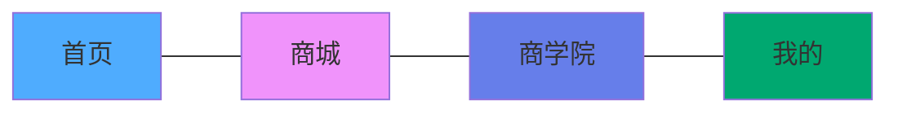

| 页面 | 路径 | 图标 | 说明 |
|------|------|------|------|
| 首页 | `/pages/index/index` | 🏠 | 课程展示、轮播Banner |
| 商城 | `/pages/mall/index` | 🛒 | 积分兑换商品/课程 |
| 商学院 | `/pages/academy/index` | 🏛️ | 商学院介绍 |
| 我的 | `/pages/mine/index` | 👤 | 个人中心 |

---

## 📂 页面分类

### 1. 认证模块 (Auth)
- `/pages/auth/login/index` - 登录页
- `/pages/auth/complete-profile/index` - 完善资料

### 2. 课程模块 (Course)
- `/pages/course/detail/index` - 课程详情
- `/pages/course/my-courses/index` - 我的课程
- `/pages/course/schedule/index` - 课程排期
- `/pages/course/appointment-confirm/index` - 预约确认

### 3. 订单模块 (Order)
- `/pages/order/confirm/index` - 确认订单
- `/pages/order/select-referee/index` - 选择推荐人
- `/pages/order/payment/index` - 确认支付
- `/pages/order/detail/index` - 订单详情

### 4. 个人中心模块 (Mine)
- `/pages/mine/profile/index` - 个人资料
- `/pages/mine/orders/index` - 我的订单
- `/pages/mine/appointments/index` - 我的预约
- `/pages/mine/contracts/index` - 我的协议
- `/pages/mine/feedback/index` - 意见反馈
- `/pages/mine/consultation/index` - 在线咨询
- `/pages/mine/referral-list/index` - 引荐人列表
- `/pages/mine/referee-manage/index` - 推荐人管理

### 5. 传播大使模块 (Ambassador)
- `/pages/ambassador/level/index` - 大使等级
- `/pages/ambassador/apply/index` - 申请传播大使
- `/pages/ambassador/team/index` - 我的团队
- `/pages/ambassador/qrcode/index` - 我的二维码
- `/pages/ambassador/merit-points/index` - 功德分管理
- `/pages/ambassador/cash-points/index` - 积分管理
- `/pages/ambassador/upgrade-guide/index` - 升级指南
- `/pages/ambassador/activity-records/index` - 活动记录
- `/pages/ambassador/contract-detail/index` - 协议详情
- `/pages/ambassador/contract-sign/index` - 签署协议
- `/pages/ambassador/withdraw/index` - 申请提现

### 6. 商学院模块 (Academy)
- `/pages/academy/intro/index` - 商学院介绍
- `/pages/academy/cases/index` - 学员案例
- `/pages/academy/materials/index` - 朋友圈素材

### 7. 公共模块 (Common)
- `/pages/common/announcement/index` - 平台公告

---

## 🔄 详细跳转逻辑

### 1️⃣ 首页 (`/pages/index/index`)

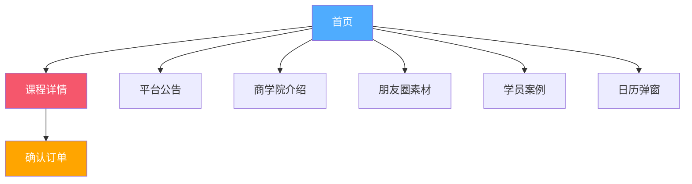

**跳转关系：**

| 触发位置 | 目标页面 | 跳转方式 | 说明 |
|---------|---------|---------|------|
| 轮播Banner-商学院 | `/pages/academy/intro/index` | `navigateTo` | 商学院介绍 |
| 轮播Banner-素材库 | `/pages/academy/materials/index` | `navigateTo` | 朋友圈素材 |
| 轮播Banner-案例 | `/pages/academy/cases/index` | `navigateTo` | 学员案例 |
| 通知提示栏 | `/pages/common/announcement/index` | `navigateTo` | 查看公告详情 |
| 课程卡片 | `/pages/course/detail/index?id={id}` | `navigateTo` | 查看课程详情 |
| 日历Tab | 显示日历弹窗 | 弹窗 | 查看课程日历 |

---

### 2️⃣ 商城 (`/pages/mall/index`)

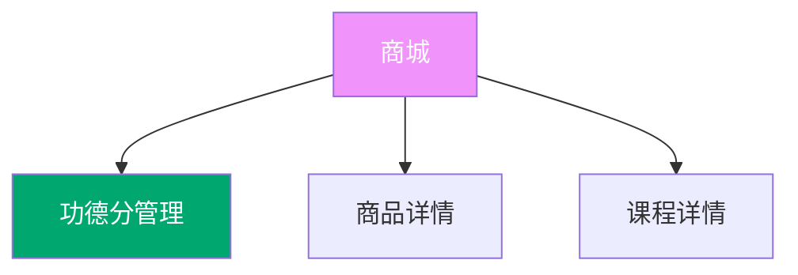

**跳转关系：**

| 触发位置 | 目标页面 | 跳转方式 | 说明 |
|---------|---------|---------|------|
| 积分明细按钮 | `/pages/ambassador/merit-points/index` | `navigateTo` | 查看功德分明细 |
| 商品卡片 | 商品详情（待开发） | `navigateTo` | 查看商品详情 |
| 课程卡片 | 课程详情（待开发） | `navigateTo` | 查看课程详情 |
| 兑换按钮 | 弹窗确认 | Modal | 确认兑换 |

---

### 3️⃣ 商学院 (`/pages/academy/index`)

**说明：** 商学院页面主要是展示信息，无页面跳转功能

---

### 4️⃣ 我的 (`/pages/mine/index`)

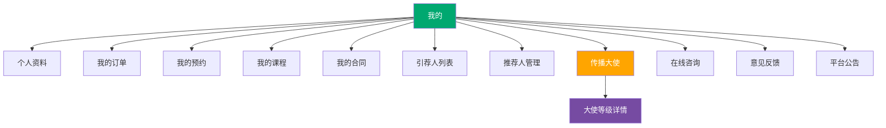

**跳转关系：**

| 触发位置 | 目标页面 | 跳转方式 | 说明 |
|---------|---------|---------|------|
| 用户头像区域 | `/pages/mine/profile/index` | `navigateTo` | 个人资料 |
| 我的订单 | `/pages/mine/orders/index` | `navigateTo` | 订单列表 |
| 我的预约 | `/pages/mine/appointments/index` | `navigateTo` | 预约列表 |
| 我的课程 | `/pages/course/my-courses/index` | `navigateTo` | 课程列表 |
| 我的合同 | `/pages/mine/contracts/index` | `navigateTo` | 合同列表 |
| 引荐人列表 | `/pages/mine/referral-list/index` | `navigateTo` | 引荐人管理 |
| 推荐人管理 | `/pages/mine/referee-manage/index` | `navigateTo` | 推荐人设置 |
| 传播大使 | `/pages/ambassador/level/index` | `navigateTo` | 大使等级页 |
| 个人资料 | `/pages/mine/profile/index` | `navigateTo` | 编辑资料 |
| 在线咨询 | `/pages/mine/consultation/index` | `navigateTo` | 客服咨询 |
| 意见反馈 | `/pages/mine/feedback/index` | `navigateTo` | 提交反馈 |
| 平台公告 | `/pages/common/announcement/index` | `navigateTo` | 查看公告 |

---

### 5️⃣ 课程详情 (`/pages/course/detail/index`)

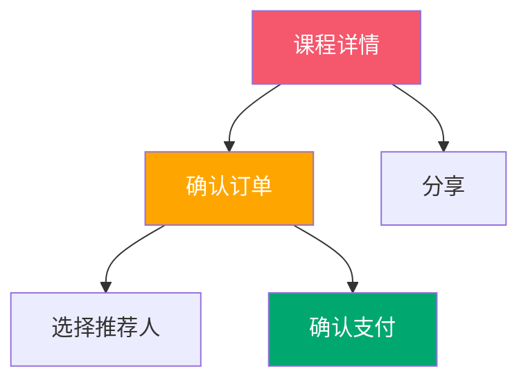

**跳转关系：**

| 触发位置 | 目标页面 | 跳转方式 | 说明 |
|---------|---------|---------|------|
| 立即购买按钮 | `/pages/order/confirm/index` | `navigateTo` | 进入订单确认 |

---

### 6️⃣ 订单流程

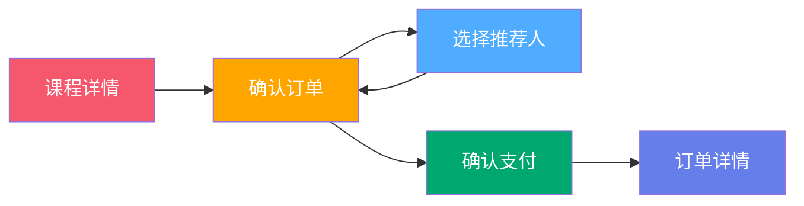

#### 6.1 确认订单 (`/pages/order/confirm/index`)

**跳转关系：**

| 触发位置 | 目标页面 | 跳转方式 | 说明 |
|---------|---------|---------|------|
| 推荐人信息卡片 | `/pages/order/select-referee/index` | `navigateTo` | 选择/更换推荐人 |
| 确认支付按钮 | 弹窗确认 | TDesign CSS Dialog | 确认推荐人信息 |
| 弹窗确定按钮 | `/pages/order/payment/index` | `navigateTo` | 进入支付页面 |

#### 6.2 选择推荐人 (`/pages/order/select-referee/index`)

**跳转关系：**

| 触发位置 | 目标页面 | 跳转方式 | 说明 |
|---------|---------|---------|------|
| 选择推荐人 | 返回上一页 | `navigateBack` | 返回订单确认页 |

#### 6.3 确认支付 (`/pages/order/payment/index`)

**跳转关系：**

| 触发位置 | 目标页面 | 跳转方式 | 说明 |
|---------|---------|---------|------|
| 支付成功 | `/pages/order/detail/index` | `redirectTo` | 查看订单详情 |

---

### 7️⃣ 传播大使模块

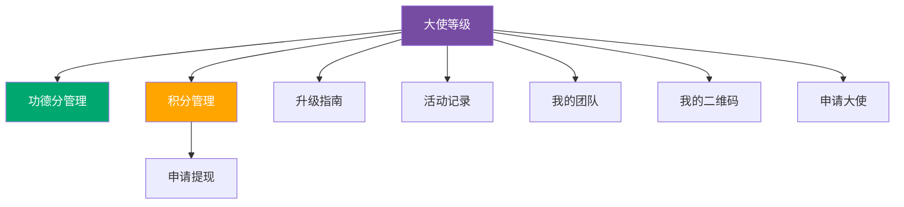

#### 7.1 大使等级 (`/pages/ambassador/level/index`)

**跳转关系：**

| 触发位置 | 目标页面 | 跳转方式 | 说明 |
|---------|---------|---------|------|
| 功德分卡片 | `/pages/ambassador/merit-points/index` | `navigateTo` | 功德分明细 |
| 积分卡片 | `/pages/ambassador/cash-points/index` | `navigateTo` | 积分明细 |
| 升级指南按钮 | `/pages/ambassador/upgrade-guide/index` | `navigateTo` | 查看升级条件 |
| 活动记录按钮 | `/pages/ambassador/activity-records/index` | `navigateTo` | 查看活动历史 |

#### 7.2 功德分管理 (`/pages/ambassador/merit-points/index`)

**说明：** 展示功德分明细，无跳转

#### 7.3 积分管理 (`/pages/ambassador/cash-points/index`)

**跳转关系：**

| 触发位置 | 目标页面 | 跳转方式 | 说明 |
|---------|---------|---------|------|
| 申请提现按钮 | `/pages/ambassador/withdraw/index` | `navigateTo` | 提现申请 |

#### 7.4 申请传播大使 (`/pages/ambassador/apply/index`)

**跳转关系：**

| 触发位置 | 目标页面 | 跳转方式 | 说明 |
|---------|---------|---------|------|
| 提交申请 | `/pages/ambassador/contract-sign/index` | `navigateTo` | 签署协议 |

#### 7.5 签署协议 (`/pages/ambassador/contract-sign/index`)

**跳转关系：**

| 触发位置 | 目标页面 | 跳转方式 | 说明 |
|---------|---------|---------|------|
| 查看协议详情 | `/pages/ambassador/contract-detail/index` | `navigateTo` | 协议内容 |
| 签署成功 | `/pages/ambassador/level/index` | `redirectTo` | 返回大使等级页 |

---

## 📊 页面流程图

### 完整用户流程

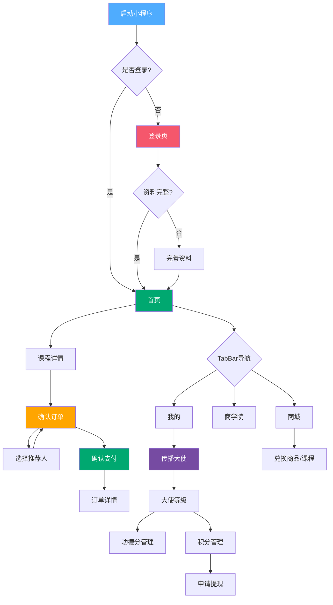

### 核心业务流程

#### 1. 购课流程

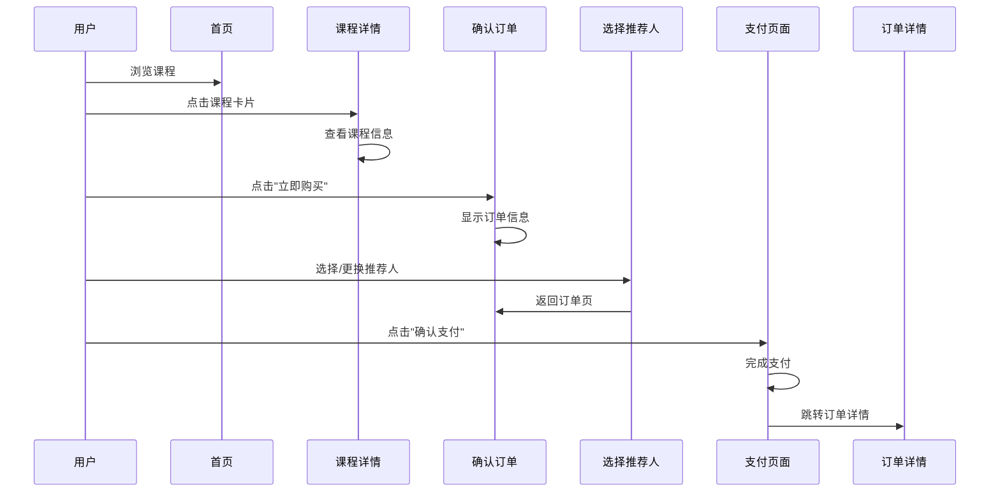

#### 2. 大使申请流程

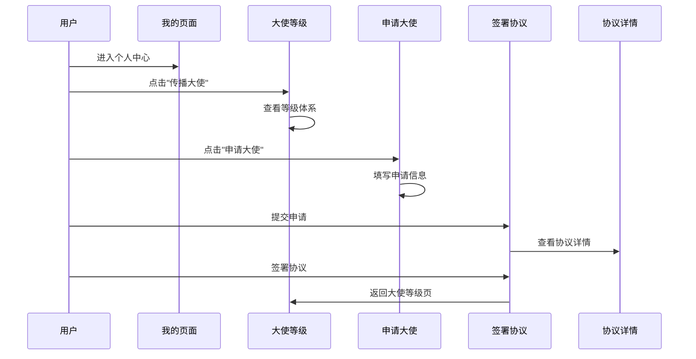

#### 3. 积分兑换流程

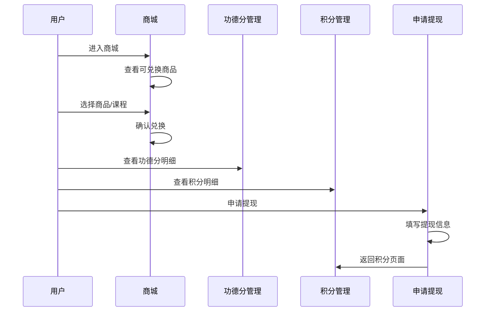

---

## 🗂️ 页面层级结构

```
小程序根目录
│
├── 🔐 认证层
│   ├── 登录页 (login)
│   └── 完善资料 (complete-profile)
│
├── 📱 TabBar主导航层
│   ├── 首页 (index)
│   ├── 商城 (mall)
│   ├── 商学院 (academy)
│   └── 我的 (mine)
│
├── 📚 课程业务层
│   ├── 课程详情 (course/detail)
│   ├── 我的课程 (course/my-courses)
│   ├── 课程排期 (course/schedule)
│   └── 预约确认 (course/appointment-confirm)
│
├── 🛒 订单业务层
│   ├── 确认订单 (order/confirm)
│   ├── 选择推荐人 (order/select-referee)
│   ├── 确认支付 (order/payment)
│   └── 订单详情 (order/detail)
│
├── 👤 个人中心层
│   ├── 个人资料 (mine/profile)
│   ├── 我的订单 (mine/orders)
│   ├── 我的预约 (mine/appointments)
│   ├── 我的协议 (mine/contracts)
│   ├── 意见反馈 (mine/feedback)
│   ├── 在线咨询 (mine/consultation)
│   ├── 引荐人列表 (mine/referral-list)
│   └── 推荐人管理 (mine/referee-manage)
│
├── 🎖️ 传播大使层
│   ├── 大使等级 (ambassador/level)
│   ├── 申请大使 (ambassador/apply)
│   ├── 我的团队 (ambassador/team)
│   ├── 我的二维码 (ambassador/qrcode)
│   ├── 功德分管理 (ambassador/merit-points)
│   ├── 积分管理 (ambassador/cash-points)
│   ├── 升级指南 (ambassador/upgrade-guide)
│   ├── 活动记录 (ambassador/activity-records)
│   ├── 协议详情 (ambassador/contract-detail)
│   ├── 签署协议 (ambassador/contract-sign)
│   └── 申请提现 (ambassador/withdraw)
│
├── 🏛️ 商学院层
│   ├── 商学院介绍 (academy/intro)
│   ├── 学员案例 (academy/cases)
│   └── 朋友圈素材 (academy/materials)
│
└── 🔔 公共层
    └── 平台公告 (common/announcement)
```

---

## 📝 页面跳转方式说明

### uni.navigateTo
保留当前页面，跳转到应用内的某个页面。可以返回到原页面。

**使用场景：** 大部分页面跳转

### uni.switchTab
跳转到 tabBar 页面，并关闭其他所有非 tabBar 页面。

**使用场景：** 跳转到首页、商城、商学院、我的

### uni.redirectTo
关闭当前页面，跳转到应用内的某个页面。不能返回到原页面。

**使用场景：** 支付成功后跳转订单详情

### uni.reLaunch
关闭所有页面，打开到应用内的某个页面。

**使用场景：** 登录成功后跳转首页

### uni.navigateBack
关闭当前页面，返回上一页面或多级页面。

**使用场景：** 选择推荐人后返回

---

## 🎯 关键页面入口汇总

### 从首页可以到达的页面
1. 课程详情
2. 平台公告
3. 商学院介绍
4. 朋友圈素材
5. 学员案例

### 从我的页面可以到达的页面
1. 个人资料
2. 我的订单
3. 我的预约
4. 我的课程
5. 我的合同
6. 引荐人列表
7. 推荐人管理
8. 传播大使（大使等级）
9. 在线咨询
10. 意见反馈
11. 平台公告

### 从大使等级可以到达的页面
1. 功德分管理
2. 积分管理
3. 升级指南
4. 活动记录
5. 我的团队
6. 我的二维码
7. 申请大使

### 从商城可以到达的页面
1. 功德分管理
2. 商品详情（待开发）
3. 课程详情（待开发）

---

## 🔍 页面查找索引

### 按功能查找

| 功能 | 页面路径 | 入口位置 |
|------|---------|---------|
| 登录 | `/pages/auth/login/index` | 启动小程序 |
| 购买课程 | `/pages/course/detail/index` | 首页课程卡片 |
| 查看订单 | `/pages/mine/orders/index` | 我的-我的订单 |
| 申请大使 | `/pages/ambassador/apply/index` | 大使等级页 |
| 查看功德分 | `/pages/ambassador/merit-points/index` | 商城/大使等级 |
| 积分兑换 | `/pages/mall/index` | TabBar-商城 |
| 提现申请 | `/pages/ambassador/withdraw/index` | 积分管理页 |
| 查看公告 | `/pages/common/announcement/index` | 首页/我的 |
| 个人资料 | `/pages/mine/profile/index` | 我的-头像区域 |
| 在线咨询 | `/pages/mine/consultation/index` | 我的-帮助与反馈 |

### 按模块查找

| 模块 | 页面数量 | 主要页面 |
|------|---------|---------|
| 认证模块 | 2 | 登录、完善资料 |
| 课程模块 | 4 | 课程详情、我的课程、排期、预约 |
| 订单模块 | 4 | 确认订单、选择推荐人、支付、详情 |
| 个人中心 | 8 | 资料、订单、预约、合同、反馈等 |
| 传播大使 | 11 | 等级、申请、团队、积分、提现等 |
| 商学院 | 3 | 介绍、案例、素材 |
| 公共模块 | 1 | 平台公告 |

**总计：** 37个页面（含TabBar主页面）

---

## 📌 注意事项

1. **登录拦截**：所有需要用户信息的页面都应该检查登录状态
2. **权限控制**：传播大使相关页面需要验证大使身份
3. **参数传递**：页面跳转时注意传递必要的参数（如课程ID、订单ID等）
4. **返回处理**：支付成功等场景使用 `redirectTo` 避免用户返回
5. **TabBar切换**：跳转到TabBar页面必须使用 `switchTab`
6. **页面栈管理**：注意页面栈深度，避免超过10层限制

---

## 🔄 更新日志

| 日期 | 版本 | 更新内容 |
|------|------|---------|
| 2025-01-30 | v1.0 | 初始版本，完成所有页面跳转逻辑梳理 |

---

**文档生成时间：** 2025-01-30  
**项目名称：** 天道文化小程序  
**技术栈：** uni-app + Vue3 + TypeScript + 腾讯云开发

