# 天道文化课程、学员和大使管理平台 V2.0

## 一、项目概述

### 1.1 项目背景
本项目旨在开发一个国学兵法课程线上商城小程序，为孙膑道天道文化课程提供线上购买、学习管理和推广的完整解决方案。

### 1.2 目标用户
- **学员**：购买和学习天道文化课程的用户
- **传播大使**：推广课程并获得功德分/积分的传播人员（青鸾大使、鸿鹄大使、金凤大使）
- **管理员**：后台管理人员，负责课程、学员、订单和大使管理

### 1.3 项目目标
- 提供便捷的课程浏览和购买体验
- 建立完善的传播大使推广体系
- 实现课程复训管理
- 支持直接推荐关系和双重奖励机制（功德分+积分）
- 提供全面的后台管理功能

### 1.4 核心机制说明

**奖励系统**（功德分与积分互斥，由后台 `ambassador_level_configs` 配置控制）：

| 对比项 | 功德分 | 积分 |
|-------|--------|------|
| **性质** | 虚拟奖励分 | 可提现的现金分 |
| **获得方式** | 后台配置功德率的等级推荐、所有大使担任辅导员/义工 | 后台配置积分率的等级推荐 |
| **使用方式** | 商城兑换商品、课程、复训、咨询 | 解冻后可提现 |
| **解冻条件** | - | 仅推荐初探班触发，每次解冻 `unfreeze_per_referral` |
| **互斥规则** | 同课程类型功德率和积分率只能配一个（后台强制二选一） | 同左 |

**核心规则**：
1. **功德分和积分不可同时发放**：后台等级配置中，初探班/密训班的功德率和积分率只能填一个，另一个必须为0
2. **冻结积分只由初探班解冻**：推荐初探班时若推荐人 `frozen>0`，优先解冻固定额度（`unfreeze_per_referral`），解冻即奖励，不再额外发功德分/积分
3. **密训班推荐不消耗冻结积分**：直接按后台配置的比例发放功德分或积分
4. **辅导员和义工** → 所有大使都可以担任，只发功德分
   - 这是额外职责，不是独立职位
   - 与推荐奖励并行，可以同时获得两个途径的功德分
5. **密训班包含初探班** → 推荐奖励只按密训班价格计算
6. **`frozen_points` 和 `unfreeze_per_referral` 必须是倍数关系**，后台审核通过时校验
7. **所有比例/名额均从 `ambassador_level_configs` 表动态读取**，不得硬编码
8. **冻结积分由后台审核时人工设置**，不再从 `ambassador_level_configs.frozen_points` 自动读取，审核时须为目标等级 `unfreeze_per_referral` 的整数倍（填 0 时跳过校验）

**青鸾大使举例**：
```
升级为青鸾大使时（2026-03 更新：取消支付环节）：
- 后台审核通过时管理员设置冻结积分（如1688，须为单次解冻积分的整数倍，可填0）
- 签署《青鸾大使补充协议》后正式升级 + 发放冻结积分
- 不获得额外功德分

第1次推荐初探班（1688元）：
- 解冻积分：1688（可提现，积分池已空）
- 功德分：0

第2次推荐初探班（1688元）：
- 解冻积分：0（积分池已空）
- 获得功德分：1688 × 30% = 506.4

第N次推荐（N≥2）：
- 解冻积分：0
- 获得功德分：1688 × 30% = 506.4（持续获得）
```

**鸿鹄大使举例**：
```
升级时（2026-03 更新：取消支付环节）：
- 后台审核通过时管理员设置冻结积分（如16880），可提现积分0

第1次推荐初探班（1688元）：
- 冻结积分：16880 - 1688 = 15192
- 可提现积分：0 + 1688 = 1688
- 功德分：0

第2次推荐密训班（38888元）：
- 冻结积分：15192（不变）
- 可提现积分：1688 + 7777.6 = 9465.6（直接加20%）

第10次推荐初探班：
- 冻结积分：0（全部解冻完毕）
- 可提现积分：持续累加

第11次推荐初探班（1688元）：
- 冻结积分：0（已空）
- 可提现积分：+ 506.4（30%直接加到可提现）
```

---

## 二、推荐人确定机制（重要）

> **2026-03-09 更新**：推荐人绑定方式简化为仅通过扫码绑定，用户无感知，购课不强制

### 2.1 核心原则

**推荐人仅通过扫描推荐二维码绑定，用户无感知且无法手动修改，首次购课后永久锁定**

### 2.2 绑定规则

#### 唯一绑定方式：扫描推荐二维码
- 用户扫描大使的推荐二维码（`pages/ambassador/qrcode/index`）进入小程序
- 系统从二维码 scene 参数（`ref=推荐码`）解析推荐人，自动写入用户表 `referee_id`
- **用户端不显示推荐人信息，无任何修改入口**（对用户完全无感知）

#### 扫码覆盖规则
- **未购课用户**：多次扫不同大使的二维码，推荐人以**最后一次扫码**为准（后来者覆盖）
- **已购课用户**：推荐人已锁定（`referee_confirmed_at` 有值），再扫码不会改变推荐人

#### 购课与推荐人的关系
- 推荐人**不是**购课的前提条件，没有推荐人也可以正常购买课程
- 创建订单时，推荐人直接从用户表的 `referee_id` 读取，不接受前端传参
- 订单确认页不显示推荐人信息

#### 推荐人锁定
- **签合同审核通过或初探班首次上课（contract_signed=1）后**，系统写入 `users.referee_confirmed_at`，推荐人被永久锁定
- 锁定后再扫任何二维码，推荐人不会改变

#### 后台管理
- 管理员可在后台"学员管理"中手动修改任意用户的推荐人（包括已锁定的）
- 变更记录写入 `referee_change_logs`（`change_type=4` 管理员修改）

### 2.3 关键字段说明

#### users表
```sql
referee_id              -- 推荐人ID（可修改，首次购买后确认）
referee_updated_at      -- 推荐人最后修改时间
is_referee_confirmed    -- 推荐人是否已确认(0否/1是)
referee_confirmed_at    -- 推荐人确认时间（首次 contract_signed=1 时间）
```

#### orders表
```sql
referee_id              -- 订单推荐人ID（支付前可修改）
referee_confirmed_at    -- 推荐人确认时间（contract_signed=1 时记录，支付回调不再设置）
is_reward_granted       -- 是否已发放奖励(0否/1是)
reward_granted_at       -- 奖励发放时间
```

#### referee_change_logs表
```sql
user_id                 -- 用户ID
old_referee_id          -- 原推荐人ID
new_referee_id          -- 新推荐人ID
change_type             -- 变更类型(1注册/2用户主动修改/3订单修改/4管理员修改)
change_source           -- 变更来源(1小程序用户资料/2订单确认页/3后台管理)
order_id                -- 关联订单ID
created_at              -- 创建时间
```

### 2.4 奖励发放规则

**重要：奖励发放给订单中的推荐人，而非用户资料中的推荐人**

**奖励发放时机（2026-03-06 更新）：非沙龙课程购买后不立即发放，须等管理员录入线下合同后触发**

| 课程类型 | 奖励发放时机 |
|---|---|
| 沙龙课程（type=4，免费） | 无推荐奖励 |
| 非沙龙课程（含合同模板） | 管理员在后台录入线下合同后（录入即生效，触发推荐人奖励） |
| 非沙龙课程（无合同模板） | 购买支付成功后立即发放 |

```
场景示例1（正常流程）：

1. 用户A注册时扫了准青鸾大使B的二维码
   users.referee_id = B（准青鸾）

2. 用户A在个人资料中改为青鸾大使C
   users.referee_id = C（青鸾）
   记录变更日志：B -> C

3. 用户A购买初探班时又改为准青鸾大使D
   验证通过：准青鸾可推荐初探班
   orders.referee_id = D（准青鸾）
   记录变更日志：C -> D（关联订单号）

4. 签合同审核通过或初探班首次上课（contract_signed=1）后
   - 奖励发放给大使D（订单推荐人）
   - 用户A推荐人确认：users.is_referee_confirmed = 1
   - 用户A推荐人锁定：users.referee_id = D

5. 用户A再次购买密训班
   - 不可修改推荐人
   - 订单推荐人自动为大使D
   - 此时D已升级为青鸾（推荐过初探班）
   - 奖励继续发放给大使D

场景示例2（资格验证失败）：

1. 用户B注册时扫了准青鸾大使E的二维码
   users.referee_id = E（准青鸾）

2. 用户B直接购买密训班
   系统验证：E是准青鸾，只能推荐初探班
   验证失败：显示错误提示
   - "您的推荐人暂时只能推荐初探班课程"
   - "请选择青鸾及以上等级的推荐人，或先购买初探班"

3. 用户B修改推荐人为青鸾大使F
   验证通过：青鸾可推荐密训班
   orders.referee_id = F（青鸾）
   可以继续支付

4. 签合同审核通过或初探班首次上课（contract_signed=1）后
   - 奖励发放给大使F（订单推荐人）
   - 用户B推荐人确认并锁定为F
```

### 2.5 风控机制

#### 修改频率限制
- 用户在个人资料中修改推荐人：7天只能修改1次
- 订单确认页面修改推荐人：不限制（但会记录日志）
- contract_signed=1 后：完全不可修改

#### 异常检测
- 同一用户频繁在多个推荐人之间切换：标记异常
- 同一IP短时间内多个用户修改推荐人：可疑
- 同一推荐人短时间内被大量设置：刷单嫌疑
- 后台可查看所有变更日志，人工审核异常情况

#### 推荐人资格验证
```python
def validate_referee(user_id, new_referee_id, course_type=None):
    # 1. 不能自己推荐自己
    if new_referee_id == user_id:
        raise Exception("不能选择自己为推荐人")
    
    # 2. 不能选择自己的下级
    referee = User.query.get(new_referee_id)
    if referee.referee_id == user_id:
        raise Exception("不能选择自己的下级为推荐人")
    
    # 3. 推荐人必须是传播大使（准青鸾及以上）
    if referee.ambassador_level < 1:
        raise Exception("推荐人必须是准青鸾及以上等级的传播大使")
    
    # 4. 准青鸾大使只能推荐初探班
    if course_type and referee.ambassador_level == 1:  # 准青鸾
        if course_type != 1:  # 不是初探班
            raise Exception("该推荐人暂时只能推荐初探班课程")
    
    return True

def validate_referee_for_order(user_id, referee_id, course_id):
    """订单创建时验证推荐人资格"""
    course = Course.query.get(course_id)
    return validate_referee(user_id, referee_id, course.type)
```

**推荐人资格限制说明**：
- **普通学员（level=0）**：不能作为推荐人
- **准青鸾大使（level=1）**：
  - ✅ 可以作为推荐人
  - ✅ 只能推荐初探班课程
  - ❌ 不能推荐密训班、咨询、顾问等其他课程
  - 后台审核通过并签署《青鸾大使补充协议》后升级为青鸾大使
- **青鸾及以上（level≥2）**：
  - ✅ 可以作为推荐人
  - ✅ 可以推荐所有类型课程

---

## 三、系统架构

### 2.1 技术架构

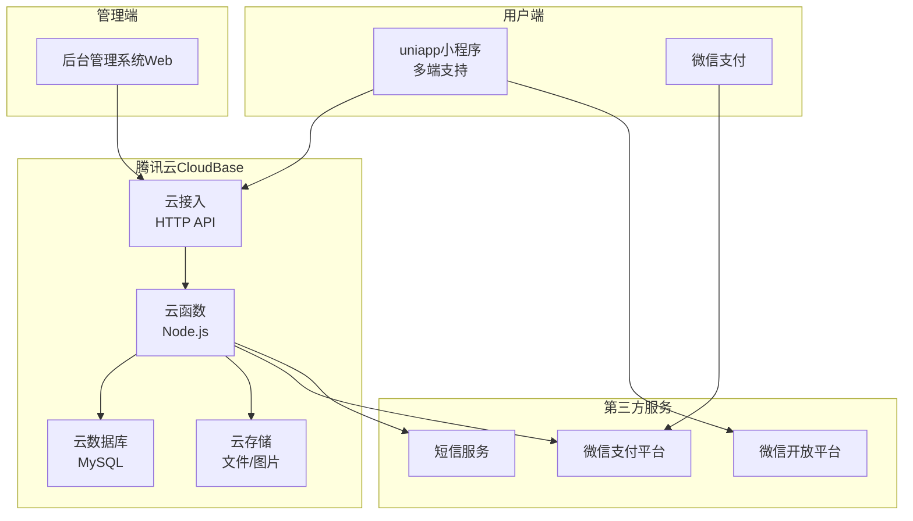

**技术栈**：
- **前端**：uniapp（支持微信小程序、H5、APP等多端）
- **后端**：腾讯云 CloudBase
  - **云函数**：Node.js（Serverless架构）
  - **云数据库**：腾讯云 MySQL
  - **云存储**：腾讯云对象存储（COS）
  - **云接入**：HTTP API服务
- **支付**：微信支付
- **其他服务**：
  - 短信服务（腾讯云SMS）
  - 定时触发器（云函数定时任务）

### 2.2 系统模块

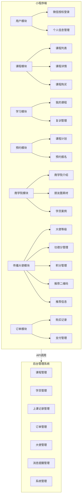

---

## 三、功能需求详细说明

## 3.1 小程序端功能

### 3.1.1 登录模块

#### 微信审核合规 · 游客浏览与协议明示同意（2026-04-01）

为满足微信平台对「先体验再登录」「隐私协议明示同意、禁止默认同意」等要求，当前小程序端约定如下：

- **冷启动**：应用启动时**不再**全局 `reLaunch` 至登录页；用户未在本地写入业务 `userInfo` 前可作为游客进入 **首页 / 商城 / 商学院** 三个 Tab 浏览（具体按钮是否拦截见前端守卫；只读接口应在云函数侧对微信 `OPENID` 可访问）。**商城列表**：`order` 云函数 `getMallGoods`、`getMallCourses`（2026-04-02）不要求 `users` 表已注册即可返回上架商品与可兑换课程列表；兑换、兑换记录等仍须业务登录。
- **底部「我的」**：使用 **微信原生 tabBar**（`pages.json` 未开启 `custom`）。未登录用户点「我的」会先进入「我的」页，随即由 `pages/mine/index` `onShow` **重定向**至登录页（合规前提下优先保证底栏稳定显示；若后续 uni 构建能正确产出小程序端 `custom-tab-bar` 组件，可再评估自定义底栏以优化选中态）。
- **登录页**：用户须 **手动勾选**「已阅读并同意《用户服务协议》与《隐私政策》」（默认不勾选）后方可发起微信一键登录；**全屏渐变布局不变**，顶部 **圆形品牌 Logo**（`static/login/logo.png`，须由小程序主图标 `static/logo.png` 放大生成，避免使用大面积半透明 PNG 导致在渐变底上不可见）；左上角返回箭头与 `TdPageHeader` 内页一致（边框旋转 chevron，非全局 `page-header.scss` 的 `‹` 字符）；有栈则 `navigateBack`，否则 `switchTab` 首页；协议正文独立页：`/pages/common/user-agreement/index`、`/pages/common/privacy-policy/index`。
- **需登录能力**：如进入 **课程详情（购买链路）**、**商城兑换 / 积分明细**、商学院快捷入口中 **非游客白名单** 页面等，在用户操作时跳转登录。
- **401 处理**：本地 **无** 业务登录态时，接口返回 401 **不**自动整页跳转登录，避免打断游客浏览；本地 **有** 业务登录态但服务端判失效时仍提示并引导重新登录。

> 业务登录态判断与 `utils/auth-state.ts` 中 `isBusinessLoggedIn()` 一致（依赖本地 `userInfo` 等字段）。

#### 微信授权登录
**功能描述**：使用微信一键登录，获取用户基本信息

**业务流程**：

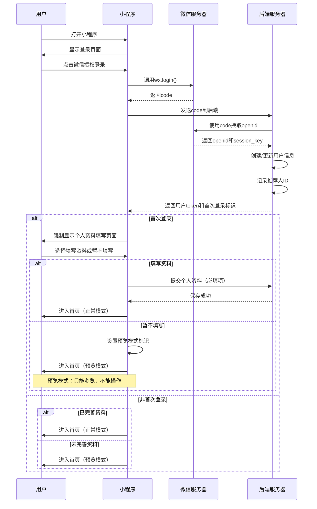

**数据字段**：
- openid（微信唯一标识）
- unionid（开放平台唯一标识）
- 昵称、头像（微信授权获取）
- 手机号（可选）
- 推荐人ID（首次注册时临时记录，可在个人资料和购买时修改，contract_signed=1 后最终确定）
- is_first_login（是否首次登录标识）

**首次登录个人资料填写**：

**功能说明**：
- 首次登录后强制弹出个人资料填写页面
- 必须填写资料后才能使用完整功能
- 不填写只能以预览模式浏览小程序（只读模式）

**资料填写表单**（必填项标*）：
- 真实姓名（必填*）
- 手机号（必填*）
- 性别（选填）
- 出生八字（年月日时）（选填）
- 从事行业（选填）
- 所在地区（选填）
- 个人简介（选填）

**页面元素**：
- 标题："完善个人资料"
- 提示语："请完善资料后使用小程序功能"
- 说明文字："未完善资料只能预览，无法购买课程、预约等操作"
- 表单字段（真实姓名和手机号必填）
- "提交"按钮
- "暂不填写，先预览"按钮（次要按钮样式）

**业务规则**：
- 真实姓名和手机号为必填项，其他选填
- 点击"暂不填写，先预览"进入预览模式
- 点击"提交"保存信息后进入正常模式，可使用全部功能
- 预览模式下功能限制见下方说明
- 后续可在"用户信息"页面补充完善或首次填写
- **收款银行账户**（选填）：用户可在个人资料页底部填写银行收款人姓名、开户支行、银行卡号，用于积分提现和退款时的财务线下转账。填写时系统自动识别发卡行并校验开户支行是否匹配，保存时需二次确认防止填错。三个场景（提现/退款/复训费退款）均在提交前检查该信息是否已填，未填则提示跳转填写。（2026-03-23 新增）

**预览模式功能限制**：

**可以访问（只读）**：
- ✅ 浏览课程列表和详情
- ✅ 查看通知公告
- ✅ 浏览商学院介绍
- ✅ 查看朋友圈素材
- ✅ 查看学员案例
- ✅ 查看课程计划

**不可操作（需完善资料）**：
- ❌ 购买课程
- ❌ 预约报名
- ❌ 申请成为大使
- ❌ 提交反馈
- ❌ 预约咨询
- ❌ 查看和使用"我的"相关功能

**预览模式提示**：
- 在受限功能入口显示"请先完善个人资料"提示
- 点击后弹窗引导去完善资料
- 显示"完善资料"悬浮按钮（右下角）

---

### 3.1.2 首页模块

**首页轮播图素材规格**：后台「轮播图管理」与小程序 `pages/index/index` 轮播区域一致，建议出图尺寸 **750×720 像素**（宽:高 = 25:24）；小程序端为通栏宽度 × **720rpx** 高，`image` 为 `aspectFill`，比例不符时会裁切，请按上述尺寸制作。

#### 3.1.2.1 通知公告
**功能描述**：展示后台发布的通知和公告信息

**页面元素**：
- 公告标题
- 发布时间
- 公告类型标签（重要/普通）
- 点击查看详情

**业务规则**：
- 按发布时间倒序排列
- 重要公告置顶
- 支持富文本内容
- 支持图片和视频

#### 3.1.2.2 课程列表
**功能描述**：展示所有可购买的课程

**页面元素**：
- 课程封面图（后台建议出图 **750×420 像素**，与小程序课程详情顶图 **420rpx** 高一致；**首页**列表卡片顶图约 **340rpx** 高、**大圆角**（约 **40rpx**）与整卡一致；商城约 **280rpx** 高，均为 `aspectFill`，易裁切边缘，素材主体宜居中偏下）
- **（2026-04-08 修订）** 首页课程卡片独立为组件 `CourseHomeCard`，**底部信息区仅展示**：左侧为**课程类型名**（如初探班/密训班）+ **价格**（沙龙显示「免费」），右侧为**白底描边胶囊**（文案垂直水平居中），**固定文案「查看详情」**（不使用「N天后」等倒计时）；底色为 **`#FBF7EE`**。整卡点击进入详情；已购非沙龙可显示「已购买」小标签。**完整课程名称**在详情页展示。

**业务规则**：
- 支持课程分类筛选
- 支持搜索功能
- 已购课程显示"已购买"标识
- 课程可设置上架/下架状态
- 管理员在后台删除课程为**软删除**（`courses.is_deleted=1`）；小程序首页课程列表、公开详情与商城兑换课程列表**仅展示** `is_deleted=0` 且已上架的课程，与后台「未删除」列表一致，**不应**再出现已删除的旧课程条目
- **2026-04-04**：管理端「课程列表」新增/编辑弹窗**不再展示**「课程详情」表单项（对应库字段 `courses.content`）；小程序端未使用该长文字段，后台仅隐藏 UI；保存课程时仍按接口原样携带已有 `content`，避免误清空历史数据。
- **2026-04-04**：课程简介与课程大纲支持**图文混排**：后台按顺序配置「文字块 / 图片块」（图片上传云存储，存 `cloud://` fileID）；数据库 `description_blocks`、`outline_blocks` 存 JSON 数组；`courses.description` 仍由文字块拼接生成纯文本摘要（≤500 字）供列表关键词检索；`outline` 仍同步纯文字 JSON 数组以兼容旧数据；小程序详情「课程介绍」「课程大纲」Tab 按顺序展示文字与图片（接口已将图片 fileID 转为 CDN HTTPS）。
- **2026-04-04**：管理端课程文字块使用与等级配置类似的**内联富文本**（`AdminRichTextInline` + contenteditable）：支持加粗、斜体、列表、链接、颜色等；存库为 HTML 字符串；小程序端用 `rich-text` 渲染（与大使等级描述一致）。

#### 3.1.2.2.1 农历日历弹窗（Tab「日历」）

- 弹窗内：公历年月顶栏、农历风格网格、底部分隔线以下为农历日（如「正月十七」）、四柱、吉神宜趋等。
- **课程行**（2026-04-08）：紧挨分隔线、在农历日**之上**，固定前缀 **「课程：」**，后接当日涉及的**课程昵称**；`class_records` 排期按 **`class_date`～`class_end_date`（含）** 展开到区间内每一天，该天内均有课展示；若同日多个不同 `course_id` 的排期，昵称以**中文逗号**拼接；当日无排期则显示 **「无」**。该行字体与农历日标题一致（衬线、同字号层级），允许多课换行。
- **（2026-04-08 修订）** 日历格第二行**不**展示排期昵称，仅展示**节气**（若有）或**农历日**；课程信息只在底部「课程：」行。排期数据仍由 `course` 云函数 **`getCalendarSchedule`** 按前端请求的日期区间拉取（切换月份时合并）。

#### 3.1.2.3 课程详情
**功能描述**：展示课程完整信息，支持在线购买

**页面元素**：
- 课程详细介绍
- 课程大纲
- 讲师介绍
- 课程时长
- 课程价格
- 购买按钮
- 分享按钮（带推荐码）

**购买流程**：

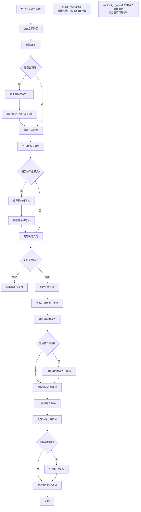

**特殊规则**：
- 密训班可以直接购买，无需先购买初探班
- **密训班（38888元）默认包含初探班课程**（套餐模式）
- 购买密训班后，两个课程都会加入"我的课程"
- **重要**：推荐人奖励只按密训班价格38888元计算，不重复计算包含的初探班
- 复训费用与正式课程价格不同

**密训班赠送课程规则（2026-03 新增，2026-04-03 后台交互修正）**：
- 后台可为密训班（type=2）绑定**一门**赠送初探班：管理端「课程列表」编辑密训班时，通过**下拉框明确选择**具体初探班课程（仅列出 `type=1`）；清空下拉表示不赠送。不再使用「仅开关、不选具体课程」的配置方式，避免 `included_course_ids` 为空导致小程序详情与购课赠课逻辑不生效。
- 服务端校验：赠送目标必须是未删除的初探班（`type=1`、`is_deleted=0`）
- 购买/兑换密训班后：
  - 用户**无**该赠送课程 → 新建 `user_courses` 记录（`is_gift=1`）
  - 用户**已有**该赠送课程 → 在原有效期基础上叠加 `validity_days` 天（不创建新记录）
- 退款时同步回退赠送课程：
  - 新建的赠送记录 → 直接失效（`status=0`）
  - 叠加有效期的 → `expire_at` 减去赠送课程的 `validity_days` 天
- 退款校验：主课程或赠送课程任一 `contract_signed=1` → 拒绝退款
- 小程序课程详情页新增「赠送课程」类 tab，**仅**展示赠送课程摘要（封面、名称、类型、有效期等），不在该 tab 内重复展示课程介绍或赠送课大纲（主课内容仍在「课程介绍 / 课程大纲 / 讲师介绍」等 tab）

**课程上架锁定规则（2026-03 新增）**：
- 课程上架后（status=1），所有编辑属性锁定不可修改（包括合同配置）
- 如需修改，必须先下架课程
- 新增课程默认为下架状态（status=0）
- 上架时弹出确认框："课程上架后不能修改任何字段，确定好再上架"

**沙龙课程（type=4）特殊规则**（2026-03 新增）：
- **免费课程**：无现价/原价/重训价/有效期/课程时长，price 字段全部为 0，validity_days 为 NULL
- **一次性课程**：每门沙龙课程仅允许创建一个排期，排期结束后自动删除课程及排期数据
- **无需合同**：管理端隐藏合同按钮，上架不检查合同模板，预约流程跳过合同签署检查
- **免费预约**：用户无需支付，从首页→详情页（显示"免费"+立即预约按钮）→课程计划页→预约确认页
- **自动创建 user_courses**：预约时若无 user_courses 记录，系统自动创建（buy_price=0，status=1）
- **全自动流转**：沙龙预约无需人工干预，定时任务自动处理全部状态：
  - 开课当天 0:00：status=0(待上课) → status=1(已签到)
  - 排期结束次日 0:00：status=0/1 → status=2(已结课)
  - 唯一的人工操作：用户主动取消 → status=3(已取消)
- **结束清理**：排期结束次日 0:00 定时任务硬删除 class_records + courses + user_courses，appointments 保留作为历史

**推荐人确定规则**：
- 确认订单页面显示当前推荐人信息（来自用户资料）
- **支付前可修改**：用户可在订单确认页面修改推荐人
- **推荐人资格验证**：
  - 推荐人必须是准青鸾及以上等级的传播大使
  - 如果推荐人是准青鸾大使，只能推荐初探班课程
  - 如果购买密训班/咨询等其他课程，推荐人必须是青鸾及以上等级
  - 不符合条件时显示错误提示并阻止下单
- **contract_signed=1 后最终确定**：签合同审核通过或初探班首次上课后，订单中的推荐人即为获得奖励的推荐人
- **锁定时机**：用户首次达到 contract_signed=1 时，推荐人被永久确认，后续不可再修改
- **奖励发放依据**：奖励发放给订单中最终确定的推荐人，而非用户资料中的推荐人
- 待支付订单可修改推荐人，已支付订单推荐人不可修改

**推荐人资格验证失败提示示例**：

场景1：推荐人不是传播大使
```
❌ 错误提示：
"推荐人必须是准青鸾及以上等级的传播大使，请选择其他推荐人"
操作：阻止创建订单，需用户更换推荐人
```

场景2：准青鸾推荐非初探班课程
```
❌ 错误提示：
"您的推荐人暂时只能推荐初探班课程
推荐人升级为青鸾大使后即可推荐所有课程
请选择青鸾及以上等级的推荐人，或先购买初探班"
操作：阻止创建订单，需用户更换推荐人或改买初探班
```

---

### 3.1.3 我的课程

**功能描述**：查看已购买的课程和复训情况

**页面元素**：
- 课程列表（已购）
- 课程进度
- 上课次数记录
- 预约上课按钮

**业务规则**：
- 初探班：提供复训机会
- 密训班：提供复训机会
- 只要第二次来上课都称作复训
- 复训需支付复训费
- 复训只以报名时间为准，没有次数限制

**数据展示**：
```
课程名称：初探班
购买时间：2024-01-15
上课次数：3次
状态：可复训
```

---

### 3.1.4 预约报名模块

#### 课程计划
**功能描述**：学员预约即将开课的课程，包括首次上课和复训

**页面元素**：
- 课程名称
- 开课时间
- 开课地点
- 剩余名额
- 预约按钮

**预约流程**：

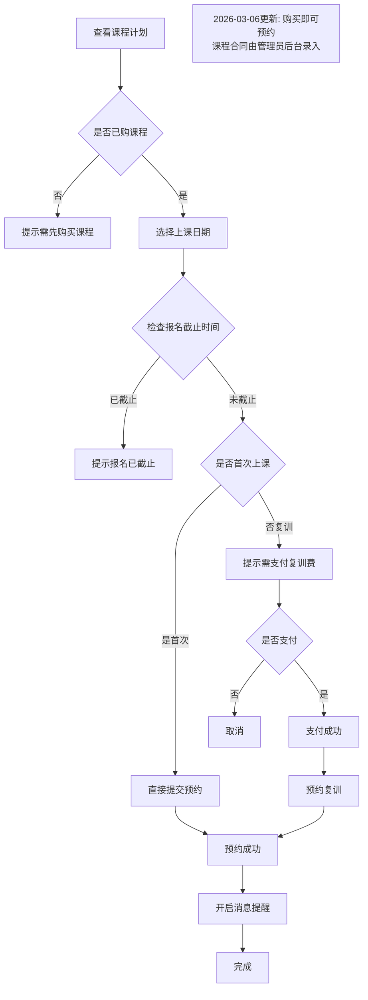

**业务规则**：
- **报名截止**：超过报名截止时间则无法报名和复训
- 每期课程有人数限制
- 只要第二次来上课都称作复训（attend_count >= 1），没有次数限制
- 复训只以报名时间为准
- **复训费**：attend_count >= 1 的非沙龙课程：若所选排期 `class_records.retrain_price > 0`，须先支付复训费（走微信支付流程），金额以该排期 `retrain_price` 为准；若为 0 则本排期免费复训，可直接预约。课程表不再配置复训价。
- **沙龙课程免复训费**：沙龙课程（type=4）无需支付复训费，直接预约
- **取消预约**：用户可在上课前X天（排期配置的 cancel_deadline_days）之前取消预约，超过截止日期后不可取消；复训用户取消后复训费保留为复训资格（详见「复训费保留与取消预约机制」）；**若用户有该排期的活动报名，需先取消活动报名后才能取消预约**（详见「志愿活动」）
- **复训流程**：预约确认页判断 attend_count → 显示复训费金额 → 用户确认 → 跳转订单确认页（order_type=2）→ 微信支付 → 支付回调自动创建预约记录 → 订阅消息授权
- **预约信息展示（2026-04-04）**：课程计划页与预约确认页展示开课日～结课日（`class_date`～`class_end_date`，单日课只显示一行日期）；另起一行展示当天上课时段的开始与结束时刻（由排期 `class_time` 解析，如 `08:00 - 10:00`）。客户端通过 `getClassRecords` 返回的 `class_end_date`、`start_time`、`end_time` 渲染。
- **首次预约合同拦截（2026-03-06 已取消）**：原逻辑为 attend_count=0 时检查合同签署；现改为购买即可预约，合同由管理员后台录入线下合同，不再拦截

#### 微信订阅消息 - 上课提醒（2026-03 新增）

**功能描述**：用户确认预约后，系统在上课前一天早上 9 点自动发送微信订阅消息提醒

**触发流程**：
1. 用户在预约确认页点击"确认预约"
2. 弹出微信订阅消息授权弹窗（仅微信小程序环境）
3. 用户允许/拒绝后继续预约流程（不影响预约操作本身）
4. 上课前一天 9:00，定时任务自动向已授权的用户发送提醒

**消息模板**（模板 ID: `SYdGf0v5jj40k50FjfUB4ROStOWQiSvhVidHIsAsHYc`）：

| 字段 | 说明 | 数据来源 |
|------|------|----------|
| 时间 | 上课日期+时间 | `class_records.class_date` + `class_time` |
| 上课地址 | 上课地点 | `class_records.class_location` |
| 主讲老师 | 讲师姓名 | `class_records.teacher` |
| 课程标题 | 课程名称 | `class_records.course_name` |
| 学习天数 | 课程持续天数 | `class_end_date - class_date + 1` |

**业务规则**：
- 一次性订阅：每次预约对应一次授权，发一条消息后配额清零
- 用户拒绝授权不影响预约操作
- 未授权的用户发送时返回错误码 43101，静默处理
- 仅微信小程序环境生效，H5/App 环境跳过授权步骤
- 消息点击后跳转"我的预约"页面
- 发送实现：通过 HTTP API 直接调用微信接口（APPID + AppSecret 换取 access_token），不依赖 wx-server-sdk openapi 权限配置

#### 复训费保留与取消预约机制

##### 排期不可编辑
- 排期新增后不可编辑，如需修改请取消后重新创建
- 取消排期时，该排期下所有待上课预约自动取消

##### 取消预约截止天数
- 新增排期时必须填写"取消预约截止天数"（`cancel_deadline_days`），为必填正整数
- 用户预约后可在上课前 X 天取消预约（X = cancel_deadline_days）
- 超过截止日期后，取消预约按钮置灰，提示"无法取消预约"
- 取消预约需确认弹窗

##### 复训费保留机制
- 复训用户（attend_count >= 1）支付复训费后取消预约，复训费不退款但保留为"复训资格"
- 复训资格仅限同课程使用，下次同课程排期预约时可免付复训费
- 复训资格永久有效，可反复保留
- 管理员取消排期时，复训预约同样触发资格保留
- 使用复训资格预约后若被标记为"缺席"，资格消耗不退回

##### 数据库字段
- class_records.cancel_deadline_days：取消预约截止天数（必填正整数）
- orders.retrain_credit_status：复训费抵扣状态（0无/1可抵用/2已抵用）

---

### 3.1.4a 课程学习服务协议（2026-03 新增，2026-03-06 已变更）

> ⚠️ **已变更**：课程合同流程已改造为管理员后台录入线下合同，详见 3.1.4b。以下为原设计，仅作参考。

#### 功能概述（原设计）

部分课程（非沙龙类）在学员首次预约前，要求签署电子版学习服务协议，签署完成后推荐人奖励才会发放。

#### 触发条件

| 条件 | 是否需要签约 |
|---|---|
| `attend_count = 0` 且课程已配置合同模板（contract_type=4） | ✅ 需要签约 |
| `attend_count ≥ 1`（已上过课） | ❌ 跳过，无需签约 |
| 沙龙课程（type=4） | ❌ 无需合同，整个流程跳过 |
| 课程未配置合同模板 | ❌ 跳过，无需签约 |
| 已有 status=5（待审核）合同 | ❌ 禁止预约，提示"合同审核中" |

#### 签约流程（含审核）

```mermaid
flowchart TD
    A[用户点击预约] --> B[调用 checkCourseContract]
    B --> C{auditPending?}
    C -->|true| P[提示"合同审核中，请等待管理员审核"]
    C -->|false| D{needSign?}
    D -->|false| E[正常进入预约流程]
    D -->|true| F[跳转课程合同签约页]
    F --> G[展示协议全文+手写签名]
    G --> H[调用 signCourseContract]
    H --> I[contract_signatures.status=5 待审核]
    I --> J[管理员在后台合约审核页操作]
    J --> K{审核结果}
    K -->|通过| L[status=1，user_courses.contract_signed=1，推荐人奖励]
    K -->|驳回| M[status=6，用户重新签署]
    L --> E
```

#### 业务规则

- 合同模板（`contract_templates`，`contract_type=4`）由管理员通过课程列表的"合同"按钮上传 PDF/Word 文件后创建
- 同一课程只有一个有效合同模板（status=1，deleted_at IS NULL）
- 小程序端通过 `getContractTemplateByCourse` 获取模板内容用于展示
- **签约后进入审核流程**：`signCourseContract` 提交后写入 `contract_signatures.status=5`（待审核），**不立即**更新 `user_courses.contract_signed`
- **管理员审核通过**（`auditContractSignature action=approve`）后才更新 `user_courses.contract_signed=1`、计算并写入 `expire_at`、触发推荐人奖励
- **管理员驳回**（`action=reject`）：status=6，用户可重新签署（新建 status=5 记录）
- **有效期起点**：审核通过日（非签署日）+ `courses.validity_days` 天
- **推荐人奖励**：审核通过后触发，而非签署后立即触发
- 已签约用户（`contract_signed=1`）不可退款

#### 课程上架前置校验（2026-03 新增）

非沙龙课程（type≠4）从下架变为上架时，若未配置学习服务协议模板，系统拒绝上架并返回错误：
> "课程上架前必须配置学习服务协议模板，请先在课程列表点击"合同"按钮上传协议文件"

沙龙课程（type=4）和已上架课程再次设置 status=1 均跳过此校验。

---

### 3.1.4b 合同流程改造（2026年3月6日）

> ⚠️ **需求变更**：以下内容替代原 3.1.4a 课程合同流程及大使合同审核流程，以本变更说明为准。

#### 变更前

- **课程合同**：用户购买课程后需线上电子签署合同 → 管理员审核通过后生效 → 才能预约课程
- **大使合同**：用户线上电子签署 → 管理员审核通过后升级等级

#### 变更后

**课程合同**：
- 改为管理员后台手动录入线下合同（上传合同照片），录入后直接生效
- 预约课程不再需要合同拦截，**购买即可预约**
- 管理员在合约管理页「录入合约」Tab 中选择用户、课程并上传合同照片
- 录入后自动激活课程有效期、触发推荐人奖励
- 小程序端可查看合同照片

**大使合同**：
- 保留电子签署方式，但**取消审核环节**，签署后直接升级等级

#### 取消的功能

- 预约课程时的合同签署拦截
- 合约审核页面（contract-audit）
- 用户端课程合同签署功能
- 合同「待审核」和「已驳回」状态

#### 新增的字段

| 表 | 字段 | 说明 |
|---|---|---|
| contract_signatures | contract_images | 线下合同照片 fileID 数组 |
| contract_signatures | sign_type | 新增值 3=管理员录入线下合同 |

#### 合约照片补充与前端修复（2026-03-13）

- **前端修复**：点击"查看合同照片"时若照片不存在或 URL 无效，显示 toast 提示"暂无合同照片，请联系管理员补充"，不再无限加载
- **后台新增**：合约详情对话框中新增"合同照片"区域，展示已有照片并支持"补充照片"上传
- **新增接口**：`updateContractImages`（管理端），用于补充/更新合约签署记录的 contract_images 字段
- **接口修复**：`getContractList` 返回字段补全，新增 contract_images、contract_url、sign_type、_rawContractImageIds 字段

#### 课程合同可选优化（2026-03-09）

courses 表新增 `need_contract` 字段（tinyint(1)，默认 1）：

| need_contract | 含义 | 触发时机 | 上架要求 |
|---|---|---|---|
| 1 | 需要合同 | 管理员在后台录入合约后触发后续业务逻辑 | 上架前必须配置合同模板 |
| 0 | 不需要合同 | 学员首次上课签到后（attend_count 0→1）自动触发同等后续业务逻辑 | 上架无需配置合同模板，不产生 contract_signatures 记录 |

**触发的后续业务逻辑**（两种场景一致）：

1. `user_courses.contract_signed = 1`
2. `user_courses.expire_at = NOW() + pending_days`
3. `user_courses.pending_days = 0`
4. 发放推荐人奖励（`grantRefereeRewardAfterSign`）

**影响范围**：

| 模块 | 变更说明 |
|---|---|
| 后台课程新增/编辑 | 增加「是否需要签订合同」必填字段 |
| 上架校验 | need_contract=0 时跳过合同模板检查 |
| 后台合约录入 | 仅显示 need_contract=1 的已购课程 |
| 课程列表操作列 | 「合同」按钮仅 need_contract=1 时显示 |
| batchCheckin.js / autoUpdateScheduleStatus.js | attend_count 0→1 时检查 need_contract=0，触发后续逻辑 |

---

### 3.1.5 商学院模块

#### 3.1.5.1 商学院介绍
**功能描述**：展示商学院文化、理念、师资等信息

**内容包括**：
- 商学院简介
- 核心理念
- 讲师团队
- 发展历程
- 荣誉资质

#### 3.1.5.1a 商学院板块动态配置

商学院首页的所有展示板块均改为后台动态可配置，管理员可通过后台自由管理板块内容。

**支持的板块类型（共7种）：**
- **Hero Banner**：页面顶部横幅，整张图片上传（文案直接做在图片中）
- **快捷入口**：快捷导航卡片，每项为图片上传 + 跳转链接（文案做在图片中）
- **商学院简介**：文字简介板块，支持多段落配置
- **核心理念**：理念卡片列表，每张包含图标、颜色（颜色选择器）、名称、描述
- **讲师团队**：讲师信息列表，包含姓名、角色、简介、头像（支持上传）、头像底色（颜色选择器）
- **发展历程**：时间线展示，包含年份、描述、圆点颜色（颜色选择器）
- **荣誉资质**：荣誉展示网格，包含图标、名称

**管理功能：**
- 新增/编辑/删除板块
- 排序调整（上下移动）
- 显示/隐藏切换
- 同类型板块可创建多个实例
- Hero Banner 和快捷入口支持图片上传（云存储）
- 讲师头像支持云存储上传
- 所有颜色字段使用颜色选择器，不再手动输入 CSS 值

**数据表：** `academy_sections`

#### 3.1.5.2 朋友圈素材
**功能描述**：为传播大使提供推广素材

**内容类型**：
- 精美海报
- 宣传文案
- 课程介绍图文
- 学员反馈截图
- 活动通知

**功能**：
- 一键保存到相册
- 复制文案
- 素材分类

#### 3.1.5.3 学员案例
**功能描述**：展示优秀学员的学习成果和反馈，支持列表浏览和详情查看

**学员案例列表页**（pages/academy/cases/index）：
- 顶部分类 Tab 切换：全部 / 企业家 / 创业者 / 职场人
- 摘要卡片展示：学员头像（真实照片或姓氏首字+主题色）、姓名、头衔、分类徽章、案例标题、摘要（2行截断）、封面图
- 精选标记（is_featured=1 时展示）
- 点击卡片跳转案例详情页
- 底部行动号召 CTA

**学员案例详情页**（pages/academy/cases/detail）：
- 学员信息区：头像、姓名、头衔、描述、分类徽章
- 案例标题（大字）、摘要
- 视频见证（如有 video_url）
- 图片画廊（如有 images，支持点击预览大图）
- 学习感悟引用区（如有 quote）
- 成长成果列表（如有 achievements）
- 详细内容（如有 content，富文本渲染）
- 底部信息：浏览次数、关联课程、发布时间

**后台管理**（admin/pages/course/case.html）：
- 完整编辑表单：标题、学员姓名/姓氏/头衔/描述、分类、头像（云存储）、头像主题色、徽章主题色、视频、图片（多图）、关联课程、摘要、内容、学习感悟、成果列表（动态数组）、是否精选、排序、显示状态

---

### 3.1.6 我的模块

**通用列表分页规则**：
- "我的"首页统计数字（订单/预约/课程/协议）超过 99 时显示 `99+`
- 四个列表页（我的订单/我的预约/我的课程/我的协议）最多展示 99 条数据
- 订单/预约/课程列表采用滚动分页加载：每次请求 20 条，滑到底部自动加载下一页，累计达 99 条后停止
- 协议列表一次性返回全部数据，客户端截取前 99 条展示

#### 3.1.6.1 购买记录
**功能描述**：查看所有订单记录

**显示信息**：
- 订单号
- 课程名称
- 购买时间
- 支付金额
- 订单状态（待支付/已支付/已取消/已退款）
- 发票申请

**操作**：
- 查看详情
- 申请退款
- 联系客服

#### 3.1.6.2 预约课程
**功能描述**：查看已预约的课程

**显示信息**：
- 课程名称
- 预约时间
- 上课地点
- 签到码
- 状态（待上课/已签到/已结课/已取消）

> **注意**：用户可在上课前X天之前取消预约，超过截止日期后不可取消。复训用户取消后复训费保留为复训资格。

**消息提醒功能**：
- 预约成功后自动引导用户订阅消息通知
- 系统将在开课前按设定时间自动发送提醒消息
- 用户不可关闭课程提醒

#### 3.1.6.3 意见反馈
**功能描述**：用户提交建议和问题，可以针对已参加的课程进行反馈

**表单内容**：
- 反馈课程（可选，从"我的课程"中选择）
  - 显示：课程名称
  - 如不选择，则为通用反馈
- 反馈类型（功能建议/课程反馈/问题反馈/投诉）
- 反馈内容（必填）
- 图片上传（可选，最多3张）
- 联系方式（可选）

**业务流程**：

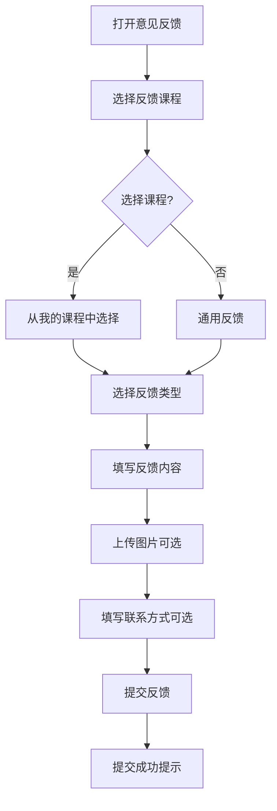

**显示规则**：
- 课程选择：仅显示用户已购买的课程
- 默认不选课程（通用反馈）
- 反馈类型根据是否选择课程动态调整：
  - 选择课程：课程内容/课程服务/讲师/场地
  - 未选课程：功能建议/问题反馈/投诉

#### 3.1.6.4 咨询预约
**功能描述**：预约一对一咨询服务

**业务流程**：
1. 选择咨询类型
2. 选择咨询时间
3. 填写咨询问题
4. 提交预约
5. 等待确认
6. 咨询完成后评价

#### 3.1.6.5 用户信息
**功能描述**：编辑个人资料

**可编辑字段**：
- 头像
- 昵称
- 性别
- 手机号
- 出生八字（年月日时）
- 从事行业
- 所在地区
- 个人简介
- **我的传播大使（推荐人）**（新增字段）

**推荐人字段说明**：
- 显示当前推荐人的昵称、头像和等级
- 可点击修改按钮选择其他传播大使
- 从传播大使列表中选择（**仅显示准青鸾及以上等级的大使**）
- **contract_signed=1 前可随时修改**
- contract_signed=1 后推荐人被永久确认，不可再修改
- 显示状态标识：
  - 未确认：显示"可修改"提示
  - 已确认：显示"已确认"标识，不可修改
- 修改频率限制：7天内只能修改一次（防止恶意刷单）

**推荐人修改规则**：
- 不能选择自己为推荐人
- 不能选择自己的下级为推荐人（防止循环推荐）
- **只能选择有效的传播大使（准青鸾及以上等级）**
- 所有修改记录后台可审计

#### 3.1.6.6 我的协议
**功能描述**：查看已签署的传播大使协议

**页面元素**：
- 协议列表
- 协议状态标识

**协议列表显示**：
- 协议名称
  - 《青鸾大使补充协议》
  - 《鸿鹄大使补充协议》
- 签署时间
- 协议状态（有效/已到期）
- 合同期限（开始时间-结束时间）
- 查看详情按钮

**协议详情页面**：
- 协议完整内容
- 签署信息：
  - 签署人姓名
  - 签署手机号
  - 签署时间
  - 签署IP地址
  - 签署设备信息
- 合同期限：
  - 合同开始时间
  - 合同结束时间
  - 剩余天数
- 下载协议（PDF格式）
- 打印功能

**协议状态说明**：
- **有效**：协议在合同期内
- **已到期**：协议已过期，需续签

**特殊说明**：
- 仅青鸾大使及以上等级可查看协议
- 准青鸾大使无协议记录
- 青鸾大使补充协议：合同期1年，到期需续签
- 鸿鹄大使补充协议：与原协议关联

#### 3.1.6.7 客服
**功能描述**：集中提供「意见反馈」「退款申请」、**联系客服（展示微信客服二维码）**等入口，文案与展示为**人工/工单客服导向**，不提供自动对话或智能问答形态，避免与「深度合成-AI 问答」类目产生误认。

**页面能力**：
- 快捷入口：意见反馈、退款（跳转既有页面）；**联系客服**（在页面会话区追加展示**常用客服**与**备用客服**两张微信二维码静态图，用户可长按识别或点击图片放大预览）
- 页面标题与「我的」入口均为「客服」，不使用「智能」「AI」「人工智能」等字样；底部输入条为引导占位，点击提示用户使用意见反馈或快捷入口

---

### 3.1.7 传播大使模块

#### 3.1.7.1 传播大使等级
**功能描述**：显示当前大使等级和权益

**显示内容**：
- 当前等级（普通学员/准青鸾大使/青鸾大使/鸿鹄大使/金凤大使）
- 等级图标和徽章
- 升级条件
- 权益说明
- 升级进度
- 申请按钮（普通学员已购买密训班时显示）
- 面试状态（申请后显示）
- 申请状态（准青鸾大使显示：待审核/已通过待签署/已拒绝）

**等级体系**：

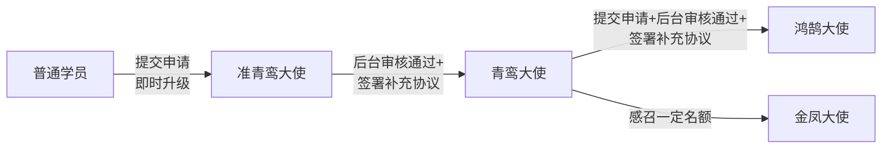

##### 普通学员
- 无推广权益
- **不能作为推荐人**
- 可通过购买密训班申请升级为准青鸾大使

##### 准青鸾大使

**成为条件（2026-03 更新：提交即升级，取消面试审核）**：
1. 购买密训班
2. 提交大使申请 → **即时升级为准青鸾（level=1）**
3. 申请记录状态为待审核（status=0），target_level=2（即后续升青鸾的申请）

**申请表单内容**：
- 真实姓名
- 手机号
- 微信号
- 所在城市
- 职业
- 为什么想成为传播大使
- 如何理解天道文化
- 是否愿意花时间帮助他人
- 预期推广计划

**权益**：
- **可以作为推荐人，但暂无推广奖励**
- 不获得功德分
- 不获得积分
- 可以生成推荐二维码（但推荐暂无奖励）
- **只能推荐初探班学员**（不能推荐密训班、咨询等其他课程）
- **升级为青鸾大使后，才能推荐其他课程的学员**

**升级流程（2026-03 更新：提交即升级为准青鸾）**：

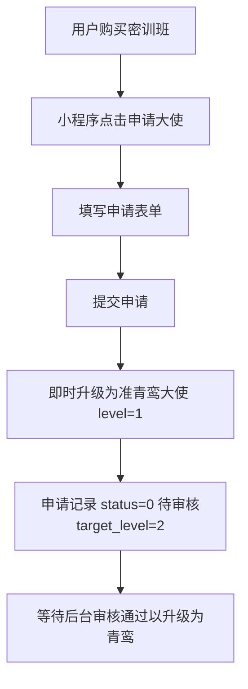

**申请状态显示**：
- 待提交：显示"申请成为大使"按钮
- 已提交（status=0）：用户已升级为准青鸾，申请待审核中
- 已通过（status=1）：审核通过，等待签署协议升级为青鸾
- 已拒绝（status=2）：显示拒绝原因，**准青鸾等级不回退**，可重新提交申请

**重要说明**：
- **提交申请即升级为准青鸾**，不再需要面试审核环节
- **驳回不回退**：申请被驳回后，用户保持准青鸾等级，不回退到普通学员
- **准青鸾大使可以作为推荐人，但暂无推广奖励**
- **只能推荐初探班学员**：
  - 如果学员购买密训班、咨询等其他课程，准青鸾无法作为推荐人
  - 系统会提示学员更换青鸾及以上等级的推荐人
- 虽然可以生成推荐码，但推荐学员购买课程时不会获得功德分和积分
- **升级为青鸾大使条件（已变更）**：后台审核通过（管理员设置冻结积分）→ 签署《青鸾大使补充协议》→ 自动升级为青鸾 + 发放冻结积分
- ~~支付1688元升级费~~（**已取消**，冻结积分改为后台人工设置）
- **升级为青鸾大使后，才能推荐密训班、咨询等其他课程的学员**
- 升级时不发放功德分

##### 青鸾大使

**成为条件（2026-03 更新：取消支付环节）**：
1. 已是准青鸾大使
2. 申请被后台审核通过（管理员设置冻结积分，可填0，须为单次解冻积分的整数倍）
3. 签署《青鸾大使补充协议》→ 自动升级为青鸾 + 发放冻结积分

**初始奖励**：
- 后台审核时管理员设置的冻结积分（推荐初探班成功后解冻）
- 不获得功德分

**推荐奖励机制**：

**第1次推荐初探班**：
- 解冻1688积分（可提现）
- 不获得功德分

**第2次及之后推荐**：
- 推荐初探班：30%功德分
- 推荐密训班：20%功德分
- 推荐咨询：20%功德分
- 不再解冻或获得积分

功德分使用：
1. 参加传播大使沙龙
2. 兑换咨询服务
3. 兑换第二年复训费
4. 兑换初探班和密训班课程
5. 兑换商城用品

**辅导员和义工奖励**（额外职责，非独立职位）：
- 所有大使都可以担任辅导员、参与义工
- 担任辅导员：获得功德分奖励
- 参与会务义工：获得功德分奖励
- 组织沙龙活动：获得功德分奖励
- 这是推荐之外的第二个功德分获得途径

**示例**：
```
升级为青鸾大使（取消支付，冻结积分由后台设置）：
- 后台审核通过时设置冻结积分1688 → 签署协议后发放
- 功德分：0

第1次推荐初探班（1688元）：
- 解冻积分：1688（可提现，积分池已空）
- 功德分：0

第2次推荐初探班（1688元）：
- 积分：0（积分池已空）
- 功德分：1688 × 30% = 506.4

第3次推荐密训班（38888元）：
- 积分：0
- 功德分：38888 × 20% = 7777.6

担任辅导员1次：
- 获得功德分：根据活动设定
- 积分：0
```

**重要说明**：
- ✅ 升级青鸾时冻结积分由后台审核时人工设置（~~支付1688元~~ 已取消）
- ✅ 第1次推荐初探班解冻积分（转为可提现）
- ✅ 第2次起推荐只获得功德分
- ✅ 功德分无上限，持续获得
- ✅ 所有大使都可以担任辅导员和义工获得功德分（额外途径）

**功德分获得途径**：
1. 推荐课程（第2次起）
2. 担任辅导员、参与义工、组织沙龙

**合同期**：1年

**升级流程（2026-03 更新：取消支付环节，后台审核+协议签署升级）**：

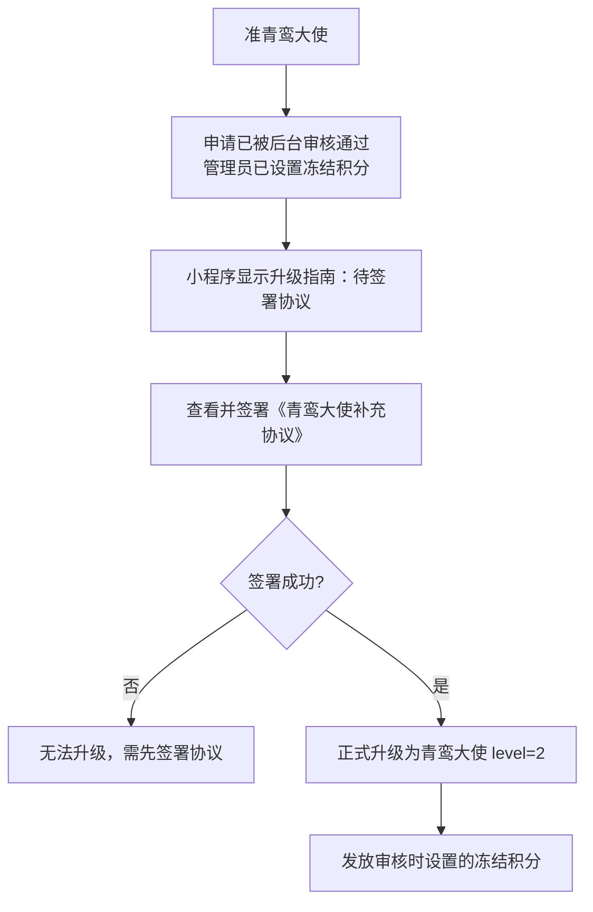

**电子协议签署**：
- **协议名称**：《青鸾大使补充协议》
- **签署时机**：后台审核通过后，用户在小程序签署协议完成升级
- **签署即升级**：签署提交后直接升级为青鸾（level=2），同时发放后台审核时设置的冻结积分
- **协议内容**：
  - 大使权利与义务
  - 功德分和积分规则
  - 推广行为规范
  - 合同期限（1年）
  - 续约规则
  - 违约责任
- **签署方式**：
  1. 后台审核通过后，用户在小程序升级指南中看到"待签署协议"
  2. 用户进入小程序查看协议全文
  3. 勾选"我已阅读并同意协议内容"
  4. 手写电子签名并提交
  5. 系统自动升级等级 + 发放冻结积分
- **签署记录**：协议签署后可在"我的协议"中查看
- **未签署影响**：未签署协议前，保持准青鸾等级

**协议说明**：
- 后台审核通过后才能签署《青鸾大使补充协议》
- 签署后直接升级为青鸾，无需支付
- 合同期从签署之日起计算1年
- 合同期内享有青鸾大使完整权益

##### 鸿鹄大使

**成为条件（2026-03 更新：取消支付环节）**：
1. 已是青鸾大使
2. 提交升级申请（target_level=3）
3. 后台审核通过（管理员设置冻结积分，可填0，须为单次解冻积分的整数倍）
4. 签署《鸿鹄大使补充协议》→ 自动升级为鸿鹄 + 发放冻结积分

**奖励机制：只发积分（推荐）+ 功德分（辅导员/义工）**

**推荐奖励（积分）**：

积分机制：
- 升级鸿鹄大使时获得：后台审核时管理员设置的冻结积分 + 名额（从 ambassador_level_configs 读取）
- 可提现积分初始为0
- 只有推荐初探班才解冻积分（冻结→可提现）
- 推荐其他课程直接加到可提现积分（不经过冻结）

**推荐初探班**（解冻机制）：
- 有冻结积分时：解冻1688积分（冻结-1688，可提现+1688）
- 冻结积分为0时：直接获得30%可提现积分

**推荐其他课程**（直接发放）：
- 推荐密训班：20%积分直接加到可提现积分
- 推荐咨询：20%积分直接加到可提现积分
- 推荐顾问：3%积分直接加到可提现积分
- 不消耗冻结积分，不受解冻限制

**辅导员和义工**：可担任辅导员、参与义工获得功德分（详见青鸾大使说明）

**示例**：
```
升级时：
- 冻结积分：16880
- 可提现积分：0

第1次推荐初探班（1688元）：
- 冻结积分：16880 - 1688 = 15192
- 可提现积分：0 + 1688 = 1688
- 功德分：0

第2次推荐密训班（38888元）：
- 冻结积分：15192（不变）
- 可提现积分：1688 + 7777.6 = 9465.6

第3次推荐初探班（1688元）：
- 冻结积分：15192 - 1688 = 13504
- 可提现积分：9465.6 + 1688 = 11153.6

第10次推荐初探班：
- 冻结积分：0（全部解冻完毕）
- 可提现积分：持续累加

第11次推荐初探班（1688元）：
- 冻结积分：0（已空）
- 可提现积分：+ 506.4（1688 × 30%直接加）

第12次推荐密训班（38888元）：
- 冻结积分：0
- 可提现积分：+ 7777.6（38888 × 20%直接加）

担任辅导员1次：
- 功德分：根据活动设定
- 积分：0
```

**重要说明**：
- ❌ 鸿鹄大使推荐不获得功德分
- ✅ 鸿鹄大使推荐只获得积分（解冻或直接发放）
- ✅ 所有大使都可以担任辅导员和义工获得功德分（额外途径）
- ✅ 解冻完10个名额后，按比例持续获得积分

**积分获得途径**：
1. 推荐初探班：解冻1688积分（有冻结时）或按30%发放（无冻结时）
2. 推荐其他课程：直接按比例加到可提现积分

**功德分获得途径**：
1. 担任辅导员、参与义工、组织沙龙（所有大使通用）

**合同期**：1年

**升级流程**：

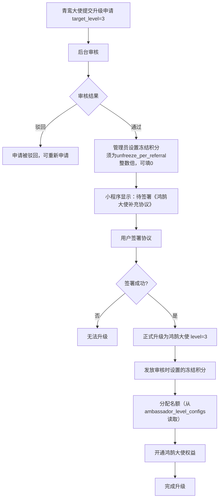

**电子协议签署**：
- **协议名称**：《鸿鹄大使补充协议》
- **签署时机**：后台审核通过后（管理员已设置冻结积分）
- **协议内容**：
  - 鸿鹄大使权益说明
  - 积分规则（冻结积分由后台审核时设置）
  - 名额分配规则（从 ambassador_level_configs 读取）
  - 推广责任与义务
  - 合同期续签（原合同基础上）
- **签署方式**：同青鸾大使签署方式
- **签署记录**：与原协议关联，可在"我的协议"中查看

##### 金凤大使

**成为条件**：
- 感召到一定名额可以成为金凤大使（具体条件待定）

**奖励机制：只发积分（推荐）+ 功德分（辅导员/义工）**

**推荐奖励（积分）**：
- 推荐初探班：50%积分（直接加到可提现积分）
- 推荐密训班：40%积分（直接加到可提现积分）
- 推荐咨询：30%积分（直接加到可提现积分）
- 推荐顾问：5%积分（直接加到可提现积分）

**辅导员和义工**：可担任辅导员、参与义工获得功德分（同其他大使）

**积分机制**：
- 冻结积分：具体额度待定
- 只有推荐初探班才解冻（冻结→可提现）
- 推荐其他课程直接按比例加到可提现积分
- 不消耗冻结积分

**班主任要求**：
1. 积极配合商学院工作
2. 不传播负面信息
3. 每月组织不低于3次沙龙

---

#### 3.1.7.2 功德分管理

**功能描述**：展示功德分明细和余额

**显示内容**：
- 功德分余额
- 累计获得
- 累计消耗
- 功德分明细记录

**功德分明细包括**：
- 时间
- 来源（推荐课程/辅导员/义工/沙龙活动）
- 订单号（如推荐）
- 学员信息（如推荐）
- 活动信息（如辅导员/义工）
- 获得功德分

**Tab 分类筛选**（2026-03-13 修复生效）：
- 全部：不筛选，显示所有明细
- 推荐：source IN (1, 2) — 推荐初探班/密训班获得功德分
- 活动：source IN (3, 4, 5, 7) — 辅导员/义工/沙龙/统筹/主持等活动岗位功德分
- 兑换：source = 6 — 兑换商品/课程的消费记录

**功德分兑换**：
- 兑换课程
- 兑换复训
- 兑换咨询服务
- 兑换商城用品

**功德分获得规则**：
- 无上限，持续发放
- 青鸾大使推荐：按课程价格比例获得功德分
- 鸿鹄及以上推荐：不获得功德分，只获得积分
- 所有大使（任何等级）担任辅导员/义工：获得功德分
  - 这是额外的功德分获得途径，不是独立职位
  - 所有大使都可以参与，推荐和辅导员/义工两个途径并行
- 功德分和积分不可同时发放（仅限推荐奖励）

**奖励计算流程**：

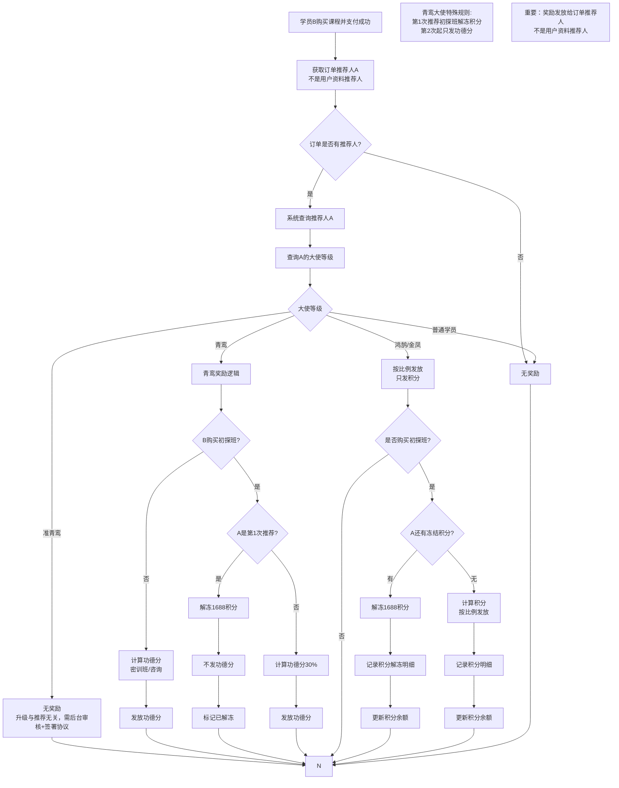

---

#### 3.1.7.3 积分管理

**功能描述**：展示积分明细、余额和提现功能

**显示内容**：
- 积分余额
- 冻结积分
- 可提现积分
- 累计提现
- 积分明细记录

**积分明细包括**：
- 时间
- 来源（升级大使/推荐解冻）
- 积分数量
- 状态（冻结/可提现/已提现）

**积分提现**：
- 查看可提现金额
- 提交提现申请（银行收款账户信息统一在「个人资料」页填写管理）
- 等待审核
- 提现到账

**变更说明（2026-03-23）**：银行收款账户信息从提现页面移至「个人资料」页统一管理，提现/退款/复训费退款三个场景共用。提现时系统自动从个人资料读取银行信息，无需每次重填。

**积分获得规则**：

**冻结积分机制**：
- 青鸾/鸿鹄大使：冻结积分由**后台审核时人工设置**，签署协议升级时发放（须为 `unfreeze_per_referral` 的整数倍，可填 0）
- 可提现积分初始为0
- 两个字段独立管理

**推荐初探班**：
- 有冻结积分时：解冻1688积分（冻结-1688，可提现+1688）
- 无冻结积分时：
  - 青鸾：只发功德分，不发积分
  - 鸿鹄：直接加30%到可提现积分

**推荐其他课程**（密训班/咨询/顾问）：
- 不消耗冻结积分
- 直接按比例加到可提现积分
- 青鸾：发功德分，不发积分
- 鸿鹄：按比例发积分到可提现字段

**重要**：功德分和积分不可同时发放

**积分解冻流程（推荐初探班）**：

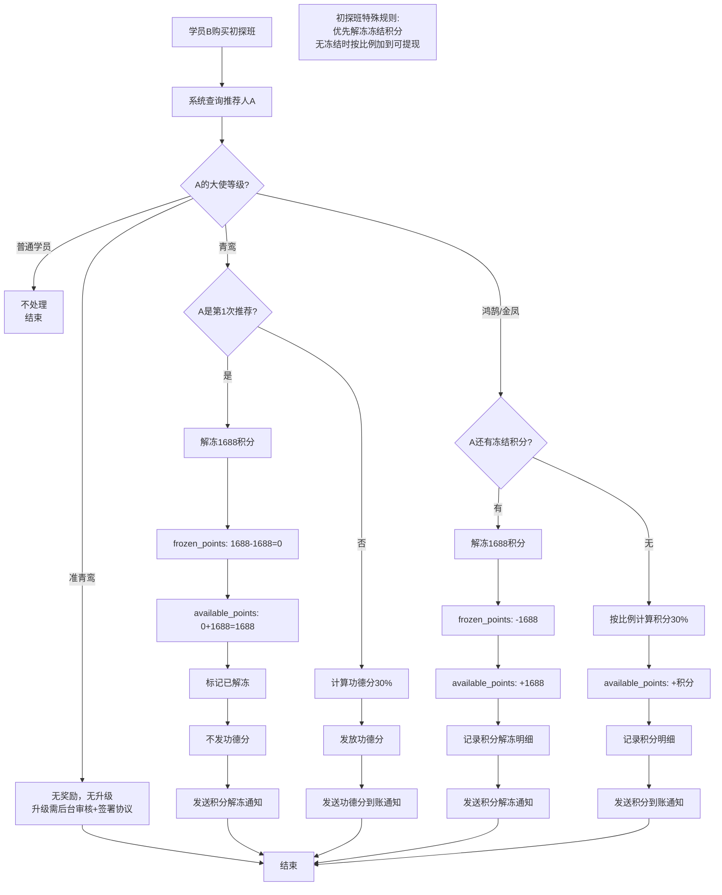

**推荐其他课程流程（密训班/咨询/顾问）**：

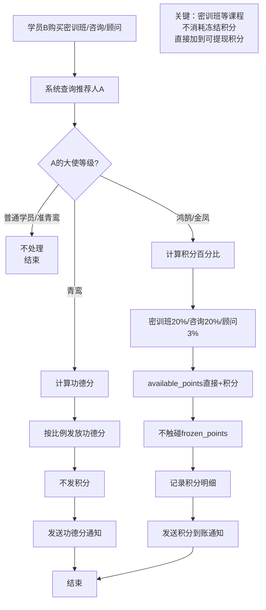

**提现流程**：

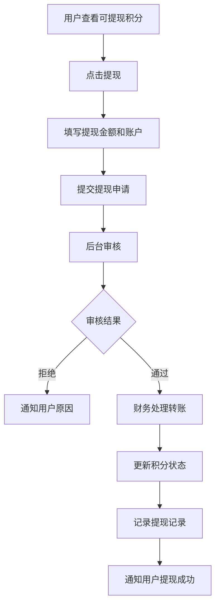

---

#### 3.1.7.4 推荐二维码
**功能描述**：生成专属推荐二维码

**生成资格**：
- **准青鸾及以上等级**才能生成推荐二维码
- 普通学员不显示此功能

**功能**：
- 生成带推荐人ID的小程序码
- 保存到相册
- 分享到微信好友/朋友圈
- 二维码统计（扫码人数、转化率）

**二维码包含信息**：
- 推荐人ID
- 推荐人昵称
- 推荐人等级
- 二维码有效期

**准青鸾大使提示**：
- 准青鸾大使生成二维码时显示提示：
  - "您当前为准青鸾大使，暂时只能推荐初探班学员"
  - "后台审核通过并签署《青鸾大使补充协议》后，将升级为青鸾大使"
  - "升级后可推荐所有课程"

#### 3.1.7.5 直接推荐人员信息
**功能描述**：查看直接推荐的学员和大使

**统计与列表规则（2026-03 更新）**：
- **"我推荐的"列表和所有推荐人数统计只计 contract_signed=1 的用户**（即签合同审核通过或初探班首次上课的用户）

**显示内容**：
- 推荐人数统计
  - 总推荐人数
  - 初探班人数
  - 密训班人数
  - 成为大使人数

**推荐列表**：
- 学员头像
- 学员昵称
- 购买课程
- 注册时间
- 累计消费
- 是否成为大使

---

#### 3.1.7.6 商城兑换

**功能描述**：大使使用功德分（或积分兜底）在商城兑换实物商品或课程续期

##### 商城商品列表

**显示内容**：
- 商品图片
- 商品名称
- 功德分价格（`merit_points_price`）
- 库存（`stock_quantity = -1` 表示无限库存）
- 已兑换数量

**交互规则**：
- 点击商品卡片：无响应（不跳转、不提示），仅"兑换"按钮可操作
- 点击"兑换"按钮：触发兑换流程

**筛选**：支持按商品类型筛选（实物商品 / 课程续期）

##### 兑换流程（三种情况）

| 情况 | 条件 | 行为 |
|------|------|------|
| 情况1：功德分足够 | `merit_points ≥ 总价` | 弹框确认"用功德分兑换"，后端只扣功德分 |
| 情况2：功德分不足但积分足够 | `merit_points < 总价` 且 `cash_points_available ≥ 总价` | 弹框提示"功德分不足，需用积分"，后端改用积分全额支付 |
| 情况3：两者均不足 | `merit_points < 总价` 且 `cash_points_available < 总价` | 前端直接提示"功德分或积分不够"，不调用接口 |

**重要说明**：
- 不走支付宝/微信支付流程
- 不创建 `orders` 表记录，直接创建 `mall_exchange_records` 记录
- 情况2中积分门槛是"积分 ≥ 全价"，而非"积分 ≥ 差额"

**兑换成功后**：
- 功德分/积分余额立即减少
- 生成兑换单号（`EX` 开头）
- 状态初始为"已兑换（待领取）"
- 持兑换单号到现场领取实物商品

##### 撤销兑换

**适用条件**：仅限 `status = 1`（已兑换/待领取）的订单，已领取(`status=2`)或已取消(`status=3`)不可撤销

**撤销后**：
- 功德分和积分全额退还
- 商品库存恢复
- 兑换记录状态变为"已取消"

##### 课程兑换（续期）

**功能**：使用积分兑换课程（延长课程有效期或获得新课程名额）

**交互规则**：
- 点击课程卡片：跳转到课程详情页（兑换模式），URL 携带 `from=exchange` 和 `pointsPrice` 参数
- 课程详情页（兑换模式）：
  - 价格区域显示"XXX积分"（替代"¥XXX"）
  - 积分充足时：按钮显示"立即兑换"，点击弹窗确认后调用 `exchangeCourse` 接口
  - 积分不足时：按钮显示"积分不足"，按钮禁用
- 兑换逻辑与商城页"兑换课程"按钮一致，调用 `OrderApi.exchangeCourse`

**可兑换对象**：
- 自己已购课程的第二年复训费
- 其他指定课程的名额

**业务规则**：
- 课程兑换仅使用积分（不使用功德分）
- 兑换价格 = `courses.current_price`（1元 = 1积分）
- 兑换成功后写入 `user_courses` 表，直接解锁课程

##### 兑换记录

**显示内容**：
- 兑换单号
- 商品名称
- 使用功德分 / 积分
- 总成本
- 兑换时间
- 状态（已兑换/已领取/已取消）
- 操作：撤销（仅已兑换状态可见）

---

#### 3.1.7.7 志愿活动

**功能描述**：大使可报名参与课程排期中的志愿岗位（辅导员、会务义工、统筹、主持等），活动结束后由管理员统一发放功德分奖励

##### 报名前置条件

- **用户必须先预约课程排期**（`appointments.status=0` 进行中）才能看到和报名该排期关联的活动
- 未预约该排期的用户，活动列表中不展示该活动，也无法报名

##### 可报名活动列表

**显示内容**：
- 排期名称（如"孙膑道·密训班 第3期"）
- 上课日期 / 地点
- 岗位列表（岗位名称、功德分奖励、剩余名额、最低等级要求）
- 是否已报名（`my_registration`）

**筛选条件**：
- 仅显示招募中（`status = 1`）且上课日期 > 今天的活动
- 当天起不可再报名
- **仅显示用户已预约（appointments.status=0）的排期所关联的活动**

**报名规则**：
- **同一活动内每人只能报名一个岗位**
- **允许跨活动报名多个**：用户可同时报名多个不同活动的岗位（取消"一人一活动"限制）
- 若岗位设有等级要求（`required_level`），用户大使等级必须达到
- 岗位剩余名额 > 0 才可报名
- 报名成功后 `registered_count + 1`
- **报名与预约关联**：`ambassador_activity_registrations` 表新增 `appointment_id` 字段，关联 `appointments.id`，报名时需传入用户对该排期的预约 ID

##### 报名流程

```
用户浏览活动列表（仅显示已预约排期的活动）→ 选择岗位 → 点击报名
→ 系统校验（等级/名额/是否已报该活动/是否已预约该排期） → 报名成功
→ ambassador_activity_registrations 写入 appointment_id
→ 活动结束后，管理员发放功德分
→ 功德分明细中显示"志愿活动-[岗位名称]"
```

##### 我的报名

- **入口**：在活动记录页面横幅右侧新增「我的报名」按钮
- **显示内容**：用户所有有效报名（status=1 已报名，且关联活动 status≠0 未结束）
- **操作**：支持取消报名
- **过滤规则**：活动结束（`status=0`）后，该活动的报名记录不显示在「我的报名」列表中（前端过滤）

##### 取消报名

- **仅活动 status=1（报名中）时可取消**；status=2（报名截止）后不可取消
- 活动结束（status=0）后，报名记录不展示在「我的报名」中
- 管理员已发功德分后不可取消
- 取消后名额恢复

##### 取消预约联动

- 若用户取消预约时，存在关联的活动报名（`ambassador_activity_registrations.appointment_id` 指向该预约），系统提示：**「您有该排期的活动报名，请先取消活动报名后再取消预约」**
- 用户需先取消活动报名，才能取消预约

##### 活动记录（历史）

**显示内容**：
- 活动名称 / 日期
- 担任岗位
- 状态（待确认 / 已发放）
- 获得功德分

**活动类型分布**（前端展示）：
- 从 4 项扩展为 6 项：辅导员、会务义工、沙龙组织、统筹、主持、其他
- 对应 `activity_type`：1 辅导员 / 2 会务义工 / 3 沙龙组织 / 4 其他 / 5 统筹 / 6 主持

**Tab 类型筛选**（前端 CapsuleTabs 组件）：
- 支持按活动类型筛选记录列表：全部 / 统筹 / 主持 / 辅导员 / 义工 / 沙龙 / 其他
- 前端参数名使用 `activityType`（camelCase），0=全部，1-6 对应各类型
- 2026-03-13 修复：参数名从 `activity_type` 改为 `activityType`，修复筛选无效的 Bug

---

## 3.2 后台管理系统功能

### 3.2.1 管理员登录
**功能描述**：后台管理员账号密码登录

**功能**：
- 用户名/手机号登录
- 密码加密存储
- 登录日志记录
- 权限验证
- Session管理

---

### 3.2.2 课程管理

#### 课程列表
**功能描述**：查看和管理所有课程

**列表显示**：
- 课程ID
- 课程名称
- 课程类型（初探班/密训班/咨询/顾问）
- 课程价格
- 复训价格
- 上架状态
- 创建时间
- 操作（编辑/删除/上下架）

#### 新增/编辑课程
**表单字段**：
- 课程名称
- 课程分类
- 课程封面图
- 课程详情图
- 课程简介
- 课程详细介绍（富文本）
- 课程大纲
- 讲师信息
- 课程时长
- 原价
- 现价
- 复训价格
- 是否允许复训
- 报名截止时间（相对开课时间，如：提前1天）
- 复训截止时间（默认：开课前3天）
- 购买限制（已取消，密训班可直接购买）
- 包含课程（多选，如密训班包含初探班）
- 库存数量
- 课程有效期（天数，**必填**，最小 1 天，最大 3650 天，默认 365 天）
- 排序
- 上架状态

**时间规则说明**：
- **报名截止时间**：超过此时间后，首次报名和复训都无法进行
- **复训截止时间**：开课前3天为复训截止时间
  - 开课前三天可以取消复训并退款
  - 到了开课前三天则不能取消和退款

**消息推送配置**：
- 是否启用消息提醒
- 提前天数（开课前几天发送）
- 发送时间（几点几分发送）
- 消息模板内容
- 推送对象（已报名学员/已购买学员）

**消息模板变量**：
- {学员姓名}
- {课程名称}
- {上课日期}
- {上课时间}
- {上课地点}
- {讲师名称}

---

### 3.2.3 学员管理

**功能描述**：管理所有注册学员

**列表显示**：
- 学员ID
- 头像
- 昵称
- 手机号
- 出生八字
- 从事行业
- 注册时间
- 推荐人
- 大使等级
- 累计消费
- 购买课程数
- 操作（查看详情/编辑/禁用）

**学员详情**：
- 基本信息
  - 头像、昵称
  - 真实姓名、手机号
  - 性别
  - 出生八字（年月日时）
  - 从事行业
  - 所在地区（省份、城市）
  - 个人简介
  - 注册时间
  - 推荐人（传播大使）
  - 大使等级
- 购买记录
- 上课记录
- 复训情况
- 直接推荐的学员列表
- 功德分明细
- 积分明细
- 预约记录

**权限管理**：
- 设置大使等级
- 手动调整功德分
- 手动调整积分
- 禁用/启用账号
- 修改推荐关系（特殊情况，需记录变更日志）

**推荐人管理**：
- 查看当前推荐人信息
- 推荐人状态（未确认/已确认）
- 推荐人确认时间
- 查看推荐人变更历史记录：
  - 变更时间
  - 原推荐人
  - 新推荐人
  - 变更类型（注册/用户修改/订单修改/管理员修改）
  - 变更来源
  - 关联订单（如有）
  - 变更IP和设备
  - 操作人
- 管理员修改推荐人（需填写原因，记录日志）

**复训管理**：
- 查看每个学员的复训情况
- 查看复训记录和上课次数统计

### 3.2.3.1 用户课程管理（2026-03-09 新增）

**功能描述**：查看和管理所有用户的课程记录，支持为老学员手动录入历史课程数据

**背景**：大量学员在小程序上线前已经购买和上过课，需要后台手动将他们的课程信息录入系统

**列表显示**：
- 用户ID、姓名、手机号
- 课程名称、课程类型
- 状态（有效/无效/已退款/已过期）
- 有效期截止日期
- 上课次数
- 合同签署状态
- 创建时间

**筛选条件**：
- 关键词（用户姓名/手机号）
- 课程筛选
- 状态筛选

**手动新增功能**：
- 搜索并选择用户（手机号搜索）
- 选择课程
- 设置剩余有效期（天数）
- 可选创建合同签署记录（若课程有合同模板则自动关联）
- 可选上传合同照片

**业务规则**：
- 同一用户同一课程不允许重复新增
- attend_count 默认为 1（视为已上过课的老学员）
- 不触发推荐人奖励
- 不关联订单，因此不可退款
- 不支持编辑和删除

---

### 3.2.4 上课记录管理

**功能描述**：登记每次课程的上课学员

**功能列表**：
1. 创建上课记录
2. 签到管理
3. 记录查询

#### 创建上课记录
**表单字段**：
- 课程名称
- 上课日期
- 上课时间
- 上课地点
- 讲师
- 课程期数
- **取消预约截止天数**（`cancel_deadline_days`）：必填正整数，表示用户可在上课前 X 天取消预约

**排期规则**（详见「复训费保留与取消预约机制」）：
- 排期新增后不可编辑，如需修改须取消后重新创建
- 取消排期时，该排期下所有待上课预约自动取消，复训预约触发资格保留

**自动触发功能**：
- 创建上课记录后，系统自动根据课程的消息提醒配置生成发送计划
- 如课程配置了"提前3天，10:00发送"，系统将自动在指定时间发送提醒

#### 签到管理（日签到系统，变更 2026-03）

**核心变更**：签到系统从"每预约签一次"改造为"按日签到"。

**适用范围**：
- **非沙龙课程**（初探班type=1/密训班type=2/咨询服务type=3）：按日签到，签到记录存入 `appointment_checkins` 表
- **沙龙课程**（type=4）：全自动流转，后台不支持手动签到/缺席操作

**非沙龙课程签到流程**：
1. 管理员在排期管理页面生成签到二维码
2. 每天上课时，学员扫码签到
3. 系统校验当天是否在 [class_date, class_end_date] 范围内
4. 校验当天是否已签到（防重复）
5. 在 `appointment_checkins` 插入一条当日签到记录
6. 签到不修改 `appointments.status`，也不修改 `user_courses.attend_count`

**后台每日签到管理**：
- 管理员在预约详情中查看每日签到记录（日期网格）
- 支持按日期「补签」或「取消签到」
- 补签记录标记为 `checkin_type=2`（后台手动补签）

**前端状态展示**（非沙龙课程）：
- `status=3` → 已取消
- `status=1` 或 `class_end_date < 今天` → 已结课
- `today_checked_in=true` → 今日已签到（绿色）
- `has_ever_checked_in=false` → 待上课（橙色）
- 其他 → 无标签

**attend_count 规则变更（2026-03-06 更新）**：
- `user_courses.attend_count` 表示"已结课次数"
- 排期结束时由定时任务判定：有签到记录 → status=1（已结课）+ attend_count+1，无签到记录 → status=4（缺席），attend_count 不变
- 创建预约、取消预约时均不影响 attend_count
- 沙龙课程为全自动流转，attend_count 不变更（沙龙免费，无需统计上课次数）

**同课程去重规则（2026-03-06 新增）**：
- 同一课程(course_id)只能有一个进行中(status=0)的预约
- 跨排期也受限，需先取消已有预约才能预约其他排期

**BUG 修复**：删除签到时解冻推荐人积分的逻辑（该逻辑与合同审批解冻重复）

#### 签到二维码管理（变更 2026-03）

**功能描述**：管理员为指定排期生成专用签到小程序码，学员扫码后完成当日签到

**变更说明**：
- 每个排期只保留一条签到码记录，重新生成时覆盖旧记录
- 新码生成后旧码自动失效
- 删除了签到码列表和删除功能（无需维护历史）

**生成流程**：
1. 选择排期（课程排期 `class_record_id`）
2. 点击"生成签到码"
3. 系统调用微信 `wxacode.getUnlimited` 生成小程序码
4. 如已有旧记录则覆盖更新，否则新增
5. 展示二维码图片，可下载打印

#### 排课状态自动更新（定时任务，变更 2026-03）

**触发方式**：每天 0 点自动触发（定时器，`cloudfunction.json` 配置）

**更新逻辑**：
1. 未开始(1) → 进行中(2)：`class_date ≤ 今天`
2. 沙龙自动签到：type=4 排期变为进行中时，appointments.status=0 → 1（自动签到）
3. 进行中(2) → 已结束(3)：`class_end_date < 今天`
4. 已结束排期中预约状态处理：
   - **沙龙(type=4)**：status=0(待上课) 或 status=1(已签到) → status=2（已结课）
   - **非沙龙**：有签到记录 → status=1（已结课）+ attend_count+1，无签到记录 → status=4（缺席）
5. 沙龙结束清理：硬删除已结束的沙龙排期和相关数据

---

### 3.2.5 订单管理

**功能描述**：管理所有课程购买订单

**列表显示**：
- 订单号
- 购买学员
- 课程名称
- 订单金额
- 支付状态
- 支付时间
- 推荐人
- 功德分
- 积分处理状态
- 操作（查看详情/退款）

**订单详情**：
- 订单基本信息
- 学员信息
- 课程信息
- 支付信息（支付方式、支付流水号）
- **推荐人信息**：
  - 推荐人昵称/手机号
  - 推荐人等级
  - 推荐人确认时间（contract_signed=1 时记录）
  - 是否最终确定（已支付订单均为已确定）
  - 查看推荐人详细资料
- 功德分分配记录
- 积分解冻记录
- 奖励发放状态（未发放/已发放）
- 奖励发放时间
- 退款信息（如有）

**订单筛选**：
- 按时间范围
- 按课程类型
- 按支付状态
- 按推荐人

**退款处理流程**：

> 📌 退款为纯人工财务转账流程，不调用微信退款 API。公司财务线下完成银行转账后，由管理员在后台上传转账发票并标记已转账，系统自动回滚业务数据。

```mermaid
flowchart TD
    A["小程序端：学员在"客服"页点击退款按钮"] --> A1["选择要退款的课程/订单"]
    A1 --> A2{"检查合同签署状态\nuser_courses.contract_signed"}
    A2 -->|已签合同| A3["提示：已签署学习合同，无法退款"]
    A2 -->|未签合同| A4["填写退款原因（必填）"]
    A4 --> A5["提交退款申请\norders.refund_status = 1"]
    A5 --> A6["退款状态页：显示"审核中""]

    A5 --> B["后台退款管理页：出现待审核记录"]
    B --> C{管理员审核}
    C -->|驳回| D["填写驳回原因\nrefund_status = 4"]
    D --> D1["小程序退款状态页显示"已驳回"及原因"]

    C -->|同意| E["财务线下银行转账给学员"]
    E --> F["管理员上传转账发票（必填）\n填写转账流水号（选填）"]
    F --> G["标记已转账\nrefund_status = 3\npay_status = 4"]
    G --> H["系统自动回滚业务数据：\n- 失效 user_courses（课程记录置为已退款）\n- 取消待上课预约\n- 大使升级订单：降回前一等级\n- 回退推荐人奖励（若已发放）"]
    H --> I["小程序退款状态页显示"退款成功""]
```

**退款状态枚举**：

| refund_status | 含义 | 小程序显示 | 后台显示 |
|---|---|---|---|
| 0 | 无退款 | — | — |
| 1 | 申请退款（待审核） | 退款申请中 | 待审核 |
| 2 | 退款失败（微信退款异常） | 退款失败（可重新申请） | 退款失败 |
| 3 | 已退款（财务已转账） | 退款成功 + 查看电子发票 | 已退款 |
| 4 | 已驳回 | 退款被驳回 + 驳回原因（可重新申请） | 已驳回 |

**退款页面 Tab 分栏（2026-03-03 新增）**：
- **未退款 Tab**：展示所有 `refund_status !== 3` 的已支付课程订单
  - `refund_status=0`：正常状态，可选中申请退款
  - `refund_status=1`：显示"退款申请中"标签，点击跳转退款详情页
  - `refund_status=2`：显示"退款失败"标签 + 失败提示，可重新选中申请
  - `refund_status=4`：显示"退款被驳回"标签 + 驳回原因，可重新选中申请
  - `contract_signed=1`：显示"已签合同"标签 + 锁图标，不可操作
- **已退款 Tab**：展示所有 `refund_status=3` 的订单
  - 显示"已退款"标签 + 退款金额
  - 如有电子发票（`invoice_url`），显示"查看电子发票"按钮
  - 不可选中，无法重新退款

**退款限制规则**：
- 订单 `pay_status` 必须为 1（已支付）方可申请
- 课程订单如已签署学习合同（`user_courses.contract_signed=1`），不可退款
- 同一订单审核中（`refund_status=1`）时无法重复提交
- 已退款（`refund_status=3`）无法再次申请
- 被驳回（`refund_status=4`）或退款失败（`refund_status=2`）可重新申请，重新申请时会清空之前的驳回原因

**后台退款管理功能**：
- 统计卡片：待审核数、已退款数、已驳回数、待退款总金额
- 列表展示：订单号、用户姓名/手机、退款金额、退款原因、申请时间、状态、操作
- 操作按钮：查看详情、标记已转账（status=1 时）、驳回（status=1 时）、查看发票（status=3 时）
- 批量操作：批量驳回、导出待退款列表（CSV）
- 标记已转账弹窗：上传转账发票（**必填**）、填写转账流水号（选填）

**订单统计**：
- 总销售额
- 各课程销售数量
- 销售趋势图
- 推荐转化率

---

### 3.2.6 大使管理

**功能描述**：管理传播大使信息、功德分和积分

#### 准青鸾大使申请管理

**功能描述**：管理学员提交的准青鸾大使申请

**申请列表显示**：
- 申请ID
- 申请人头像昵称
- 真实姓名
- 手机号
- 所在城市
- 申请时间
- 申请状态（待审核/已通过/已拒绝）
- 目标等级（target_level=2 升青鸾，target_level=3 升鸿鹄）
- 操作（查看详情/审核/设置冻结积分）

**申请详情页面**：
- 申请人基本信息（头像、昵称、真实姓名、手机号、微信号）
- 所在城市、职业
- 是否已购买密训班（系统自动检查）
- 购买记录（购买时间、金额）
- 申请原因
- 对天道文化的理解
- 是否愿意帮助他人
- 推广计划
- 审核操作区

**审核操作（2026-03 更新）**：
1. **通过申请**：
   - 点击"通过"
   - **手动设置冻结积分**（须为目标等级 `unfreeze_per_referral` 的整数倍，可填 0）
   - 状态变更为"已通过"
   - 发送通知，引导用户签署对应补充协议
   - 用户签署协议后正式升级并发放冻结积分

2. **拒绝申请**：
   - 填写拒绝原因
   - 发送拒绝通知
   - 状态变更为"已拒绝"
   - **准青鸾等级不回退**，用户保持准青鸾身份，可重新提交申请

**筛选功能**：
- 按申请状态筛选
- 按目标等级筛选（升青鸾/升鸿鹄）
- 按申请时间筛选
- 搜索姓名/手机号

**统计数据**：
- 总申请数
- 待审核数
- 通过率

#### 大使列表
**显示内容**：
- 大使ID
- 头像昵称
- 大使等级（准青鸾/青鸾/鸿鹄/金凤）
- 功德分余额
- 积分余额（可提现/冻结）
- 直接推荐人数
- 成为大使时间
- 操作（查看详情/编辑）

**准青鸾大使标识**：
- 列表中准青鸾大使特殊标识
- 显示申请状态：待审核/已通过待签署/已拒绝（可重新申请）
- 显示成为准青鸾的天数

#### 大使详情

**1. 大使基本信息**
- 姓名
- 手机号
- 微信号
- 大使等级
- 成为大使时间
- 合同到期时间

**2. 功德分信息**
- 功德分余额
- 累计获得功德分
- 累计兑换

**3. 积分信息**
- 总积分余额
- 可提现积分
- 冻结积分
- 累计提现
- 待审核提现

**4. 大使奖励核算**

显示每笔订单和活动带来的奖励：

**推荐订单奖励**：
- 订单时间
- 订单金额
- 购买学员
- 课程名称
- 奖励类型（功德分/积分）
- 奖励数量
- 积分解冻数量（鸿鹄及以上，如有）
- 状态（待发放/已发放/已取消）

**说明**：
- 青鸾大使：只显示功德分
- 鸿鹄及以上：只显示积分（解冻或直接发放）
- 密训班：按38888元计算奖励

**5. ~~赠送课程~~（2026-03-03 新增，2026-03-09 已隐藏）**

> ⚠️ **该功能已隐藏**：大使升级不再赠送名额，后台大使详情中的赠课名额区域和赠送课程按钮已隐藏。数据库表（ambassador_quotas、quota_usage_records）保留但不再写入新数据。如需恢复，在 `ambassador_level_configs` 表中配置 `gift_quota_basic`/`gift_quota_advanced` > 0 即可。

**6. 会务义工、辅导员活动记录**

记录大使参与活动情况：
- 活动日期
- 活动类型（辅导员/会务义工/沙龙组织/统筹/主持/其他）
- 活动名称
- 活动地点
- 奖励功德分
- 备注
- 记录时间

**添加活动记录**：
- 选择大使
- 选择活动类型
- 填写活动信息
- 设置奖励功德分
- 提交后自动发放功德分

**统计数据**：
- 累计参与次数
- 累计获得功德分
- 按活动类型分类统计

**6. 推荐学员和大使情况**

**推荐统计**：
- 直推学员数
- 直推大使数
- 各等级大使分布

**推荐学员列表**：

列表显示字段：
- 序号
- 学员头像
- 学员昵称
- 手机号
- 注册时间
- 大使等级（普通学员/准青鸾/青鸾/鸿鹄/金凤）
- 购买课程数
- 累计消费金额
- 为该大使带来的功德分
- 为该大使带来的解冻积分
- 状态（正常/已禁用）

**筛选功能**：
- 按大使等级筛选
- 按注册时间筛选
- 按消费金额排序
- 搜索学员昵称/手机号

**操作功能**：
- 查看学员详细信息
- 查看学员的购买记录
- 导出推荐学员列表

#### 功德分管理
**功能**：
- 手动调整功德分
- 功德分兑换审核
- 功德分冻结/解冻

#### 积分管理与提现审核

**功能**：
- 手动调整积分
- 手动冻结/解冻积分
- 积分提现审核
- 查看提现记录

**提现列表显示**：
- 提现单号
- 用户姓名 / 手机号
- 提现金额
- 收款方式（微信/支付宝/银行卡）
- 收款账户
- 申请时间
- 状态（待审核 / 已转账 / 已驳回）
- 操作（标记已转账 / 驳回）

**积分提现审核流程（完整版）**：

```mermaid
flowchart TD
    A[用户提交提现申请] --> B[后台查看待审核列表]
    B --> C[查看申请详情]
    C --> D{审核判断}
    D -->|驳回| E[填写驳回原因]
    E --> F[积分从"提现中"退回"可提现"]
    F --> G[通知用户已驳回]
    D -->|通过并线下转账| H[财务线下完成转账]
    H --> I[后台点击"标记已转账"]
    I --> J[上传转账凭证截图]
    J --> K[记录转账时间]
    K --> L[提现中积分清零]
    L --> M[通知用户到账]
```

**标记已转账操作**：
1. 找到对应提现申请
2. 点击"标记已转账"
3. 上传银行/微信/支付宝转账截图凭证
4. 确认提交
5. 系统：
   - 更新提现状态为"已转账"
   - 记录处理管理员 ID 和处理时间
   - 将"提现中积分"清零（不退回可提现，直接减掉）
   - 发送"提现到账"微信通知给用户

**驳回操作**：
1. 点击"驳回"
2. 填写驳回原因（必填）
3. 确认提交
4. 系统：
   - 更新状态为"已驳回"
   - 将"提现中积分"全额退回"可提现积分"
   - 发送"提现驳回"通知给用户，包含驳回原因

**业务约束**：
- 同一用户有"待审核"提现时，不允许再次申请
- 管理员不可对"已转账"或"已驳回"记录再次操作
- 积分退回不产生额外手续费

---

#### 兑换记录管理

**功能描述**：管理员查看所有大使的商城兑换记录，并在现场核对后确认领取

**兑换记录列表**：

| 字段 | 说明 |
|------|------|
| 兑换单号 | `EX` 开头的唯一编号，用于现场核对 |
| 用户姓名 / 手机号 | 用于现场核实身份 |
| 商品名称 | 兑换的商品 |
| 使用功德分 | 扣减的功德分数量 |
| 使用积分 | 扣减的积分数量（兜底时） |
| 总成本 | 功德分 + 积分合计 |
| 状态 | 已兑换（待领取）/ 已领取 / 已取消 |
| 兑换时间 | |
| 操作 | "确认领取"（仅待领取状态可用） |

**筛选功能**：
- 按状态筛选（待领取/已领取/已取消）
- 搜索用户姓名或兑换单号

**确认领取操作**：
1. 用户持兑换单号到现场
2. 管理员在列表中找到对应记录
3. 核对用户身份（姓名/手机尾号）
4. 点击"确认领取"，可填写备注
5. 系统将状态从"已兑换"改为"已领取"，记录操作管理员和时间

**约束**：
- 已领取记录不可再次操作
- 已取消记录不可操作（用户已撤销兑换）

---

#### 大使等级配置管理

**功能描述**：动态配置各等级大使的奖励比例、冻结积分额度、升级费用等参数。**所有奖励计算均从此表动态读取，不得硬编码。**

**配置字段说明**：

| 字段 | 说明 | 业务影响 |
|------|------|---------|
| `level_name` | 等级名称 | 显示用 |
| `merit_rate_basic` | 推荐初探班功德分比例 | 奖励计算，与 `cash_rate_basic` 互斥 |
| `merit_rate_advanced` | 推荐密训班功德分比例 | 奖励计算，与 `cash_rate_advanced` 互斥 |
| `cash_rate_basic` | 推荐初探班积分比例 | 奖励计算，与 `merit_rate_basic` 互斥 |
| `cash_rate_advanced` | 推荐密训班积分比例 | 奖励计算，与 `merit_rate_advanced` 互斥 |
| `frozen_points` | 等级配置参考值；**实际冻结积分由后台审核时人工设置**，须为 `unfreeze_per_referral` 的整数倍（0 跳过校验） | 大使升级 |
| `unfreeze_per_referral` | 每次推荐初探班解冻的固定积分额 | 推荐奖励触发解冻 |
| `upgrade_payment_amount` | 已废弃（2026-03 取消支付环节） | — |
| `gift_quota_basic` | ~~升级赠送初探班名额数~~（2026-03-09 已隐藏，当前全部为 0） | — |
| `gift_quota_advanced` | ~~升级赠送密训班名额数~~（2026-03-09 已隐藏，当前全部为 0） | — |
| `can_earn_reward` | 是否可获得推荐奖励（0/1） | 奖励发放前置判断 |
| `apply_questions` | 大使申请页动态问题列表（JSON：`[{question, is_required}]`） | 后台「等级配置 → 申请列表文案」维护；每项可开关「必填」；小程序按 `is_required` 显示红色星标并校验；历史数据无 `is_required` 时行为与旧版一致（仅第一题必填） |

**保存时校验规则（前后端双重校验）**：

1. `merit_rate_basic` 和 `cash_rate_basic` 不能同时 > 0（功德分和积分互斥）
2. `merit_rate_advanced` 和 `cash_rate_advanced` 不能同时 > 0
3. `unfreeze_per_referral > 0` 时，`frozen_points` 必须是其整数倍

**示例**：

| 等级 | merit_rate_basic | cash_rate_basic | frozen_points | unfreeze_per_referral |
|------|-----------------|-----------------|---------------|----------------------|
| 青鸾（level=2） | 0.30 | 0（与merit互斥） | 1688 | 1688 |
| 鸿鹄（level=3） | 0（与cash互斥） | 0.30 | 16880 | 1688 |

**奖励发放优先级**：
1. `can_earn_reward = 0` → 无奖励（结束）
2. 推荐初探班时，推荐人还有冻结积分 → 解冻 `unfreeze_per_referral`，不发功德分/积分
3. 否则，按比例发 `merit_rate` 或 `cash_rate`（二选一）

---

#### 志愿活动管理

**功能描述**：管理员基于已有课程排期创建志愿活动，设置岗位和名额，活动结束后统一发放功德分

##### 岗位类型管理

**功能**：
- 查看岗位类型列表（名称、默认功德分、最低等级要求、状态）
- 新增岗位类型：
  - 岗位名称（唯一）
  - 最低大使等级要求（可选）
  - 默认功德分（可覆盖）
  - 描述
  - 排序值
- 编辑 / 停用岗位类型

**固定岗位规则**（辅导员、会务义工、沙龙组织、统筹、主持）：
- 对应小程序「活动记录」页的「活动类型分布」前五项（辅导员、会务义工、沙龙组织、统筹、主持）
- **不可删除**：后台岗位设置中不显示删除按钮，接口也会拦截
- **不可修改名称**：编辑时岗位名称输入框禁用
- 用户参与固定岗位时，次数分别计入对应类型（activity_type：1 辅导员 / 2 会务义工 / 3 沙龙组织 / 5 统筹 / 6 主持）
- 其他新增岗位均归入「其他活动」（activity_type=4）

**内置岗位参考**（初始化数据）：

| 岗位名称 | 最低等级 | 默认功德分 | 是否固定 | activity_type |
|---------|---------|-----------|---------|----------------|
| 辅导员 | 青鸾 | 100 | 是 | 1 |
| 会务义工 | 准青鸾 | 80 | 是 | 2 |
| 沙龙组织 | 青鸾 | 150 | 是 | 3 |
| 统筹 | 待配置 | 待配置 | 是 | 5 |
| 主持 | 待配置 | 待配置 | 是 | 6 |
| 其他 | 无限制 | 50 | 否 | 4 |

##### 活动列表

**显示内容**：
- 排期名称 / 日期 / 地点
- 岗位数量 / 总名额 / 已报名人数
- 功德分是否已发放
- 活动状态（招募中 / 已结束）
- 操作：查看报名详情 / 发放功德分

##### 创建志愿活动

1. 选择课程排期（`schedule_id`）
2. 添加一个或多个岗位：
   - 选择岗位类型
   - 设置本次名额（`quota`）
   - 设置本次功德分奖励（可覆盖岗位类型默认值）
3. 确认创建
4. 大使端即可看到此活动

##### 查看报名人员

**显示内容**：
- 大使姓名 / 等级
- 报名岗位
- 报名时间
- 状态（已报名 / 已取消）

##### 手动添加活动人员

**功能描述**：管理员可手动为活动添加人员，无需用户自行报名

**操作流程**：
1. 搜索用户（支持姓名/手机号）
2. 选择岗位
3. 确认添加
4. 系统自动创建报名记录，并**自动创建用户对该排期的预约**（`appointments` 表）

**业务规则**：
- 若用户已有该排期的预约，则直接使用该预约 ID 关联报名
- 若用户无该排期预约，则先创建预约再创建报名记录
- 需满足岗位的等级要求、名额限制

##### 发放功德分

**触发条件**：活动结束后（排课日期已过），管理员手动发放

**操作**：
1. 进入活动详情
2. 确认报名人员列表
3. 点击"发放活动功德分"
4. 系统按每人报名岗位的功德分金额批量发放
5. 活动状态更新为"已结束"，`merit_distributed = 1`

**约束**：
- 暂无报名记录时提示"暂无报名记录，无法发放"
- 已发放后不可重复发放
- 发放后大使功德分明细中显示"志愿活动-[岗位名称]"

#### 大使升级
**功能**：
- 审核大使升级申请（准青鸾→青鸾、青鸾→鸿鹄）
- 审核通过时**手动设置冻结积分**（须为目标等级 `unfreeze_per_referral` 的整数倍，可填 0）
- 查看准青鸾大使申请状态
- 手动升级大使等级（特殊情况）
- 设置合同期
- 签署协议后发放冻结积分
- 分配名额（鸿鹄大使、金凤大使）

**准青鸾大使申请审核流程（2026-03 更新）**：

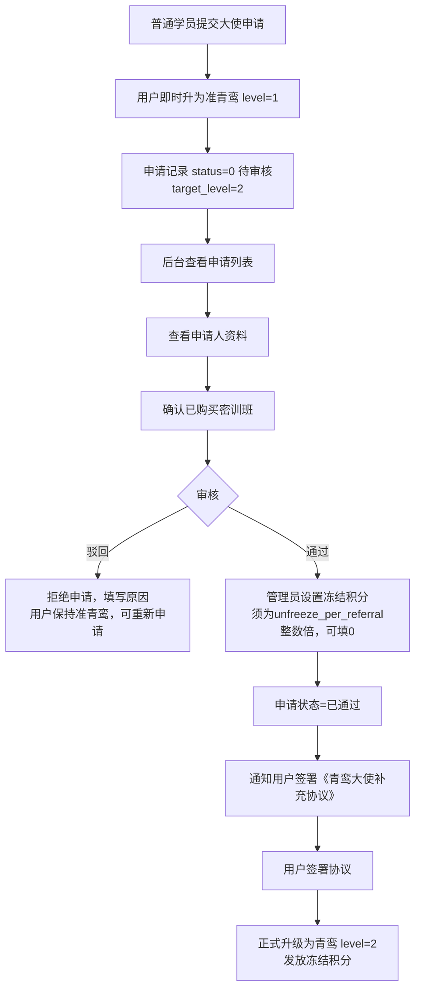

**准青鸾→青鸾升级流程**：
- 普通学员提交申请后**即时升为准青鸾**，无需等待审核
- 后台审核通过时，管理员**手动设置冻结积分**（可填 0，须为单次解冻积分的整数倍）
- 用户签署《青鸾大使补充协议》后正式升级为青鸾，同时发放冻结积分
- **已取消**：支付 1688 元升级费环节

**青鸾→鸿鹄升级流程**：
- 青鸾大使提交升级申请（target_level=3）
- 后台审核通过时，管理员手动设置冻结积分
- 用户签署《鸿鹄大使补充协议》后正式升级为鸿鹄，同时发放冻结积分
- **已取消**：支付 9800 元升级费环节

---

### 3.2.7 消息提醒管理

**功能描述**：管理课程提醒消息的发送

#### 消息提醒配置

**功能**：
- 查看所有课程的消息提醒配置
- 编辑消息提醒规则
- 查看消息发送记录
- 手动触发消息发送

**配置项**：
- 课程名称
- 是否启用
- 提前天数
- 发送时间
- 消息模板
- 推送状态（启用/禁用）

#### 消息发送记录

**列表显示**：
- 发送时间
- 课程名称
- 上课日期
- 接收学员数
- 发送成功数
- 发送失败数
- 状态（待发送/发送中/已完成/失败）
- 操作（查看详情/重新发送）

**发送详情**：
- 学员列表
- 发送状态（成功/失败）
- 失败原因
- 消息内容

**消息发送流程**：

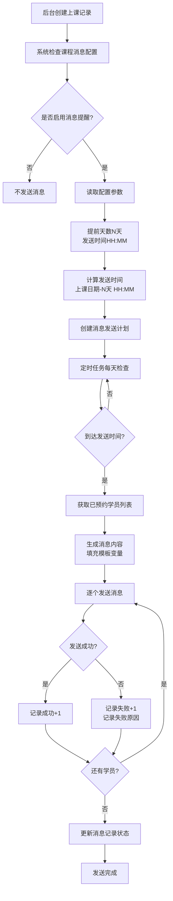

#### 消息推送规则

**业务规则**：
1. 系统每天定时检查即将开课的课程
2. 根据课程设置的提前天数和时间自动发送提醒
3. 仅向已预约该课程的学员发送
4. 支持小程序订阅消息
5. 记录每次发送的详细日志

**示例**：
```
课程：初探班第10期
上课时间：2024-12-25 09:00
提醒设置：提前3天，每天10:00发送

发送计划：
- 2024-12-22 10:00 发送第一次提醒
- 2024-12-23 10:00 发送第二次提醒  
- 2024-12-24 10:00 发送第三次提醒
```

#### 手动发送消息

**功能**：
- 选择课程
- 选择目标学员（全部/部分）
- 自定义消息内容
- 立即发送或定时发送

---

### 3.2.8 系统管理

#### 后台用户管理
**功能描述**：管理后台管理员账号

**功能列表**：
- 添加管理员
- 编辑管理员信息
- 删除管理员
- 角色权限管理
- 操作日志查看

**字段**：
- 用户名
- 真实姓名
- 手机号
- 角色（超级管理员/课程管理员/订单管理员/客服）
- 状态
- 最后登录时间

#### 角色权限管理

**功能说明**：在管理员管理页面新增"角色管理" Tab，支持角色的增删改查及页面级权限配置。

**业务规则**：

1. **角色体系**
   - 系统内置 3 个角色：超级管理员（super_admin）、管理员（admin）、操作员（operator），不可删除
   - 支持创建自定义角色（如"财务"、"课程编辑"等），可编辑和删除
   - 超级管理员始终拥有全部权限，权限配置不可修改

2. **权限粒度**
   - 页面级别的查看权限控制
   - 权限结构为两级：一级为功能板块（用户管理、订单管理等），二级为具体页面（与侧边栏菜单一一对应）

3. **权限编辑**
   - 使用树形复选框编辑每个角色可查看的页面
   - 勾选一级板块自动全选/取消该板块下所有二级页面
   - 部分勾选时一级板块显示半选状态

4. **权限生效**
   - 登录时从角色表获取权限列表，存入 localStorage
   - 侧边栏仅显示有权限的菜单项
   - 无权限页面访问时自动跳转到 dashboard

5. **角色下拉框**
   - 管理员新增/编辑弹窗中的角色下拉框从数据库动态获取
   - super_admin 角色仅当前登录者也是超级管理员时才可选

6. **删除限制**
   - 系统内置角色不可删除
   - 有管理员正在使用的角色不可删除

#### 推荐人变更审计
**功能描述**：审计和监控推荐人变更记录，防止恶意刷单

**列表显示**：
- 变更时间
- 用户昵称/手机号
- 原推荐人
- 新推荐人
- 变更类型（注册/用户修改/订单修改/管理员修改）
- 变更来源（用户资料/订单页/后台）
- 关联订单号
- 变更IP地址
- 变更设备
- 操作人
- 状态（正常/异常）

**筛选功能**：
- 按变更时间范围筛选
- 按变更类型筛选
- 按用户搜索
- 按推荐人搜索
- 按异常状态筛选

**异常检测规则**：
- 同一用户7天内修改超过1次：标记为异常
- 同一用户频繁在不同推荐人之间切换：标记为高风险
- 同一IP短时间内多个用户修改推荐人：标记为可疑
- 同一推荐人短时间内被大量设置：标记为刷单嫌疑

**操作功能**：
- 查看详情
- 标记异常
- 冻结用户
- 导出记录
- 统计分析

**统计数据**：
- 今日变更次数
- 本周变更趋势
- 异常变更占比
- 高频变更用户Top10
- 高频被选推荐人Top10

#### 通知公告管理
**功能**：
- 发布通知公告
- 编辑/删除公告
- 设置重要公告
- 公告置顶

#### 系统设置
**功能**：
- 小程序基本信息
- 客服联系方式
- 支付配置
- 复训规则设置
- 功德分规则设置
- 积分规则设置
- 分佣比例配置

#### 协议模板管理
**功能描述**：管理传播大使电子协议模板

**协议模板列表**：
- 模板ID
- 协议名称
- 协议类型（传播大使合作/补充协议）
- 版本号
- 状态（启用/停用）
- 创建时间
- 最后修改时间
- 操作（编辑/预览/停用）

**协议模板类型**：
1. 《青鸾大使补充协议》（准青鸾升级青鸾时签署）
2. 《鸿鹄大使补充协议》（青鸾升级鸿鹄时签署）

**编辑协议模板**：
- 协议名称
- 协议内容（富文本编辑器）
- 版本号（自动生成）
- 生效时间
- 变量标签支持：
  - {用户姓名}
  - {手机号}
  - {签署日期}
  - {合同开始日期}
  - {合同结束日期}
  - {大使等级}

**协议版本管理**：
- 查看历史版本
- 版本对比
- 恢复到某个版本
- 新版本自动编号

**业务规则**：
- 每次修改协议内容自动生成新版本
- 新版本从生效时间起对新签署生效
- 已签署的协议不受新版本影响
- 停用的协议不可用于新签署

---

### 3.2.9 协议签署管理

**功能描述**：管理和查询电子协议签署记录

**2026-03-06 变更**：
- **取消**：合约审核页面（contract-audit）
- **新增**：「录入合约」Tab：管理员选择用户、课程，上传线下合同照片，录入后自动激活课程有效期、触发推荐人奖励

#### 协议签署记录列表

**列表显示**：
- 签署ID
- 用户昵称/手机号
- 协议名称
- 协议类型
- 协议版本
- 签署时间
- 关联订单号（如有）
- 签署IP地址
- 签署设备
- 协议状态（有效/已到期/已作废）
- 操作（查看详情/导出）

**筛选功能**：
- 按协议类型筛选
- 按签署时间范围筛选
- 按协议状态筛选
- 搜索用户姓名/手机号
- 搜索订单号

**签署详情**：
- 用户信息：头像、昵称、真实姓名、手机号
- 协议信息：
  - 协议名称
  - 协议版本号
  - 协议完整内容（带用户信息填充）
- 签署信息：
  - 签署时间
  - 签署IP地址
- 合同照片：
  - 展示已上传的线下合同照片缩略图（可点击放大）
  - 支持"补充照片"上传，追加到已有照片列表（2026-03-13 新增）
- 电子合约文件：
  - 若有电子合约文件，显示"查看电子合约"链接
  - 签署设备信息（型号、系统版本）
  - 签署确认方式（手机号后四位）
- 关联信息：
  - 关联订单号（如有）
  - 关联课程（如有）
  - 大使等级（如有）
  - 合同期限（传播大使协议）
- 操作：
  - 导出PDF
  - 打印协议
  - 作废协议（特殊情况）

**统计数据**：
- 各类协议签署总数
- 今日新增签署数
- 本月签署趋势图
- 即将到期协议数（传播大使协议）

#### 协议到期提醒

**功能描述**：管理传播大使合作协议到期提醒

**提醒列表**：
- 大使姓名/昵称
- 大使等级
- 合同开始时间
- 合同到期时间
- 距离到期天数
- 续签状态（未续签/已续签）
- 操作（发送提醒/手动续签）

**提醒规则**：
- 到期前30天显示预警
- 到期前7天发送提醒通知
- 到期当天再次提醒
- 已续签的不再提醒

**手动续签操作**：
- 选择大使
- 确认续签1年
- 系统自动更新合同结束时间
- 发送续签成功通知

---

### 3.2.10 反馈管理

**功能描述**：管理用户提交的意见反馈

#### 反馈列表

**列表显示**：
- 反馈ID
- 用户昵称/手机号
- 反馈课程（显示课程名称，无课程显示"通用反馈"）
- 反馈类型（功能建议/课程内容/课程服务/讲师/场地/问题反馈/投诉）
- 反馈内容（简略显示前50字）
- 图片数量
- 状态（待处理/处理中/已处理/已关闭）
- 提交时间
- 操作（查看详情/回复/标记处理/关闭）

**筛选功能**：
- 按反馈类型筛选
- 按处理状态筛选
- 按课程筛选
- 按时间范围筛选
- 搜索用户昵称/手机号

**统计信息**：
- 待处理数量
- 今日新增反馈
- 本周反馈数量
- 各类型反馈占比

#### 反馈详情

**显示内容**：
- 用户信息：头像、昵称、手机号
- 反馈课程：课程名称（如有）
- 反馈类型
- 反馈内容
- 图片查看（大图预览）
- 联系方式
- 提交时间
- 处理状态
- 处理记录：
  - 状态变更记录
  - 处理人
  - 处理时间

**操作功能**：
- 回复反馈（填写回复内容）
- 更改状态（待处理→处理中→已处理→已关闭）
- 标记重要
- 导出反馈记录
- 转发相关部门

**处理流程**：

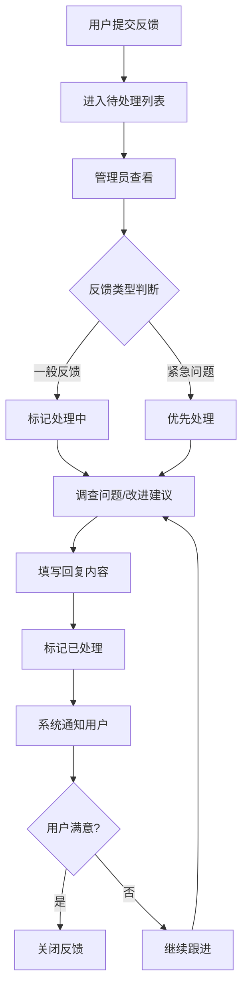

#### 课程反馈统计

**功能描述**：统计各课程的反馈情况

**显示内容**：
- 课程名称
- 反馈总数
- 好评数（课程内容/服务类型且已处理）
- 问题数（问题反馈/投诉类型）
- 待处理数
- 满意度评分（根据反馈类型和处理情况计算）

**用途**：
- 发现课程质量问题
- 改进课程内容和服务
- 评估讲师表现
- 优化场地安排

---

### 3.2.11 表现分与评估名单

#### 功能概述

表现分是独立于功德分的评估体系，用于记录学员在各岗位活动中的表现加分，以及因缺席课程或活动的扣分。当扣分累计超过阈值时，管理员可对学员执行拉黑操作，限制其在一定时间内无法预约课程或报名活动。

#### 业务规则

##### 加分规则
- 管理员在用户列表或评估名单页面对学员手动加分
- 加分需选择岗位类型（辅导员、会务义工、沙龙组织、统筹、主持、其他等），从 ambassador_position_types 动态获取
- 管理员自由决定加分分值和备注

##### 扣分规则
- 管理员手动输入扣分，扣分类型分为"学员扣分"和"活动扣分"两种
- 管理员自由决定扣分分值和备注
- 系统自动以负数存储扣分值

##### 拉黑规则
- 当学员扣分累计低于"学员扣分阈值"（默认 -30），评估名单页面显示"拉黑课程"按钮
- 当活动扣分累计低于"活动扣分阈值"（默认 -20），评估名单页面显示"拉黑活动"按钮
- 拉黑课程：学员在拉黑月数内（默认3个月）无法预约上课，小程序端提示"因为你多次缺席，X月内无法报名复训，请和客服联系"
- 拉黑活动：学员在拉黑月数内（默认2个月）无法报名活动，小程序端提示"因为你多次缺席活动参与，X月内无法报名活动，请和客服联系"
- 管理员可随时解除拉黑，解除后学员恢复正常使用

##### 阈值配置
- 管理员可在评估名单页面设置：学员扣分阈值、课程拉黑月数、活动扣分阈值、活动拉黑月数
- 阈值为负数，表示累计扣分低于该值时触发拉黑条件

#### 管理后台页面

##### 用户列表页（已有页面增强）
- 操作列新增"加分"和"扣分"两个按钮
- 加分弹窗：选择岗位类型 + 输入分值 + 备注
- 扣分弹窗：选择扣分类型（学员扣分/活动扣分）+ 输入分值 + 备注

##### 评估名单页（新增页面）
- 展示所有用户在每个岗位的加分总和，以及所有岗位的加分总计
- 展示每个用户的学员扣分和活动扣分累计
- 课程/活动状态列显示：正常、可拉黑、已拉黑
- 操作列：加分、扣分、拉黑课程/解除、拉黑活动/解除
- 阈值设置按钮：配置扣分阈值和拉黑月数

#### 小程序前端拦截
- 预约确认页：调用 createAppointment 被拦截时，以弹窗（showModal）展示拉黑提示信息
- 活动报名页：调用 applyForActivity 被拦截时，以弹窗（showModal）展示拉黑提示信息

---

## 四、数据库设计

### 4.1 数据库关系图

```mermaid
erDiagram
    users ||--o{ orders : "购买"
    users ||--o{ user_courses : "拥有"
    users ||--o{ merit_points_records : "获得功德分"
    users ||--o{ cash_points_records : "积分记录"
    users ||--o{ withdraw_records : "提现记录"
    users ||--o{ attendance_records : "签到"
    users ||--o{ appointments : "预约"
    users ||--o{ referee_relations : "推荐关系"
    users ||--o{ contract_signatures : "签署协议"
    
    courses ||--o{ orders : "被购买"
    courses ||--o{ user_courses : "包含"
    courses ||--o{ class_records : "开班"
    courses ||--o{ course_notification_configs : "消息配置"
    
    orders ||--o{ merit_points_records : "产生功德分"
    orders ||--o{ cash_points_records : "积分变动"
    
    class_records ||--o{ attendance_records : "学员签到"
    class_records ||--o{ appointments : "被预约"
    class_records ||--o{ notification_logs : "消息提醒"
    
    notification_logs ||--o{ notification_details : "发送明细"
    users ||--o{ notification_details : "接收消息"
    
    user_courses ||--o{ attendance_records : "上课记录"
    user_courses ||--o{ appointments : "课程预约"
    
    contract_templates ||--o{ contract_signatures : "签署"
    
    users {
        int id PK
        string openid
        string nickname
        int referee_id FK
        int ambassador_level
        decimal merit_points
        decimal cash_points_frozen
        decimal cash_points_available
    }
    
    courses {
        int id PK
        string name
        int type
        decimal current_price
    }
    
    class_records {
        int id PK
        int course_id FK
        decimal retrain_price
    }
    
    orders {
        int id PK
        string order_no
        int user_id FK
        int course_id FK
        decimal amount
        int referee_id FK
    }
    
    merit_points_records {
        int id PK
        int user_id FK
        int source
        decimal amount
        int order_id FK
    }
    
    cash_points_records {
        int id PK
        int user_id FK
        int type
        decimal amount
        int order_id FK
    }
    
    withdraw_records {
        int id PK
        int user_id FK
        decimal amount
        int status
    }
    
    contract_templates {
        int id PK
        string contract_name
        int contract_type
        string version
        int status
    }
    
    contract_signatures {
        int id PK
        int user_id FK
        int contract_template_id FK
        int ambassador_level
        datetime sign_time
        int status
    }
```

### 4.2 核心数据表

#### 用户表 (users)
```
id                      主键
openid                  微信openid
unionid                 微信unionid
nickname                昵称
avatar                  头像
real_name               真实姓名
phone                   手机号
gender                  性别
birth_bazi              出生八字（年月日时）
industry                从事行业
province                省份
city                    城市
personal_intro          个人简介
profile_completed       资料是否完善(0否/1是)
referee_id              推荐人ID（可修改，contract_signed=1 后确认）
referee_code            推荐码（唯一）
referee_updated_at      推荐人最后修改时间
is_referee_confirmed    推荐人是否已确认(0否/1是，contract_signed=1 后设为1)
referee_confirmed_at    推荐人确认时间（首次 contract_signed=1 时间）
ambassador_level        大使等级(0普通/1准青鸾/2青鸾/3鸿鹄/4金凤)
merit_points            功德分余额
cash_points_frozen      冻结积分
cash_points_available   可提现积分
is_first_recommend      是否首次推荐(0否/1是，青鸾大使专用)
contract_start          合同开始时间（青鸾及以上有值）
contract_end            合同结束时间（青鸾及以上有值）
status                  状态(1正常/0禁用)
created_at              创建时间
updated_at              更新时间
```

**合同字段说明**：
- 准青鸾大使：contract_start和contract_end为空（无需签署协议）
- 青鸾大使：签署《青鸾大使补充协议》后填写，合同期1年
- 鸿鹄大使：签署《鸿鹄大使补充协议》后可续签，更新合同结束时间
- 金凤大使：同鸿鹄大使规则

#### 课程表 (courses)
```
id                  主键
name                课程名称
type                课程类型(1初探班/2密训班/3咨询/4沙龙)
cover_image         封面图
description         简介
content             详细介绍
outline             课程大纲
teacher             讲师信息
duration            课程时长
original_price      原价
current_price       现价
allow_retrain       是否允许复训
prerequisite_id     前置课程ID（已废弃，密训班可直接购买）
included_course_ids 包含的课程ID（JSON数组，如密训班包含初探班：["1"]）
stock               库存
sort                排序
status              状态(1上架/0下架)
created_at          创建时间
updated_at          更新时间
```

#### 上课计划表 (class_records)（复训费）
```
retrain_price       该排期复训费（0=本排期免费复训，2026-04-04 从 courses 迁入）
```

#### 订单表 (orders)
```
id                  主键
order_no            订单号（唯一）
user_id             购买用户ID
course_id           课程ID
course_name         课程名称
amount              订单金额
pay_status          支付状态(0待支付/1已支付/2已取消/3已退款)
pay_time            支付时间
pay_method          支付方式
transaction_id      支付流水号
referee_id          推荐人ID（支付前可修改，支付后最终确定）
referee_confirmed_at 推荐人确认时间（contract_signed=1 时记录，支付回调不再设置）
is_reward_granted   是否已发放奖励(0否/1是)
reward_granted_at   奖励发放时间
is_retrain          是否复训(0否/1是)
retrain_credit_status 复训费抵扣状态(0无/1可抵用/2已抵用)
refund_reason       退款原因
refund_time         退款时间
created_at          创建时间
updated_at          更新时间
```

#### 用户课程表 (user_courses)
```
id                  主键
user_id             用户ID
course_id           课程ID
order_id            订单ID
buy_time            购买时间
first_class_time    首次上课时间
attend_count        已结课次数（排期结束且有签到记录时+1）
status              状态(1正常/0过期)
created_at          创建时间
updated_at          更新时间
```

#### 上课记录表 (class_records)
```
id                  主键
course_id           课程ID
course_name         课程名称
class_date          上课日期
class_time          上课时间
class_location      上课地点
teacher             讲师
period              期数
cancel_deadline_days 取消预约截止天数（上课前X天不可取消预约）
created_at          创建时间
```

#### 签到记录表 (attendance_records)
```
id                  主键
class_record_id     上课记录ID
user_id             学员ID
user_course_id      用户课程ID
checkin_time        签到时间
is_first_class      是否首次上课(0否/1是)
is_retrain          是否复训(0否/1是)
remark              备注
created_at          创建时间
```

#### 功德分记录表 (merit_points_records)
```
id                  主键
user_id             用户ID
source              来源(1推荐初探班/2推荐密训班/3推荐咨询/4推荐顾问/5辅导员/6义工/7沙龙活动/8兑换/9其他)
amount              功德分数量
order_id            关联订单ID(推荐时有值)
referee_user_id     被推荐人ID(推荐时有值)
activity_id         活动ID(辅导员/义工时有值)
remark              备注
created_at          创建时间
```

#### 积分记录表 (cash_points_records)
```
id                  主键
user_id             用户ID
type                类型(1获得冻结/2解冻/3直接发放/4提现/5退款回退)
amount              积分数量
order_id            关联订单ID
referee_user_id     被推荐人ID
remark              备注
created_at          创建时间
```

#### 提现记录表 (withdraw_records)
```
id                  主键
user_id             用户ID
withdraw_no         提现单号（唯一）
amount              提现金额
account_type        账户类型(1微信/2支付宝/3银行卡)
account_info        账户信息(JSON)
status              状态(0待审核/1审核通过/2已转账/3已拒绝)
reject_reason       拒绝原因
apply_time          申请时间
audit_time          审核时间
transfer_time       转账时间
created_at          创建时间
updated_at          更新时间
```

**说明**：
- 密训班购买时，系统自动创建两条user_courses记录：密训班+初探班
- 通过course_id和order_id关联，无需额外表记录

#### 推荐关系表 (referee_relations)
```
id                  主键
user_id             用户ID
referee_id          推荐人ID（传播大使ID）
created_at          创建时间
```

**说明**：
- referee_id：推荐该用户的传播大使ID
- 只记录直接推荐关系，无多层级概念

#### 推荐人变更日志表 (referee_change_logs)
```
id                  主键
user_id             用户ID
old_referee_id      原推荐人ID
new_referee_id      新推荐人ID
change_type         变更类型(1注册/2用户主动修改/3订单修改/4管理员修改)
change_source       变更来源(1小程序用户资料/2订单确认页/3后台管理)
order_id            关联订单ID（订单修改时有值）
change_ip           变更IP地址
change_device       变更设备信息(JSON)
admin_id            管理员ID（管理员修改时有值）
remark              备注
created_at          创建时间
```

**说明**：
- 记录所有推荐人变更操作，用于审计和风控
- change_type类型：
  - 1注册：用户首次注册时临时设置推荐人
  - 2用户主动修改：用户在个人资料页面修改推荐人
  - 3订单修改：用户在订单确认页面修改推荐人
  - 4管理员修改：后台管理员特殊情况修改
- 所有变更均需记录IP地址和设备信息
- 用于风控分析和异常检测

#### 意见反馈表 (feedbacks)
```
id                  主键
user_id             用户ID
course_id           课程ID（可为空，表示通用反馈）
feedback_type       反馈类型(1功能建议/2课程内容/3课程服务/4讲师/5场地/6问题反馈/7投诉)
content             反馈内容
images              图片(JSON数组)
contact             联系方式
status              状态(0待处理/1处理中/2已处理/3已关闭)
reply               回复内容
reply_time          回复时间
created_at          创建时间
updated_at          更新时间
```

**说明**：
- course_id为空：通用反馈
- course_id有值：针对该课程的反馈
- 反馈类型1功能建议/6问题反馈/7投诉：通常不关联课程
- 反馈类型2课程内容/3课程服务/4讲师/5场地：通常关联课程

#### 大使申请表 (ambassador_applications)
```
id                  主键
user_id             用户ID
target_level        目标等级(2青鸾/3鸿鹄)，普通学员申请时填2，青鸾申请时填3
real_name           真实姓名
phone               手机号
wechat_id           微信号
city                所在城市
occupation          职业
apply_reason        申请原因
understanding       对天道文化的理解
willing_help        是否愿意帮助他人
promotion_plan      推广计划
status              状态(0待审核/1已通过/2已拒绝)
frozen_points       审核通过时管理员设置的冻结积分（须为unfreeze_per_referral整数倍，可填0）
reject_reason       拒绝原因
audit_admin_id      审核管理员ID
audit_time          审核时间
created_at          申请时间
updated_at          更新时间
```

**说明**：
- 普通学员提交申请后**即时升为准青鸾**（level=1），无需等待审核
- 申请记录 target_level=2 表示升青鸾，target_level=3 表示升鸿鹄
- 准青鸾无需签署协议；升青鸾签署《青鸾大使补充协议》，升鸿鹄签署《鸿鹄大使补充协议》

#### 协议模板表 (contract_templates)
```
id                  主键
contract_name       协议名称
contract_type       协议类型(1传播大使合作/2补充协议)
contract_subtype    协议子类型(1大使合作/2鸿鹄补充)
content             协议内容(富文本)
version             版本号(如: v1.0, v1.1)
effective_time      生效时间
status              状态(1启用/0停用)
created_by          创建人ID
created_at          创建时间
updated_at          更新时间
```

**说明**：
- 协议类型：1传播大使合作、2补充协议
- 协议子类型：1大使合作（青鸾大使）、2鸿鹄补充（鸿鹄大使）
- 版本号：每次修改内容自动生成新版本
- 支持变量：{用户姓名}、{手机号}、{签署日期}、{合同开始日期}、{合同结束日期}、{大使等级}等

#### 协议签署记录表 (contract_signatures)
```
id                  主键
user_id             用户ID
contract_template_id 协议模板ID
contract_name       协议名称（冗余字段，方便查询）
contract_type       协议类型（冗余字段）
contract_version    协议版本（签署时的版本号）
contract_content    协议内容（签署时的完整内容，已填充变量）
ambassador_level    关联大使等级（1青鸾/2鸿鹄/3金凤）
sign_phone          签署手机号
sign_phone_suffix   签署确认手机号后四位
sign_ip             签署IP地址
sign_device         签署设备信息(JSON: 型号、系统、版本)
sign_time           签署时间
contract_start      合同开始时间
contract_end        合同结束时间
status              状态(1有效/2已到期/3已作废)
sign_type           签署类型(1电子签署/2其他/3管理员录入线下合同)（2026-03-06 新增）
contract_images     线下合同照片fileID数组(JSON)（2026-03-06 新增，sign_type=3时使用）
created_at          创建时间
updated_at          更新时间
```

**说明**：
- 仅用于传播大使协议签署记录
- ambassador_level：1青鸾、2鸿鹄、3金凤（0准青鸾无协议）
- 签署设备信息示例：{"model": "iPhone 13", "os": "iOS", "version": "16.0"}
- contract_content保存签署时的完整内容，已替换所有变量
- status根据合同期判断：当前时间在合同期内为1有效，超过合同期为2已到期

#### 预约记录表 (appointments)
```
id                  主键
user_id             用户ID
class_record_id     上课记录ID
user_course_id      用户课程ID
status              状态：非沙龙 0进行中/1已结课/3已取消/4缺席；沙龙(type=4) 0待上课/1已签到/2已结课/3已取消
cancel_time         取消时间
cancel_reason       取消原因
created_at          创建时间
updated_at          更新时间
```

#### 活动记录表 (activity_records)
```
id                  主键
user_id             大使ID
activity_type       活动类型(1辅导员/2会务义工/3沙龙组织/4其他/5统筹/6主持)
activity_name       活动名称
activity_date       活动日期
activity_location   活动地点
merit_points        奖励功德分
remark              备注
admin_id            记录人ID
created_at          创建时间
updated_at          更新时间
```

#### 通知公告表 (announcements)
```
id                  主键
title               标题
content             内容
type                类型(1普通/2重要)
is_top              是否置顶
status              状态(1发布/0下架)
publish_time        发布时间
created_at          创建时间
updated_at          更新时间
```

#### 课程消息提醒配置表 (course_notification_configs)
```
id                  主键
course_id           课程ID
is_enabled          是否启用(0否/1是)
advance_days        提前天数
send_time           发送时间(如: 10:00)
message_template    消息模板内容
target_type         推送对象(1已预约/2已购买)
created_at          创建时间
updated_at          更新时间
```

#### 消息发送记录表 (notification_logs)
```
id                  主键
class_record_id     上课记录ID
course_id           课程ID
course_name         课程名称
class_date          上课日期
send_time           发送时间
total_count         接收学员总数
success_count       发送成功数
fail_count          发送失败数
status              状态(0待发送/1发送中/2已完成/3失败)
created_at          创建时间
updated_at          更新时间
```

#### 消息发送明细表 (notification_details)
```
id                  主键
notification_log_id 消息记录ID
user_id             学员ID
message_content     消息内容
send_status         发送状态(0待发送/1成功/2失败)
fail_reason         失败原因
send_time           发送时间
created_at          创建时间
```

---

## 五、接口设计建议

### 5.1 用户相关接口
- POST /api/user/login - 微信登录
  - 参数：code（微信code）、temp_referee_id（临时推荐人ID，扫码带来的）
  - 返回：token、is_first_login、profile_completed、is_referee_confirmed标识
- POST /api/user/complete-profile - 完善个人资料（必填：真实姓名、手机号）
- GET /api/user/info - 获取用户信息
  - 返回：包含referee_id、referee_name、is_referee_confirmed等推荐人信息
- PUT /api/user/info - 更新用户信息（包括推荐人）
- GET /api/user/referee - 获取推荐人详细信息
- PUT /api/user/update-referee - 更新推荐人
  - 参数：referee_id（新推荐人ID）
  - 校验：
    - 7天内只能修改一次
    - 不能自己推荐自己
    - 防止循环推荐
    - **推荐人必须是准青鸾及以上等级**
  - 返回：更新结果
- GET /api/user/ambassador-list - 获取可选的传播大使列表
  - 参数：course_type（可选，课程类型，用于过滤推荐人）
  - 返回：
    - 如果不传course_type：返回准青鸾及以上等级的传播大使列表
    - 如果传course_type=1（初探班）：返回准青鸾及以上等级的传播大使列表
    - 如果传course_type=2/3/4（密训班/咨询/顾问）：只返回青鸾及以上等级的传播大使列表
- GET /api/user/referee-status - 查询推荐人状态
  - 返回：is_referee_confirmed、referee_confirmed_at、can_modify（是否可修改）
- GET /api/user/profile-status - 查询资料完善状态（返回是否预览模式）

### 5.2 课程相关接口
- GET /api/course/list - 课程列表
- GET /api/course/detail - 课程详情
- GET /api/course/my - 我的课程

### 5.3 订单相关接口
- POST /api/order/create - 创建订单
  - 参数：course_id、referee_id（可选，不传则使用用户资料中的推荐人）
  - 返回：order_no、amount、referee_id、referee_name
  - 业务逻辑：
    - 订单推荐人优先级：订单指定 > 用户资料 > 无推荐人
    - **推荐人资格验证**：
      - 推荐人必须是准青鸾及以上等级
      - 准青鸾大使只能推荐初探班（course_type=1）
      - 其他课程推荐人必须是青鸾及以上等级
      - 验证失败返回错误，不允许创建订单
    - 记录推荐人变更日志（如果与用户资料不同）
- PUT /api/order/update-referee - 修改订单推荐人（支付前）
  - 参数：order_no、referee_id（新推荐人ID）
  - 校验：
    - 订单必须是待支付状态
    - **推荐人资格验证**（同创建订单）
  - 返回：更新结果
  - 记录：推荐人变更日志
- POST /api/order/pay - 发起支付
- POST /api/order/notify - 支付回调
  - **重要**：支付成功后需要：
    1. 根据courses表的included_course_ids字段，将密训班及其包含的初探班都加入用户课程
    2. 设置 is_reward_granted=0
    3. **不再设置 referee_confirmed_at**：推荐人确认改在 contract_signed=1 时（签合同审核通过/初探班首次上课）设置
    4. 非沙龙课程奖励在管理员录入合同或首次上课签到（contract_signed=1）时触发，计算时**只按密训班价格38888元**计算，不重复计算包含的初探班
    5. 发放奖励给订单中的推荐人（不是用户资料中的推荐人）
- GET /api/order/list - 订单列表
- GET /api/order/detail - 订单详情
  - 返回：包含referee_id、referee_name、referee_confirmed_at、is_reward_granted等信息

### 5.4 预约相关接口
- GET /api/appointment/class-plans - 课程计划列表
- POST /api/appointment/create - 创建预约
- DELETE /api/appointment/cancel - 取消预约
- GET /api/appointment/my - 我的预约

### 5.5 功德分相关接口
- GET /api/merit-points/balance - 功德分余额
- GET /api/merit-points/records - 功德分明细
- POST /api/merit-points/exchange - 功德分兑换

### 5.6 积分相关接口
- GET /api/cash-points/balance - 积分余额（冻结+可提现）
- GET /api/cash-points/records - 积分明细
- POST /api/cash-points/withdraw - 申请提现
- GET /api/cash-points/withdraw-list - 提现记录

### 5.7 大使相关接口
- GET /api/ambassador/info - 大使信息
- POST /api/ambassador/apply - 申请成为准青鸾大使
- GET /api/ambassador/apply-status - 查看申请状态
- GET /api/ambassador/qrcode - 生成推荐二维码
  - 校验：必须是准青鸾及以上等级
  - 返回：推荐二维码、推荐链接、推荐人信息
- GET /api/ambassador/referees - 推荐人员列表
- GET /api/ambassador/upgrade-progress - 查看升级进度（准青鸾查看申请状态，青鸾查看升级条件）
- GET /api/ambassador/validate-referee - 验证推荐人资格
  - 参数：referee_id（推荐人ID）、course_type（课程类型）
  - 返回：
    - valid（布尔值，是否有效）
    - error_message（错误提示，无效时返回）
    - referee_info（推荐人信息）
  - 用途：订单创建前验证推荐人资格

### 5.8 消息提醒相关接口
- GET /api/notification/configs - 获取消息提醒配置
- POST /api/notification/subscribe - 订阅消息授权
- GET /api/notification/history - 获取消息历史

### 5.9 其他接口
- GET /api/announcement/list - 公告列表
- GET /api/announcement/detail - 公告详情
- GET /api/material/list - 素材列表
- GET /api/case/list - 学员案例列表

### 5.10 反馈相关接口
- GET /api/feedback/my-courses - 获取可反馈的课程列表（我的课程）
- GET /api/feedback/types - 获取反馈类型列表
  - 参数：course_id（可选）
  - 返回：根据是否选择课程返回对应的反馈类型
- POST /api/feedback/submit - 提交反馈
  - 参数：course_id（可选）、feedback_type、content、images、contact
- GET /api/feedback/my-list - 我的反馈列表
- GET /api/feedback/detail - 反馈详情（含回复）

### 5.11 协议相关接口

#### 小程序端接口
- GET /api/contract/template - 获取协议模板
  - 参数：contract_type（协议类型）、ambassador_level（大使等级）
  - 返回：协议模板内容（已填充用户变量）
  - **说明**：仅青鸾及以上等级可调用
  
- POST /api/contract/sign - 签署协议
  - 参数：
    - contract_template_id（协议模板ID）
    - ambassador_level（大使等级：1青鸾/2鸿鹄）
    - sign_phone_suffix（手机号后四位）
    - sign_device（设备信息JSON）
  - 返回：签署记录ID、签署时间、合同期限
  - **重要**：
    - 准青鸾升级青鸾时必须调用此接口
    - 青鸾升级鸿鹄时必须调用此接口
  
- GET /api/contract/my-list - 我的协议列表
  - 返回：
    - 协议名称
    - 签署时间
    - 协议状态
    - 合同期限
    - 剩余天数
  - **说明**：仅青鸾及以上等级可查看
    
- GET /api/contract/detail - 协议详情
  - 参数：signature_id（签署记录ID）
  - 返回：
    - 协议完整内容
    - 签署信息（时间、IP、设备）
    - 大使等级
    - 合同期限
    
- GET /api/contract/check-sign-status - 检查协议签署状态
  - 参数：user_id（用户ID）、ambassador_level（大使等级）
  - 返回：是否已签署、签署记录ID、合同到期时间
  - **用途**：
    - 准青鸾后台审核通过后检查是否已签署《青鸾大使补充协议》
    - 青鸾申请升级鸿鹄时检查是否已签署《鸿鹄大使补充协议》
  
- GET /api/contract/download-pdf - 下载协议PDF
  - 参数：signature_id（签署记录ID）
  - 返回：PDF文件流

#### 后台管理接口
- GET /api/admin/contract/template-list - 协议模板列表
- POST /api/admin/contract/template-create - 创建协议模板
- PUT /api/admin/contract/template-update - 更新协议模板（自动生成新版本）
- DELETE /api/admin/contract/template-delete - 删除协议模板
- GET /api/admin/contract/template-versions - 查看协议模板版本历史
- POST /api/admin/contract/template-restore - 恢复历史版本

- GET /api/admin/contract/signature-list - 协议签署记录列表
  - 支持筛选：协议类型、签署时间、协议状态、用户搜索
- GET /api/admin/contract/signature-detail - 协议签署详情
- POST /api/admin/contract/signature-void - 作废协议（特殊情况）
- GET /api/admin/contract/signature-export - 导出签署记录

- GET /api/admin/contract/expiring-list - 即将到期协议列表
  - 返回：30天内到期的传播大使合作协议
- POST /api/admin/contract/renew - 手动续签协议
  - 参数：user_id、renew_years（续签年数，默认1年）
  - 功能：更新合同结束时间，发送续签通知
  
- GET /api/admin/contract/statistics - 协议统计数据
  - 返回：各类协议签署总数、今日新增、本月趋势

---

## 5.X 排座管理（后台）

### 功能概述
管理员可以为每个课程排期安排学员座位。学员名单来自预约数据（appointments），支持拖拽排座、随机分配、搜索定位、全屏查看和 Word 导出。

### 操作流程
1. 管理员进入后台「排座管理」页面
2. 选择课程 → 选择排期
3. 系统自动加载该排期已报名学员和活动岗位标签
4. 管理员通过拖拽/点击方式安排座位，每次操作自动保存
5. 可导出学员座位表和签到表 Word 文档

### 座位配置
- 每个排期独立配置：桌数（1-50）、每桌座位数（4-12）、显示列数（1-10）、桌布颜色
- 配置变更后，超出范围的已排座学员自动移回备选区

### 学员来源
- 从 appointments 表查询该排期状态为进行中(0)和已结课(1)的学员
- 如果该排期有关联的大使活动（ambassador_activities），已报名活动的学员显示岗位标签（如辅导员、会务义工）

### 座位布局
- 每桌为长方形桌面，座位分布在四边：上1个、下1个、左右各分配剩余座位
- 多桌按网格排列，列数可配置

### 核心交互
- 拖拽：备选区→空座（入座）、座位↔座位（交换）
- 点击空座：弹窗选人
- 点击有人座位：确认后移回备选区
- 搜索：按姓名搜索，高亮并滚动定位到对应座位
- 随机分配：选中备选区学员后一键随机分配到空座位
- 全屏查看：只读模式展示完整座位安排

### 导出
- 学员信息表：按桌分组，包含座位号、姓名、手机号、岗位
- 签到表：按桌分组，包含序号、姓名、签到栏

### 数据库
- seating_configs：排座配置表（每排期一条）
- seating_assignments：座位分配表（每座位一条）

---

## 六、非功能性需求

### 6.1 性能要求
- 页面加载时间 < 2秒
- 云函数响应时间 < 500ms
- 支持同时在线用户 > 1000人
- 图片加载优化（腾讯云CDN加速）
- 云函数冷启动优化
- 数据库连接池配置优化

### 6.2 安全性要求
- HTTPS加密传输（CloudBase自动配置）
- 用户token认证（CloudBase身份验证）
- 敏感信息加密存储
- 防止SQL注入（使用参数化查询）
- 云函数访问控制和鉴权
- 接口防刷机制（基于云函数限流）
- 支付安全验证（微信支付签名验证）
- 积分提现双重验证
- 协议签署安全：
  - 签署时验证手机号后四位
  - 记录签署IP地址和设备信息
  - 协议内容不可篡改（保存完整快照）
  - 防止重复签署同一协议
- 云存储访问权限控制

### 6.3 兼容性要求
- **小程序端**：
  - 支持微信小程序基础库 2.0 以上
  - uniapp框架兼容多端（微信、支付宝、H5等）
  - 兼容iOS和Android系统
- **后台管理系统**：
  - 支持主流浏览器（Chrome、Firefox、Safari、Edge）
- **云函数环境**：
  - Node.js 12.x 或以上版本

### 6.4 数据备份
- 腾讯云数据库自动备份（每日）
- 云存储文件自动备份
- 重要操作日志记录（云函数日志）
- 数据恢复方案（CloudBase备份恢复机制）

### 6.5 运维监控
- **CloudBase监控**：
  - 云函数调用统计和性能监控
  - 云数据库性能监控
  - 云存储使用监控
- **业务监控**：
  - 错误日志记录（云函数日志服务）
  - 用户行为统计
  - 支付异常告警
  - 积分异常告警
- **告警机制**：
  - 云函数异常告警
  - 数据库连接异常告警
  - 业务异常实时通知

---

## 七、上线检查清单

### 7.1 小程序审核准备
- [ ] 小程序基本信息完善
- [ ] 营业执照和资质上传
- [ ] 类目选择（教育/在线教育）
- [ ] 隐私政策和用户协议
- [ ] 支付功能申请（需企业资质）
- [ ] 版本号和更新说明
- [ ] 测试账号提供

### 7.2 功能测试
- [ ] 登录授权流程
- [ ] 课程浏览和购买
- [ ] 支付流程（实际支付测试）
- [ ] 功德分计算准确性
- [ ] 积分冻结解冻准确性
- [ ] 积分提现流程
- [ ] **推荐关系建立和修改流程**
  - [ ] 扫码注册时临时记录推荐人
  - [ ] 个人资料页面修改推荐人
  - [ ] 订单确认页面修改推荐人
  - [ ] contract_signed=1 后推荐人最终确定
  - [ ] 首次购买后推荐人锁定（不可再修改）
  - [ ] 推荐人修改频率限制（7天一次）
  - [ ] 防止自己推荐自己
  - [ ] 防止循环推荐
  - [ ] **推荐人资格验证**：
    - [ ] 推荐人必须是准青鸾及以上等级
    - [ ] 准青鸾只能推荐初探班
    - [ ] 其他课程必须青鸾及以上推荐人
    - [ ] 资格验证失败时显示错误提示
  - [ ] 推荐人变更日志记录
- [ ] **奖励发放准确性**
  - [ ] 奖励发放给订单推荐人（不是用户资料推荐人）
  - [ ] 多次修改推荐人后奖励发放正确
- [ ] **大使申请流程（准青鸾）**：提交申请即时升为准青鸾
- [ ] **准青鸾→青鸾**：后台审核通过 + 签署《青鸾大使补充协议》后升级
- [ ] **青鸾→鸿鹄**：提交申请 + 后台审核通过 + 签署《鸿鹄大使补充协议》后升级
- [ ] 复训流程
- [ ] 预约功能
- [ ] 消息提醒功能
- [ ] **我的协议查看和下载（青鸾及以上）**
- [ ] 后台管理功能
- [ ] **后台协议模板管理**
- [ ] **后台协议签署记录查询**
- [ ] **协议到期提醒功能**
- [x] **后台学员推荐关系管理**（2026-03-18 完成；2026-04-02 增强）
  - [x] 学员列表（分页、关键词搜索、大使等级筛选）
  - [x] 每个学员「推荐关系」按钮：弹窗展示完整推荐树（文字树/图形树双视图）
  - [x] 多选学员并导出推荐关系 Word 文档（含伯乐信息 + 递归推荐树）
  - [x] 推荐树向下包含**全部**下线（含仅有 `referee_id`、尚未 `referee_confirmed_at` 锁定的学员）；**下级**在姓名后展示相对伯乐的 **已绑定 / 未绑定 / 无伯乐** 标识（与课程 outline 标签风格一致）；**本人（树根）不展示**上述标识，仅姓名与等级；Word 同步规则（根行无状态文案，子树有）
- [ ] **后台推荐人变更审计功能**
  - [ ] 查看推荐人变更日志
  - [ ] 异常检测和标记
  - [ ] 风控统计分析

### 7.3 数据准备
- [ ] 初始课程数据录入
- [ ] **传播大使协议模板准备**：
  - [ ] 《青鸾大使补充协议》（青鸾大使）
  - [ ] 《鸿鹄大使补充协议》（鸿鹄大使）
- [ ] 通知公告发布
- [ ] 商学院介绍内容
- [ ] 朋友圈素材准备
- [ ] 学员案例录入
- [ ] 后台管理员账号创建

### 7.4 运营准备
- [ ] 客服体系建立
- [ ] 用户操作手册
- [ ] 大使培训资料
- [ ] 推广素材准备
- [ ] 应急预案制定

---

## 八、后续迭代规划

### V1.0（基础版）
- 用户注册登录
- 课程浏览和购买
- **电子协议签署系统**
- 基础推荐关系
- 功德分系统
- 积分系统（冻结/解冻/提现）
- 消息提醒功能
- 后台管理
- **协议模板管理**
- **协议签署记录管理**

### V1.1（优化版）
- 在线客服
- 商城用品兑换
- 直播课程
- 课程评价
- 优惠券系统

### V2.0（增强版）
- 社区功能
- 学习打卡
- 作业提交
- 在线考试
- 学习证书

### V3.0（生态版）
- 知识付费
- 内容传播
- 私域流量运营
- 数据大屏
- AI智能推荐

---

## 九、项目关键风险

### 9.1 技术风险
- **风险**：支付回调处理失败导致订单状态异常
- **应对**：实现支付结果主动查询机制，定时任务检查异常订单

### 9.2 业务风险
- **风险**：功德分/积分计算错误导致财务损失
- **应对**：多重校验机制，人工审核大额积分，可回滚

### 9.3 合规风险
- **风险**：推荐分佣机制违反法律规定
- **应对**：只设置直接推荐关系，咨询法律顾问，避免传销嫌疑

### 9.4 运营风险
- **风险**：恶意刷单和虚假推荐
- **应对**：风控系统，异常订单人工审核，黑名单机制

### 9.5 积分风险
- **风险**：积分解冻机制被恶意利用
- **应对**：严格审核提现申请，限制提现频率，设置提现阈值

### 9.6 推荐人变更风险
- **风险1**：用户频繁修改推荐人套取奖励
- **应对**：
  - 7天内只能修改一次推荐人
  - 记录所有变更日志，后台可审计
  - 异常检测系统，自动标记高风险行为
  - contract_signed=1 后推荐人不可修改（防止事后篡改）
  
- **风险2**：用户和推荐人串通刷单
- **应对**：
  - 同一IP短时间内多次修改推荐人：标记异常
  - 同一推荐人短时间内被大量用户设置：刷单嫌疑
  - 用户在多个推荐人之间频繁切换：高风险标记
  - 后台人工审核可疑订单
  
- **风险3**：循环推荐和自己推荐自己
- **应对**：
  - 系统校验：不允许自己推荐自己
  - 系统校验：不允许下级推荐上级（防止循环）
  - 数据完整性约束
  
- **风险4**：contract_signed=1 后恶意修改推荐人
- **应对**：
  - contract_signed=1 后推荐人永久锁定（is_referee_confirmed=1）
  - 订单推荐人在 contract_signed=1 后不可修改
  - 管理员修改需特殊权限并记录详细日志

---

## 十、技术实现方案

### 10.1 腾讯云CloudBase架构

#### 10.1.1 整体架构
本项目基于腾讯云CloudBase（云开发）Serverless架构实现，具有以下优势：
- **免运维**：无需管理服务器，自动弹性伸缩
- **按量付费**：根据实际使用量计费，降低成本
- **快速开发**：前后端一体化开发体验
- **安全可靠**：腾讯云级别的安全保障

#### 10.1.2 核心组件

**1. 云函数（Cloud Functions）**
- 运行环境：Node.js 12.x+
- 函数类型：
  - HTTP触发函数（API接口）
  - 定时触发函数（消息提醒、订单检查等）
  - 事件触发函数（支付回调等）
- 配置建议：
  - 内存：256MB-512MB
  - 超时时间：30秒
  - 并发限制：根据业务量配置

**2. 云数据库（Cloud Database）**
- 数据库类型：MySQL 5.7/8.0
- 连接方式：云函数内网直连
- 性能优化：
  - 配置连接池复用
  - 索引优化
  - 慢查询监控

**3. 云存储（Cloud Storage）**
- 存储内容：
  - 用户头像
  - 课程封面图/详情图
  - 朋友圈素材
  - 协议PDF文件
- 访问控制：
  - 公开读私有写
  - CDN加速
  - 防盗链配置

**4. 云接入（HTTP API）**
- API网关自动配置
- HTTPS加密传输
- 跨域配置
- 请求限流

#### 10.1.3 云函数设计

**函数分类**：

```
functions/
├── user/                    # 用户相关
│   ├── login               # 登录
│   ├── getUserInfo         # 获取用户信息
│   ├── updateProfile       # 更新个人资料
│   └── updateReferee       # 更新推荐人
├── course/                  # 课程相关
│   ├── getCourseList       # 课程列表
│   ├── getCourseDetail     # 课程详情
│   └── getMyCourses        # 我的课程
├── order/                   # 订单相关
│   ├── createOrder         # 创建订单
│   ├── payOrder            # 支付订单
│   ├── payCallback         # 支付回调
│   └── getOrderList        # 订单列表
├── ambassador/              # 大使相关
│   ├── applyAmbassador     # 申请大使
│   ├── getAmbassadorInfo   # 大使信息
│   ├── generateQRCode      # 生成推荐码
│   └── getRefereeList      # 推荐列表
├── points/                  # 积分相关
│   ├── getMeritPoints      # 功德分
│   ├── getCashPoints       # 积分
│   └── withdrawPoints      # 提现
├── contract/                # 协议相关
│   ├── getContractTemplate # 获取协议模板
│   ├── signContract        # 签署协议
│   └── getMyContracts      # 我的协议
├── admin/                   # 后台管理
│   ├── course              # 课程管理函数组
│   ├── user                # 学员管理函数组
│   ├── order               # 订单管理函数组
│   └── ambassador          # 大使管理函数组
└── schedule/                # 定时任务
    ├── sendNotification    # 发送消息提醒
    ├── checkOrders         # 检查异常订单
    └── updateContractStatus # 更新协议状态
```

#### 10.1.3b 时区处理规范（2026-03-02 补充）

腾讯云函数运行环境时区为 UTC，所有涉及北京时间的处理必须手动偏移 +8h。

**核心工具函数**：
- `formatBeijingDate(date)` → 返回 `YYYY-MM-DD`，内部自动 +8h
- `formatDateTime(date)` → 返回 `YYYY-MM-DD HH:mm:ss`，内部自动 +8h

**正确用法**（传入原始 Date 对象，由函数做一次偏移）：
```javascript
const today = formatBeijingDate(new Date());  // ✅ 正确
const now = formatDateTime(new Date());       // ✅ 正确
```

**禁止双重偏移**（先手动 +8h 再传入 formatBeijingDate/formatDateTime）：
```javascript
const d = new Date(Date.now() + 8 * 3600000);
const str = formatBeijingDate(d);  // ❌ 双重 +8h，日期可能多一天
```

**手动偏移后直接取 UTC 方法**（用于需要对偏移后的 Date 做日期运算的场景）：
```javascript
const d = new Date(Date.now() + 8 * 3600000);
d.setUTCFullYear(d.getUTCFullYear() + 1);
const str = `${d.getUTCFullYear()}-${String(d.getUTCMonth()+1).padStart(2,'0')}-${String(d.getUTCDate()).padStart(2,'0')}`;  // ✅ 正确
```

**前端剩余天数计算**（避免 Math.ceil + 时间分量导致多算一天）：
```javascript
const parts = dateStr.split(' ')[0].split('-').map(Number);
const targetMs = Date.UTC(parts[0], parts[1] - 1, parts[2]);
const todayMs = Date.UTC(now.getFullYear(), now.getMonth(), now.getDate());
const diffDays = Math.round((targetMs - todayMs) / 86400000);  // ✅ 纯日期比较
```

#### 10.1.4 数据库连接优化

**连接池配置示例**：
```javascript
const mysql = require('mysql2/promise');

// 创建连接池
const pool = mysql.createPool({
  host: process.env.DB_HOST,
  port: process.env.DB_PORT,
  user: process.env.DB_USER,
  password: process.env.DB_PASSWORD,
  database: process.env.DB_NAME,
  connectionLimit: 5,        // 连接池大小
  waitForConnections: true,
  queueLimit: 0,
  enableKeepAlive: true,
  keepAliveInitialDelay: 0
});

module.exports = pool;
```

#### 10.1.5 前端uniapp配置

**目录结构**：
```
uniapp-project/
├── pages/                   # 页面
│   ├── index/              # 首页
│   ├── course/             # 课程
│   ├── mine/               # 我的
│   └── ambassador/         # 大使中心
├── components/             # 组件
├── static/                 # 静态资源
├── utils/                  # 工具函数
│   ├── request.js         # 请求封装
│   └── cloudbase.js       # CloudBase初始化
├── store/                  # 状态管理
└── manifest.json          # 配置文件
```

**CloudBase初始化**：
```javascript
// utils/cloudbase.js
import cloudbase from '@cloudbase/js-sdk';

const app = cloudbase.init({
  env: 'your-env-id'  // 环境ID
});

const auth = app.auth({
  persistence: 'local'
});

export { app, auth };
```

#### 10.1.6 支付流程实现

**微信支付集成**：
1. 云函数调用微信支付统一下单API
2. 返回支付参数给小程序前端
3. 前端调起微信支付
4. 支付成功后微信回调云函数
5. 云函数验证签名并更新订单状态
6. 触发奖励发放逻辑

**注意事项**：
- 支付回调需要幂等性处理
- 支付结果需要主动查询作为补偿
- 支付流水号唯一性校验

#### 10.1.7 定时任务配置

**消息提醒定时任务**：
```javascript
// 云函数触发器配置
// 每天10:00执行
exports.main = async (event, context) => {
  // 查询今天需要发送提醒的课程
  // 获取已预约学员列表
  // 发送小程序订阅消息
  return { success: true };
};
```

**触发器配置**：
- 类型：定时触发器
- Cron表达式：`0 10 * * *`（每天10:00）
- 时区：Asia/Shanghai

#### 10.1.8 性能优化建议

1. **云函数优化**：
   - 全局变量复用数据库连接
   - 减少冷启动时间（保持函数活跃）
   - 异步操作优化

2. **数据库优化**：
   - 适当的索引设计
   - 避免N+1查询
   - 使用缓存减少数据库压力

3. **云存储优化**：
   - 开启CDN加速
   - 图片压缩
   - 合理的缓存策略

4. **前端优化**：
   - 分包加载
   - 图片懒加载
   - 请求防抖节流

### 10.2 开发环境配置

#### 10.2.1 本地开发

**前端开发**：
```bash
# 安装HBuilderX
# 或使用vue-cli创建uniapp项目
npm install -g @vue/cli
vue create -p dcloudio/uni-preset-vue my-project
```

**云函数开发**：
```bash
# 安装CloudBase CLI
npm install -g @cloudbase/cli

# 登录
tcb login

# 初始化项目
tcb init

# 部署云函数
tcb fn deploy functionName
```

#### 10.2.2 环境变量配置

```javascript
// 云函数环境变量
DB_HOST=xxx.xxx.xxx.xxx
DB_PORT=3306
DB_USER=root
DB_PASSWORD=xxxxx
DB_NAME=tiandao_course

WECHAT_APPID=xxxxx
WECHAT_SECRET=xxxxx
WECHAT_MCHID=xxxxx
WECHAT_PAY_KEY=xxxxx
```

### 10.3 部署流程

#### 10.3.1 云函数部署

1. 开发环境测试
2. 提交代码到Git仓库
3. 使用CloudBase CLI部署
4. 配置环境变量
5. 测试云函数
6. 配置触发器

#### 10.3.2 数据库部署

1. 创建云数据库实例
2. 执行数据库初始化脚本
3. 配置白名单（云函数内网访问）
4. 创建索引
5. 数据备份配置

#### 10.3.3 前端部署

1. uniapp编译打包
2. 微信小程序上传代码
3. 提交审核
4. 发布上线

### 10.4 监控与运维

#### 10.4.1 CloudBase控制台监控

- 云函数调用次数、耗时、错误率
- 数据库连接数、慢查询
- 云存储容量、流量
- 费用监控

#### 10.4.2 告警配置

- 云函数错误率>5%告警
- 数据库连接数>80%告警
- 云存储容量>80%告警
- 自定义业务告警（支付异常、积分异常等）

#### 10.4.3 日志分析

- 使用CloudBase日志服务
- 云函数运行日志
- 错误日志收集
- 用户行为日志

---

## 十一、历史学员数据导入功能

### 11.1 功能概述

小程序上线前存在大量线下学员和大使记录（来源于 Excel 台账），需要在这些用户注册小程序并填写真实姓名时自动识别并导入其历史数据，实现无缝衔接。

### 11.2 触发时机

用户通过 `updateProfile` 接口提交真实姓名（`realName` 字段）时自动触发，无需用户额外操作。

### 11.3 名字匹配规则

1. **清理空格**：将 realName 去除所有空白字符后进行匹配
2. **主名精确匹配**：与 `legacy_students.student_name` 完全相等
3. **别名匹配**：若主名未匹配到，从 `student_aliases` JSON 数组中查找是否包含该名字（如"吴秀琴"可通过别名"明琴"匹配）
4. **排除条件**：`is_duplicate=2`（永久排除记录）或 `import_status=1`（已导入）的记录不参与匹配

### 11.4 导入内容

| 内容 | 规则 |
|-----|------|
| **历史课程** | 有 `chutan_date` 时导入初探班（课程模板取 type=1 最早活跃的课程）；有 `mixin_date` 时导入密训班（type=2）；`source=3`（管理员线下录入）；`attend_count=1` |
| **课程状态** | 根据开课时间+有效天数计算，超期则 `status=2`（已过期） |
| **推荐人绑定** | 通过 `recommender_alias` 找到推荐人的注册账号；仅在当前用户无已确认推荐人（`referee_confirmed_at IS NULL`）时绑定，会覆盖已有的未确认推荐关系 |
| **大使升级** | 若 `is_ambassador=1`，更新用户 `ambassador_level`；生成 `referee_code`（若无）；插入 `ambassador_upgrade_logs`；创建 `contract_signatures`（`sign_type=3`，365天有效期）；不降级（已有更高等级则跳过） |
| **追溯绑定** | 大使注册后，系统自动反向查找已注册但未绑定推荐人的学员，为其绑定推荐关系 |

### 11.5 防重机制

- 每个 userId 首次触发时才执行导入（通过查询 `linked_user_id` 是否已有该用户的记录判断）
- 匹配成功后立即将 `import_status` 置 1、`linked_user_id` 填入，防止并发重复导入
- 导入失败不影响 `updateProfile` 本身的成功返回

### 11.6 数据来源

历史数据来自大使台账 Excel（大使.xlsx），经 Python 脚本清洗后入库：
- 同一大使下的同名学员自动合并，取最新开课时间
- 自我引用的大使（出现在自己学员列表中）独立处理
- 跨大使重名记录按预定规则标记正确大使，错误记录置 `is_duplicate=2`
- 共 644 条记录（预期 674 条，30 条因编码问题待补录）

---

## 十二、附录

### 10.1 术语表
- **初探班**：入门级课程，价格1688元
- **密训班**：高级课程套餐，价格38888元，**默认包含初探班课程**，可直接购买（无需先购买初探班）
- **推荐奖励计算**：密训班推荐奖励只按38888元计算，不重复计算其中包含的初探班
- **复训**：已购课程学员重复上课
- **准青鸾大使**：购买密训班并提交申请后即时升级的中间级别，可作为推荐人但暂无推广奖励，只能推荐初探班学员；后台审核通过并签署《青鸾大使补充协议》后升级为青鸾大使，升级后才能推荐其他课程
- **青鸾大使**：正式的传播大使，升级时冻结积分由后台审核时人工设置，签署协议后发放；第1次推荐初探班解冻积分，第2次起推荐只获得功德分
- **鸿鹄大使**：高级传播大使，升级时冻结积分由后台审核时人工设置，签署《鸿鹄大使补充协议》后发放；推荐只获得积分，不获得功德分
- **功德分**：虚拟奖励分，不可提现，只能在商城兑换商品、课程、复训、咨询服务等。获得途径：①青鸾大使推荐（第2次起），②所有大使担任辅导员/义工（额外职责，非独立职位）
- **积分**：可提现的现金分，青鸾大使第1次推荐解冻，鸿鹄及以上大使推荐获得，采用冻结解冻机制，解冻后可提现
- **冻结积分**：由后台审核时人工设置的积分额度，签署协议升级时发放；须为目标等级单次解冻积分的整数倍（0 跳过校验）；只能通过推荐初探班解冻，解冻后转入可提现积分
- **可提现积分**：可以申请提现的积分，来源包括：①冻结积分解冻，②推荐其他课程直接按比例发放
- **积分解冻**：推荐初探班时，将冻结积分转为可提现积分的过程
- **积分直接发放**：推荐密训班/咨询/顾问时，不消耗冻结积分，直接按比例加到可提现积分
- **首次推荐标识**：青鸾大使专用字段，标识是否已完成第1次推荐并解冻积分
- **直接推荐关系**：传播大使与其直接推荐的学员之间的一对一推荐关系
- **互斥规则**：功德分和积分不可同时发放，每次奖励只发放其中一种
- **电子协议**：传播大使在小程序中以电子方式签署的法律协议，具有法律效力
- **协议模板**：后台预设的协议内容模板，支持变量替换，可版本管理
- **协议签署**：大使通过勾选同意并输入手机号后四位确认的电子签署行为
- **青鸾大使补充协议**：准青鸾升级为青鸾大使时签署的补充协议，合同期1年
- **鸿鹄大使补充协议**：青鸾大使升级为鸿鹄大使时签署的补充协议
- **协议版本**：协议模板的版本号（如v1.0），每次修改内容自动生成新版本
- **协议快照**：大使签署时保存的协议完整内容，保证签署内容不可篡改
- **合同期**：传播大使合作协议的有效期限，默认1年，到期需续签
- **协议前置条件**：准青鸾大使无需签署协议，只有正式青鸾大使及以上等级才需要签署协议
- **推荐人确定机制**：用户的推荐人可在注册、个人资料、订单确认时多次修改，首次购买支付成功后最终确定并永久锁定
- **临时推荐人**：用户注册时通过扫码带来的推荐人ID，保存在用户资料中但可修改
- **订单推荐人**：订单中记录的推荐人ID，可在支付前修改，支付成功后不可修改
- **最终推荐人**：用户首次购买支付成功后，订单中的推荐人即为最终推荐人，后续不可修改
- **推荐人确认**：首次购买支付成功后，用户的is_referee_confirmed设为1，推荐人被永久锁定
- **推荐人变更日志**：记录所有推荐人修改操作的日志表，用于审计和风控
- **推荐人修改频率限制**：用户7天内只能修改一次推荐人，防止恶意刷单
- **奖励发放依据**：奖励发放给订单中最终确定的推荐人，而非用户资料中的推荐人
- **推荐人资格限制**：
  - 普通学员不能作为推荐人
  - 准青鸾大使可作为推荐人，但只能推荐初探班
  - 青鸾及以上大使可推荐所有课程
- **推荐人资格验证**：创建订单和修改订单推荐人时，系统验证推荐人等级与课程类型的匹配关系，验证失败则阻止操作并提示用户更换推荐人

### 10.2 联系人
- 产品负责人：[姓名] [联系方式]
- 技术负责人：[姓名] [联系方式]
- 运营负责人：[姓名] [联系方式]

---

**文档版本**：V2.10  
**创建日期**：2024-12-22  
**最后更新**：2026-03-09  
**文档状态**：待评审  
**更新内容**：
- V2.10：大使活动优化（2026-03-09）
  - **新增固定岗位**：统筹(activity_type=5)、主持(activity_type=6)，与辅导员、会务义工、沙龙组织一样不可删除、不可改名
  - **报名前置条件**：用户必须先预约课程排期（appointments.status=0）才能看到和报名活动
  - **取消"一人一活动"限制**：允许跨活动报名多个，同一活动内仍只能报一个岗位
  - **新增"我的报名"功能**：活动记录页横幅右侧新增按钮，展示有效报名，支持取消
  - **取消规则**：仅活动 status=1（报名中）时可取消，status=2（报名截止）后不可取消；活动结束(status=0)后报名不显示在「我的报名」
  - **报名与预约关联**：ambassador_activity_registrations 新增 appointment_id 字段，关联 appointments.id
  - **取消预约联动**：取消预约时若有关联活动报名，提示先取消活动报名
  - **后台手动添加活动人员**：搜索用户→选岗位→自动创建预约
  - **活动类型分布**：前端从 4 项扩展为 6 项（辅导员、会务义工、沙龙组织、统筹、主持、其他）
- V2.9：大使升级流程变更（2026-03-09）
  - **取消所有等级支付环节**：准青鸾→青鸾、青鸾→鸿鹄均不再支付
  - **普通学员→准青鸾**：提交申请即时升为准青鸾，不等审核
  - **准青鸾→青鸾**：后台审核通过（管理员手动设置冻结积分）→ 签署《青鸾大使补充协议》→ 升级并发放冻结积分
  - **青鸾→鸿鹄**：提交申请 → 后台审核通过（管理员手动设置冻结积分）→ 签署《鸿鹄大使补充协议》→ 升级并发放冻结积分
  - **驳回不回退**：准青鸾申请被驳回后保持准青鸾等级，可重新申请
  - **冻结积分校验**：须为目标等级 `unfreeze_per_referral` 的整数倍（0 跳过校验）
- V2.8：复训费保留与取消预约机制（2026-03-06）
  - 新增「复训费保留与取消预约机制」子节：排期不可编辑、取消预约截止天数（必填正整数）、复训费保留机制（资格保留、同课程使用、永久有效、缺席不退回、管理员取消同样触发）
  - 新增数据库字段：class_records.cancel_deadline_days、orders.retrain_credit_status
  - 更新预约相关描述：由「不可取消」改为「截止日前可取消」
  - 后台创建上课记录：新增 cancel_deadline_days 必填字段，补充排期不可编辑及取消排期规则
- V2.7：合同流程改造（2026-03-06）
  - **课程合同**：改为管理员后台录入线下合同（上传照片），录入即生效；预约不再需要合同拦截，购买即可预约
  - **大使合同**：保留电子签署，取消审核环节，签署后直接升级
  - 取消：预约合同拦截、合约审核页、用户端课程合同签署、待审核/已驳回状态
  - 新增字段：contract_signatures.contract_images、contract_signatures.sign_type=3
- V2.2：简化推荐关系为直接推荐，去除多层级推荐、团队和绩效概念
- V2.3：调整推荐人确定机制，支持多次修改，contract_signed=1 后最终确定
  - 新增个人资料"我的传播大使"字段，可修改推荐人
  - 订单确认页面可修改推荐人
  - contract_signed=1 后推荐人最终确定并永久锁定
  - 新增推荐人变更日志表（审计和风控）
  - 新增推荐人变更频率限制（7天一次）
  - 新增后台推荐人变更审计功能
  - 完善推荐人相关风控机制
- V2.4：新增推荐人资格限制规则
  - **推荐人必须是准青鸾及以上等级**（普通学员不能作为推荐人）
  - **准青鸾大使只能推荐初探班**（不能推荐密训班/咨询等其他课程）
  - **青鸾及以上大使可推荐所有课程**
  - 准青鸾后台审核通过并签署《青鸾大使补充协议》后升级为青鸾大使，才能推荐其他课程
  - 新增推荐人资格验证机制（订单创建和修改时验证）
  - 完善推荐二维码生成规则
  - 更新传播大使列表过滤规则
- V2.6：调整准青鸾升级青鸾的机制（2026-02-27，已由 V2.9 进一步变更）
  - 原升级条件：签合同+支付1688元升级费
  - V2.9 已取消支付，改为后台审核+签署协议
- V2.5：更新技术架构为腾讯云CloudBase方案（2026-01-20）
  - **前端**：微信小程序 → uniapp多端框架
  - **后端**：传统服务器 → 腾讯云CloudBase Serverless架构
  - **云函数**：Node.js实现业务逻辑
  - **云数据库**：腾讯云MySQL
  - **云存储**：腾讯云COS对象存储
  - 新增第十章：技术实现方案详细说明
  - 更新性能、安全、兼容性、运维等非功能性需求
  - 提供云函数设计、部署流程、监控方案等技术细节


